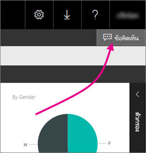
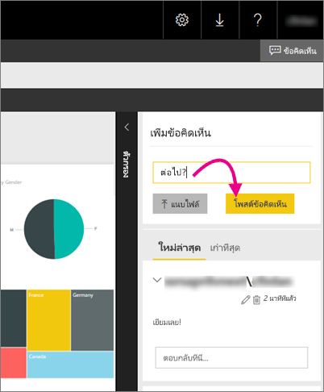

# เพิ่มข้อคิดเห็นไปยังรายงานในรีพอร์ตเซิร์ฟเวอร์
คุณสามารถเพิ่มข้อคิดเห็นเมื่อต้องการรายงาน รวมถึงรายงาน Power BI ภายในพอร์ทัลเว็บของรีพอร์ตเซิร์ฟเวอร์ ข้อคิดเห็นสดพร้อมรายงาน และทุกคนที่มีสิทธิ์ที่เหมาะสม สามารถดูข้อคิดเห็นสำหรับรายงานได้ ดูส่วน[สิทธิ์](#permissions)ด้านล่างสำหรับรายละเอียด

## เพิ่ม หรือดูข้อคิดเห็น
1. เปิดส่วนที่มีการแบ่งหน้าหรือรายงาน Power BI บนรีพอร์ตเซิร์ฟเวอร์
2. ในมุมขวาบน ให้เลือก**ข้อคิดเห็น**
   
    
   
    ในบานหน้าต่างข้อคิดเห็น คุณสามารถดูข้อคิดเห็นใดๆ ที่มีอยู่
3. เขียนข้อคิดเห็นของคุณ จากนั้นเลือก**โพสต์ข้อคิดเห็น**
   
    
   
    ข้อคิดเห็นของคุณจะแสดงในบานหน้าต่างด้านบนพอร์ทัลเว็บ พร้อมกับข้อคิดเห็นก่อนหน้า ข้อคิดเห็นนั้นไม่ได้ปรากฏพร้อมกับรายงานในแอป Power BI สำหรับอุปกรณ์เคลื่อนที่
   
   > [!TIP]
   > คุณทราบหรือไม่ คุณสามารถ[ใส่คำอธิบายประกอบรายงาน Power BI ในแอป Power BI สำหรับอุปกรณ์เคลื่อนที่](../mobile-annotate-and-share-a-tile-from-the-mobile-apps.md)และแชร์รายงานที่มีคำอธิบายประกอบกับผู้อื่นได้
   > 
   > 

## สิทธิ์
ขึ้นอยู่กับสิทธิ์ของคุณ คุณสามารถ:

* ไม่เห็นข้อคิดเห็น
* ดูข้อคิดเห็นทั้งหมด และโพสต์ แก้ไข และลบของคุณเอง
* ดูข้อคิดเห็นทั้งหมด โพสต์ แก้ไข และลบของคุณเอง และลบของบุคคลอื่น

## ขั้นตอนถัดไป
* [เซิร์ฟเวอร์รายงาน Power BI คืออะไร](get-started.md)  

มีคำถามเพิ่มเติมหรือไม่ [ลองถามชุมชน Power BI](https://community.powerbi.com/)

