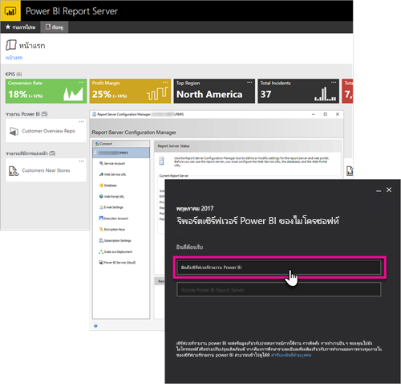

# ภาพรวมคู่มือผู้ดูแล เซิร์ฟเวอร์รายงาน Power BI
ยินดีต้อนรับสู่คู่มือผู้ดูแลสำหรับเซิร์ฟเวอร์รายงาน Power BI ตำแหน่งที่ตั้งภายในองค์กรสำหรับการจัดเก็บและการจัดการ Power BI อุปกรณ์เคลื่อนที่ และรายงานที่มีการแบ่งหน้าของคุณ

คู่มือนี้จะช่วยให้คุณเข้าใจแนวคิดเกี่ยวกับการวางแผน การปรับใช้ และการจัดการเซิร์ฟเวอร์รายงาน Power BI ของคุณ

## การติดตั้งและการโยกย้าย
คุณจะต้องติดตั้งเซิร์ฟเวอร์รายงาน Power BI เพื่อเริ่มใช้งาน เรามีข้อมูลที่จะช่วยให้คุณสามารถจัดการงานนี้

ก่อนที่คุณเริ่มการติดตั้ง อัปเกรด หรือโยกย้ายไปยังเซิร์ฟเวอร์รายงาน Power BI ให้ดู[ความต้องการของระบบ](system-requirements.md)สำหรับเซิร์ฟเวอร์รายงาน

### กำลังติดตั้ง
ถ้าคุณกำลังปรับใช้เซิร์ฟเวอร์รายงาน Power BI ตัวใหม่ ให้คุณใช้เอกสารต่อไปนี้เพื่อช่วยให้คุณ การเริ่มต้นด่วนพร้อมให้ใช้งานทันที หรือคุณสามารถค้นหาเอกสารการติดตั้งสำหรับรายละเอียดทั้งหมด

* [การเริ่มต้นใช้งานด่วน: ติดตั้งเซิร์ฟเวอร์รายงาน Power BI](quickstart-install-report-server.md)
* [ติดตั้งเซิร์ฟเวอร์รายงาน Power BI](install-report-server.md)

### การโยกย้าย
ไม่มีการอัปเกรดในสถานที่สำหรับ SQL Server Reporting Services ถ้าคุณมีอินสแตนซ์ของ SQL Server Reporting Services อยู่แล้วที่คุณต้องการทำเซิร์ฟเวอร์รายงาน Power BI คุณจะต้องโยกย้ายอินสแตนซ์ดังกล่าว มีเหตุผลอื่น ๆ ที่คุณอาจต้องการดำเนินการโยกย้ายเช่นกัน ทบทวนเอกสารการโยกย้ายสำหรับรายละเอียดเพิ่มเติม

[โยกย้ายการติดตั้งเซิร์ฟเวอร์รายงาน](migrate-report-server.md)

## กำหนดค่าเซิร์ฟเวอร์รายงานของคุณ
คุณมีหลายตัวเลือกเมื่อทำการกำหนดค่าเซิร์ฟเวอร์รายงานของคุณ คุณจะใช้ SSL หรือไม่ คุณกำลังกำหนดค่าเซิร์ฟเวอร์อีเมลใช่หรือไม่ คุณต้องการรวมเข้ากับบริการ Power BI เพื่อปักหมุดการแสดงภาพหรือไม่

ส่วนใหญ่ของการกำหนดค่าจะเกิดขึ้นภายในตัวจัดการการกำหนดค่าเซิร์ฟเวอร์รายงาน ลองดูเอกสารประกอบ[การจัดการการกำหนดค่า](https://docs.microsoft.com/sql/reporting-services/install-windows/reporting-services-configuration-manager-native-mode)สำหรับรายละเอียดเพิ่มเติม

## ความปลอดภัย
ความปลอดภัยและการป้องกันมีความสำคัญสำหรับทุกองค์กร คุณสามารถเรียนรู้เกี่ยวกับการรับรองความถูกต้อง การอนุญาต บทบาท และสิทธิ์บนเอกสารประกอบด้าน[ความปลอดภัย](https://docs.microsoft.com/sql/reporting-services/security/reporting-services-security-and-protection)

## ขั้นตอนถัดไป
[การเริ่มต้นใช้งานด่วน: ติดตั้งเซิร์ฟเวอร์รายงาน Power BI](quickstart-install-report-server.md)  
[วิธีการค้นหาคีย์ผลิตภัณฑ์เซิร์ฟเวอร์รายงานของคุณ](find-product-key.md)  
[ติดตั้ง Power BI Desktop ที่ปรับให้เหมาะสำหรับเซิร์ฟเวอร์รายงาน Power BI](install-powerbi-desktop.md)  
[ติดตั้งตัวสร้างรายงาน](https://docs.microsoft.com/sql/reporting-services/install-windows/install-report-builder)  
[ดาวน์โหลด SQL Server Data Tools (SSDT)](http://go.microsoft.com/fwlink/?LinkID=616714)

มีคำถามเพิ่มเติมหรือไม่ [ลองถามชุมชน Power BI](https://community.powerbi.com/)

