# <a name="configure-power-bi-report-server-with-azure-application-proxy"></a>กำหนดค่าเซิร์ฟเวอร์รายงาน Power BI ด้วยพร็อกซีแอปพลิเคชัน Azure

บทความนี้อธิบายวิธีใช้พร็อกซีแอปพลิเคชัน Azure Active Directory เพื่อเชื่อมต่อกับเซิร์ฟเวอร์รายงาน Power BI และ SQL Server Reporting Services (SSRS) 2016 และใหม่กว่า โดยผ่านการรวมกลุ่มนี้ ผู้ใช้ที่อยู่ห่างจากเครือข่ายองค์กรสามารถเข้าถึงเซิร์ฟเวอร์รายงาน Power BI  และรายงาน Reporting Services ได้จากเบราว์เซอร์ไคลเอ็นต์และได้รับการปกป้องโดย Azure Active Directory (AD) อ่านเพิ่มเติมเกี่ยวกับการเข้าถึงระยะไกลไปยังแอปพลิเคชันในองค์กรผ่านทาง[พร็อกซีแอปพลิเคชัน Azure Active Directory](https://docs.microsoft.com/azure/active-directory/manage-apps/application-proxy)

## <a name="environment-details"></a>รายละเอียดสภาพแวดล้อม

เราใช้ค่าเหล่านี้ในตัวอย่างที่เราได้สร้างขึ้น 

- โดเมน: umacontoso.com
- เซิร์ฟเวอร์รายงาน Power BI: PBIRSAZUREAPP.umacontoso.com
- เครื่องมือข้อมูลเซิร์ฟเวอร์ SQL Server SQLSERVERAZURE.umacontoso.com

## <a name="configure-power-bi-report-server"></a>กำหนดค่า Power BI Report Server

หลังจากติดตั้งเซิร์ฟเวอร์รายงาน Power BI (สมมติว่าติดตั้งบน Azure VM) ให้กำหนดค่าบริการเว็บเซิร์ฟเวอร์รายงาน Power BI และ URL พอร์ทัลเว็บโดยใช้ขั้นตอนต่อไปนี้:

1. สร้างกฎขาเข้าและขาออกบนไฟร์วอลล์ VM สำหรับพอร์ต๘๐ (พอร์ต๔๔๓หากคุณมีการกำหนดค่า Url https) นอกจากนี้สร้างกฎขาเข้าและขาออกสำหรับ Azure VM จากพอร์ทัล Azure สำหรับโพรโทคอล TCP –พอร์ต๘๐
2. ชื่อ DNS ที่ได้รับการกำหนดค่าสำหรับ VM ในสภาพแวดล้อมของเราคือ `pbirsazureapp.eastus.cloudapp.azure.com`
3. กำหนดค่าบริการเว็บภายนอกของเซิร์ฟเวอร์รายงาน Power BI และ URL เว็บพอร์ทัลโดยเลือกแท็บ **ขั้นสูง** > **เพิ่ม**ปุ่ม > **เลือกชื่อส่วนหัวของโฮสต์** และเพิ่มชื่อโฮสต์ (ชื่อ DNS) ดังที่แสดงไว้ที่นี่

    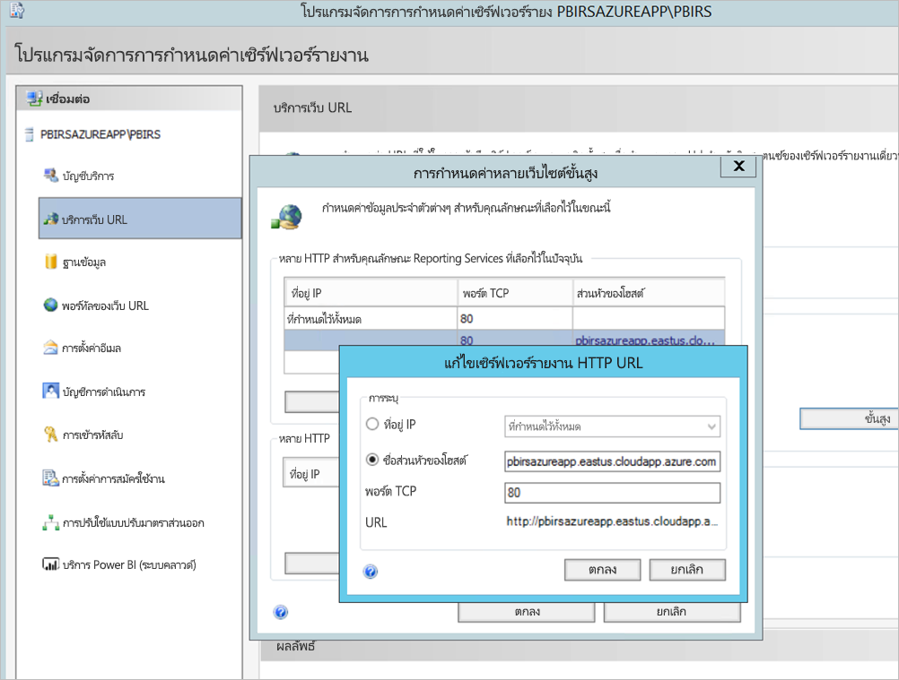

1. เราดำเนินการขั้นตอนก่อนหน้าสำหรับทั้งการ Web Service และ Web portal และได้มี Url ที่ลงทะเบียนไว้ในตัวจัดการการกำหนดค่าเซิร์ฟเวอร์รายงาน:

    - `https://pbirsazureapp.eastus.cloudapp.azure.com/ReportServer`
    - `https://pbirsazureapp.eastus.cloudapp.azure.com/Reports`

2. ในพอร์ทัล Azure เราเห็นสอง IP แอดเดรสสำหรับ VM ในส่วนระบบเครือข่าย 

    - **IP สาธารณะ** 
    - **ส่วนบุคคล**. 
    
    ที่อยู่ IP สาธารณะใช้สำหรับการเข้าถึงจากภายนอกเครื่องเสมือน

3. ดังนั้นเราจึงเพิ่มรายการไฟล์โฮสต์บน VM (เซิร์ฟเวอร์รายงาน Power BI) เพื่อรวมที่อยู่ IP สาธารณะและชื่อโฮสต์ไว้ `pbirsazureapp.eastus.cloudapp.azure.com`
4. โปรดทราบว่าในการเริ่มต้นใช้งาน VM ที่อยู่ IP แบบไดนามิกอาจเปลี่ยนแปลงและคุณอาจจำเป็นต้องเพิ่ม IP แอดเดรสที่ถูกต้องอีกครั้งในไฟล์โฮสต์ เพื่อหลีกเลี่ยงปัญหานี้คุณสามารถตั้งค่า IP แอดเดรสสาธารณะเป็นแบบสแตติกในพอร์ทัล Azure
5. ต้องสามารถเข้าถึง Url ของ Web Service และพอร์ทัลของเว็บได้สำเร็จหลังจากทำการเปลี่ยนแปลงที่กล่าวถึงข้างต้น
6. ในการเข้าถึง URL `https://pbirsazureapp.eastus.cloudapp.azure.com/ReportServer` บนเซิร์ฟเวอร์เราจะได้รับพร้อมท์สามครั้งสำหรับข้อมูลประจำตัวและดูหน้าจอว่างเปล่า
7. เพิ่มรายการรีจิสทรีต่อไปนี้:

    `HKEY\_LOCAL\_MACHINE \SYSTEM\CurrentControlset\Control \Lsa\ MSV1\_0` รีจิสทรีคีย์

1. เพิ่มค่าใหม่ `BackConnectionHostNames`ค่าหลายสตริงและใส่ชื่อโฮสต์ `pbirsazureapp.eastus.cloudapp.azure.com`

หลังจากนั้นเราสามารถเข้าถึง Url บนเซิร์ฟเวอร์ได้เช่นกัน

## <a name="configure-power-bi-report-server-to-work-with-kerberos"></a>กำหนดค่าเซิร์ฟเวอร์รายงาน Power BI เพื่อให้ทำงานกับ Kerberos ได้

### <a name="1-configure-the-authentication-type"></a>1. การกำหนดค่าชนิดการรับรองความถูกต้อง

เราจำเป็นต้องกำหนดค่าชนิดการรับรองความถูกต้องสำหรับเซิร์ฟเวอร์รายงานเพื่ออนุญาตให้สามารถรับมอบสิทธิ์ Kerberos ที่บังคับได้ ซึ่งทำได้ภายในไฟล์**rsreportserver.config**

ภายในไฟล์ rsreportserver.config คุณจะต้องการปรับค่าส่วน**รับรองความถูกต้อง/AuthenticationTypes** ให้เหมาะสมยิ่งขึ้น

เราต้องตรวจสอบให้แน่ใจว่า RSWindowsNegotiate อยู่ในรายการและเป็นส่วนแรกในรายการของชนิดการรับรองความถูกต้อง ซึ่งควรมีลักษณะคล้ายต่อไปนี้

```
<AuthenticationTypes>

    <RSWindowsNegotiate/>

</AuthenticationTypes>
```

ถ้าคุณจำเป็นต้องเปลี่ยนแปลงแฟ้มการกำหนดค่า **หยุดและเริ่มบริการ** เซิร์ฟเวอร์รายงานจากโปรแกรมจัดการการกำหนดค่าเซิร์ฟเวอร์รายงานเพื่อตรวจสอบให้แน่ใจว่าการเปลี่ยนแปลงจะมีผล

### <a name="2-register-service-principal-names-spns"></a>2. ลงทะเบียนชื่อบริการหลัก (SPNs)

เปิดพร้อมท์คำสั่งในฐานะผู้ดูแลระบบและดำเนินการตามขั้นตอนต่อไปนี้

ลงทะเบียน SPN ต่อไปนี้ภายใต้บัญชี**บัญชีบริการเซิร์ฟเวอร์รายงาน Power BI** โดยใช้คำสั่งต่อไปนี้

```
setspn -s http/ Netbios name\_of\_Power BI Report Server\_server<space> Power BI Report Server\_ServiceAccount

setspn -s http/ FQDN\_of Power BI Report Server\_server<space> Power BI Report Server\_ServiceAccount
```

ลงทะเบียน SPN ต่อไปนี้ภายใต้บัญชีบัญชีบริการเซิร์ฟเวอร์รายงาน Power BI โดยใช้คำสั่งต่อไปนี้

```
setspn -s MSSQLSVC/FQDN\_of\_SQL\_Server: 1433 (PortNumber) <SQL service service account>

setspn -s MSSQLSVC/FQDN\_of\_SQL\_Server<SQL service service account>
```

### <a name="3-configure-delegation-settings"></a>3. กำหนดค่าการตั้งค่าการมอบหมาย

ส่วนสุดท้ายที่เราจำเป็นต้องกำหนดค่าคือการตั้งค่าการรับมอบสิทธิ์บนบัญชีผู้ใช้บริการเซิร์ฟเวอร์รายงาน

1. ผู้ใช้ active Directory และคอมพิวเตอร์
2. คุณจะต้องเริ่มต้นโดยไปที่คุณสมบัติของบัญชีผู้ใช้บริการเซิร์ฟเวอร์รายงานภายในผู้ใช้ Active Directory และคอมพิวเตอร์
3. เราจะต้องกำหนดค่าการมอบสิทธิ์ที่บังคับด้วยโปรโตคอลการส่งผ่าน สำหรับการรับมอบสิทธิ์ทีี่บังคับ คุณต้องมีความชัดเจนว่าบริการใดที่คุณต้องการมอบหมาย
4. คลิกขวาที่**บัญชีบริการเซิร์ฟเวอร์รายงาน** และเลือก **คุณสมบัติ**
5. เลือกแถบ **การมอบหมาย**
6. เลือก **เชื่อถือคอมพิวเตอร์เครื่องนี้สำหรับการรับมอบสิทธิ์ไปยังบริการที่ระบุเท่านั้น**
7. เลือก**ใช้โปรโตคอลรับรองความถูกต้องใดก็ได้**
8. ภายใต้**บริการที่บัญชีผู้ใช้นี้สามารถใช้ข้อมูลประจำตัวที่ได้รับมอบหมาย:** เลือก**เพิ่ม**
9. ในกล่องโต้ตอบใหม่ เลือก**ผู้ใช้หรือคอมพิวเตอร์**
10. ป้อนบัญชีบริการ **สำหรับบริการเซิร์ฟเวอร์ SQL** และเลือก **ตกลง**

    ซึ่งเริ่มต้นด้วย MSSQLSVC

1. เพิ่มการ SPNs
2. เลือก**ตกลง** คุณควรเห็น SPN ในรายการแล้วตอนนี้

ขั้นตอนเหล่านี้ช่วยกำหนดค่าเซิร์ฟเวอร์รายงาน Power BI ให้ทำงานกับกลไกการพิสูจน์ตัวตน Kerberos และรับการเชื่อมต่อทดสอบกับแหล่งข้อมูลที่ทำงานบนเครื่องท้องถิ่นของคุณ

## <a name="configure-azure-application-proxy-connector"></a>กำหนดค่าพร็อกซีแอปพลิเคชัน  Azure

อ้างอิงไปยังบทความสำหรับการกำหนดค่า [ที่เกี่ยวข้องกับตัวเชื่อมต่อพร็อกซีโปรแกรมประยุกต์](https://docs.microsoft.com/azure/active-directory/manage-apps/application-proxy-add-on-premises-application#add-an-on-premises-app-to-azure-ad)

เราได้ติดตั้งตัวเชื่อมต่อพร็อกซีแอปพลิเคชันบนเซิร์ฟเวอร์รายงาน Power BI แต่คุณสามารถกำหนดค่าบนเซิร์ฟเวอร์แยกต่างหากและตรวจสอบให้แน่ใจว่าได้ตั้งค่าการมอบหมายอย่างถูกต้อง

### <a name="ensure-the-connector-is-trusted-for-delegation"></a>ตรวจสอบให้แน่ใจว่าตัวเชื่อมต่อที่เชื่อถือได้สำหรับการมอบหมาย

ตรวจสอบให้แน่ใจว่าตัวเชื่อมต่อได้รับการเชื่อถือสำหรับการมอบหมายไปยัง SPN ที่เพิ่มไปยังบัญชีพูลโปรแกรมประยุกต์ของเซิร์ฟเวอร์รายงาน

กำหนดค่าการมอบหมายที่มีข้อจำกัดของ Kerberos (KCD) เพื่อให้บริการพร็อกซีโปรแกรมประยุกต์ Azure AD สามารถมอบหมายข้อมูลเฉพาะตัวของผู้ใช้ไปยังบัญชีพูลโปรแกรมประยุกต์ของเซิร์ฟเวอร์รายงาน กำหนดค่า KCD โดยการเปิดใช้งานตัวเชื่อมต่อพร็อกซีแอปพลิเคชันเพื่อดึงข้อมูลตั๋ว Kerberos สำหรับผู้ใช้ของคุณที่ได้รับการรับรองความถูกต้องใน Azure AD จากนั้นเซิร์ฟเวอร์จะส่งผ่านบริบทไปยังแอปพลิเคชันเป้าหมายหรือเซิร์ฟเวอร์รายงาน Power BI ในกรณีนี้

ในการกำหนดค่า KCD ให้ทำซ้ำขั้นตอนต่อไปนี้สำหรับแต่ละเครื่องเชื่อมต่อ

1. ลงชื่อเข้าใช้ตัวควบคุมโดเมนในฐานะผู้ดูแลโดเมนจากนั้นเปิด **ผู้ใช้ Active Directory และคอมพิวเตอร์ที่ใช้งานอยู่**
2. ค้นหาคอมพิวเตอร์ที่ตัวเชื่อมต่อกำลังทำงานอยู่
3. ดับเบิลคลิกที่คอมพิวเตอร์จากนั้นเลือกแท็บ **การรับมอบสิทธิ์**
4. เลือก **เชื่อถือคอมพิวเตอร์เครื่องนี้สำหรับการรับมอบสิทธิ์ไปยังบริการที่ระบุเท่านั้น** แล้วให้เลือก**ใช้โปรโตคอลรับรองความถูกต้องใดก็ได้**
5. เลือก **เพิ่ม**จากนั้นเลือก **ผู้ใช้หรือคอมพิวเตอร์**
6. ป้อนบัญชีบริการที่คุณใช้สำหรับเซิร์ฟเวอร์รายงาน Power BI บัญชีนี้คือบัญชีที่คุณเพิ่ม SPN เข้าไปภายในการกำหนดค่า Reporting Services
7. คลิก **ตกลง** 
8. หากต้องการบันทึกการเปลี่ยนแปลงให้คลิก **ตกลง** อีกครั้ง

## <a name="publish-through-azure-ad-application-proxy"></a>เผยแพร่ผ่านพร็อกซีแอปพลิเคชัน Azure AD

คุณพร้อมที่จะกำหนดค่าพร็อกซีแอปพลิเคชัน Azure AD แล้วตอนนี้

เผยแพร่เซิร์ฟเวอร์รายงาน Power BI ผ่านพร็อกซีแอปพลิเคชันด้วยการตั้งค่าต่อไปนี้ สำหรับคำแนะนำทีละขั้นตอนเกี่ยวกับวิธีเผยแพร่แอปพลิเคชันผ่านพร็อกซีแอปพลิเคชันโปรดดู[ การเผยแพร่แอปพลิเคชันโดยใช้พร็อกซีแอปพลิเคชัน  Azure AD](https://docs.microsoft.com/azure/active-directory/manage-apps/application-proxy-add-on-premises-application#add-an-on-premises-app-to-azure-ad)

- **URL ภายนอก** : ป้อน URL ไปยังเซิร์ฟเวอร์รายงานที่ตัวเชื่อมต่อสามารถเข้าถึงได้ในเครือข่ายขององค์กร ตรวจสอบให้แน่ใจว่า URL นี้ไม่สามารถเข้าถึงได้จากเซิร์ฟเวอร์ที่มีการติดตั้งตัวเชื่อมต่อ แนวทางปฏิบัติที่เหมาะสมที่สุดคือการใช้โดเมนระดับบนสุดเช่น `https://servername/` เพื่อหลีกเลี่ยงปัญหาเกี่ยวกับพาธย่อยที่เผยแพร่ผ่านพร็อกซีแอปพลิเคชัน ตัวอย่างเช่นใช้ `https://servername/` และไม่ใช่ `https://servername/reports/` หรือ `https://servername/reportserver/` เราได้กำหนดค่าสภาพแวดล้อมของเราด้วย `https://pbirsazureapp.eastus.cloudapp.azure.com/`

    > [!NOTE]
    > เราขอแนะนำให้ใช้การเชื่อมต่อ HTTPS ที่ปลอดภัยไปยังเซิร์ฟเวอร์รายงาน โปรดดูการ[กำหนดค่าการเชื่อมต่อ SSL บนเซิร์ฟเวอร์รายงานโหมดดั้งเดิม](https://docs.microsoft.com/sql/reporting-services/security/configure-ssl-connections-on-a-native-mode-report-server?view=sql-server-2017)สำหรับข้อมูลวิธีการ

- **URL ภายนอก** ป้อน URL สาธารณะที่แอป Power BI สำหรับอุปกรณ์เคลื่อนที่จะเชื่อมต่อ ตัวอย่างเช่นอาจ มีลักษณะเช่น `https://reports.contoso.com` ถ้ามีการใช้โดเมนแบบกำหนดเอง หากต้องการใช้โดเมนแบบกำหนดเอง ให้อัปโหลดใบรับรองสำหรับโดเมนและชี้ระเบียน DNS ไปยังโดเมน msappproxy.net เริ่มต้นสำหรับแอปพลิเคชันของคุณ สำหรับขั้นตอนโดยละเอียด ให้ดูที่การ[ทำงานด้วยโดเมนแบบกำหนดเองในพร็อกซีแอปพลิเคชัน Azure AD](https://docs.microsoft.com/azure/active-directory/manage-apps/application-proxy-configure-custom-domain)

เราได้กำหนดค่า URL ภายนอกให้เป็น `https://pbirsazureapp-umacontoso2410.msappproxy.net/` สำหรับสภาพแวดล้อมของเรา

- **วิธีการรับรองความถูกต้องล่วงหน้า**: Azure Active Directory
- **กลุ่มตัวเชื่อมต่อ:** ค่าเริ่มต้น

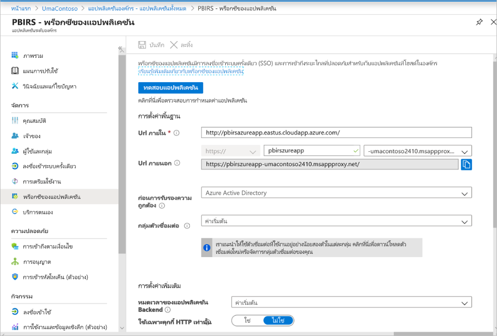

เรายังไม่ได้ทำการเปลี่ยนแปลงใดๆ ในส่วน**การตั้งค่าเพิ่มเติม** ซึ่งได้รับการกำหนดค่าให้ทำงานกับตัวเลือกเริ่มต้น:


### <a name="configure-single-sign-on"></a>กำหนดค่าการลงชื่อเข้าระบบครั้งเดียว

เมื่อแอปของคุณได้รับการเผยแพร่ ให้กำหนดค่าการตั้งค่าการลงชื่อเข้าระบบครั้งเดียวด้วยขั้นตอนต่อไปนี้:

1. บนหน้าแอปพลิเคชันในพอร์ทัล เลือก**การลงชื่อเข้าระบบครั้งเดียว**
2. สำหรับ**โหมดการลงชื่อเข้าระบบเพียงครั้งเดียว** ให้เลือก**การรับรองความถูกต้องของ Windows แบบรวม**
3. ตั้งค่า **SPN แอปพลิเคชันภายใน**เป็นค่าที่คุณตั้งค่าไว้ก่อนหน้านี้ คุณสามารถระบุค่านี้ได้โดยใช้ขั้นตอนต่อไปนี้:

    - ลองเรียกใช้รายงานหรือดำเนินการทดสอบการเชื่อมต่อไปยังแหล่งข้อมูลเพื่อให้ตั๋ว Kerberos ได้รับการสร้างขึ้น
    - หลังจากดำเนินการเชื่อมต่อรายงาน/ทดสอบการเชื่อมต่อ, เปิด command พร้อมท์, แล้วเรียกใช้คำสั่ง command นี้: `klist` ในส่วนผลลัพธ์ คุณควรเห็นตั๋วที่มี `http/` SPN ถ้าเหมือนกับ SPN ที่คุณได้กำหนดค่าด้วยเซิร์ฟเวอร์รายงาน Power BI ให้ใช้ SPN ดังกล่าวในส่วนนี้

1. เลือก**ข้อมูลประจำตัวของการเข้าสู่ระบบที่ได้รับมอบสิทธิ์**สำหรับตัวเชื่อมต่อที่จะใช้ในนามของผู้ใช้ของคุณ สำหรับข้อมูลเพิ่มเติม โปรดดูที่[การทำงานกับข้อมูลประจำตัวในองค์กรและคลาวด์ที่แตกต่างกัน](https://docs.microsoft.com/azure/active-directory/manage-apps/application-proxy-configure-single-sign-on-with-kcd#working-with-different-on-premises-and-cloud-identities)

    เราขอแนะนำให้ใช้ชื่อหลักของผู้ใช้ ในตัวอย่างของเรา เราได้กำหนดให้ทำงานกับตัวเลือก**ชื่อหลักของผู้ใช้**:

    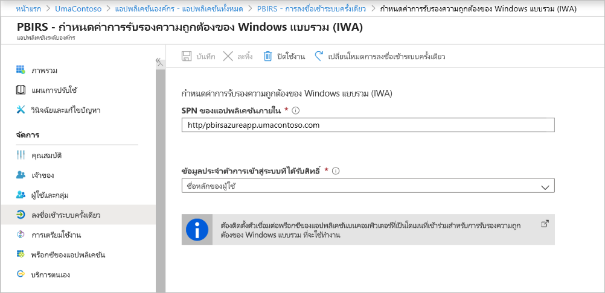

1. เลือก**บันทึก** เพื่อบันทึกการเปลี่ยนแปลงของคุณ

### <a name="finish-setting-up-your-application"></a>ตั้งค่าแอปพลิเคชันของคุณให้เสร็จสมบูรณ์

เพื่อดำเนินการการตั้งค่าแอปพลิเคชันของคุณให้เสร็จสิ้น ให้ไปที่ส่วน**ผู้ใช้และกลุ่ม** และกำหนดผู้ใช้เพื่อเข้าถึงแอปพลิเคชันนี้

1. กำหนดค่าส่วน**การรับรองความถูกต้อง**ของการลงทะเบียนแอปพลิเคชันที่เซิร์ฟเวอร์รายงาน Power BI ดังต่อไปนี้สำหรับการเปลี่ยนเส้นทาง **URL** และ**การตั้งค่าขั้นสูง**:

    - สร้าง URL การเปลี่ยนเส้นทางใหม่และกำหนดค่าด้วย**ชนิด** = **เว็บ** และ **URI การเปลี่ยนเส้นทาง** = `https://pbirsazureapp-umacontoso2410.msappproxy.net/`
    - ในส่วน**การตั้งค่าขั้นสูง** ให้กำหนดค่า**URL ออกจากระบบ**เป็น `https://pbirsazureapp-umacontoso2410.msappproxy.net/?Appproxy=logout`

    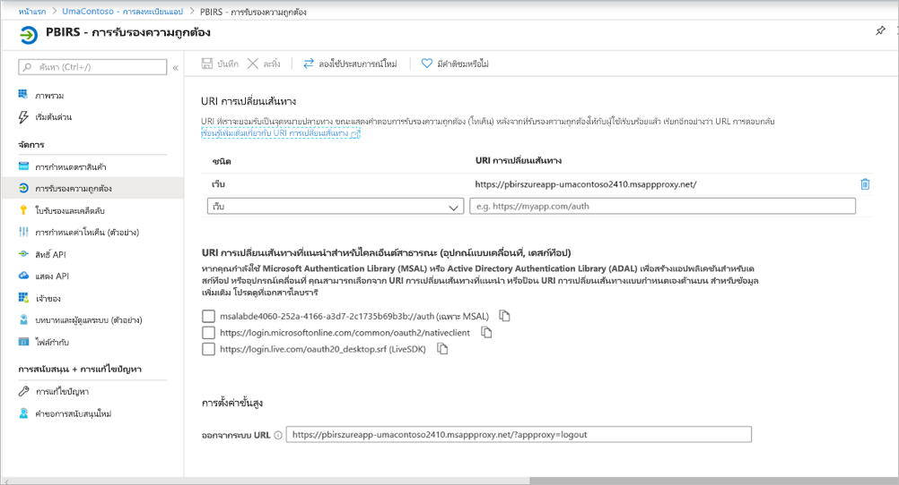

1. ดำเนินการกำหนดค่าส่วน**การรับรองความถูกต้อง**ของการลงทะเบียนแอปพลิเคชันเซิร์ฟเวอร์รายงาน Power BI ต่อไปนี้สำหรับ**การให้สิทธิ์โดยนัย** **ชนิดไคลเอ็นต์เริ่มต้น** และ**ชนิดบัญชีที่ได้รับการรองรับ**:

    - ตั้งค่า**การให้สิทธิ์โดยนัย**เป็น**รหัสโทเค็น**
    - ตั้งค่า **ชนิดไคลเอ็นต์เริ่มต้น**เป็น**ไม่มี**
    - ตั้งค่า**ชนิดบัญชีที่ได้รับการรองรับ**เป็น**บัญชี ในไดเรกทอรีองค์กรนี้เท่านั้น (เฉพาะ UmaContoso - ผู้เช่าเดียวเท่านั้น)**

    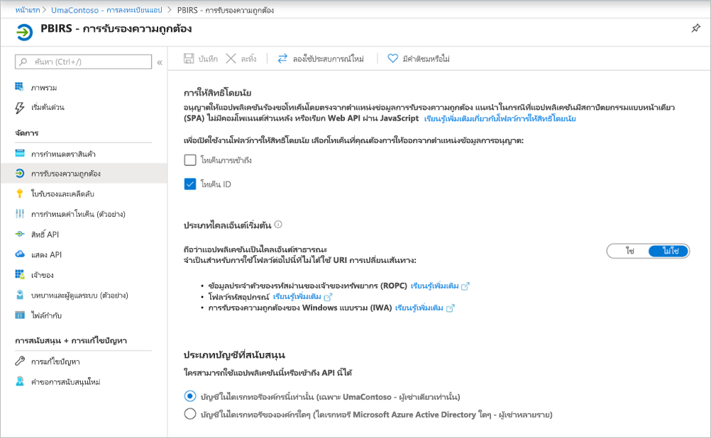

1. เมื่อมีการตั้งค่าการลงชื่อเข้าระบบครั้งเดียวและ URL `https://pbirsazureapp-umacontoso2410.msappproxy.net` ทำงานอยู่ เราจำเป็นต้องตรวจสอบให้แน่ใจว่าบัญชีผู้ใช้ที่เราเข้าสู่ระบบจะซิงค์กับบัญชีที่มีการให้สิทธิ์ในเซิร์ฟเวอร์รายงาน Power BI

1. ก่อนอื่นเราจำเป็นต้องกำหนดค่าโดเมนแบบกำหนดเองที่เรากำลังวางแผนที่จะใช้ในการเข้าสู่ระบบแล้วตรวจสอบให้แน่ใจว่าได้รับการยืนยันแล้ว
2. ในกรณีนี้ เราได้ซื้อโดเมนที่เรียกว่า umacontoso.com และกำหนดค่าโซน DNS ด้วยรายการต่างๆ คุณยังสามารถลองใช้โดเมน `onmicrosoft.com` และซิงค์กับ AD ในองค์กรที่ได้

    ดูบทความ[บทช่วยสอน: แมปชื่อ DNS แบบกำหนดเองที่มีอยู่ไปยัง Azure App Service](https://docs.microsoft.com/Azure/app-service/app-service-web-tutorial-custom-domain) สำหรับการอ้างอิง

1. หลังจากตรวจสอบรายการ DNS สำหรับโดเมนแบบกำหนดเองเรียบร้อยแล้ว คุณมองเห็นสถานะเป็น**ตรวจสอบแล้ว**ที่สอดคล้องกับโดเมนจากพอร์ทัล

    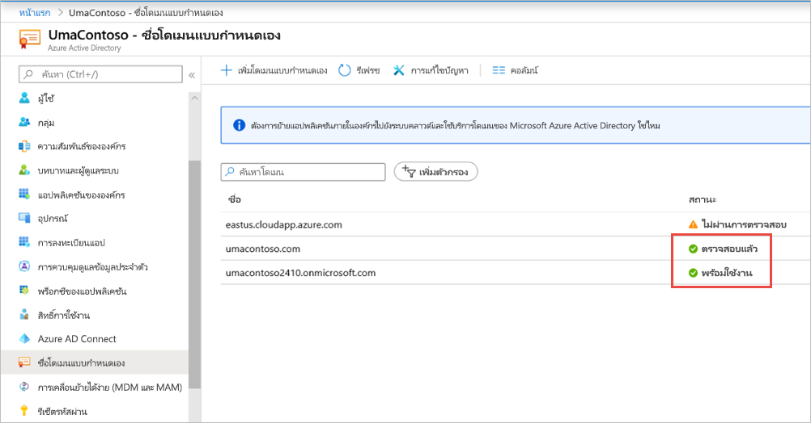

1. ติดตั้ง Microsoft Azure AD เชื่อมต่อบนเซิร์ฟเวอร์ตัวควบคุมโดเมนและกำหนดค่าให้ซิงค์กับ Azure AD

    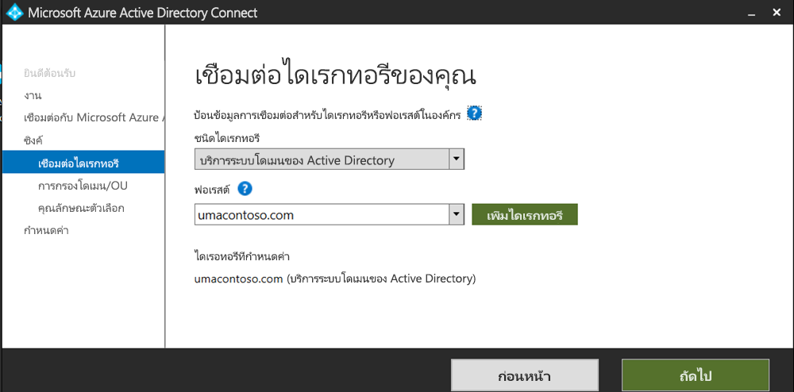

1. เมื่อ Azure AD ซิงค์กับ AD ในองค์กร เราจะเห็นสถานะต่อไปนี้จากพอร์ทัล Azure:

    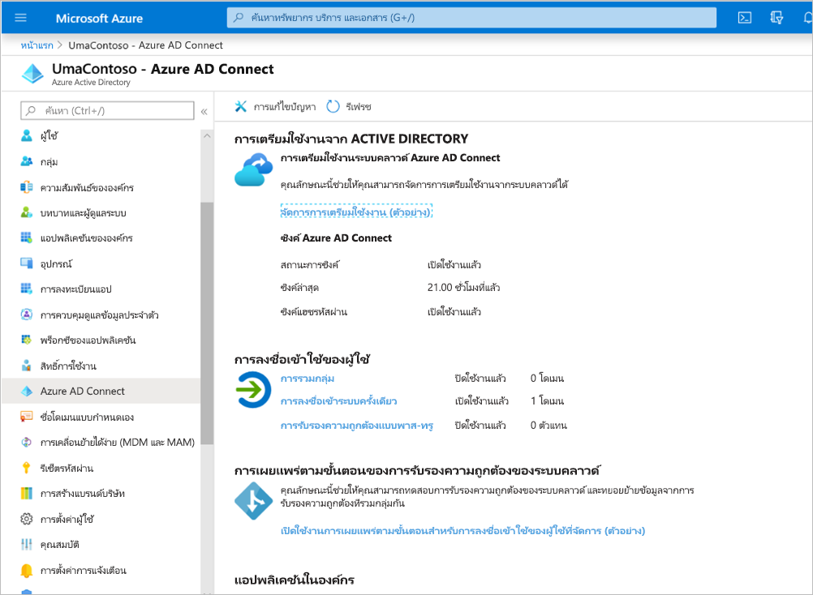

1. นอกจากนี้ เมื่อการซิงค์เสร็จสมบูรณ์แล้ว ให้เปิดโดเมน AD และความน่าเชื่อถือบนตัวควบคุมโดเมน คลิกขวาโดเมน Active Directory และความน่าเชื่อถือ > คุณสมบัติและเพิ่ม UPN ในสภาพแวดล้อมของเรา `umacontoso.com` เป็นโดเมนแบบกำหนดเองที่เราซื้อ

1. หลังจากเพิ่ม UPN คุณควรสามารถกำหนดค่าบัญชีผู้ใช้ที่มี UPN ได้เพื่อให้บัญชี Azure AD และบัญชี AD ในองค์กรได้รับการเชื่อมต่อและโทเค็นที่รู้จักในระหว่างการรับรองความถูกต้อง

    ชื่อโดเมน AD จะแสดงในรายการดรอปดาวน์ของ**ชื่อการเข้าสู่ระบบของผู้ใช้**หลังจากที่คุณทำตามขั้นตอนก่อนหน้า กำหนดค่าชื่อผู้ใช้และเลือกโดเมนจากรายการดรอปดาวน์ในส่วน**ชื่อการเข้าสู่ระบบของผู้ใช้** ของคุณสมบัติผู้ใช้ AD

    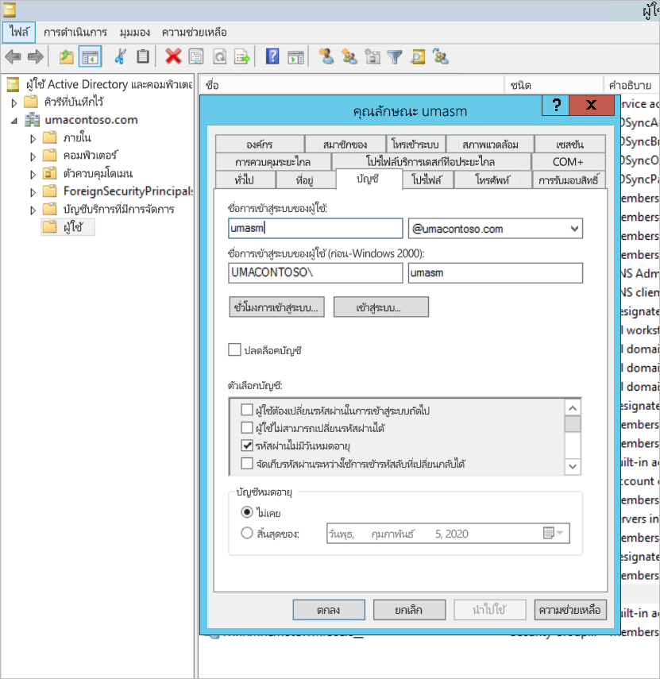

1. เมื่อการซิงค์ AD เสร็จสมบูรณ์ คุณจะเห็นบัญชีผู้ AD ในองค์กรปรากฏในพอร์ทัล Azure ภายใต้ส่วน**ผู้ใช้และกลุ่ม**ของแอปพลิเคชัน แหล่งที่มาสำหรับบัญชีผู้ใช้คือ **Windows Server AD**
2. การเข้าสู่ระบบด้วย `umasm@umacontoso.com` จะเท่ากับการใช้ข้อมูลประจำตัวของ Windows `Umacontoso\umasm`

    จะสามารถใช้ขั้นตอนก่อนหน้านี้ได้หากคุณมีการกำหนดค่า AD ในองค์กรและกำลังวางแผนที่จะซิงค์กับ Azure AD

    การลงชื่อเข้าใช้สำเร็จหลังจากการดำเนินการขั้นตอนข้างต้นนี้:

    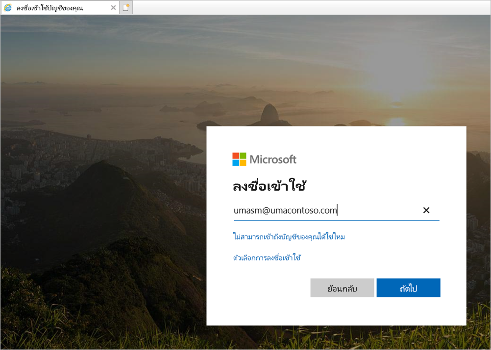

    ตามด้วยการแสดงเว็บพอร์ทัล:

    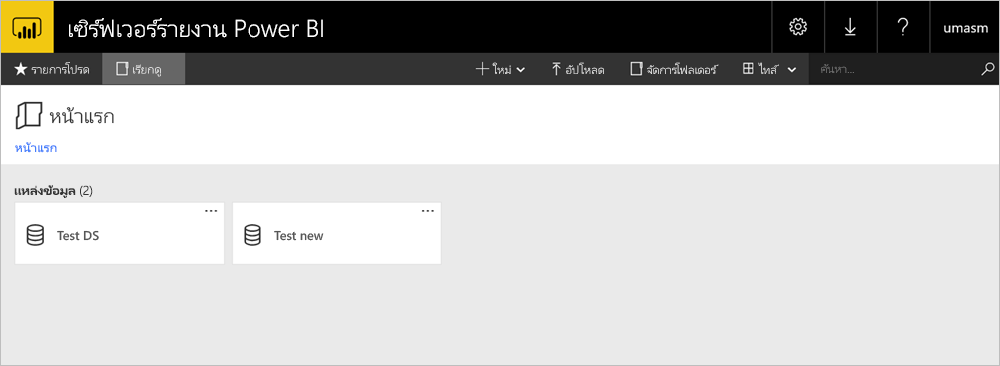

    ด้วยการทดสอบการเชื่อมต่อกับแหล่งข้อมูลที่สำเร็จโดยใช้ Kerberos เป็นการรับรองความถูกต้อง:

    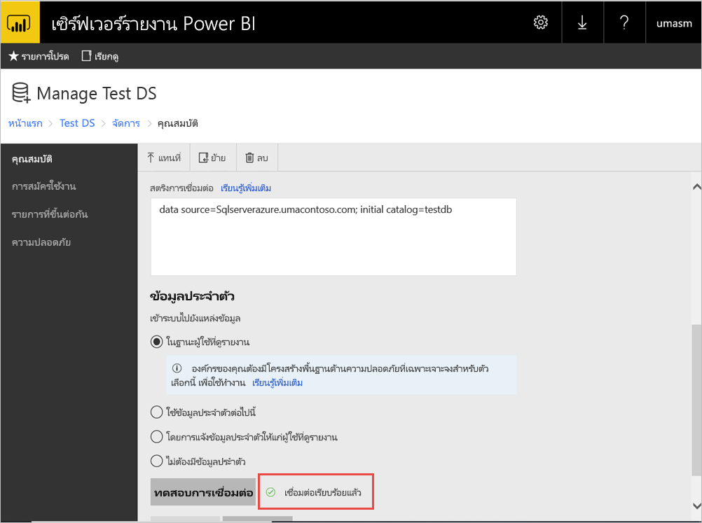

## <a name="access-from-power-bi-mobile-apps"></a>การเข้าถึงแอป Power BI สำหรับอุปกรณ์เคลื่อนที่

### <a name="configure-the-application-registration"></a>กำหนดค่าการลงทะเบียนแอปพลิเคชัน

ก่อนที่แอป Power BI สำหรับอุปกรณ์เคลื่อนที่จะสามารถเชื่อมต่อและเข้าถึงเซิร์ฟเวอร์รายงาน Power BI ได้ คุณต้องกำหนดค่าการลงทะเบียนแอปพลิเคชันที่ถูกสร้างขึ้นโดยอัตโนมัติสำหรับคุณในการ[เผยแพร่ผ่านทางพร็อกซีแอปพลิเคชัน Azure AD](#publish-through-azure-ad-application-proxy) ก่อนหน้าในบทความนี้

1. บนหน้าภาพรวม **Azure Active Directory** ให้เลือก**การลงทะเบียนแอป**
2. บนแท็บ**แอปพลิเคชันทั้งหมด** ให้ค้นหาแอปพลิเคชันที่คุณสร้างขึ้นสำหรับเซิร์ฟเวอร์รายงาน Power BI
3. เลือกแอปพลิเคชันจากนั้นเลือก**การรับรองความถูกต้อง**
4. เพิ่มการเปลี่ยนเส้นทาง URI ต่อไปนี้ตามแพลตฟอร์มที่คุณกำลังใช้

    เมื่อกำหนดค่าแอปสำหรับ Power BI Mobile ที่ใช้ **iOS** ให้เพิ่มการเปลี่ยนเส้นทาง URI ต่อไปนี้ของชนิดไคลเอ็นต์สาธารณะ (อุปกรณ์เคลื่อนที่และ Desktop):

    - `msauth://code/mspbi-adal%3a%2f%2fcom.microsoft.powerbimobile`
    - `msauth://code/mspbi-adalms%3a%2f%2fcom.microsoft.powerbimobilems`
    - `mspbi-adal://com.microsoft.powerbimobile`
    - `mspbi-adalms://com.microsoft.powerbimobilems`

    เมื่อกำหนดค่าแอปสำหรับ  Power BI Mobile ที่ใช้ **Android** ให้เพิ่มการเปลี่ยนเส้นทาง URI ต่อไปนี้ของชนิดไคลเอ็นต์สาธารณะ (อุปกรณ์เคลื่อนที่และ Desktop):

    - `urn:ietf:wg:oauth:2.0:oob`
    - `mspbi-adal://com.microsoft.powerbimobile`
    - `msauth://com.microsoft.powerbim/g79ekQEgXBL5foHfTlO2TPawrbI%3D`
    - `msauth://com.microsoft.powerbim/izba1HXNWrSmQ7ZvMXgqeZPtNEU%3D`

    เมื่อกำหนดค่าแอปสำหรับ Power BI บนอุปกรณ์เคลื่อน iOS และ Android ให้เพิ่มการเปลี่ยนเส้นทาง URI ต่อไปนี้ของชนิดไคลเอ็นต์สาธารณะ (อุปกรณ์เคลื่อนที่และ Desktop) ไปยังรายการการเปลี่ยนเส้นทาง URI ที่กำหนดค่าไว้สำหรับ iOS:

    - `urn:ietf:wg:oauth:2.0:oob`

    > [!IMPORTANT]
    > ต้องเพิ่มการเปลี่ยนเส้นทาง URI สำหรับแอปพลิเคชันเพื่อให้สามารถทำงานได้อย่างถูกต้อง

### <a name="connect-from-the-power-bi-mobile-apps"></a>เชื่อมต่อจากแอป Power BI mobile

1. ในแอป Power BI mobile ให้เชื่อมต่อกับอินสแตนซ์ของเซิร์ฟเวอร์รายงานของคุณ หากต้องการเชื่อมต่อ ให้ป้อน **URL ภายนอก**สำหรับแอปพลิเคชันที่คุณเผยแพร่ผ่านทางพร็อกซีของแอปพลิเคชัน
2. เลือก **เชื่อมต่อ** คุณจะถูกเปลี่ยนเส้นทางไปยังหน้าลงชื่อเข้าใช้ Azure Active Directory
3. ใส่ข้อมูลประจำตัวที่ถูกต้องสำหรับผู้ใช้ของคุณและเลือก**ลงชื่อเข้าใช้** คุณจะเห็นองค์ประกอบจากเซิร์ฟเวอร์รายงานของคุณ

## <a name="next-steps"></a>ขั้นตอนถัดไป

[เปิดใช้งานการเข้าถึงระยะไกลไปยัง Power BI Mobile ด้วยพร็อกซีแอปพลิเคชันของ Azure AD](https://docs.microsoft.com/azure/active-directory/manage-apps/application-proxy-integrate-with-power-bi)

มีคำถามเพิ่มเติมหรือไม่ [ลองถามชุมชน Power BI](https://community.powerbi.com/)

                