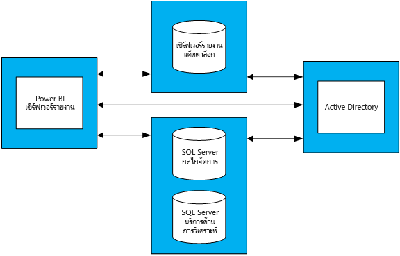

# คำแนะนำในการวางแผนความจุสำหรับเวอร์รายงาน Power BI
เซิร์ฟเวอรรายงาน์ power BI เป็นแบบบริการตนเอง BI และเป็นโซลูชันการรายงานสำหรับองค์กรธุรกิจ ซึ่งลูกค้าสามารถปรับใช้ภายในองค์กรหลังไฟร์วอลล์ของพวกเขา ได้ จะรวมความสามารถในการรายงานแบบโต้ตอบของ Power BI Desktop ด้วยแพลตฟอร์มที่เซิร์ฟเวอร์ภายในองค์กรของ SQL Server Reporting Services ด้วยน้ำหนักและการเติบโตของการใช้งานของการวิเคราะห์และการรายงานภายในองค์กร การจัดทำงบประมาณฮาร์ดแวร์โครงสร้างพื้นฐานและลิขสิทธิ์ซอฟต์แวร์จึงถูกใช้งาน เพื่อขยายไปยังฐานผู้ใช้แบบองค์กร ซึ่งเป็นเรื่องท้าทายยิ่งนัก เอกสารนี้มีวัตถุประสงค์เพื่อเสนอคำแนะนำเกี่ยวกับการวางแผนความจุสำหรับเซิร์ฟเวอร์รายงาน Power BI โดยแชร์ผลลัพธ์การดำเนินการทดสอบการโหลดจำนวนมากของปริมาณงานต่างๆ เทียบกับเซิร์ฟเวอร์รายงาน ในขณะที่รายงาน คิวรี่ และการใช้รูปแบบขององค์กรแตกต่างกันอย่างกว้างขวาง ผลลัพธที่์แสดงอยู่ในเอกสารนี้ พร้อมกับการทดสอบจริงที่ใช้และอธิบายโดยละเอียดเกี่ยวกับวิธี่ดำเนินการ ทำหน้าที่เป็นจุดอ้างอิงสำหรับทุกคน ในช่วงต้นของขั้นตอนการวางแผนเพื่อใช้เซิร์ฟเวอร์รายงาน Power BI

## สรุปสำหรับผู้บริหาร
เราใช้ปริมาณงานสองชริดกับเซิร์ฟเวอร์รายงาน Power BI ปริมาณงานแต่ละรายการประกอบด้วยการแสดงรายงานชนิดต่างๆ เช่นเดียวกับการดำเนินการพอร์ทัลเว็บต่างๆ 

* ในปริมาณงาน "Power BI Report Heavy" เป็นการดำเนินการบ่อยที่สุด (เช่น ดำเนินการ 60% ของเวลา) ถูกแสดงรายงาน Power BI
* ในปริมาณงาน “Paginated Report Heavy” เป็นการดำเนินการบ่อยที่สุด ถูกแสดงรายงาน

ภายใต้สี่เซิร์ฟเวอร์โทโพโลยีของเซิร์ฟเวอร์รายงาน Power BI และคาดหวังว่า ไม่เกิน 5% ของผู้ใชที่้จะเข้าถึงเซิร์ฟเวอร์รายงานได้ทุกเวลา ตารางต่อไปนี้อธิบายถึงจำนวนสูงสุดของผู้ใช้ที่เซิร์ฟเวอร์รายงาน Power BI ที่สามารถจัดการกับน้อย 99% ความน่าเชื่อถือ 

| ปริมาณงาน | 8 Core/32 GB RAM | 16 Core/64 GB RAM |
| --- | --- | --- |
| **Power BI Report Heavy** (>60%) |ผู้ใช้ 1000 ราย |ผู้ใช้ 3000 ราย |
| **แบ่งหน้า (RDL) Report Heavy**  (> 60%) |ผู้ใช้ 2000 ราย |ผู้ใช้ 3,200 ราย |

ในแต่ละครั้งที่เรียกใช้งาน ทรัพยากรที่ใช้นมากที่สุดคือ CPU เนื่องจากนี่ การเพิ่มจำนวน cores ใน Power BI Report Server จะให้เชื่อถือของระบบมากกว่าการเพิ่มจำนวนหน่วยความจำหรือเพิ่มขนาดฮาร์ดดิสก์ 

## วิธีการทดสอบ
ทดสอบโทโพโลยีที่ใช้เป็นไปตามเครื่องเสมือน Microsoft Azure ไม่ได้เป็นตามผู้จัดจำหน่ายฮาร์ดแวร์ เครื่องทั้งหมดถูกโฮสต์ในขอบเขตของสหรัฐอเมริกา สิ่งนี้แสดงแนวโน้มทั่วไปของการจำลองเสมือนของฮาร์ดแวร์ทั้งภายในองค์กรและในระบบคลาวด์สาธารณะ 

### โทโพโลยของเซิร์ฟเวอร์รายงาน Power BI
การใช้เซิร์ฟเวอร์รายงาน Power BI ประกอบด้วยเครื่องเสมือนต่อไปนี้

* Active Directory Domain Controller สิ่งนี้จำเป็นสำหรับ SQL Server Database Engine, SQL Server Analysis Services และเซิร์ฟเวอร์รายงาน Power BI เพื่อรับรองคำขอทั้งหมดได้อย่างปลอดภัย
* SQL Server Database Engine and SQL Server Analysis Services นี่คือตำแหน่งที่เราจัดเก็บฐานข้อมูลทั้งหมดสำหรับรายงานที่จะใช้เมื่อเราแสดงผล
* เซิร์ฟเวอร์รายงานของ Power BI
* ฐ่านข้อมูลเซิร์ฟเวอร์รายงานของ Power BI ฐานข้อมูลเซิร์ฟเวอร์รายงานถูกโฮสต์บนคอมพิวเตอร์มากเครื่องมากกว่าเซิร์ฟเวอร์รายงาน Power BI เพื่อให้ไม่จำเป็นเพื่อการแย่งหน่วยความจำของ SQL Server Database Engine CPU เครือข่าย และแหล่งข้อมูลบนดิสก์

ดูภาคผนวก 1.1 โทโพโลยีเซิร์ฟเวอร์รายงาน Power BI และภาคผนวก 1.2 การตั้งค่าเครื่องเสมือนเซิร์ฟเวอร์รายงาน Power BI สำหรับการกำหนดค่าโดยละเอียดของแต่ละเครื่องเสมือนที่ใช้ในโทโพโลยี

### ทดสอบ
การทดสอบที่ใช้ใน การทดสอบการโหลด มีให้ดาวน์โหลดได้สาธารณะในโครงการ GitHub ที่ชื่อว่า [Reporting Services LoadTest](https://github.com/Microsoft/Reporting-Services-LoadTest) เครื่องมือนี้ช่วยให้ผู้ใช้ศึกษาประสิทธิภาพการทำงาน ความน่าเชื่อถือ ปรับขนาด และลักษณะการคืนสภาพของ SQL Server Reporting Services และ Power BI Report Server โครงการนี้ประกอบด้วย่ของกรณีทดสอบสีกลุ่ม

* ทดสอบการจำลองกำลังแสดงรายงาน Power BI
* ทดสอบการจำลอการแสดงงรายงานมือถือ
* ทดสอบการจำลองแสดงรายงานที่ถูกจัดหน้าขนาดเล็กและใหญ่และ 
* ทดสอบการจำลองการดำเนินการชนิดต่าง ๆ ของการดำเนินการเว็บพอร์ทัล 

การทดสอบทั้งหมดถูกเขียนขึ้นเพื่อทำการดำเนินการแบบ end-to-end (เช่นการสร้างรายงาน สร้างแหล่งข้อมูลใหม่ และอื่น ๆ) พวกเขาทำสิ่งนี้ โดยทำการร้องขอเว็บหนึ่งอันหรือมากกว่าไปยังเซิร์ฟเวอร์รายงาน (ผ่าน API) ในโลกแห่งความจริง ผู้ใช้อาจจำเป็นต้องดำเนินการขั้นกลางสองสามสองสามชนิด เพื่อเสร็จสิ้นการดำเนินการ end-to-end หนึ่งอัน ตัวอย่างเช่น เมื่อต้องแสดงรายงานผู้ใช้จะต้องไปยังเว็บพอร์ทัล นำทางไปยังโฟลเดอร์ที่รายงานอยู่ จากนั้นคลิกรายงานเพื่อแสดง ในขณะทดสอบไม่ดำเนินการทั้งหมด การทำงานที่ต้องการสร้างงานแบบ end-to-end พวกเขายังคงกำหนดการโหลดส่วนใหญ่ของการโหลดเซิร์ฟเวอร์รายงาน Power BI จะเป็นไปได้ คุณสามารถเรียนรู้เพิ่มเติมเกี่ยวกับรายชนิดต่างๆที่ใช้ รวมถึงความหลากหลายของการดำเนินการทำโดยการสำรวจ GitHub project

### ปริมาณงาน
มีโปรไฟล์ปริมาณงาน 2 ชุดที่ใช้ในการทดสอบ: รายงาน power BI Heavy และมีการแบ่งหน้ารายงาน Heavy ตารางด้านล่างนี้อธิบายเกี่ยวกับการแจกแจงคำขอที่ดำเนินการกับเซิร์ฟเวอร์รายงาน

| กิจกรรม | Power BI Report Heavy ความถี่ของการเกิดขึ้น | Paginated Report Heavy ความถี่ของการเกิดขึ้น |
| --- | --- | --- |
| **แสดงรายงาน Power BI** |60% |10% |
| **การแสดงผลรายงานแบบจัดหน้า(RDL)** |30% |60% |
| **แสดงรายงานมือถือ** |5% |20% |
| **การดำเนินงานเว็บพอร์ทัล** |5% |10% |

### โหลดผู้ใช้
สำหรับการทดสอบการเรียกใช้ การทดสอบถูกดำเนินการโดยยึดตามความถี่ที่ระบุในปริมาณงานหนึ่งหรือสองอย่าง ทดสอบการเริ่มต้นใช้งานกับผู้ใช้งานพร้อมกัน 20 ราย ที่ขอไปยังเซิร์ฟเวอร์รายงาน การโหลดผู้ใช้จากนั้นถูกเพิ่มขึ้นทีละน้อยจนกว่าความน่าเชื่อถือจะตกต่ำกว่าเป้าหมาย 99%

## ผลลัพธ์
### ความจุเพื่อผู้ใช้พร้อมกัน
ตามที่ระบุไว้ก่อนหน้านี้ การทดสอบเริ่มต้นใช้งานกับผู้ใช้พร้อมกัน 20 ราย ที่ทำการขอไปยังเซิร์ฟเวอร์รายงาน จำนวนผู้ใช้พร้อมกันได้เพิ่มขึ้นทีละน้อยจนกว่า 1% ของคำขอทั้งหมดจะล้มเหลว ผลลัพธ์ในตารางต่อไปนี้บอกให้เราจำนวนการขอของผู้ใช้พร้อมกัน ซึ่งเซิร์ฟเวอร์จะสามารถจัดการภายใต้การโหลดสูงสุดกับอัตราความล้มเหลวน้อยกว่า 1%

| ปริมาณงาน | 8 Core/32 GB | 16 Core/64 GB |
| --- | --- | --- |
| **Power BI Report Heavy** |ผู้ใช้พร้อมกัน 50 ราย |ผู้ใช้พร้อมกัน 150 ราย |
| **Paginated Report Heavy** |ผู้ใช้พร้อมกัน 100 ราย |ผู้ใช้พร้อมกัน 160 ราย |

### ความจุผู้ใช้ทั้งหมด
ที่ Microsoft เรามีการปรับใช้ของการผลิตของเซิร์ฟเวอร์รายงาน Power BI ที่ใช้หลายทีม เมื่อเราวิเคราะห์การใช้งานจริงของสภาพแวดล้อมนี้ เราจะสังเกตเห็นว่า จำนวนผู้ใช้พร้อมกันในเวลาใดุ (แม้แต่ในระหว่างการโหลดสูงสุดประจำวัน) ไม่มีแนวโน้มเกิน 5% ของฐานผู้ใช้ทั้งหมด เราใช้ 5% ของอัตราส่วนแบบพร้อมกัน เป็นเกณฑ์มาตรฐาน หาฐานผู้ใช้เซิร์ฟเวอร์รายงาน Power BI ไม่สามารถจัดการความน่าเชื่อถือ 99%

| ปริมาณงาน | 8 Core/32 GB | 16 Core/64 GB |
| --- | --- | --- |
| **Power BI Report Heavy** |ผู้ใช้ 1000 ราย |ผู้ใช้ 3000 ราย |
| **Paginated Report Heavy** |ผู้ใช้ 2000 ราย |ผู้ใช้ 3,200 ราย |

### ดูผลลัพธ์
เลือกรายงานเพื่อดูผลลัพธ์ของการทดสอบการโหลด

| ปริมาณงาน | 8 Core/32 GB | 16 Core/64 GB |
| --- | --- | --- |
| **Power BI Report Heavy** |[มุมมอง 8 core](https://msit.powerbi.com/view?r=eyJrIjoiMDhhNGY4NGQtNGRhYy00Yzk4LTk2MzAtYzFlNWI5NjBkMGFiIiwidCI6IjcyZjk4OGJmLTg2ZjEtNDFhZi05MWFiLTJkN2NkMDExZGI0NyIsImMiOjV9) |[มุมมอง 16 core](https://msit.powerbi.com/view?r=eyJrIjoiNDBiODk1OGUtYTAyOC00MzVhLThmZmYtNzVjNTFjNzMwYzkwIiwidCI6IjcyZjk4OGJmLTg2ZjEtNDFhZi05MWFiLTJkN2NkMDExZGI0NyIsImMiOjV9) |
| **Paginated Report Heavy** |[มุมมอง 8 core](https://msit.powerbi.com/view?r=eyJrIjoiNDFiZWYzMTktZGIxNS00MzcwLThjODQtMmJkMGRiZWEzNjhlIiwidCI6IjcyZjk4OGJmLTg2ZjEtNDFhZi05MWFiLTJkN2NkMDExZGI0NyIsImMiOjV9) |[มุมมอง 16 core](https://msit.powerbi.com/view?r=eyJrIjoiOTU0YjJkYTgtNDg4Yy00NzlhLWIwMGYtMzg4YWI2MjNmOTZjIiwidCI6IjcyZjk4OGJmLTg2ZjEtNDFhZi05MWFiLTJkN2NkMDExZGI0NyIsImMiOjV9) |

<iframe width="640" height="360" src="https://msit.powerbi.com/view?r=eyJrIjoiMDhhNGY4NGQtNGRhYy00Yzk4LTk2MzAtYzFlNWI5NjBkMGFiIiwidCI6IjcyZjk4OGJmLTg2ZjEtNDFhZi05MWFiLTJkN2NkMDExZGI0NyIsImMiOjV9" frameborder="0" allowFullScreen="true"></iframe>

<iframe width="640" height="360" src="https://msit.powerbi.com/view?r=eyJrIjoiNDBiODk1OGUtYTAyOC00MzVhLThmZmYtNzVjNTFjNzMwYzkwIiwidCI6IjcyZjk4OGJmLTg2ZjEtNDFhZi05MWFiLTJkN2NkMDExZGI0NyIsImMiOjV9" frameborder="0" allowFullScreen="true"></iframe>

<iframe width="640" height="360" src="https://msit.powerbi.com/view?r=eyJrIjoiNDFiZWYzMTktZGIxNS00MzcwLThjODQtMmJkMGRiZWEzNjhlIiwidCI6IjcyZjk4OGJmLTg2ZjEtNDFhZi05MWFiLTJkN2NkMDExZGI0NyIsImMiOjV9" frameborder="0" allowFullScreen="true"></iframe>

<iframe width="640" height="360" src="https://msit.powerbi.com/view?r=eyJrIjoiOTU0YjJkYTgtNDg4Yy00NzlhLWIwMGYtMzg4YWI2MjNmOTZjIiwidCI6IjcyZjk4OGJmLTg2ZjEtNDFhZi05MWFiLTJkN2NkMDExZGI0NyIsImMiOjV9" frameborder="0" allowFullScreen="true"></iframe>

## สรุป
สำหรับแต่ละทดสอบการโหลดที่ทำ CPU ใช้ทรัพยากรมากที่สุดตรงจุดโหลดสูงสุดบนเครื่องเซิร์ฟเวอร์รายงาน Power BI เนื่องจากนี่ ทรัพยากรแรกที่ต้องการเพิ่มคือจำนวนของ core อีกวิธีหนึ่งคือ คุณสามารถพิจารณาขยาย โดยการเพิ่มโฮสต์เซิร์ฟเวอร์รายงาน Power BI ในโทโพโลยีของคุณ

ผลลัพธ์นำเสนอในเอกสารนี้มาจากการดำเนินการกับชุดเฉพาะของรายงานที่ใช้ชุดข้อมูล ซึ่งถูกทำซ้ำในรูปแบบเฉพาะเจาะจง เป็นจุดอ้างอิงที่มีประโยชน์ แต่โปรดทราบว่าการใช้งานของคุณจะขึ้นอยู่กับรายงาน คิวรี่ รูปแบบการใช้ และการปรับใช้ของเซิร์ฟเวอร์รายงาน Power BI ของคุณ

## ภาคผนวก
### โทโพโลยี 1
**1.1 โทโพโลยีเซิร์ฟเวอร์รายงาน BI power**

เมื่อต้องเน้นเท่านั้นบนเซิร์ฟเวอร์รายงาน Power BI ลักษณะการทำงานภายใต้การกำหนดค่าที่หลากหลาย การกำหนดค่า VM สำหรับเครื่องแต่ละชนิด(ยกเว้นเครื่องโฮสตเซิร์ฟเวอ์รรายงาน Power BI) ได้รับการแก้ไข แต่ละเครื่องจะถูกเตรียมใช้งานตามเครื่อง D Series second-generation (v2) ที่มี Premium Storage Disks คุณสามารถหาข้อมูลโดยละเอียดเกี่ยวกับ แต่ละขนาดของ VM ภายใต้ส่วน “วัตถุประสงค์ทั่วไป” ที่ https://azure.microsoft.com/pricing/details/virtual-machines/windows/

| ชนิดเครื่องเสมือน | ตัวประมวลผล | หน่วยความจำ | ขนาด azure VM |
| --- | --- | --- | --- |
| **Active Directory Domain Controller** |2 Cores |7 GB |Standard_DS2_v2 |
| **SQL Server Database Engine and Analysis Services** |16 cores |56 GB |Standard_DS5_v2 |
| **ฐานข้อมูลเซิร์ฟเวอร์รายงาน** |16 Cores |56 GB |Standard_DS5_v2 |

**1.2 กำหนดค่าเครื่องเสมือนของเซิร์ฟเวอร์รายงาน BI power** 

กำหนดค่าที่หลากหลายของตัวประมวลผลและหน่วยความจะถูกใช้สำหรับเครื่องเสมือนโฮสต์เซิร์ฟเวอร์รายงาน BI power ไม่เหมือนกับ Vm อื่นๆ เครื่องนี้ถูกเตรียมใช้งานตามเครื่อง D Series third-generation (v3) ที่มี Premium Storage Disks คุณสามารถหาข้อมูลโดยละเอียดเกี่ยวกับ ขนาดของ VM นี้ ภายใต้ส่วน “วัตถุประสงค์ทั่วไป” ที่ https://azure.microsoft.com/pricing/details/virtual-machines/windows/

| เครื่องเสมือน | ตัวประมวลผล | หน่วยความจำ | ขนาด azure VM |
| --- | --- | --- | --- |
| **เซิร์ฟเวอร์รายงาน BI power(เล็ก)** |8 Cores |32 GB |Standard_D8S_v3 |
| **เซิร์ฟเวอร์รายงาน BI power(ใหญ่)** |16 Cores |64 GB |vStandard_D16S_v3 |

### 2 เรียกใช้เครื่องมือ LoadTest
ถ้าคุณต้องการเรียกใช้เครื่องมือ Reporting Services LoadTest กับ Microsoft Azure ของเซิร์ฟเวอร์รายงาน Power BI ของคุณ ให้ทำตามขั้นตอนเหล่านี้

1. โคลนโครงการ Reporting Services LoadTest จาก GitHub (https://github.com/Microsoft/Reporting-Services-LoadTest)
2. ในไดเรกทอรีโครงการ คุณจะพบไฟล์โซลูชันที่เรียกว่า RSLoadTests.sln เปิดไฟล์นี้ ในปี Visual Studio 2015 หรือใหม่กว่า
3. กำหนดว่าคุณต้องการเรียกใช้เครื่องมือนี้ กับการใชงาน้ของเซิร์ฟเวอร์รายงาน Power BI หรือกับเซิร์ฟเวอร์รายงานของ Power BI ใน Microsoft Azure ถ้าคุณกำลังจะเรียกใช้กับการปรับใช้ของคุณเอง ไปที่ขั้นตอนที่ 5
4. ทำตามคำแนะนำที่แสดงอยู่บน https://github.com/Microsoft/Reporting-Services-LoadTest#create-a-sql-server-reporting-services-load-environment-in-azure เพื่อสร้างสภาพแวดล้อมเซิร์ฟเวอร์รายงาน Power BI ใน Azure
5. เมื่อคุณปรับใช้สภาพแวดล้อมเสร็จแล้ว ทำตามคำแนะนำที่แสดงอยู่ที่ https://github.com/Microsoft/Reporting-Services-LoadTest#load-test-execution เพื่อเรียกใช้การทดสอบ

มีคำถามเพิ่มเติมหรือไม่? [ลองถามชุมชน Power BI](https://community.powerbi.com/)

