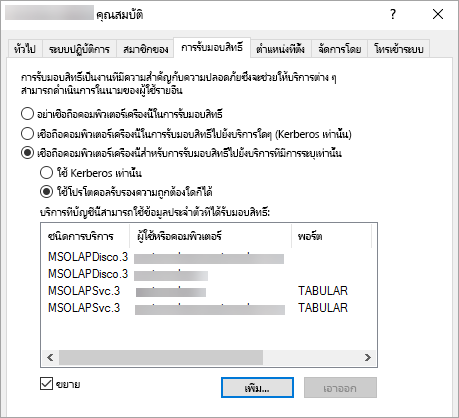

# <a name="configure-kerberos-to-use-power-bi-reports"></a>กำหนดค่า Kerberos เพื่อใช้รายงาน Power BI
<iframe width="640" height="360" src="https://www.youtube.com/embed/vCH8Fa3OpQ0?showinfo=0" frameborder="0" allowfullscreen></iframe>

เรียนรู้วิธีการกำหนดค่าเซิร์ฟเวอร์รายงานของคุณสำหรับการรับรองความถูกต้อง Kerberos ไปยังแหล่งข้อมูลที่ใช้ภายในรายงานของ Power BI สำหรับสภาพแวดล้อมแบบกระจาย

เซิร์ฟเวอร์รายงาน Power BI รวมถึงความสามารถในการโฮสต์รายงาน Power BI เซิร์ฟเวอร์รายการของคุณสนับสนุนแหล่งข้อมูลมากมาย ในขณะที่บทความนี้มุ่งเน้นโดยเฉพาะที่ SQL Server Analysis Services คุณสามารถใช้แนวคิดดังกล่าวและนำไปใช้กับแหล่งข้อมูลอื่น ๆ เช่น SQL Server ได้

คุณสามารถติดตั้งเซิร์ฟเวอร์รายงาน Power BI, SQL Server และ Analysis Services บนคอมพิวเตอร์เครื่องเดียวได้ และทุกอย่างควรใช้งานได้โดยไม่ต้องกำหนดค่าเพิ่มเติม ซึ่งดีมากสำหรับสภาพแวดล้อมการทดสอบ คุณอาจพบข้อผิดพลาดถ้าคุณมีบริการเหล่านี้ติดตั้งอยู่บนเครื่องที่แยกต่างหากที่เรียกว่าสภาพแวดล้อมแบบกระจาย ในสภาพแวดล้อมเช่นนี้ คุณจะต้องใช้การรับรองความถูกต้อง Kerberos ต้องมีการกำหนดค่าที่จำเป็นสำหรับการนำขั้นตอนนี้ไปใช้ 

โดยเฉพาะอย่างยิ่ง คุณจะต้องกำหนดค่าการมอบสิทธิ์ที่บังคับ คุณอาจมีการกำหนดค่า Kerberos ในสภาพแวดล้อมของคุณ แต่ Kerberos อาจไม่ถูกกำหนดค่าการมอบสิทธิ์ที่บังคับ

## <a name="error-running-report"></a>ข้อผิดพลาดในการเรียกใช้รายงาน
ถ้าเซิร์ฟเวอร์รายงานของคุณไม่ได้มีการกำหนดค่าอย่างถูกต้อง อาจมีผิดพลาดต่อไปนี้เกิดขึ้น

    Something went wrong.

    We couldn’t run the report because we couldn’t connect to its data source. The report or data source might not be configured correctly. 

ในรายละเอียดทางเทคนิค คุณจะเห็นข้อความต่อไปนี้

    We couldn’t connect to the Analysis Services server. The server forcibly closed the connection. To connect as the user viewing the report, your organization must have configured Kerberos constrained delegation.


## <a name="configuring-kerberos-constrained-delegation"></a>การกำหนดค่าการมอบสิทธิ์ที่บังคับของ Kerberos
มีหลายรายการที่จำเป็นต้องกำหนดค่าลำดับเพื่อให้การรับมอบสิทธิ์ที่บังคับของ Kerberos ทำงานได้ ซึ่งรวมถึงชื่อหลักของการบริการ (Service Principal Name: SPN) และการตั้งค่าการมอบสิทธิ์บนบัญชีบริการ

> [!NOTE]
> ในการกำหนดค่า SPN และการตั้งค่าการรับมอบสิทธิ์ คุณต้องเป็นผู้ดูแลโดเมน
> 
> 

เราจะต้องกำหนดค่าหรือตรวจสอบรายการต่อไปนี้

1. ชนิดการรับรองความถูกต้องภายในการกำหนดค่าเซิร์ฟเวอร์รายงาน
2. SPN สำหรับบัญชีผู้ใช้บริการเซิร์ฟเวอร์รายงาน
3. SPN สำหรับบริการ Analysis Services
4. SPN สำหรับบริการเบราเซอร์ SQL บนเครื่องของ Analysis Services ส่วนนี้สำหรับตัวอย่างที่ตั้งชื่อแล้วเท่านั้น
5. ตั้งค่าการรับมอบสิทธิ์บนเซิร์ฟเวอร์รายงานบัญชีบริการ

## <a name="authentication-type-within-report-server-configuration"></a>ชนิดการรับรองความถูกต้องภายในการกำหนดค่าเซิร์ฟเวอร์รายงาน
เราจำเป็นต้องกำหนดค่าชนิดการรับรองความถูกต้องสำหรับเซิร์ฟเวอร์รายงานเพื่ออนุญาตให้สามารถรับมอบสิทธิ์ Kerberos ที่บังคับได้ ซึ่งทำได้ภายในไฟล์**rsreportserver.config** ตำแหน่งเริ่มต้นสำหรับไฟล์นี้คือ`C:\Program Files\Microsoft Power BI Report Server\PBIRS\ReportServer`

ภายในไฟล์ rsreportserver.config คุณจะต้องการปรับค่าส่วน**รับรองความถูกต้อง/AuthenticationTypes** ให้เหมาะสมยิ่งขึ้น

เราต้องตรวจสอบให้แน่ใจว่า RSWindowsNegotiate อยู่ในรายการและเป็นส่วนแรกในรายการของชนิดการรับรองความถูกต้อง ซึ่งควรมีลักษณะคล้ายต่อไปนี้

```
<AuthenticationTypes>
    <RSWindowsNegotiate/>
    <RSWindowsNTLM/>
</AuthenticationTypes>
```

ถ้าคุณต้องเปลี่ยนแปลงไฟล์การกำหนดค่า คุณควรหยุดและเริ่มใช้งานเซิร์ฟเวอร์รายงานเพื่อทำการตรวจสอบให้แน่ใจว่าการเปลี่ยนแปลงดังกล่าวมีผล

สำหรับข้อมูลเพิ่มเติม ดูที่[กำหนดค่าการรับรองความถูกต้องของ Windows บนเซิร์ฟเวอร์รายงาน](https://docs.microsoft.com/sql/reporting-services/security/configure-windows-authentication-on-the-report-server)

## <a name="spns-for-the-report-server-service-account"></a>SPN สำหรับบัญชีผู้ใช้บริการเซิร์ฟเวอร์รายงาน
ต่อไปเราจำเป็นต้องตรวจสอบให้แน่ใจว่าเซิร์ฟเวอร์รายงานมี SPN ที่ถูกต้องพร้อมใช้งานหรือไม่ ซึ่งจะยึดตามบัญชีผู้ใช้บริการที่มีการกำหนดค่าสำหรับเซิร์ฟเวอร์รายงานดังกล่าว

### <a name="virtual-service-account-or-network-service"></a>บัญชีบริการเสมือนหรือบริการเครือข่าย
ถ้าเซิร์ฟเวอร์รายงานของคุณมีการกำหนดค่าสำหรับบัญชีบัญชีบริการเสมือนหรือบัญชีบริการเครือข่าย คุณไม่ควรต้องทำอะไรอีก สิ่งเหล่านี้อยู่ในบริบทของบัญชีเครื่องแล้ว บัญชีเครื่องจะมี SPN โฮสต์ตามค่าเริ่มต้น ซึ่งจะครอบคลุมบริการ HTTP และจะใช้โดยเซิร์ฟเวอร์รายงาน

ถ้าคุณกำลังใช้ชื่อเซิร์ฟเวอร์เสมือนที่ชื่อไม่เหมือนกับบัญชีเครื่อง รายการโฮสต์จะไม่ครอบคลุมและคุณจะต้องเพิ่ม SPN สำหรับชื่อโฮสต์เซิร์ฟเวอร์เสมือนด้วยตนเอง

### <a name="domain-user-account"></a>บัญชีผู้ใช้โดเมน
ถ้าเซิร์ฟเวอร์รายงานของคุณถูกกำหนดค่าให้ใช้บัญชีผู้ใช้โดเมน คุณจะต้องสร้าง HTTP SPN บนบัญชีผู้ใช้นั้นด้วยตนเอง ซึ่งสามารถทำได้โดยใช้เครื่องมือ setspn ที่มาพร้อมกับ Windows

> [!NOTE]
> คุณจะต้องมีสิทธิ์ผู้ดูแลระบบโดเมนเพื่อสร้าง SPN ขึ้น
> 
> 

แนะนำให้สร้างสอง SPN หนึ่งด้วยชื่อ NetBIOS และอีกหนึ่งด้วยชื่อโดเมนแบบเต็มที่มีคุณสมบัติเหมาะสม (FQDN) SPN จะอยู่ในรูปแบบดังต่อไปนี้

    <Service>/<Host>:<port>

เซิร์ฟเวอร์รายงาน Power BI จะใช้การบริการของ HTTP สำหรับ HTTP SPN คุณจะไม่ทำรายการพอร์ต บริการที่เราสนใจที่นี่คือ HTTP โฮสต์ของ SPN จะเป็นชื่อที่คุณใช้ใน URL หนึ่ง โดยทั่วไปแล้วนี่คือชื่อของเครื่อง ถ้าคุณอยู่เบื้องหลังตัวสร้างสมดุลการโหลด ชื่อนี้อาจเป็นชื่อเสมือน

> [!NOTE]
> คุณสามารถตรวจสอบ URL ได้ด้วยการดูสิ่งที่คุณใส่ลงในแถบที่อยู่ของเบราว์เซอร์ หรือคุณสามารถค้นหาในตัวจัดการการกำหนดค่าเซิร์ฟเวอร์รายงานบนแถบ Web Portal URL
> 
> 

ถ้าชื่อเครื่องของคุณคือ ContosoRS ดังนั้น SPN ของคุณจะเป็นดังต่อไปนี้

| ประเภท SPN | SPN |
| --- | --- |
| ชื่อโดเมนแบบเต็มที่มีคุณสมบัติ (FQDN) |HTTP/ContosoRS.contoso.com |
| NetBIOS |HTTP/ContosoRS |

### <a name="location-of-spn"></a>ตำแหน่งที่ตั้งของ SPN
คุณจะใส่ SPN นี้ที่ไหน? SPN จะถูกวางไว้บนสิ่งที่คุณกำลังใช้สำหรับบัญชีบริการของคุณ ถ้าคุณใช้บัญชีผู้ใช้บริการเสมือนหรือบริการเครือข่าย ส่วนนี้จะเป็นบัญชีเครื่อง แม้ว่าเราได้กล่าวถึงแล้วก่อนหน้านี้ คุณควรจำเป็นต้องทำสิ่งนี้สำหรับ URL เสมือนเท่านั้น ถ้าคุณใช้ผู้ใช้โดเมนสำหรับบัญชีผู้ใช้บริการเซิร์ฟเวอร์รายงาน คุณจะใส่ SPN ที่บัญชีผู้ใช้โดเมนนั้น

ตัวอย่างเช่น ถ้าเราใช้บัญชีผู้ใช้บริการเครือข่ายและชื่อของเราเครื่องคือ ContosoRS เราจะวาง SPN ทีี่ ContosoRS

ถ้าเราใช้บัญชีผู้ใช้โดเมนของ RSService เราจะวาง SPN บน RSService

### <a name="using-setspn-to-add-the-spn"></a>ใช้ SetSPN เพื่อเพิ่ม SPN ดังกล่าว
เราสามารถใช้เครื่องมือ SetSPN เพื่อเพิ่ม SPN ดังกล่าวได้ เราจะทำตามตัวอย่างเดียวกันกับทางด้านบนด้วยบัญชีผู้ใช้เครื่องและบัญชีผู้ใช้โดเมน

การวาง SPN ดังกล่าวบนบัญชีเครื่องสำหรับทั้ง FQDN และ NetBIOS SPN จะมีลักษณะคล้ายกับรายการต่อไปนี้ถ้าเราใช้ URL แบบเสมือนของ contosoreports

      Setspn -a HTTP/contosoreports.contoso.com ContosoRS
      Setspn -a HTTP/contosoreports ContosoRS

การวาง SPN บนบัญชีผู้ใช้โดเมนสำหรับทั้ง FQDN และ NetBIOS SPN จะมีลักษณะคล้ายกับรายการดังต่อไปนี้ถ้าคุณใช้ชื่อเครื่องสำหรับโฮสต์ของ SPN

      Setspn -a HTTP/ContosoRS.contoso.com RSService
      Setspn -a HTTP/ContosoRS RSService

## <a name="spns-for-the-analysis-services-service"></a>SPN สำหรับบริการ Analysis Services
SPN สำหรับ Analysis Services จะคล้ายกับที่เราดำเนินการกับเซิร์ฟเวอร์รายงาน Power BI รูปแบบของ SPN จะแตกต่างเล็กน้อยถ้าคุณมีตัวอย่างที่ตั้งชื่อแล้ว

สำหรับ Analysis Services เราใช้บริการของ MSOLAPSvc.3 เราจะระบุชื่อตัวอย่างสำหรับตำแหน่งที่ตั้งพอร์ตบน SPN ส่วนที่เป็นโฮสต์ของ SPN จะเป็นชื่อเครื่องหรือชื่อเสมือนของกลุ่ม

ตัวอย่างของ SPN สำหรับ Analysis Services มีลักษณะดังต่อไปนี้

| ชนิด | รูปแบบ |
| --- | --- |
| ตัวอย่างเริ่มต้น |MSOLAPSvc.3/ContosoAS.contoso.com<br>MSOLAPSvc.3/ContosoAS |
| ตัวอย่างที่ตั้งชื่อ |MSOLAPSvc.3/ContosoAS.contoso.com:INSTANCENAME<br>MSOLAPSvc.3/ContosoAS:INSTANCENAME |

การวางตำแหน่งของ SPN จะคล้ายกับสิ่งที่กล่าวถึงก่อนหน้านี้กับเซิร์ฟเวอร์รายงาน Power BI ซึ่งจะยึดตามบัญชีผู้ใช้บริการ  ถ้าคุณใช้ระบบภายในเครื่องหรือบริการเครือข่าย คุณจะอยู่ในบริบทของบัญชีเครื่อง ถ้าคุณใช้บัญชีผู้ใช้โดเมนสำหรับตัวอย่าง Analysis Services คุณจะวาง SPN ที่บัญชีผู้ใช้โดเมนนั้น

### <a name="using-setspn-to-add-the-spn"></a>ใช้ SetSPN เพื่อเพิ่ม SPN ดังกล่าว
เราสามารถใช้เครื่องมือ SetSPN เพื่อเพิ่ม SPN ดังกล่าวได้ สำหรับตัวอย่างนี้ ชื่อเครื่องจะเป็น ContosoAS

การวาง SPN ดังกล่าวบนบัญชีเครื่องสำหรับทั้ง FQDN และ NetBIOS SPN จะมีลักษณะคล้ายกับรายการต่อไปนี้

    Setspn -a MSOLAPSvc.3/ContosoAS.contoso.com ContosoAS
    Setspn -a MSOLAPSvc.3/ContosoAS ContosoAS

การวาง SPN ดังกล่าวบนบัญชีผู้ใช้โดเมนสำหรับทั้ง FQDN และ NetBIOS SPN จะมีลักษณะคล้ายกับรายการต่อไปนี้

    Setspn -a MSOLAPSvc.3/ContosoAS.contoso.com OLAPService
    Setspn -a MSOLAPSvc.3/ContosoAS OLAPService

## <a name="spns-for-the-sql-browser-service"></a>SPN สำหรับบริการ SQL Browser
ถ้าคุณมีตัวอย่าง Analysis Services ที่มีชื่อแล้ว คุณยังจำเป็นต้องตรวจสอบให้แน่ใจว่าคุณมี SPN สำหรับบริการเบราว์เซอร์ดังกล่าวด้วย ซึ่งมีเฉพาะใน Analysis Services

SPN สำหรับ SQL Browser จะคล้ายกับสิ่งที่เราดำเนินการกับเซิร์ฟเวอร์รายงาน Power BI

สำหรับ SQL Browser เราใช้บริการของ MSOLAPDisco.3 เราจะระบุชื่อตัวอย่างสำหรับตำแหน่งที่ตั้งพอร์ตบน SPN ส่วนที่เป็นโฮสต์ของ SPN จะเป็นชื่อเครื่องหรือชื่อเสมือนของกลุ่ม
คุณไม่จำเป็นต้องระบุสิ่งใดสำหรับชื่อหรือพอร์ตตัวอย่าง

ตัวอย่างของ SPN สำหรับ Analysis Services มีลักษณะดังต่อไปนี้

    MSOLAPDisco.3/ContosoAS.contoso.com
    MSOLAPDisco.3/ContosoAS

การวางตำแหน่งของ SPN จะคล้ายกับสิ่งที่กล่าวถึงก่อนหน้านี้กับเซิร์ฟเวอร์รายงาน Power BI ความแตกต่าง ณ จุดนี้คือ SQL Browser ทำงานภายใต้บัญชีระบบภายในเครื่องเสมอ ซึ่งหมายความว่า SPN จะไปที่บัญชีเครื่องเสมอ 

### <a name="using-setspn-to-add-the-spn"></a>ใช้ SetSPN เพื่อเพิ่ม SPN ดังกล่าว
เราสามารถใช้เครื่องมือ SetSPN เพื่อเพิ่ม SPN ดังกล่าวได้ สำหรับตัวอย่างนี้ ชื่อเครื่องจะเป็น ContosoAS

การวาง SPN ดังกล่าวบนบัญชีเครื่องสำหรับทั้ง FQDN และ NetBIOS SPN จะมีลักษณะคล้ายกับรายการต่อไปนี้

    Setspn -a MSOLAPDisco.3/ContosoAS.contoso.com ContosoAS
    Setspn -a MSOLAPDisco.3/ContosoAS ContosoAS

สำหรับข้อมูลเพิ่มเติม ดูที่ [จำเป็นต้องมี SPN สำหรับบริการเบราเซอร์เซิร์ฟเวอร์ SQL](https://support.microsoft.com/kb/950599)

## <a name="delegation-settings-on-the-report-server-service-account"></a>การตั้งค่าการรับมอบสิทธิ์บนบัญชีบริการเซิร์ฟเวอร์รายงาน
ส่วนสุดท้ายที่เราจำเป็นต้องกำหนดค่าคือการตั้งค่าการรับมอบสิทธิ์บนบัญชีผู้ใช้บริการเซิร์ฟเวอร์รายงาน มีเครื่องมือหลายตัวที่คุณสามารถใช้เพื่อดำเนินการขั้นตอนเหล่านี้ได้ สำหรับจุดประสงค์ของเอกสารนี้ เราจะใช้ผู้ใช้ Active Directory และคอมพิวเตอร์

คุณจะต้องเริ่มต้นโดยไปที่คุณสมบัติของบัญชีผู้ใช้บริการเซิร์ฟเวอร์รายงานภายในผู้ใช้ Active Directory และคอมพิวเตอร์ ซึ่งจะเป็นบัญชีเครื่องถ้าคุณใช้บัญชีผู้ใช้บริการเสมือนหรือบริการเครือข่าย หรือจะเป็นบัญชีผู้ใช้โดเมน

เราจะต้องกำหนดค่าการมอบสิทธิ์ที่บังคับด้วยส่งผ่านโปรโตคอล สำหรับการรับมอบสิทธิ์ทีี่บังคับ คุณต้องมีความชัดเจนว่าบริการใดที่คุณต้องการมอบหมาย เราจะไปและเพิ่มทั้ง SPN สำหรับบริการ Analysis Services และ SPN SQL Browser ไปยังรายการที่เซิร์ฟเวอร์รายงาน Power BI สามารถมอบหมายสิทธิ์ได้

1. คลิกขวาบนบัญชีผู้ใช้บริการเซิร์ฟเวอร์รายงาน และเลือก**คุณสมบัติ**
2. เลือกแถบ **การมอบหมาย**
3. เลือก **เชื่อถือคอมพิวเตอร์เครื่องนี้สำหรับการรับมอบสิทธิ์ไปยังบริการที่ระบุเท่านั้น**
4. เลือก**ใช้โปรโตคอลรับรองความถูกต้องใดก็ได้**
5. ใต้**บริการที่บัญชีผู้ใช้นี้สามารถใช้ข้อมูลประจำตัวที่ได้รับมอบหมาย:** เลือก**เพิ่ม**
6. ในกล่องโต้ตอบใหม่ เลือก**ผู้ใช้หรือคอมพิวเตอร์**
7. ป้อนบัญชีบริการสำหรับบริการ Analysis Services และเลือก**ตกลง**
8. เลือก SPN ที่คุณสร้างขึ้น ซึ่งจะเริ่มต้นด้วย`MSOLAPSvc.3` ถ้าคุณเพิ่มทั้ง FQDN และ NetBIOS SPN ระบบจะเลือกทั้งสองอย่าง คุณอาจเห็นแค่อย่างเดียวเท่านั้น
9. เลือก**ตกลง**  คุณควรเห็น SPN ในรายการแล้วตอนนี้
10. คุณอาจเลือก**ขยาย**เพื่อแสดงทั้ง FQDN และ NetBIOS SPN ในรายการดังกล่าว
11. เลือก**เพิ่ม**อีกครั้ง เราจะเพิ่ม SPN SQL Browser ตอนนี้้
12. ในกล่องโต้ตอบใหม่ เลือก**ผู้ใช้หรือคอมพิวเตอร์**
13. ใส่ชื่อเครื่องสำหรับเครื่องที่บริการ SQL Browser เปิดอยู่ แล้วเลือก**ตกลง**
14. เลือก SPN ที่คุณสร้างขึ้น ซึ่งจะเริ่มต้นด้วย`MSOLAPDisco.3` ถ้าคุณเพิ่มทั้ง FQDN และ NetBIOS SPN ระบบจะเลือกทั้งสองอย่าง คุณอาจเห็นแค่อย่างเดียวเท่านั้น
15. เลือก**ตกลง** กล่องโต้ตอบควรมีลักษณะคล้ายรูปต่อไปนี้ ถ้าคุณได้ทำเครื่องหมายที่**ขยาย**
    
    
16. เลือก**ตกลง**
17. ปิดและเปิดเซิร์ฟเวอร์รายงาน Power BI ใหม่

## <a name="running-a-power-bi-report"></a>การเรียกใช้รายงาน Power BI
หลังจากที่มีการกำหนดค่าด้านบนทั้งหมดแล้ว รายงานของคุณควรแสดงอย่างถูกต้อง 


ขณะที่การกำหนดค่านี้ควรใช้ได้ในกรณีส่วนใหญ่ ด้วย Kerberos อาจมีการกำหนดค่าที่แตกต่างออกไปโดยขึ้นอยู่กับสภาพแวดล้อมของคุณ ถ้ารายงานยังคงไม่โหลด คุณจะต้องติดต่อผู้ดูแลระบบโดเมนของคุณเพื่อตรวจสอบเพิ่มเติม หรือติดต่อฝ่ายสนับสนุน

## <a name="next-steps"></a>ขั้นตอนถัดไป
[คู่มือผู้ดูแลระบบ](admin-handbook-overview.md)  
[เริ่มต้นใช้งานด่วน: ติดตั้งเซิร์ฟเวอร์รายงาน Power BI](quickstart-install-report-server.md)  

มีคำถามเพิ่มเติมหรือไม่? [ลองถามชุมชน Power BI](https://community.powerbi.com/)

