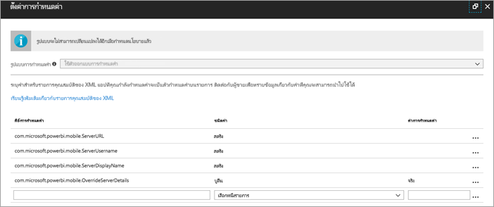
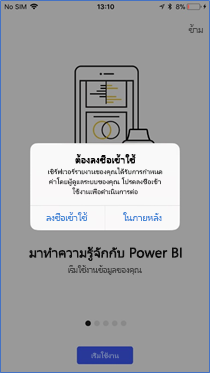
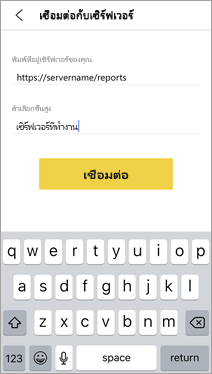
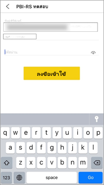

# กำหนดค่าการเข้าถึงเซิร์ฟเวอร์รายงานจากระยะไกล สำหรับแอปอุปกรณ์เคลื่อนที่ ของ Power BI

ใช้ได้กับ:

|  |  |
|:--- |:--- |
| iOS |Android |

ในบทความนี้ เรียนรู้วิธีการใช้เครื่องมือ MDM ขององค์กรของคุณเพื่อกำหนดค่าการเข้าถึงแอปอุปกรณ์เคลื่อนที่ไปยังเซิร์ฟเวอร์รายงาน เมื่อต้องการกำหนดค่า ผู้ดูแลระบบ IT สร้างนโยบายการกำหนดค่าแอปด้วยข้อมูลที่จำเป็นเพื่อที่จะส่งไปยังแอป 

 ผู้ใช้แอป Power BI สำหรับอุปกรณ์เคลื่อนที่ สามารถเชื่อมต่อกับเซิร์ฟเวอร์รายงานขององค์กรได้ง่ายขึ้น เนื่องจากมีการกำหนดค่าการเชื่อมต่อเซิร์ฟเวอร์รายงานไว้แล้ว 

## สร้างนโยบายการกำหนดค่าแอปในเครื่องมือ MDM 

ในฐานะผู้ดูแลระบบ ต่อไปนี้คือขั้นตอนที่คุณทำตามใน Microsoft Intune เพื่อสร้างนโยบายการกำหนดค่าแอป ขั้นตอนและประสบการณ์การสร้างนโยบายการกำหนดค่าแอปอาจแตกต่างกันในเครื่องมือ MDM อื่น ๆ 

1. เชื่อมต่อเครื่องมือ MDM ของคุณ 
2. สร้างและตั้งชื่อนโยบายการกำหนดค่าแอปใหม่ 
3. เลือกผู้ใช้ที่คุณจะแจกจ่ายนโยบายกำหนดค่าแอปนี้ไปให้ 
4. สร้างคู่คีย์-ค่า 

ตารางต่อไปนี้กล่าวถึงคู่ต่าง ๆ

|คีย์  |ประเภท  |คำอธิบาย  |
|---------|---------|---------|
| com.microsoft.powerbi.mobile.ServerURL | สตริง | URL เซิร์ฟเวอร์รายงาน   ควรเริ่มต้นด้วย http/https |
| com.microsoft.powerbi.mobile.ServerUsername | สตริง | [เป็นทางเลือก]   ชื่อผู้ใช้เพื่อใช้สำหรับการเชื่อมต่อเซิร์ฟเวอร์   หากไม่มีชื่ออยู่ แอปจะปรากฏข้อควมให้ผู้ใช้ให้พิมพ์ชื่อผู้ใช้สำหรับการเชื่อมต่อ| 
| com.microsoft.powerbi.mobile.ServerDisplayName | สตริง | [เป็นทางเลือก]   ค่าเริ่มต้นเป็น "เซิร์ฟเวอร์รายงาน"   ชื่อที่เรียกง่ายที่ใช้ในแอปเพื่อเป็นตัวแทนเซิร์ฟเวอร์ | 
| com.microsoft.powerbi.mobile.OverrideServerDetails | บูลีน | ค่าเริ่มต้นเป็น True  เมื่อตั้งค่าเป็น "True" จะแทนที่ข้อกำหนดของเซิร์ฟเวอร์รายงานใด ๆ ที่อยู่ในอุปกรณ์เคลื่อนที่อยู่แล้ว เซิร์ฟเวอร์ที่มีอยู่ที่ถูกกำหนดค่าไว้จะถูกลบ   การแทนการตั้งค่าเป็น True ยังช่วยป้องกันไม่ให้ผู้ใช้ลบการกำหนดค่านั้นด้วย   การตั้งค่าเป็น "False" จะเพิ่มค่าที่ส่ง โดยอปล่อยให้มีการใช้การตั้งค่าใด ๆ ที่มีอยู่ต่อไป   หากมีการกำหนดค่า URL เซิร์ฟเวอร์เดียวกันในแอปสำหรับอุปกรณ์เคลื่อนที่แล้ว แอปจะปิดการกำหนดค่าดังกล่าวด้วย แอปจะไม่ขอให้ผู้ใช้ตรวจสอบสิทธิ์ซ้ำสำหรับเซิร์ฟเวอร์เดียวกัน |

นี่คือตัวอย่างของการตั้งค่านโยบายการกำหนดค่าโดยใช้ Intune

## ผู้ใช้ปลายทางที่เชื่อมต่อกับเซิร์ฟเวอร์รายงาน

 สมมติว่าคุณเผยแพร่นโยบายการกำหนดค่าแอปสำหรับรายชื่อการแจกจ่าย เมื่อผู้ใช้และอุปกรณ์ในรายชื่อการแจกจ่ายดังกล่าวเริ่มต้นใช้งานแอปสำหรับอุปกรณ์เคลื่อนที่ พวกเขาจะได้รับประสบการณ์ดังต่อไปนี้ 

1. พวกเขาจะเห็นข้อความว่าแอปสำหรับอุปกรณ์เคลื่อนที่ของตนได้กำหนดค่าสำหรับเซิร์ฟเวอร์รายงานแล้ว และแตะ **ลงชื่อเข้าใช้**

    

2.  บนหน้า**เชื่อมต่อกับเซิร์ฟเวอร์** รายละเอียดของเซิร์ฟเวอร์รายงานได้ถูกกรอกให้แล้ว ผู้ใช้แตะ**เชื่อมต่อ**

    

3. ผู้ใช้พิมพ์รหัสผ่านเพื่อรับรองความถูกต้อง จากนั้นแตะ**ลงชื่อเข้าใช้** 

    

ตอนนี้ ผู้ใช้สามารถดูและโต้ตอบกับ KPI และรายงาน Power BI ที่จัดเก็บบนเซิร์ฟเวอร์รายงาน

## ขั้นตอนถัดไป

- [เปิดใช้งานการเข้าถึงระยะไกลไปยัง Power BI Mobile ด้วยพร็อกซีแอปพลิเคชันของ Azure AD](https://docs.microsoft.com/azure/active-directory/manage-apps/application-proxy-integrate-with-power-bi)
- [ภาพรวมของผู้ดูแลระบบ](admin-handbook-overview.md)  
- [ติดตั้ง Power BI Report Server](install-report-server.md)  

มีคำถามเพิ่มเติมหรือไม่ [ลองถามชุมชน Power BI](https://community.powerbi.com/)

