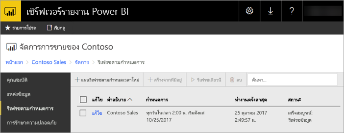
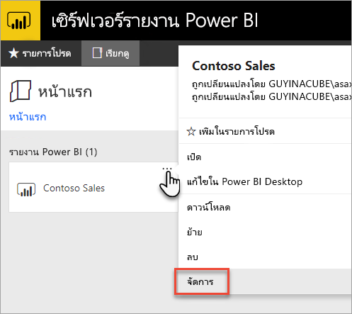
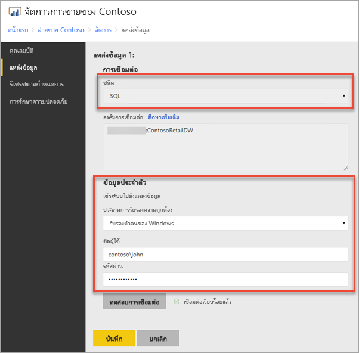
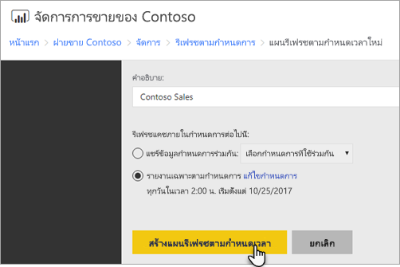
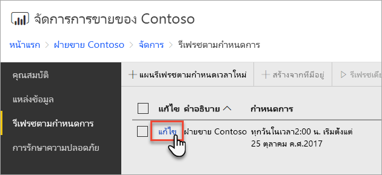
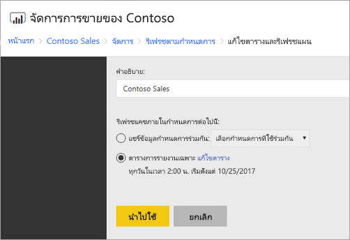

# วิธีการกำหนดค่าการรีเฟรชตามกำหนดเวลา ของรายงาน Power BI
เมื่อต้องการรีเฟรชข้อมูลในรายงาน Power BI ของคุณ แผนการรีเฟรชตามกำหนดเวลาต้องถูกสร้างขึ้น ซึ่งสามารถทำได้ภายในการบริเวณ *จัดการ* ของรายงาน Power BI

## กำหนดค่าข้อมูลประจำตัวของแหล่งข้อมูล
ก่อนที่จะสร้างแผนการรีเฟรชตามกำหนดเวลา คุณจำเป็นต้องตั้งค่าข้อมูลประจำตัวสำหรับ**แต่ละแหล่งข้อมูล** ที่ใช้ในรายงาน Power BI ของคุณ

1. ในพอร์ทัลของเว็บ คลิกขวาบนรายงาน Power BI และเลือก**จัดการ**
   
    
2. ในเมนูทางด้านซ้าย เลือกแท็บ**แหล่งข้อมูล**
3. สำหรับแต่ละแหล่งข้อมูลที่ปรากฏขึ้น เลือกชนิดของการรับรองความถูกต้องที่จะใช้เมื่อเชื่อมต่อกับแหล่งข้อมูลนั้น ใส่ข้อมูลประจำตัวที่เหมาะสม
   
    

## การสร้างแผนรีเฟรชตามกำหนดเวลา
ทำตามขั้นตอนเหล่านี้ เพื่อสร้างแผนรีเฟรชตามกำหนดเวลา

1. ในพอร์ทัลของเว็บ คลิกขวาบนรายงาน Power BI และเลือก**จัดการ**
   
    
2. ในเมนูทางด้านซ้าย เลือกแท็บ**รีเฟรชตามกำหนดเวลา**
3. บนหน้า**รีเฟรชตามกำหนดเวลา** เลือก**สร้างแผนรีเฟรชตามกำหนดเวลาใหม่**
   
    
4. บนหน้า**สร้างแผนรีเฟรชตามกำหนดเวลาใหม่** ใส่คำอธิบาย และตั้งค่ากำหนดเวลา สำหรับเวลาที่คุณต้องการให้รูปแบบข้อมูลของคุณถูกรีเฟรช
5. เลือก**สร้างแผนรีเฟรชตามกำหนดเวลา** เมื่อเสร็จแล้ว
   
    

## การปรับเปลี่ยนแผนรีเฟรชตามกำหนดเวลา
การปรับเปลี่ยนแผนรีเฟรชตามกำหนดเวลา จะคล้ายกับเวลาสร้างแผน

1. ในพอร์ทัลของเว็บ คลิกขวาบนรายงาน Power BI และเลือก**จัดการ**
   
    
2. ในเมนูทางด้านซ้าย เลือกแท็บ**รีเฟรชตามกำหนดเวลา**
3. บนหน้า**รีเฟรชตามกำหนดเวลา** เลือก**แก้ไข**ข้างแผนการรีเฟรชที่คุณต้องการจัดการ
   
    
4. บนหน้า**แก้ไขแผนรีเฟรชตามกำหนดเวลา** ใส่คำอธิบาย และตั้งค่ากำหนดเวลา สำหรับเวลาที่คุณต้องการให้รูปแบบข้อมูลของคุณถูกรีเฟรช
5. เลือก**นำไปใช้** เมื่อทำเสร็จแล้ว
   
    

## ดูสถานะของแผนรีเฟรชตามกำหนดเวลา
ดูสถานะของแผนรีเฟรชตามกำหนดเวลาในพอร์ทัลของเว็บ

1. ในพอร์ทัลของเว็บ คลิกขวาบนรายงาน Power BI และเลือก**จัดการ**
   
    
2. ในเมนูทางด้านซ้าย เลือกแท็บ**รีเฟรชตามกำหนดเวลา**
3. บนหน้า**รีเฟรชตามกำหนดเวลา** คอลัมน์ด้านขวาสุดจะแสดงสถานะของแผน
   
   | **สถานะ** | **คำอธิบาย** |
   | --- | --- |
   | แผนรีเฟรชตามกำหนดเวลาใหม่ |แผนถูกสร้างขึ้นแล้ว แต่ยังไม่เคยเรียกใช้งาน |
   | กำลังรีเฟรช |กระบวนการรีเฟรชได้เริ่มขึ้นแล้ว |
   | กำลังสตรีมรูปแบบไปยังเซิร์ฟเวอร์การวิเคราะห์ |กำลังคัดลอกรูปแบบ จากฐานข้อมูลแค็ตตาล็อกเซิร์ฟเวอร์รายงาน ไปยังอินสแตนซ์ของ Analysis Services ที่ถูกโฮสต์ |
   | กำลังรีเฟรชข้อมูล |กำลังรีเฟรชข้อมูลภายในรูปแบบ |
   | กำลังเอาข้อมูลประจำตัวออกจากรูปแบบ |เอาข้อมูลประจำตัวที่ใช้ในการเชื่อมต่อกับแหล่งข้อมูลออกจากรูปแบบ |
   | กำลังบันทึกรูปแบบไปยังแค็ตตาล็อก |การรีเฟรชข้อมูลเสร็จสมบูรณ์ และรูปแบบปรับปรุงใหม่กำลังถูกบันทึกกลับไปยังฐานข้อมูลแค็ตตาล็อกของเซิร์ฟเวอร์รายงาน |
   | เสร็จสมบูรณ์แล้ว: รีเฟรชข้อมูล |รีเฟรชเสร็จสิ้นแล้ว |
   | ข้อผิดพลาด: |มีข้อผิดพลาดเกิดขึ้นระหว่างการรีเฟรช และแสดงข้อผิดพลาด |

เว็บเพจนี้ต้องมีการรีเฟรชเพื่อดูสถานะปัจจุบัน สถานะจะไม่เปลี่ยนแปลงโดยอัตโนมัติ

## ขั้นตอนถัดไป
เมื่อต้องการเรียนรู้เพิ่มเติมเกี่ยวกับการสร้างและปรับเปลี่ยนกำหนดเวลา ดู[สร้าง แก้ไข และลบกำหนดเวลา](https://docs.microsoft.com/sql/reporting-services/subscriptions/create-modify-and-delete-schedules)

สำหรับข้อมูลเกี่ยวกับวิธีการแก้ไขปัญหารีเฟรชตามกำหนดเวลา ดู[แก้ไขปัญหารีเฟรชตามกำหนดเวลาในรีพอร์ตเซิร์ฟเวอร์ Power BI](scheduled-refresh-troubleshoot.md)

คำถามเพิ่มเติมหรือไม่ [ลองถามชุมชน Power BI](https://community.powerbi.com/)

