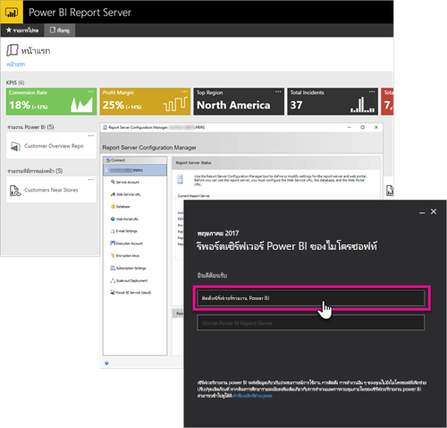

# ภาพรวมคู่มือสำหรับนักพัฒนา เซิร์ฟเวอร์รายงาน Power BI
ยินดีต้อนรับสู่คู่มือสำหรับนักพัฒนา สำหรับเซิร์ฟเวอร์รายงาน Power BI ซึ่งใช้จัดเก็บ และจัดการรายงาน Power BI, รายงานบนอุปกรณ์เคลื่อนที่ และรายงานที่จัดรูปหน้าแล้วของคุณภายในองค์กร

คู่มือนี้จะแสดงให้เห็นตัวเลือกที่คุณมี สำหรับนักพัฒนา เพื่อทำงานกับ เซิร์ฟเวอร์รายงาน Power BI

## การฝังตัว
สำหรับรายงานใด ๆ ภายในเซิร์ฟเวอร์รายงาน Power BI คุณสามารถฝังตัวภายใน iFrame โดยการเพิ่มพารามิเตอร์ querystring `?rs:Embed=true` เข้าไปใน URL ซึ่งทำงานได้กับรายงาน Power BI เช่นเดียวกับรายงานชนิดอื่น ๆ

### ตัวควบคุม Report Viewer
สำหรับรายงานที่มีการแบ่งหน้า คุณสามารถใช้ประโยชน์จากตัวควบคุม Report Viewer ซึ่งให้คุณสามารถวางตัวควบคุมภายใน .NET Windows แอปพลิเคชัน หรือเว็บแอปพลิเคชัน สำหรับข้อมูลเพิ่มเติม ดู[เริ่มต้นใช้งานตัวควบคุม Report Viewer](https://docs.microsoft.com/sql/reporting-services/application-integration/integrating-reporting-services-using-reportviewer-controls-get-started)

## API
คุณมีหลายตัวเลือกสำหรับ API เพื่อโต้ตอบกับเซิร์ฟเวอร์รายงาน Power BI ซึ่งรวมไปถึงต่อไปนี้

* [REST API](rest-api.md)
* [การเข้าถึง URL](https://docs.microsoft.com/sql/reporting-services/url-access-ssrs)
* [ผู้ให้บริการ WMI](https://docs.microsoft.com/sql/reporting-services/wmi-provider-library-reference/reporting-services-wmi-provider-library-reference-ssrs)

คุณยังสามารถใช้ [โปรแกรมอรรถประโยชน์ของ PowerShell](https://github.com/Microsoft/ReportingServicesTools) ที่เป็นโอเพนซอร์ส เพื่อจัดการเซิร์ฟเวอร์รายงานของคุณได้

> [!NOTE]
> โปรแกรมอรรถประโยชน์ของ PowerShell ในขณะนี้ยังไม่สนับสนุนไฟล์ Power BI Desktop (.pbix)
> 
> 

## ส่วนขยายแบบกำหนดเอง
ไลบรารีส่วนขยายคือ ชุดของคลาส อินเทอร์เฟซ และชนิดของค่า ที่มีอยู่ในเซิร์ฟเวอร์รายงาน Power BI ไลบรารีนี้ให้การเข้าถึงฟังก์ชันการทำงานของระบบ และถูกออกแบบมาเพื่อให้เป็นพื้นฐานที่ แอปพลิเคชัน Microsoft .NET Framework สามารถใช้ขยายคอมโพเนนต์ของ เซิร์ฟเวอร์รายงาน Power BI

มีส่วนขยายหลายชนิดที่คุณสามารถสร้างได้

* ส่วนขยายการประมวลผลข้อมูล
* ส่วนขยายการจัดส่ง
* ส่วนขยายการแสดงผลรายงานที่มีการแบ่งหน้า
* ส่วนขยายการรักษาความปลอดภัย

เมื่อต้องการเรียนรู้เพิ่มเติม ดู[ไลบรารีส่วนขยาย](https://docs.microsoft.com/sql/reporting-services/extensions/reporting-services-extension-library)

## ขั้นตอนถัดไป
[เริ่มต้นใช้งานตัวควบคุม Report Viewer](https://docs.microsoft.com/sql/reporting-services/application-integration/integrating-reporting-services-using-reportviewer-controls-get-started)  
[สร้างแอปพลิเคชันโดยใช้ บริการเว็บ และ .NET Framework](https://docs.microsoft.com/sql/reporting-services/report-server-web-service/net-framework/building-applications-using-the-web-service-and-the-net-framework)  
[การเข้าถึง URL](https://docs.microsoft.com/sql/reporting-services/url-access-ssrs)  
[ไลบรารีส่วนขยาย](https://docs.microsoft.com/sql/reporting-services/extensions/reporting-services-extension-library)  
[ผู้ให้บริการ WMI](https://docs.microsoft.com/sql/reporting-services/wmi-provider-library-reference/reporting-services-wmi-provider-library-reference-ssrs)

คำถามเพิ่มเติมหรือไม่ [ลองถามชุมชน Power BI](https://community.powerbi.com/)

