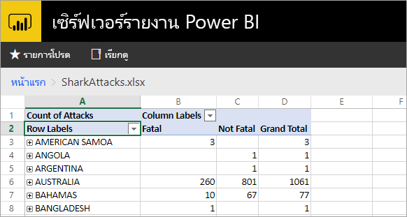
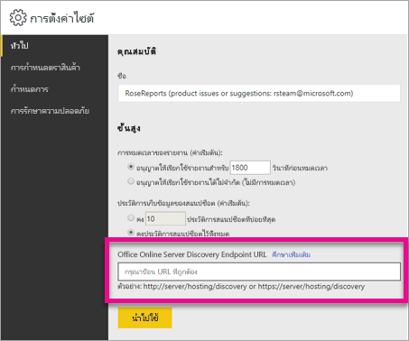

# <a name="configure-your-report-server-to-host-excel-workbooks-using-office-online-server-oos"></a>กำหนดค่าเซิร์ฟเวอร์รายงานของคุณเพื่อโฮสต์ เวิร์กบุ๊ก Excel โดยใช้ Office Online Server (OOS)

นอกเหนือจากการดูรายงาน Power BI ในพอร์ทัลของเว็บแล้ว เซิร์ฟเวอร์รายงาน Power BI สามารถโฮสต์สมุดงาน Excel โดยใช้ [Office Online Server](https://docs.microsoft.com/officeonlineserver/office-online-server-overview) (OOS) ได้ เซิร์ฟเวอร์รายงานของคุณกลายเป็นสถานที่เดียวเพื่อเผยแพร่ และดูเนื้อหา Microsoft BI แบบบริการตนเอง



## <a name="prepare-server-to-run-office-online-server"></a>เตรียมเซิร์ฟเวอร์เพื่อเรียกใช้ Office Online Server

ทำตามขั้นตอนต่อไปนี้บนเซิร์ฟเวอร์ที่จะเรียกใช้ Office Online Server เซิร์ฟเวอร์นี้ต้องเป็น Windows Server 2012 R2 หรือ Windows Server 2016 Windows Server 2016 จำเป็นต้องมี Office Online Server เดือนเมษายน 2017 หรือใหม่กว่า

### <a name="install-prerequisite-software-for-office-online-server"></a>ติดตั้งซอฟต์แวร์ตามข้อกำหนดเบื้องต้นสำหรับ Office Online Server

1. เปิดพร้อมท์ Windows PowerShell เป็นผู้ดูแลระบบ และเรียกใช้คำสั่งนี้เพื่อติดตั้ง บทบาทและบริการที่จำเป็น

    **Windows Server 2012 R2:**

    ```powershell
    Add-WindowsFeature Web-Server,Web-Mgmt-Tools,Web-Mgmt-Console,Web-WebServer,Web-Common-Http,Web-Default-Doc,Web-Static-Content,Web-Performance,Web-Stat-Compression,Web-Dyn-Compression,Web-Security,Web-Filtering,Web-Windows-Auth,Web-App-Dev,Web-Net-Ext45,Web-Asp-Net45,Web-ISAPI-Ext,Web-ISAPI-Filter,Web-Includes,InkandHandwritingServices,NET-Framework-Features,NET-Framework-Core,NET-HTTP-Activation,NET-Non-HTTP-Activ,NET-WCF-HTTP-Activation45,Windows-Identity-Foundation,Server-Media-Foundation
    ```

    **Windows Server 2016:**

    ```powershell
    Add-WindowsFeature Web-Server,Web-Mgmt-Tools,Web-Mgmt-Console,Web-WebServer,Web-Common-Http,Web-Default-Doc,Web-Static-Content,Web-Performance,Web-Stat-Compression,Web-Dyn-Compression,Web-Security,Web-Filtering,Web-Windows-Auth,Web-App-Dev,Web-Net-Ext45,Web-Asp-Net45,Web-ISAPI-Ext,Web-ISAPI-Filter,Web-Includes,NET-Framework-Features,NET-Framework-45-Features,NET-Framework-Core,NET-Framework-45-Core,NET-HTTP-Activation,NET-Non-HTTP-Activ,NET-WCF-HTTP-Activation45,Windows-Identity-Foundation,Server-Media-Foundation
    ```

    ถ้าถูกพร้อมท์ ให้รีสตาร์ตเซิร์ฟเวอร์
2. ติดตั้งซอฟต์แวร์ต่อไปนี้:

   * [.NET Framework 4.5.2](https://go.microsoft.com/fwlink/p/?LinkId=510096)
   * [Visual C++ Redistributable Packages for Visual Studio 2013](https://www.microsoft.com/download/details.aspx?id=40784)
   * [Visual C++ Redistributable for Visual Studio 2015](https://go.microsoft.com/fwlink/p/?LinkId=620071)
   * [Microsoft.IdentityModel.Extention.dll](https://go.microsoft.com/fwlink/p/?LinkId=620072)

### <a name="install-office-online-server"></a>ติดตั้ง Office Online Server

ถ้าคุณวางแผนที่จะใช้คุณลักษณะใด ๆ ของ Excel Online ที่ใช้การเข้าถึงข้อมูลภายนอก (เช่น Power Pivot) โปรดทราบว่า Office Online Server ต้องอยู่ในฟอเรสต์ Active Directory เดียวกับของผู้ใช้ เช่นเดียวกับแหล่งข้อมูลภายนอกใด ๆ ที่คุณวางแผนที่จะเข้าถึง โดยใช้การรับรองความถูกต้องด้วย Windows

1. ดาวน์โหลด Office Online Server จาก [Volume Licensing Service Center (VLSC)](https://go.microsoft.com/fwlink/p/?LinkId=256561) การดาวน์โหลดจะอยู่ภายใต้ผลิตภัณฑ์ Office เหล่านั้นบนพอร์ทัล VLSC สำหรับการพัฒนา คุณสามารถดาวน์โหลด OOS จากดาวน์โหลดสำหรับสมาชิกของ MSDN
2. เรียกใช้ Setup.exe
3. บนหน้า**อ่านข้อกำหนดสิทธิ์การใช้งานซอฟต์แวร์ของ Microsoft** เลือก**ฉันยอมรับเงื่อนไขของข้อตกลงนี้** แล้วเลือก**ดำเนินการต่อ**
4. บนหน้า**เลือกตำแหน่งที่ตั้งไฟล์** เลือกโฟลเดอร์ที่คุณต้องการติดตั้งไฟล์ Office Online Server (ตัวอย่างเช่น C:\Program Files\Microsoft Office Web Apps\*) และเลือก **ติดตั้งทันที** ถ้าโฟลเดอร์ที่คุณระบุไม่มีอยู่จริง โปรแกรมติดตั้งจะสร้างให้คุณ

    เราขอแนะนำให้ คุณติดตั้ง Office Online Server บนไดรฟ์ระบบ

5. เมื่อโปรแกรมติดตั้ง Office Online Server ติดตั้งเสร็จ เลือก**ปิด**

### <a name="install-language-packs-for-office-web-apps-server-optional"></a>ติดตั้งชุดภาษาสำหรับ Office Web Apps Server (ไม่บังคับ)

ชุดภาษา Office Online Server ช่วยให้ผู้ใช้ดูไฟล์ Office บนเว็บได้ในหลายภาษา

เมื่อต้องการติดตั้งชุดภาษา ทำตามขั้นตอนเหล่านี้

1. ดาวน์โหลดชุดภาษา Online Server Office จาก[ศูนย์ดาวน์โหลด Microsoft](https://go.microsoft.com/fwlink/p/?LinkId=798136)
2. เรียกใช้ **wacserverlanguagepack.exe**
3. ในตัว Office Online Server Language Pack Wizard บนหน้า**อ่านข้อกำหนดสิทธิ์การใช้งานซอฟต์แวร์ของ Microsoft** เลือก**ฉันยอมรับเงื่อนไขของข้อตกลงนี้** และเลือก**ดำเนินการต่อ**
4. เมื่อโปรแกรมติดตั้ง Office Online Server ติดตั้งเสร็จ เลือก**ปิด**

## <a name="deploy-office-online-server"></a>ปรับใช้ Office Online Server

### <a name="create-the-office-online-server-farm-https"></a>สร้างฟาร์มสำหรับ Office Online Server (HTTPS)

ใช้คำสั่ง New-OfficeWebAppsFarm เพื่อสร้างฟาร์มสำหรับ Office Online Server ใหม่ที่ประกอบด้วยเซิร์ฟเวอร์เดียว ดังที่แสดงในตัวอย่างต่อไปนี้

```powershell
New-OfficeWebAppsFarm -InternalUrl "https://server.contoso.com" -ExternalUrl "https://wacweb01.contoso.com" -CertificateName "OfficeWebApps Certificate"
```

**พารามิเตอร์**

* **–InternalURL** คือชื่อโดเมนแบบเต็ม (FQDN) ของเซิร์ฟเวอร์ที่เรียกใช้ Office Online Server เช่น `https://servername.contoso.com`
* **–ExternalURL** คือ FQDN ที่สามารถเข้าถึงได้บนอินเทอร์เน็ต
* **–CertificateName** คือชื่อที่เข้าใจง่ายของใบรับรอง

### <a name="create-the-office-online-server-farm-http"></a>สร้างฟาร์มสำหรับ Office Online Server (HTTP)

ใช้คำสั่ง New-OfficeWebAppsFarm เพื่อสร้างฟาร์มสำหรับ Office Online Server ใหม่ที่ประกอบด้วยเซิร์ฟเวอร์เดียว ดังที่แสดงในตัวอย่างต่อไปนี้

```powershell
New-OfficeWebAppsFarm -InternalURL "https://servername" -AllowHttp
```

**พารามิเตอร์**

* **–InternalURL** คือชื่อของเซิร์ฟเวอร์ที่เรียกใช้ Office Online Server เช่น `https://servername`
* **–AllowHttp** กำหนดค่าฟาร์มให้ใช้ HTTP

### <a name="verify-that-the-office-online-server-farm-was-created-successfully"></a>ตรวจสอบว่าฟาร์มของ Office Online Server ถูกสร้างขึ้นเรียบร้อยแล้ว

หลังจากที่ฟาร์มถูกสร้างขึ้นแล้ว รายละเอียดเกี่ยวกับฟาร์มจะปรากฏในพร้อมท์ Windows PowerShell เพื่อตรวจสอบว่า Office Online Server ถูกติดตั้ง และกำหนดค่าอย่างถูกต้อง ใช้เว็บเบราว์เซอร์เข้าถึง URL ของการค้นพบ Office Online Server ดังที่แสดงในตัวอย่างต่อไปนี้ URL ของการค้นพบ คือพารามิเตอร์ *InternalUrl* ที่คุณระบุเมื่อคุณกำหนดค่าฟาร์ม Office Online Server ของคุณ ตามด้วย */hosting/discovery* ตัวอย่างเช่น:

```
<InternalUrl>/hosting/discovery
```

ถ้า Office Online Server ทำงานได้ตามคาด คุณควรเห็นไฟล์ XML ของการค้นหา Web Application Open Platform Interface Protocol (WOPI) ในเว็บเบราว์เซอร์ของคุณ หลายบรรทัดแรกของไฟล์ดังกล่าว ควรมีลักษณะดังตัวอย่างต่อไปนี้:

```xml
<?xml version="1.0" encoding="utf-8" ?> 
<wopi-discovery>
<net-zone name="internal-http">
<app name="Excel" favIconUrl="<InternalUrl>/x/_layouts/images/FavIcon_Excel.ico" checkLicense="true">
<action name="view" ext="ods" default="true" urlsrc="<InternalUrl>/x/_layouts/xlviewerinternal.aspx?<ui=UI_LLCC&><rs=DC_LLCC&>" /> 
<action name="view" ext="xls" default="true" urlsrc="<InternalUrl>/x/_layouts/xlviewerinternal.aspx?<ui=UI_LLCC&><rs=DC_LLCC&>" /> 
<action name="view" ext="xlsb" default="true" urlsrc="<InternalUrl>/x/_layouts/xlviewerinternal.aspx?<ui=UI_LLCC&><rs=DC_LLCC&>" /> 
<action name="view" ext="xlsm" default="true" urlsrc="<InternalUrl>/x/_layouts/xlviewerinternal.aspx?<ui=UI_LLCC&><rs=DC_LLCC&>" /> 
```

### <a name="configure-excel-workbook-maximum-size"></a>กำหนดค่าขนาดสูงสุดของเวิร์กบุ๊ก Excel

ขนาดไฟล์สูงสุดสำหรับไฟล์ทั้งหมดใน เซิร์ฟเวอร์รายงาน Power BI คือ 100 เมกะไบต์ ถ้าคุณต้องการให้ใช้ค่าเดียวกันกับเวิร์กบุ๊ก Excel คุณต้องตั้งค่านี้ด้วยตัวเองใน OOS

```powershell
Set-OfficeWebAppsFarm -ExcelWorkbookSizeMax 100
```

## <a name="using-effectiveusername-with-analysis-services"></a>การใช้ EffectiveUserName กับ Analysis Services

เพื่ออนุญาตให้เชื่อมต่อสดไปยัง Analysis Services สำหรับการเชื่อมต่อภายในเวิร์กบุ๊ก Excel ที่ใช้ EffectiveUserName นั้น เพื่อให้ OOS ได้ใช้ EffectiveUserName คุณจะต้องเพิ่มบัญชีเครื่องของเซิร์ฟเวอร์ OOS ให้เป็นผู้ดูแลระบบสำหรับอินสแตนซ์ของ Analysis Services จำเป็นต้องใช้ Management Studio สำหรับ SQL Server 2016 หรือใหม่กว่า สำหรับทำขั้นตอนนี้

เฉพาะการเชื่อมต่อกับ Analysis Services แบบฝังตัวเท่านั้นที่ ได้รับการสนับสนุนภายในเวิร์กบุ๊ก Excel ในขณะนี้ บัญชีของผู้ใช้จะต้องมีสิทธิ์ในการเชื่อมต่อกับ Analysis Services เนื่องจากการพร็อกซีผู้ใช้ยังไม่มีให้ใช้งาน

เรียกใช้คำสั่ง PowerShell ต่อไปนี้บนเซิร์ฟเวอร์ OOS

```powershell
Set-OfficeWebAppsFarm -ExcelUseEffectiveUserName:$true
Set-OfficeWebAppsFarm -ExcelAllowExternalData:$true
Set-OfficeWebAppsFarm -ExcelWarnOnDataRefresh:$false
```

## <a name="configure-a-power-pivot-instance-for-data-models"></a>กำหนดค่าอินสแตนซ์ของ Power Pivot สำหรับแบบจำลองข้อมูล

การติดตั้งอินสแตนซ์ Analysis Services โหมด Power Pivot ช่วยให้คุณทำงานกับเวิร์กบุ๊ก Excel ที่กำลังใช้ Power Pivot ตรวจสอบให้แน่ใจว่า อินสแตนซ์นั้นมีชื่อว่า *POWERPIVOT* เพิ่มบัญชีเครื่องของเซิร์ฟเวอร์ OOS เป็นผู้ดูแล สำหรับอินสแตนซ์ Analysis Services โหมด Power Pivot จำเป็นต้องใช้ Management Studio สำหรับ SQL Server 2016 หรือใหม่กว่า สำหรับทำขั้นตอนนี้

เพื่อให้ OOS ได้ใช้อินสแตนซ์โหมด Power Pivot เรียกใช้คำสั่งต่อไปนี้

```powershell
New-OfficeWebAppsExcelBIServer -ServerId <server_name>\POWERPIVOT
```

ถ้าคุณยังไม่ได้อนุญาตข้อมูลภายนอก จากขั้นตอน Analysis Services ด้านบน เรียกใช้คำสั่งต่อไปนี้

```powershell
Set-OfficeWebAppsFarm -ExcelAllowExternalData:$true
```

### <a name="firewall-considerations"></a>ข้อควรพิจารณาเกี่ยวกับไฟร์วอลล์

เพื่อหลีกเลี่ยงปัญหาไฟร์วอลล์ คุณอาจจำเป็นต้องเปิดพอร์ต 2382 และ 2383 คุณยังสามารถเพิ่ม *msmdsrv.exe* สำหรับอินสแตนซ์ Power Pivot ให้เป็นแอปพลิเคชันไฟร์วอลล์ ที่กำหนดนโยบายไฟร์วอลล์

## <a name="configure-power-bi-report-server-to-use-the-oos-server"></a>กำหนดค่าเซิร์ฟเวอร์รายงาน Power BI เพื่อใช้เซิร์ฟเวอร์ OOS

บนหน้า**ทั่วไป** ของ**การตั้งค่าไซต์** ใส่ url ของการค้นพบ OOS Url ของการค้นพบ OOS คือ *InternalUrl* ตามด้วย */hosting/discovery* ใช้เมื่อมีการปรับใช้เซิร์ฟเวอร์ OOS ตัวอย่างเช่น `https://servername/hosting/discovery` สำหรับ HTTP และ `https://server.contoso.com/hosting/discovery` สำหรับ HTTPS

เมื่อต้องเข้าถึง**การตั้งค่าไซต์** เลือก**ไอคอนรูปเฟือง**ที่มุมบนขวา แล้วเลือก**การตั้งค่าไซต์**

เฉพาะผู้ใช้ที่มีบทบาท**ผู้ดูแลระบบ**จะเห็นการตั้งค่า Office Online Server discovery url



หลังจากที่คุณใส่ url ของการค้นพบ และเลือก**นำไปใช้**แล้ว การเลือกเวิร์กบุ๊ก Excel ใด ๆ ภายในพอร์ทัลของเว็บ ควรจะแสดงเวิร์กบุ๊กนั้นภายในพอร์ทัลของเว็บ

## <a name="limitations-and-considerations"></a>ข้อจำกัดและข้อควรพิจารณา

- คุณทำได้แค่การอ่านเวิร์กบุ๊กเท่านั้น
- การรีเฟรชตามกำหนดเวลาไม่ได้รับการสนับสนุนสำหรับเวิร์กบุ๊ก Excel ในเซิร์ฟเวอร์รายงาน Power BI

## <a name="next-steps"></a>ขั้นตอนถัดไป

[ภาพรวมของผู้ดูแลระบบ](admin-handbook-overview.md)  
[ติดตั้ง Power BI Report Server](install-report-server.md)  
[ดาวน์โหลดตัวสร้างรายงาน](https://www.microsoft.com/download/details.aspx?id=53613)  
[ดาวน์โหลด SQL Server Data Tools (SSDT)](https://go.microsoft.com/fwlink/?LinkID=616714)

มีคำถามเพิ่มเติมหรือไม่ [ลองถามชุมชน Power BI](https://community.powerbi.com/)
