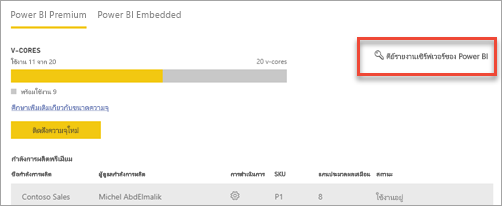
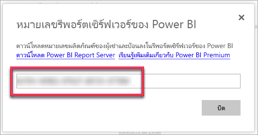
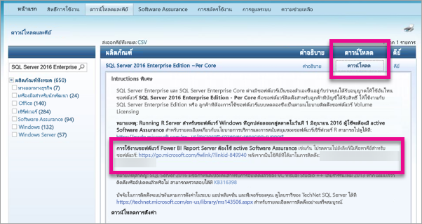

# วิธีการค้นหาคีย์ผลิตภัณฑ์เซิร์ฟเวอร์รายงานของคุณ
เรียนรู้วิธีคุณสามารถค้นหาคีย์ผลิตภัณฑ์เซิร์ฟเวอร์รายงาน Power BI ของคุณเมื่อต้องการติดตั้งเซิร์ฟเวอร์ของคุณในสภาพแวดล้อมการผลิต

<iframe width="640" height="360" src="https://www.youtube.com/embed/6CQnf-NGtpU?rel=0&amp;showinfo=0" frameborder="0" allowfullscreen></iframe>

ดาวน์โหลดเซิร์ฟเวอร์รายงาน Power BI และคุณจะได้รับข้อตกลงการรับประกันซอฟต์แวร SQL Server Enterprise หรือ คุณสามารถซื้อ Power BI Premium หากคุณต้องการติดตั้งเซิร์ฟเวอร์ในสภาพแวดล้อมการผลิต คุณต้องใช้คีย์ผลิตภัณฑ์ในการทำเช่นนั้น คีย์ผลิตภัณฑ์อยู่ที่ไหน 

คีย์ผลิตภัณฑ์จะอยู่ในหนึ่งในสองตำแหน่งโดยขึ้นอยู่กับสิ่งที่คุณซื้อ

## ซื้อ Power BI Premium
ถ้าคุณซื้อ Power BI Premium ภายในแท็บการ**ตั้งค่าความจุ**ของพอร์ทัลผู้ดูแลระบบ Power BI คุณจะสามารถเข้าถึงคีย์ผลิตภัณฑ์เซิร์ฟเวอร์รายงาน Power BI ของคุณ ซึ่งสิ่งนี้จะพร้อมใช้งานสำหรับผู้ดูแลระบบสากล หรือผู้ใช้ที่ได้รับการกำหนดบทบาทผู้ดูแลระบบบริการ Power BI

การเลือก**คีย์เซิร์ฟเวอร์รายงาน Power BI**จะแสดงกล่องโต้ตอบที่มีคีย์ผลิตภัณฑ์ของคุณ คุณสามารถคัดลอกและใช้กับการติดตั้ง

## ข้อตกลงการรับประกันซอฟต์แวร์ที่ซื้อ
ถ้าคุณมีข้อตกลง SQL Server Enterprise SA คุณสามารถรับคีย์ผลิตภัณฑ์ของคุณจาก[ศูนย์บริการการมอบสิทธิ์การใช้งาน Volume](https://www.microsoft.com/Licensing/servicecenter/)ได้ ค้นหาภายใต้เซอร์วิสแพ็คล่าสุดสำหรับเซิร์ฟเวอร์ SQL รุ่นล่าสุด หากคุณค้นหาไม่พบ ให้ค้นหาภายใต้การปล่อย RTM ของเซิร์ฟเวอร์ SQL รุ่นล่าสุด

> [!NOTE]
> คุณต้องค้นหาภายใต้ส่วนดาวน์โหลด ไม่ใช่ส่วนคีย์
> 
> 

## ขั้นตอนถัดไป
[ติดตั้ง Power BI Report Server](install-report-server.md)  
[ติดตั้ง Power BI Desktop ที่ปรับให้เหมาะสำหรับ Power BI Report Server](install-powerbi-desktop.md)  
[ติดตั้งตัวสร้างรายงาน](https://docs.microsoft.com/sql/reporting-services/install-windows/install-report-builder)  
[ดาวน์โหลด SQL Server Data Tools (SSDT)](http://go.microsoft.com/fwlink/?LinkID=616714)

มีคำถามเพิ่มเติมหรือไม่? [ลองถามชุมชน Power BI](https://community.powerbi.com/)

