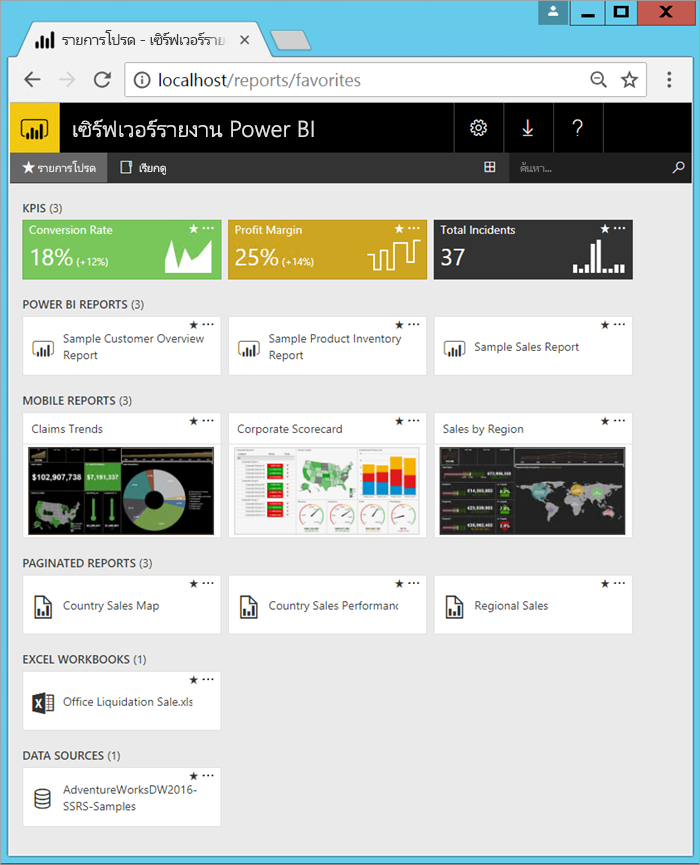

# เซิร์ฟเวอร์รายงาน Power BI คืออะไร?

Power BI Report Server เป็นเซิร์ฟเวอร์รายงานในองค์กรที่มีพอร์ทัลเว็บที่คุณแสดงและจัดการรายงานและ KPI นอกจากนี้ยังมีเครื่องมือในการสร้างรายงาน Power BI รายงานแบบแบ่งหน้า รายงานมือถือ และ KPI ผู้ใช้ของคุณสามารถเข้าถึงรายงานเหล่านั้นได้หลายวิธี: ดูในเว็บเบราว์เซอร์ หรืออุปกรณ์เคลื่อนที่ หรือเป็นอีเมลในกล่องขาเข้าของพวกเขาได้

## เปรียบเทียบเซิร์ฟเวอร์รายงาน Power BI 
เซิร์ฟเวอร์รายงาน Power BI คล้ายกับทั้ง SQL Server Reporting Services และบริการออนไลน์ของ Power BI แต่ในด้านที่ต่างกัน เซิร์ฟเวอร์รายงาน Power BI ทำการโฮสต์รายงาน Power BI (.pbix), ไฟล์ Excel และรายงานที่มีการแบ่งหน้า (.rdl) เช่นเดียวกับบริการของ Power BI เซิร์ฟเวอร์รายงาน Power BI อยู่ภายในองค์กร เหมือนกับ Reporting Services คุณสมบัติเซิร์ฟเวอร์รายงาน Power BI คือชุดใหญ่ของ Reporting Services: ทุกอย่างที่คุณสามารถทำได้ใน Reporting Services คุณสามารถทำได้ในเซิร์ฟเวอร์รายงาน Power BI รวมทั้งเพิ่มการสนับสนุนสำหรับรายงาน Power BI ดู[เปรียบเทียบเซิร์ฟเวอร์รายงาน Power BI และบริการของ Power BI](compare-report-server-service.md) สำหรับรายละเอียด

## สิทธิ์การใช้งานเซิร์ฟเวอร์รายงาน Power BI
เซิร์ฟเวอร์รายงาน power BI จะใช้งานได้เมื่อมีใบอนุญาตให้ใช้งานสองอย่างดังต่อไปนี้: [Power BI Premium](../admin/service-premium-what-is.md) และ SQL Server Enterprise Edition พร้อมการรับประกันซอฟต์แวร์ ดู [การให้สิทธิการใช้งาน Microsoft Volume](https://www.microsoftvolumelicensing.com/DocumentSearch.aspx?Mode=3&DocumentTypeId=1&ShowArchived=True) สำหรับรายละเอียดเพิ่มเติม ด้วยสิทธิ์การใช้งาน Power BI Premium คุณสามารถสร้างการปรับใช้ที่ผสมผสานระหว่างระบบคลาวด์และภายในองค์กร  

> [!NOTE]
> สำหรับ Power BI Premium เซิร์ฟเวอร์รายงาน Power BI จะมาพร้อมกับ P SKU ไม่รวมกับ EM SKU

## เว็บพอร์ทัล
ทางเข้าสู่เซิร์ฟเวอร์รายงาน Power BI คือ พอร์ทัลของเว็บที่มีความปลอดภัย ที่คุณสามารถดูในเบราว์เซอร์สมัยใหม่เบราว์เซอร์ใดก็ได้ ที่นี่ คุณสามารถเข้าถึงรายงานและ KPI ทั้งหมดของคุณได้ เนื้อหาบนพอร์ทัลของเว็บ ถูกจัดระเบียบในลำดับชั้นแบบโฟลเดอร์ดั้งเดิม ในโฟลเดอร์ของคุณ เนื้อหาจะถูกจัดกลุ่มตามชนิดดังต่อไปนี้: รายงาน Power BI รายงานแบบแบ่งหน้า รายงานมือถือ KPI และเวิร์กบุ๊ก Excel ชุดข้อมูลที่ใช้ร่วมกันและแหล่งข้อมูลที่ใช้ร่วมกันอยู่ในโฟลเดอร์ของตนเองเพื่อใช้เป็นส่วนสร้างรายงานของคุณ คุณสามารถแท็กรายการโปรดเพื่อดูรายการโปรดทั้งหมดในโฟลเดอร์เดียวได้ และคุณสามารถสร้าง KPI ที่เหมาะสมในเว็บพอร์ทัลได้ 

ขึ้นอยู่กับสิทธิ์ของคุณ คุณสามารถจัดการเนื้อหาในพอร์ทัลของเว็บ คุณสามารถกำหนดตารางเวลาการประมวลผลรายงาน การเข้าถึงรายงานตามความต้องการ และสมัครสมาชิกรายงานที่เผยแพร่แล้ว คุณยังสามารถใช้[การกำหนดตราสินค้า](https://docs.microsoft.com/sql/reporting-services/branding-the-web-portal)แบบกำหนดเองของคุณ กับพอร์ทัลของเว็บคุณได้ 

อ่านเพิ่มเติมเกี่ยวกับ [พอร์ทัลของเว็บเซิร์ฟเวอร์รายงาน Power BI](https://docs.microsoft.com/sql/reporting-services/web-portal-ssrs-native-mode)

## รายงาน Power BI
คุณสร้างรายงาน Power BI (.pbix) ด้วยเวอร์ชันของ Power BI Desktop ที่ปรับให้เหมาะสำหรับเซิร์ฟเวอร์รายงาน จากนั้นคุณเผยแพร่และดูรายงานในพอร์ทัลของเว็บในสภาพแวดล้อมของคุณเอง

รายงาน Power BI เป็นการดูจากหลายมุมมองเข้าไปในรูปแบบข้อมูล ด้วยการแสดงภาพที่แสดงการค้นพบและข้อมูลเชิงลึกต่าง ๆ ที่ได้จากรูปแบบข้อมูลนั้น  รายงานสามารถมีการแสดงภาพเดียวหรือมีหน้าที่เต็มไปด้วยการแสดงภาพ ขึ้นอยู่กับบทบาทของคุณ คุณอาจอ่านและสำรวจรายงาน หรือคุณอาจสร้างรายงานสำหรับผู้อื่น

อ่านเกี่ยวกับ[การติดตั้ง Microsoft Power BI Desktop](install-powerbi-desktop.md)

## รายงานที่มีการแบ่งหน้า
รายงานที่มีการแบ่งหน้า (.rdl) เป็นรายงานรูปแบบเอกสารที่มีการแสดงภาพ ที่ตารางขยายตามแนวนอนและแนวตั้งเพื่อแสดงข้อมูลทั้งหมด ต่อเนื่องจากหน้าหนึ่งไปยังอีกหน้าหนึ่งตามความจำเป็น ซึ่งเหมาะมากกับสำหรับเอกสารที่มีเค้าโครงคงที่, พิกเซลสมบูรณ์แบบ ที่ปรับให้เหมาะสมสำหรับการพิมพ์ เช่นไฟล์ PDF และ Word 

คุณสร้างรายงานที่มีการแบ่งหน้าด้วย[ตัวสร้างรายงาน](https://docs.microsoft.com/sql/reporting-services/report-builder/report-builder-in-sql-server-2016)หรือ ตัวออกแบบรายงาน ใน[SQL Server Data Tools (SSDT)](https://docs.microsoft.com/sql/reporting-services/tools/reporting-services-in-sql-server-data-tools-ssdt)

## รายงานอุปกรณ์มือถือของ Reporting Services
รายงานอุปกรณ์มือถือเชื่อมต่อกับข้อมูลภายในองค์กร และมีเค้าโครงแบบตอบสนอง ที่ปรับเข้ากับอุปกรณ์ต่าง ๆ และวิธีที่คุณถือมือถือ คุณสร้างรายงานนั้นด้วย SQL Server Mobile Report Publisher

อ่านเพิ่มเติมเกี่ยวกับ[รายงานอุปกรณ์มือถือของ Reporting Services](https://docs.microsoft.com/sql/reporting-services/mobile-reports/create-mobile-reports-with-sql-server-mobile-report-publisher) 

## ฟีเจอร์โปรแกรม Report Server
ใช้ประโยชน์จากคุณลักษณะการเขียนโปรแกรมเซิร์ฟเวอร์รายงาน Power BI เพื่อขยายและกำหนดความสามารถการรายงานของคุณเอง ด้วย API เพื่อรวมหรือขยายการประมวลผลข้อมูลและรายงานในแอปพลิเคชันแบบกำหนดเอง

เพิ่มเติม[เอกสารของนักพัฒนาเซิร์ฟเวอร์รายงาน](https://docs.microsoft.com/sql/reporting-services/reporting-services-developer-documentation)

## ขั้นตอนถัดไป
[ติดตั้ง Power BI Report Server](install-report-server.md)  
[ดาวน์โหลดตัวสร้างรายงาน](https://www.microsoft.com/download/details.aspx?id=53613)  

มีคำถามเพิ่มเติมหรือไม่ [ลองถามชุมชน Power BI](https://community.powerbi.com/)
