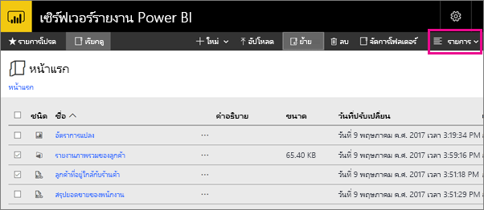

# การนำทางพอร์ทัลของเว็บเซิร์ฟเวอร์รายงาน Power BI
พอร์ทัลของเว็บเซิร์ฟเวอร์รายงาน Power BI คือ ตำแหน่งที่ตั้งภายในองค์กรสำหรับการดู การจัดเก็บ และการจัดการ Power BI ของคุณ รายงานสำหรับอุปกรณ์เคลื่อนที่และที่มีการแบ่งหน้า และ KPI

คุณสามารถดูพอร์ทัลของเว็บในเบราว์เซอร์ที่ทันสมัยใดๆ ก็ได้ ในพอร์ทัลของเว็บ รายงาน และ KPI จะถูกจัดระเบียบไว้ในโฟลเดอร์ และคุณสามารถทำเครื่องหมายว่าเป็นรายการโปรดได้ นอกจากนี้คุณยังสามารถจัดเก็บเวิร์กบุ๊ก Excel ไว้ที่นั่นได้ จากพอร์ทัลของเว็บ คุณสามารถเปิดใช้เครื่องมือที่คุณจำเป็นต้องใช้ในการสร้างรายงาน:

* **รายงาน Power BI**ที่สร้างขึ้นด้วย Power BI Desktop: ดูรายงานเหล่านั้นในพอร์ทัลของเว็บและแอป Power BI สำหรับอุปกรณ์เคลื่อนที่
* **รายงานที่มีการแบ่งหน้า**ซึ่งถูกสร้างขึ้นในตัวสร้างรายงาน: เอกสารที่ดูทันสมัยและเค้าโครงแบบคงที่ถูกปรับให้เหมาะสมสำหรับการพิมพ์
* **KPI** ที่ถูกสร้างอย่างเหมาะสมในพอร์ทัลของเว็บ

ในพอร์ทัลของเว็บ คุณสามารถเรียกดูโฟลเดอร์ของเซิร์ฟเวอร์รายงานหรือค้นหารายงานเฉพาะเจาะจง คุณสามารถดูรายงาน คุณสมบัติทั่วไป และสำเนาในอดีตของรายงานที่ถูกเก็บไว้ในประวัติรายงาน ขึ้นอยู่กับสิทธิ์ของคุณ คุณอาจยังสามารถสมัครใช้งานรายงานสำหรับจัดส่งไปยังกล่องขาเข้าของอีเมลหรือโฟลเดอร์ที่ใช้ร่วมกันในระบบไฟล์ของคุณ

## งานพอร์ทัลของเว็บ
คุณสามารถใช้พอร์ทัลของเว็บสำหรับจำนวนงาน รวมถึงสิ่งเหล่านี้:

* ดู ค้นหา พิมพ์ และสมัครใช้งานรายงาน
* สร้าง รักษาความปลอดภัย และรักษาลำดับชั้นโฟลเดอร์เพื่อจัดระเบียบรายการบนเซิร์ฟเวอร์
* กำหนดค่าคุณสมบัติการดำเนินการรายงาน ประวัติรายงาน และพารามิเตอร์รายงาน
* สร้างกำหนดการที่ใช้ร่วมกันและแหล่งข้อมูลที่ใช้ร่วมกันเพื่อทำให้สามารถจัดการการเชื่อมต่อแหล่งข้อมูลและกำหนดการได้ง่ายขึ้น
* สร้างการสมัครใช้งานที่อิงตามข้อมูลเพื่อเผยแพร่รายงานไปยังรายการผู้รับขนาดใหญ่
* สร้างรายงานที่เชื่อมโยงเพื่อนำมาใช้ใหม่ และนำรายงานที่มีอยู่มาใช้ใหม่เพื่อวัตถุประสงค์อื่นในวิธีที่ต่างกัน
* ดาวน์โหลด และเปิดเครื่องมือทั่วไปเช่น Power BI Desktop (เซิร์ฟเวอร์รายงาน) ตัวสร้างรายงาน และ Mobile Report Publisher
* [สร้าง KPI](https://docs.microsoft.com/sql/reporting-services/working-with-kpis-in-reporting-services)
* ส่งคำติชมหรือทำการร้องขอคุณลักษณะ
* [การกำหนดตราสินค้าพอร์ทัลของเว็บ](https://docs.microsoft.com/sql/reporting-services/branding-the-web-portal)
* [ทำงานกับ KPI](https://docs.microsoft.com/sql/reporting-services/working-with-kpis-in-reporting-services)
* [ทำงานกับชุดข้อมูลที่ใช้ร่วมกัน](https://docs.microsoft.com/sql/reporting-services/work-with-shared-datasets-web-portal)

## บทบาทและสิทธิ์ของพอร์ทัลของเว็บ
พอร์ทัลของเว็บ คือ โปรแกรมประยุกต์บนเว็บที่ใช้งานในเบราว์เซอร์ เมื่อคุณเริ่มพอร์ทัลของเว็บ หน้า ลิงก์ และตัวเลือกที่คุณเห็นจะแตกต่างกันไปโดยขึ้นอยู่กับสิทธิ์ที่คุณมีบนเซิร์ฟเวอร์รายงาน ถ้าคุณถูกกำหนดให้ได้บทบาทที่มีสิทธิ์แบบเต็ม คุณสามารถเข้าถึงชุดของเมนูและหน้าแอปพลิเคชันทั้งหมดสำหรับการจัดการเซิร์ฟเวอร์รายงาน ถ้าคุณถูกกำหนดให้ได้บทบาทที่มีสิทธิ์ในการดูและเรียกใช้รายงาน คุณจะเห็นเฉพาะเมนูและหน้าที่คุณจำเป็นต้องใช้สำหรับกิจกรรมเหล่านั้น คุณสามารถมีการกำหนดบทบาทที่แตกต่างกันสำหรับเซิร์ฟเวอร์รายงานที่แตกต่างกัน หรือแม้แต่รายงานและโฟลเดอร์ต่างๆ บนเซิร์ฟเวอร์รายงานเดียว

## เริ่มต้นพอร์ทัลของเว็บ
1. เปิดเว็บเบราว์เซอร์ของคุณ
   
    ดูรายการของ[เว็บเบราว์เซอร์และรุ่นที่ได้รับการสนับสนุน](browser-support.md)
2. ในแถบที่อยู่ พิมพ์ URL พอร์ทัลของเว็บ
   
    ตามค่าเริ่มต้น URL คือ*http://[ComputerName]/reports*
   
    เซิร์ฟเวอร์รายงานอาจถูกกำหนดค่าให้ใช้พอร์ตที่เจาะจง ตัวอย่างเช่น*http://[ComputerName]:80/reports*หรือ*http://[ComputerName]:8080/reports*
   
    คุณเห็นว่า พอร์ทัลของเว็บจัดกลุ่มรายการลงในหมวดหมู่เหล่านี้:
   
   * KPI
   * รายงานสำหรับอุปกรณ์เคลื่อนที่
   * รายงานที่มีการแบ่งหน้า
   * รายงาน Power BI Desktop
   * เวิร์กบุ๊ก Excel
   * ชุดข้อมูล
   * แหล่งข้อมูล
   * ทรัพยากร

## สร้าง และแก้ไขรายงาน Power BI Desktop (ไฟล์ .pbix)
คุณสามารถดู อัปโหลด สร้าง จัดระเบียบ และจัดการสิทธิ์สำหรับรายงาน Power BI Desktop ในพอร์ทัลของเว็บ

### สร้างรายงาน Power BI Desktop
1. เลือก**รายงาน Power BI** > **ใหม่**
   
    
   
    แอป Power BI Desktop เปิดขึ้น
   
    
2. สร้างรายงาน Power BI ของคุณ ดู[เริ่มต้นใช้งานด่วน: รายงาน Power BI](quickstart-create-powerbi-report.md)สำหรับรายละเอียด
3. อัปโหลดรายงานของคุณไปยังเซิร์ฟเวอร์รายงาน

### แก้ไขรายงาน Power BI Desktop ที่มีอยู่
1. เลือกจุดไข่ปลา (**...** ) ในมุมขวาบนของไทล์รายงาน > **แก้ไขใน Power BI Desktop**
   
    
   
    แอป Power BI Desktop เปิดขึ้น
2. ทำการเปลี่ยนแปลงของคุณและบันทึก... [ทำอย่างไร]

## สร้าง และแก้ไขรายงานที่มีการแบ่งหน้า (ไฟล์ .rdl)
คุณสามารถดู อัปโหลด สร้าง จัดระเบียบ และจัดการสิทธิ์สำหรับรายงานที่มีการแบ่งหน้าในพอร์ทัลของเว็บ

### สร้างรายงานที่มีการแบ่งหน้า
1. เลือก**รายงานที่มีการแบ่งหน้า** > **ใหม่**
   
    แอปตัวสร้างรายงานเปิดขึ้น
   
    
2. สร้างรายงานที่มีการแบ่งหน้าของคุณ ดู[เริ่มต้นใช้งานด่วน: รายงานที่มีการแบ่งหน้า](quickstart-create-paginated-report.md)สำหรับรายละเอียด
3. อัปโหลดรายงานของคุณไปยังเซิร์ฟเวอร์รายงาน

### แก้ไขรายงานที่มีการแบ่งหน้าที่มีอยู่
1. เลือกจุดไข่ปลา (...) ในมุมขวาบนของไทล์รายงาน > **แก้ไขในตัวสร้างรายงาน**
   
    
   
    แอปตัวสร้างรายงานเปิดขึ้น
2. ทำการเปลี่ยนแปลงของคุณและบันทึก

## อัปโหลด และจัดระเบียบเวิร์กบุ๊ก Excel
คุณสามารถอัปโหลด จัดระเบียบ และจัดการสิทธิ์สำหรับรายงาน Power BI Desktop และเวิร์กบุ๊ก Excel พวกเขาจะถูกจัดกลุ่มเข้าด้วยกันภายในพอร์ทัลของเว็บ

สมุดงานจะถูกเก็บไว้ภายในเซิร์ฟเวอร์รายงาน Power BI คล้ายกับไฟล์ทรัพยากรอื่นๆ เลือกหนึ่งในเวิร์กบุ๊กที่จะดาวน์โหลดไปยังเดสก์ท็อปภายในเครื่องของคุณ คุณสามารถบันทึกการเปลี่ยนแปลงที่คุณทำโดยการอัปโหลดไปยังเซิร์ฟเวอร์รายงานอีกครั้ง

## จัดการรายการในพอร์ทัลของเว็บ
เซิร์ฟเวอร์รายงาน Power BI มีการควบคุมอย่างละเอียดของรายการที่คุณเก็บไว้บนพอร์ทัลของเว็บ ตัวอย่างเช่น คุณสามารถตั้งค่าการสมัครใช้งาน การแคช สแนปช็อต และรักษาความปลอดภัยบนรายงานที่มีการแบ่งหน้าแต่ละรายการ

1. เลือกจุดไข่ปลา (...) ในมุมขวาบนของรายการ จากนั้นเลือก**จัดการ**
   
    
2. เลือกคุณสมบัติหรือคุณลักษณะอื่นๆ ที่คุณต้องการตั้งค่า
   
    
3. เลือก**นำไปใช้**

อ่านเพิ่มเติมเกี่ยวกับ[การทำงานกับการสมัครใช้งานในพอร์ทัลของเว็บ](https://docs.microsoft.com/sql/reporting-services/working-with-subscriptions-web-portal)

## แท็กรายงานและ KPI ที่คุณชื่นชอบได้
คุณสามารถแท็กรายงานและ KPI ที่คุณต้องการทำให้เป็นรายการโปรด ง่ายต่อการค้นหาเนื่องจากทั้งหมดถูกรวบรวมไว้ในโฟลเดอร์รายการโปรดเดียว ทั้งในพอร์ทัลของเว็บ และในแอป Power BI สำหรับอุปกรณ์เคลื่อนที่ 

1. เลือกจุดไข่ปลา (**...** ) ในมุมขวาบนของ KPI หรือรายงานที่คุณต้องการทำให้เป็นรายการโปรด แล้วเลือก**เพิ่มในรายการโปรด**
   
    
2. เลือก**รายการโปรด**บน Ribbon พอร์ทัลของเว็บเพื่อดูพร้อมกับรายการโปรดอื่นๆ ของคุณบนหน้ารายการโปรดในพอร์ทัลของเว็บ
   
    
   
    ตอนนี้ในแอป Power BI สำหรับอุปกรณ์เคลื่อนที่ คุณจะเห็นรายการโปรดเหล่านี้พร้อมกับแดชบอร์ดโปรดของคุณจากบริการ Power BI
   
    

## ซ่อนหรือดูรายการในพอร์ทัลของเว็บ
คุณสามารถซ่อนรายการในพอร์ทัลของเว็บ และคุณสามารถเลือกเพื่อดูรายการที่ซ่อนอยู่

### ซ่อนรายการ
1. เลือกจุดไข่ปลา (...) ในมุมขวาบนของรายการ จากนั้นเลือก**จัดการ**
   
    
2. เลือก**ซ่อนรายการนี้**
   
    
3. เลือก**นำไปใช้**

### ดูรายการที่ซ่อนไว้
1. เลือก**ไทล์** (หรือ**รายการ**) ในมุมขวาบน > **แสดงรายการที่ซ่อนอยู่**
   
    รายการปรากฏขึ้น รายการเหล่านั้นเป็นสีเทา แต่คุณยังคงสามารถเปิดและแก้ไขได้
   
    

## ค้นหารายการ
คุณสามารถป้อนทีมค้นหา และคุณจะเห็นทุกอย่างที่คุณสามารถเข้าถึงได้ ผลลัพธ์จะถูกแยกประเภทลงใน KPI รายงาน ชุดข้อมูล และรายการอื่นๆ คุณสามารถโต้ตอบกับผลลัพธ์ และเพิ่มลงในรายการโปรดของคุณ  

## ย้าย หรือลบรายการในมุมมองรายการ
ตามค่าเริ่มต้น พอร์ทัลของเว็บจะแสดงเนื้อหาในมุมมองไทล์

คุณสามารถสลับเป็นมุมมองรายการ ซึ่งเป็นเรื่องง่ายเมื่อต้องย้าย หรือลบหลายรายการในแต่ละครั้ง 

1. เลือก**รายการ** > **ไทล์**
   
    
2. เลือกรายการ จากนั้นเลือก**ย้าย**หรือ**ลบ**

## ขั้นตอนถัดไป
[คู่มือผู้ใช้](user-handbook-overview.md)  
[เริ่มต้นใช้งานด่วน: รายงานที่มีการแบ่งหน้า](quickstart-create-paginated-report.md)  
[เริ่มต้นใช้งานด่วน: รายงาน Power BI](quickstart-create-powerbi-report.md)

มีคำถามเพิ่มเติมหรือไม่ [ลองถามชุมชน Power BI](https://community.powerbi.com/)

