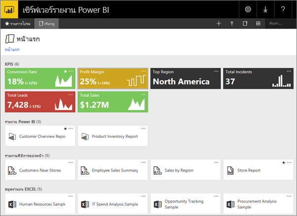
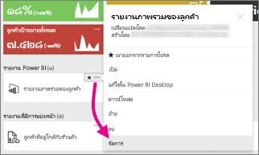
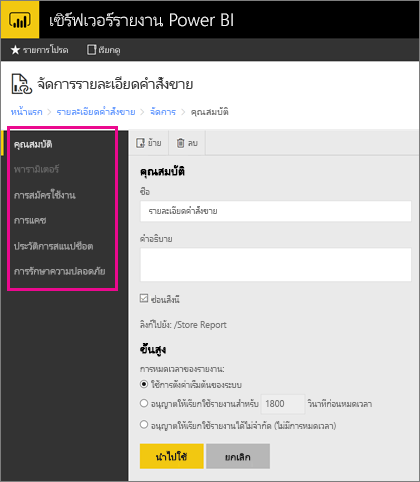

# จัดการเนื้อหาในพอร์ทัลของเว็บ 
พอร์ทัลของเว็บเซิร์ฟเวอร์รายงาน Power BI คือ ตำแหน่งที่ตั้งภายในองค์กรสำหรับการดู การจัดเก็บ และการจัดการ Power BI ของคุณ รายงานสำหรับอุปกรณ์เคลื่อนที่และที่มีการแบ่งหน้า และ KPI

คุณสามารถดูพอร์ทัลของเว็บในเบราว์เซอร์ที่ทันสมัยใดๆ ก็ได้ ในพอร์ทัลของเว็บ รายงาน และ KPI จะถูกจัดระเบียบไว้ในโฟลเดอร์ และคุณสามารถทำเครื่องหมายว่าเป็นรายการโปรดได้ นอกจากนี้คุณยังสามารถจัดเก็บเวิร์กบุ๊ก Excel ไว้ที่นั่นได้ จากพอร์ทัลของเว็บ คุณสามารถเปิดใช้เครื่องมือที่คุณจำเป็นต้องใช้ในการสร้างรายงาน:

* **รายงาน power BI**ที่สร้างขึ้นด้วย Power BI Desktop: ดูข้อมูลได้ในพอร์ทัลของเว็บและแอป Power BI สำหรับอุปกรณ์เคลื่อนที่
* **รายงานที่มีการแบ่งหน้า** ที่สร้างขึ้นในตัวสร้างรายงาน: ดูทันสมัย มีเค้าโครงแบบคงที่ซึ่งปรับให้เหมาะสมสำหรับการพิมพ์
* **KPI** ที่ถูกสร้างอย่างเหมาะสมในพอร์ทัลของเว็บ

ในพอร์ทัลของเว็บ คุณสามารถเรียกดูโฟลเดอร์ของเซิร์ฟเวอร์รายงานหรือค้นหารายงานเฉพาะเจาะจง คุณสามารถดูรายงาน คุณสมบัติทั่วไป และสำเนาในอดีตของรายงานที่ถูกเก็บไว้ในประวัติรายงาน ขึ้นอยู่กับสิทธิ์ของคุณ คุณอาจยังสามารถสมัครใช้งานรายงานสำหรับจัดส่งไปยังกล่องขาเข้าของอีเมลหรือโฟลเดอร์ที่ใช้ร่วมกันในระบบไฟล์ของคุณ

## บทบาทและสิทธิ์ของพอร์ทัลของเว็บ
แอปพลิเคชันพอร์ทัลของเว็บ ทำงานในเบราว์เซอร์ เมื่อคุณเริ่มพอร์ทัลของเว็บ หน้า ลิงก์ และตัวเลือกที่คุณเห็นจะแตกต่างกันไปโดยขึ้นอยู่กับสิทธิ์ที่คุณมีบนเซิร์ฟเวอร์รายงาน ถ้าคุณถูกกำหนดให้ได้บทบาทที่มีสิทธิ์แบบเต็ม คุณสามารถเข้าถึงชุดของเมนูและหน้าแอปพลิเคชันทั้งหมดสำหรับการจัดการเซิร์ฟเวอร์รายงาน ถ้าคุณถูกกำหนดให้ได้บทบาทที่มีสิทธิ์ในการดูและเรียกใช้รายงาน คุณจะเห็นเฉพาะเมนูและหน้าที่คุณจำเป็นต้องใช้สำหรับกิจกรรมเหล่านั้น คุณสามารถมีการกำหนดบทบาทที่แตกต่างกันสำหรับเซิร์ฟเวอร์รายงานที่แตกต่างกัน หรือแม้แต่รายงานและโฟลเดอร์ต่างๆ บนเซิร์ฟเวอร์รายงานเดียว

## เริ่มต้นพอร์ทัลของเว็บ
1. เปิดเว็บเบราว์เซอร์ของคุณ
   
    ดูรายการของ[เว็บเบราว์เซอร์และรุ่นที่ได้รับการสนับสนุน](browser-support.md)
2. ในแถบที่อยู่ พิมพ์ URL พอร์ทัลของเว็บ
   
    ตามค่าเริ่มต้น URL คือ<em>https://[ComputerName]/reports</em>
   
    เซิร์ฟเวอร์รายงานอาจถูกกำหนดค่าให้ใช้พอร์ตที่เจาะจง ตัวอย่างเช่น<em>https://[ComputerName]:80/reports</em>หรือ<em>https://[ComputerName]:8080/reports</em>
   
    คุณเห็นว่า พอร์ทัลของเว็บจัดกลุ่มรายการลงในหมวดหมู่เหล่านี้:
   
   * KPI
   * รายงานสำหรับอุปกรณ์เคลื่อนที่
   * รายงานที่มีการแบ่งหน้า
   * รายงาน Power BI Desktop
   * เวิร์กบุ๊ก Excel
   * ชุดข้อมูล
   * แหล่งข้อมูล
   * ทรัพยากร

## จัดการรายการในพอร์ทัลของเว็บ
เซิร์ฟเวอร์รายงาน Power BI มีการควบคุมอย่างละเอียดของรายการที่คุณเก็บไว้บนพอร์ทัลของเว็บ ตัวอย่างเช่น คุณสามารถตั้งค่าการสมัครใช้งาน การแคช สแนปช็อต และรักษาความปลอดภัยบนรายงานที่มีการแบ่งหน้าแต่ละรายการ

1. เลือก **ตัวเลือกเพิ่มเติม** (...) ที่มุมบนขวาของรายการ จากนั้นเลือก **จัดการ**
   
    
2. เลือกคุณสมบัติหรือคุณลักษณะอื่นๆ ที่คุณต้องการตั้งค่า
   
    
3. เลือก**นำไปใช้**

อ่านเพิ่มเติมเกี่ยวกับ[การทำงานกับการสมัครใช้งานในพอร์ทัลของเว็บ](https://docs.microsoft.com/sql/reporting-services/working-with-subscriptions-web-portal)

## ขั้นตอนถัดไป
[เซิร์ฟเวอร์รายงาน Power BI คืออะไร](get-started.md)

มีคำถามเพิ่มเติมหรือไม่? [ลองถามชุมชน Power BI](https://community.powerbi.com/)

