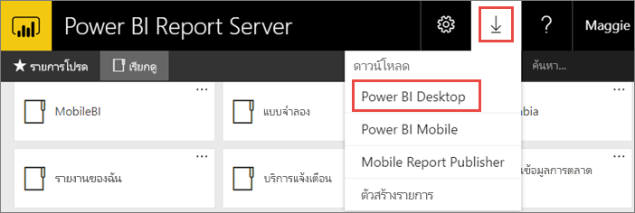
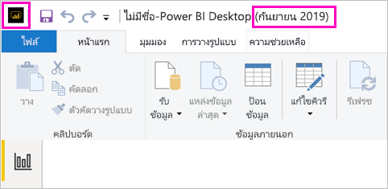

# ติดตั้ง Power BI Desktop ที่ปรับให้เหมาะสำหรับเซิร์ฟเวอร์รายงาน Power BI

เมื่อต้องสร้างรายงาน Power BI สำหรับเซิร์ฟเวอร์รายงาน Power BI คุณจำเป็นต้องดาวน์โหลดและติดตั้ง Power BI Desktop เวอร์ชันที่ปรับให้เหมาะสำหรับเซิร์ฟเวอร์รายงาน Power BI การเผยแพร่นี้จะแตกต่างจาก Power BI Desktop ที่ใช้กับบริการ Power BI ตัวอย่างเช่น เวอร์ชัน Power BI Desktop สำหรับบริการ Power BI จะมีคุณลักษณะตัวอย่างที่ไม่มีอยู่ในเวอร์ชันเซิร์ฟเวอร์รายงาน Power BI จนกว่าจะออกวางจำหน่ายทั่วไป การใช้การเผยแพรนี้จะทำให้แน่ใจว่า เซิร์ฟเวอร์รายงานสามารถโต้ตอบกับรายงานและแบบจำลองเวอร์ชันที่ทราบแล้วได้ 

ข่าวดีก็คือ คุุณสามารถติดตั้ง Power BI Desktop และ Power BI Desktop ที่ปรับให้เหมาะสมสำหรับเซิร์ฟเวอร์รายงาน Power BI ได้โดยควบคู่กันไปบนคอมพิวเตอร์เครื่องเดียวกัน

## ดาวน์โหลด และติดตั้ง Power BI Desktop

วิธีที่ง่ายที่สุดเพื่อให้แน่ใจว่าคุณมีเวอร์ชันล่าสุดของ Power BI Desktop ที่ปรับให้เหมาะสมสำหรับเซิร์ฟเวอร์รายงาน Power BI ก็คือ การเริ่มต้นจากพอร์ทัลเว็บของเซิร์ฟเวอร์รายงานของคุณ

1. ในพอร์ทัลเว็บเซิร์ฟเวอร์รายงาน เลือก **ดาวน์โหลด**ลูกศร > **Power BI Desktop**

    

    หรือไปที่หน้าหลัก [เซิร์ฟเวอร์รายงาน Power BI](https://powerbi.microsoft.com/report-server/) แล้วเลือก **ตัวเลือกการดาวน์โหลดขั้นสูง**

2. ในหน้าศูนย์ดาวน์โหลด ให้เลือกภาษา จากนั้นเลือก **ดาวน์โหลด**

3. ขึ้นอยู่กับคอมพิวเตอร์ของคุณ เลือก: 

    - **PBIDesktopRS.msi** (เวอร์ชัน 32 บิต) หรือ
    - **PBIDesktopRS_x64.msi** (เวอร์ชัน 64 บิต)

1. หลังจากดาวน์โหลดตัวติดตั้ง ให้เรียกใช้ตัวช่วยติดตั้ง Power BI Desktop (กันยายน 2019)

2. ในตอนท้ายของการติดตั้ง เลือก **เรียกใช้ Power BI Desktop**

    จะเริ่มต้นโดยอัตโนมัติ และคุณก็พร้อมที่จะไปต่อ

## ตรวจสอบว่าคุณกำลังใช้เวอร์ชันที่ถูกต้อง
เป็นเรื่องง่ายเมื่อต้องการตรวจสอบว่าคุณกำลังใช้ Power BI Desktop ที่ถูกต้องอยู่: ดูที่เปิดใช้งานหน้าจอหรือแถบชื่อเรื่องภายใน Power BI Desktop คุณสามารถแจ้งว่าคุณมีเวอร์ชั่นที่ถูกต้อง เนื่องจาก **Power BI Desktop (กันยายน 2019)** อยู่ในแถบรายการแจ้งชื่อ นอกจากนี้ สีโลโก้ Power BI จะกลับกันโดยสีเหลืองจะอยู่บนพื้นดำแทนที่เป็นสีดำบนพื้นเหลือง

เวอร์ชั่น Power BI Desktop สำหรับบริการ Power BI ไม่มีเดือนและปีในแถบรายการชื่อ

## การเชื่อมโยงนามสกุลไฟล์
ถ้าคุณติดตั้งทั้ง Power BI Desktop และ Power BI Desktop ที่ปรับให้เหมาะสมสำหรับเซิร์ฟเวอร์รายงาน Power BI บนเครื่องเดียวกัน การติดตั้งล่าสุดของ Power BI Desktop จะมีการเชื่อมโยงไฟล์กับไฟล์ .pbix ดังนั้นแล้วเมื่อคุณดับเบิลคลิกที่ไฟล ์.pbix ก็จะเปิดใช้ Power BI Desktop ที่คุณได้ทำการติดตั้งล่าสุด

ถ้าคุณมี Power BI Desktop อยู่ แล้วติดตั้ง Power BI Desktop ที่ปรับให้เหมาะสมสำหรับเซิร์ฟเวอร์รายงาน Power BI ไฟล์ pbix ทั้งหมดก็จะเปิดใน Power BI Desktop ที่ปรับให้เหมาะสมสำหรับเซิร์ฟเวอร์รายงาน Power BI ตามค่าเริ่มต้น ถ้าคุณต้องการให้ Power BI Desktop เป็นค่าเริ่มต้นแทนสำหรับเปิดใช้งานเมื่อเปิดไฟล์ .pbix ให้ติดตั้ง [ Power BI Desktop จาก Microsoft Store ใหม่](https://aka.ms/pbidesktopstore)

คุณสามารถเปิด Power BI Desktop เวอร์ชันที่คุณต้องการใช้ก่อนได้เสมอ จากนั้น ให้เปิดไฟล์จากภายใน Power BI Desktop

การแก้ไขรายงาน Power BI จากภายในเซิร์ฟเวอร์รายงาน Power BI หรือการสร้างรายงาน Power BI ใหม่จากพอร์ทัลเว็บมักจะเปิด Power BI Desktop เวอร์ชันที่ถูกต้องเสมอ

## ข้อควรพิจารณาและข้อจำกัด

รายงาน Power BI ในเซิร์ฟเวอร์รายงาน Power BI ในบริการของ Power BI (https://app.powerbi.com) และในแอปสำหรับอุปกรณ์เคลื่อนที่ Power BI ทำงานได้เกือบจะเหมือนกัน แต่จะมีบางคุณลักษณ์ที่แตกต่างกัน

### การเลือกภาษา

สำหรับการ Power BI Desktop ที่ปรับให้เหมาะสำหรับเซิร์ฟเวอร์รายงาน Power BI คุณต้องเลือกภาษาเมื่อคุณติดตั้งแอป ซึ่งหลังจากนี้คุณจะไม่สามารถเปลี่ยนภาษาได้ แต่คุณสามารถติดตั้งเวอร์ชันในภาษาอื่นได้

### การแสดงภาพรายงานในเบราว์เซอร์

รายงานของเซิร์ฟเวอร์รายงาน Power BI รองรับส่วนการแสดงผลเกือบทั้งหมด รวมทั้งส่วนการแสดงผลกำหนดเอง รายงานในเซิร์ฟเวอร์รายงาน Power BI ไม่สนับสนุน:

* วิชวล R
* แผนที่ ArcGIS
* การนำทางแบบแสดงเส้นนำทาง
* คุณลักษณะที่เป็นตัวอย่างใน Power BI Desktop

### รายงานในแอปสำหรับอุปกรณ์เคลื่อนที่ Power BI

รายงานในเซิร์ฟเวอร์รายงาน Power BI สนับสนุนฟังก์ชันพื้นฐานทั้งหมดใน[แอปสำหรับอุปกรณ์เคลื่อนที่ Power BI](../consumer/mobile/mobile-apps-for-mobile-devices.md) รวมถึง:

* [เค้าโครงรายงานโทรศัพท์](../desktop-create-phone-report.md): คุณสามารถปรับรายงานให้เหมาะสมกับแอปสำหรับอุปกรณ์เคลื่อนที่ Power BI ได้ บนโทรศัพท์มือถือของคุณ รายงานที่ปรับให้เหมาะสมมีไอคอนพิเศษ  และเค้าโครงที่เหมาะกับมือถือ
  
    

รายงานในเซิร์ฟเวอร์รายงาน Power BI ไม่สนับสนุนคุณลักษณะเหล่านี้ในแอปสำหรับอุปกรณ์เคลื่อนที่ Power BI:

* วิชวล R
* แผนที่ ArcGIS
* วิชวลแบบกำหนดเอง
* การนำทางแบบแสดงเส้นนำทาง
* การกรองพรมแดนหรือบาร์โค้ด

### การรักษาความปลอดภัยแบบกำหนดเอง

Power BI Desktop ที่ปรับให้เหมาะสำหรับเซิร์ฟเวอร์รายงาน Power BI ไม่รองรับการรักษาความปลอดภัยแบบกำหนดเอง ถ้ามีการกำหนดค่าเซิร์ฟเวอร์รายงาน Power BI ของคุณด้วยส่วนขยายการรักษาความปลอดภัยแบบกำหนดเอง คุณจะไม่สามารถบันทึกรายงาน Power BI จาก Power BI Desktop (ปรับให้เหมาะสำหรับเซิร์ฟเวอร์รายงาน Power BI) ไปยังอินสแตนซ์เซิร์ฟเวอร์รายงาน Power BI ได้ คุณจำเป็นต้องบันทึกไฟล์รายงานนามสกุล .pbix จาก Power BI Desktop และอัปโหลดไปยังไซต์พอร์ทัลเซิร์ฟเวอร์รายงาน Power BI

## Power BI Desktop สำหรับเซิร์ฟเวอร์รายงาน Power BI เวอร์ชันก่อนหน้านี้

ถ้าเซิร์ฟเวอร์รายงานของคุณเป็นเวอร์ชันก่อนหน้า คุณจำเป็นต้องมี Power BI Desktop เวอร์ชันที่สอดคล้องกัน นี่คือลิงก์สำหรับดาวน์โหลดเวอร์ชันก่อนหน้านี้

- Microsoft Power BI Desktop ([ปรับให้เหมาะสมสำหรับ เซิร์ฟเวอร์รายงาน Power BI - กันยายน 2019](https://go.microsoft.com/fwlink/?linkid=2103723))

## ขั้นตอนถัดไป

หลังจากที่ติดตั้ง Power BI Desktop แล้ว คุณสามารถเริ่มการสร้างรายงาน Power BI ได้

[สร้างรายงาน Power BI สำหรับเซิร์ฟเวอร์รายงาน Power BI](quickstart-create-powerbi-report.md)  
[เซิร์ฟเวอร์รายงาน Power BI คืออะไร](get-started.md)

มีคำถามเพิ่มเติมหรือไม่ [ลองถามชุมชน Power BI](https://community.powerbi.com/)
