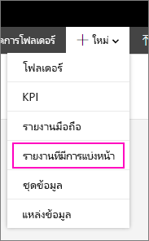
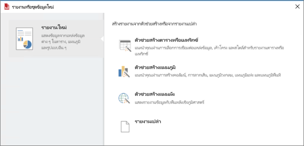

# ติดตั้งตัวสร้างรายงาน - เซิร์ฟเวอร์รายงาน Power BI

ตัวสร้างรายงานเป็นแอปแบบสแตนด์อโลนที่ติดตั้งบนคอมพิวเตอร์ของคุณโดยคุณหรือผู้ดูแลระบบ คุณสามารถติดตั้งจากศูนย์ดาวน์โหลด Microsoft หรือจากเซิร์ฟเวอร์รายงาน Power BI  

กำลังมองหาความช่วยเหลือเกี่ยวกับการติดตั้งตัวสร้างรายงานสำหรับบริการ Power BI ดู [ตัวสร้างรายงานใน Power BI](../paginated-reports/report-builder-power-bi.md) แทน
  
โดยทั่วไป ผู้ดูแลระบบจะติดตั้งและกำหนดค่าเซิร์ฟเวอร์รายงาน Power BI อนุญาตการดาวน์โหลดตัวสร้างรายงานจากพอร์ทัลเว็บ และจัดการโฟลเดอร์และสิทธิ์อนุญาตต่างๆ ไปยังรายงาน และชุดข้อมูลที่ใช้ร่วมกันที่บันทึกไปยังเซิร์ฟเวอร์รายงาน สำหรับข้อมูลเพิ่มเติมเกี่ยวกับการดูแลระบบเซิร์ฟเวอร์รายงาน Power BI ดู [ภาพรวมผู้ดูแลระบบ, เซิร์ฟเวอร์รายงาน Power BI](admin-handbook-overview.md)  
  
## ข้อกำหนดของระบบ
  
 ดูส่วน **ความต้องการของระบบ** ของ [หน้าดาวน์โหลดตัวสร้างรายงาน](https://go.microsoft.com/fwlink/?LinkID=734968) ในศูนย์ดาวน์โหลดของ Microsoft
 
## ติดตั้งตัวสร้างรายงานจากพอร์ทัลเว็บ
  
คุณสามารถติดตั้งตัวสร้างรายงานได้จากพอร์ทัลเว็บเซิร์ฟเวอร์รายงาน Power BI คุณอาจมีการติดตั้งตัวสร้างรายงานเพื่อสร้างรายงานสำหรับเซิร์ฟเวอร์ SSRS แล้ว คุณสามารถใช้รุ่นเดียวกัน หรือใช้ตัวสร้างรายงานเพื่อสร้างรายงานสำหรับเซิร์ฟเวอร์รายงาน Power BI ถ้าคุณยังไม่ได้ทำการติดตั้ง คุณสามารถติดตั้งได้ง่ายๆ

1. ในเว็บพอร์ทัลเซิร์ฟเวอร์ Power BI เลือก**สร้างรายงาน** > **แบบแบ่งหน้าใหม่**
   
    
   
    หากคุณไม่ได้ติดตั้งตัวสร้างรายงานอยู่แล้ว ตัวช่วยสร้างตัวสร้างรายงานของ Microsoft จะเริ่มทำงาน  
  
3.  ยอมรับข้อกำหนดในข้อตกลงสิทธิการใช้งาน > **ถัดไป**  
 
5.  เลือก **ติดตั้ง** เพื่อดำเนินการติดตั้งตัวสร้างรายงานให้เสร็จสมบูรณ์  

2. หลังจากติดตั้งแล้ว “ตัวสร้างรายงาน” จะเปิดขึ้นใน**หน้าจอชุดข้อมูลหรือ**รายงานใหม่
   
    
 

##   ติดตั้งตัวสร้างรายงานจากศูนย์ดาวน์โหลด  
  
1.  บน [หน้าตัวสร้างรายงานของศูนย์ดาวน์โหลดของ Microsoft](https://go.microsoft.com/fwlink/?LinkID=734968) เลือก **ดาวน์โหลด**  
  
2.  หลังจากตัวสร้างรายงานดาวน์โหลดเสร็จสิ้นแล้ว เลือก  **เรียกใช้**  
  
     ตัวช่วยสร้างตัวสร้างรายงานของ Microsoft จะเริ่มทำงาน  
  
3.  ยอมรับข้อกำหนดในข้อตกลงสิทธิการใช้งาน > **ถัดไป**  
 
5.  เลือก **ติดตั้ง** เพื่อดำเนินการติดตั้งตัวสร้างรายงานให้เสร็จสมบูรณ์  
 

## ขั้นตอนถัดไป

[เซิร์ฟเวอร์รายงาน Power BI คืออะไร](get-started.md)
