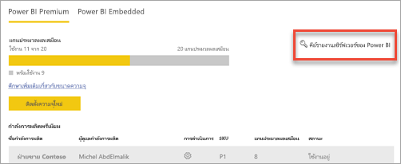
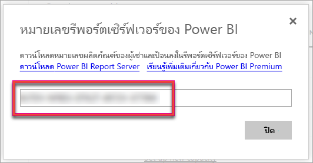
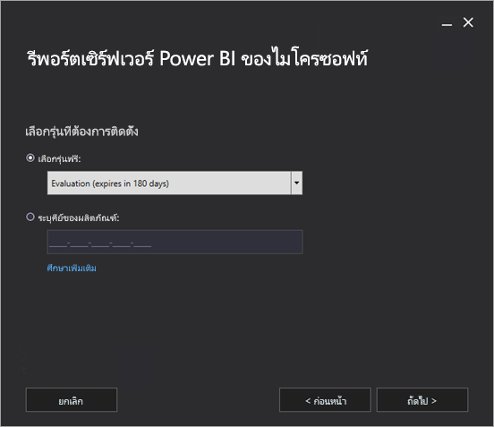
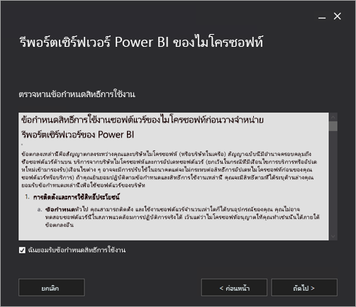
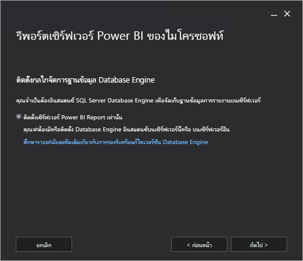
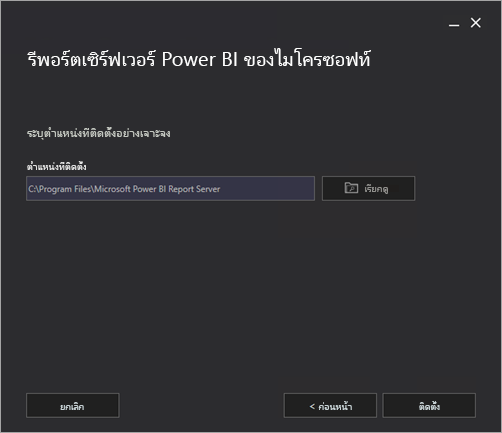
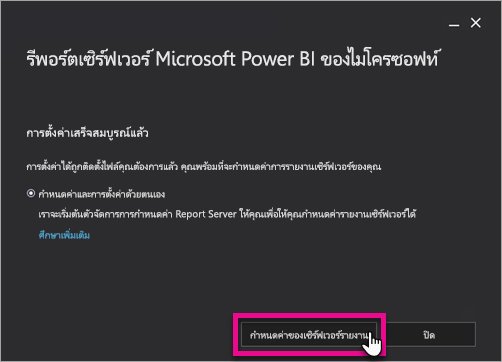
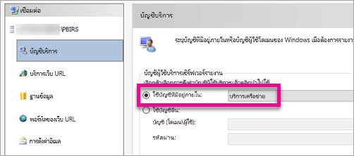
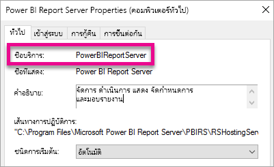

# ติดตั้ง Power BI Report Server

เรียนรู้วิธีการติดตั้งเซิร์ฟเวอร์รายงาน Power BI

## ดาวน์โหลดเซิร์ฟเวอร์รายงาน Power BI

ในหน้า[การรายงานภายในองค์กรกับเซิร์ฟเวอร์รายงาน Power BI](https://powerbi.microsoft.com/report-server/) เลือก**ดาวน์โหลดรุ่นทดลองใช้ฟรี**

เมื่อคุณเรียกใช้ไฟล์ PowerBIReportServer.exe คุณจะเลือกรุ่นทดลองใช้ฟรีหรือป้อนรหัสผลิตภัณฑ์ของคุณ อ่านรายละเอียด

## ก่อนที่คุณจะติดตั้ง

ก่อนที่คุณจะติดตั้ง Power BI Report Server เราขอแนะนำให้คุณตรวจสอบ [ข้อกำหนดของฮาร์ดแวร์และซอฟต์แวร์สำหรับการติดตั้ง Power BI Report Server](system-requirements.md)

 > [!IMPORTANT]
 > ในขณะที่คุณสามารถติดตั้งเซิร์ฟเวอร์รายงาน Power BI ในสภาพแวดล้อมที่มีตัวควบคุมโดเมนแบบอ่านอย่างเดียว (RODC), Power BI Report Server จำเป็นต้องเข้าถึงตัวควบคุมโดเมนแบบอ่าน-เขียนเพื่อให้ทำงานได้อย่างถูกต้อง ถ้า Power BI Report Server สามารถเข้าถึง RODC ได้เท่านั้นคุณอาจพบข้อผิดพลาดเมื่อพยายามจัดการบริการ

### คีย์ผลิตภัณฑ์เซิร์ฟเวอร์รายงาน Power BI

คุณสามารถรับคีย์ผลิตภัณฑ์สำหรับเซิร์ฟเวอร์รายงาน Power BI จากแหล่งข้อมูลอื่นสองแห่ง:

- Power BI Premium
- SQL Server Enterprise Software Assurance (SA)

อ่านรายละเอียด

#### Power BI Premium

ถ้าคุณซื้อ Power BI Premium แล้ว ภายในแท็บ **การตั้งค่า Premium** ของพอร์ทัลผู้ดูแลระบบ Power BI คุณสามารถเข้าถึงคีย์ผลิตภัณฑ์ของเซิร์ฟเวอร์รายงาน Power BI พอร์ทัลผู้ดูแลระบบพร้อมใช้งานสำหรับผู้ดูแลระบบส่วนกลาง หรือผู้ใช้ที่ได้รับการกำหนดบทบาทเป็นผู้ดูแลระบบบริการของ Power BI เท่านั้น

การเลือก**คีย์เซิร์ฟเวอร์รายงาน Power BI** จะแสดงบทสนทนาที่มีคีย์ผลิตภัณฑ์ของคุณ คุณสามารถคัดลอกคีย์และนำไปใช้กับการติดตั้ง

#### SQL Server Enterprise Software Assurance (SA)

ถ้าคุณมีข้อตกลง SQL Server Enterprise SA คุณสามารถรับคีย์ผลิตภัณฑ์ของคุณจาก[ศูนย์บริการการมอบสิทธิ์การใช้งาน Volume](https://www.microsoft.com/Licensing/servicecenter/)ได้

## ติดตั้งเซิร์ฟเวอร์รายงานของคุณ

การติดตั้งเซิร์ฟเวอร์รายงาน Power BI จะเป็นไปอย่างง่ายดาย มีเพียงไม่กี่ขั้นตอนในการติดตั้งไฟล์

คุณไม่จำเป็นต้องใช้เปิดงานเซิร์ฟเวอร์กลไกจัดการฐานข้อมูล SQL Server ในขณะติดตั้ง แต่คุณจะต้องมีเพื่อกำหนดค่า “บริการการรายงาน” หลังจากติดตั้ง

1. ค้นหาตำแหน่งที่ตั้งของ PowerBIReportServer.exe และเปิดใช้งานตัวติดตั้ง

2. เลือก**ติดตั้งเซิร์ฟเวอร์รายงาน Power BI**

    
3. เลือกรุ่นเพื่อติดตั้ง จากนั้นเลือก**ถัดไป**

    

    เลือก “รุ่นการประเมิน” หรือ “รุ่นนักพัฒนา”

    

    หรือป้อนคีย์ผลิตภัณฑ์ที่คุณได้รับมาจากบริการของ Power BI หรือศูนย์บริการ Volume License ดูที่ส่วน[ก่อนที่คุณจะติดตั้ง](#before-you-install)ข้างต้น สำหรับข้อมูลเพิ่มเติมเกี่ยวกับวิธีการรับคีย์ผลิตภัณฑ์ของคุณ
4. อ่านและยอมรับเงื่อนไขและข้อกำหนดสิทธิ์การใช้งาน จากนั้นเลือก**ถัดไป**

    
5. คุณต้องมีกลไลจัดการฐานข้อมูลที่พร้อมใช้งานเพื่อจัดเก็บฐานข้อมูลเซิร์ฟเวอร์รายงาน เลือก**ถัดไป**เพื่อติดตั้งเซิร์ฟเวอร์รายงานเท่านั้น

    
6. ระบุตำแหน่งการติดตั้งสำหรับเซิร์ฟเวอร์รายงาน เลือก**ติดตั้ง**เพื่อดำเนินการต่อ

    

    เส้นทางเริ่มต้นคือ C:\Program Files\Microsoft Power BI Report Server

7. หลังจากตั้งค่าสำเร็จ เลือก**กำหนดค่าเซิร์ฟเวอร์รายงาน**เพื่อเปิดใช้ตัวจัดการการกำหนดค่าบริการการรายงาน

    

## กำหนดค่าเซิร์ฟเวอร์รายงานของคุณ

หลังจากที่คุณเลือก**กำหนดค่าเซิร์ฟเวอร์รายงาน**ในการตั้งค่า คุณจะพบ Reporting Services Configuration Manager ดูที่[ตัวจัดการการกำหนดค่าบริการการรายงาน](https://docs.microsoft.com/sql/reporting-services/install-windows/reporting-services-configuration-manager-native-mode)สำหรับข้อมูลเพิ่มเติม

เพื่อดำเนินการกำหนดค่าเริ่มต้นของ “บริการการรายงาน” ให้เสร็จสิ้น คุณต้อง[สร้างฐานข้อมูลเซิร์ฟเวอร์รายงาน](https://docs.microsoft.com/sql/reporting-services/install-windows/ssrs-report-server-create-a-report-server-database) เซิร์ฟเวอร์ฐานข้อมูล SQL Server จะต้องทำตามขั้นตอนต่อไปนี้

### สร้างฐานข้อมูลในเซิร์ฟเวอร์อื่น

ถ้าคุณกำลังสร้างฐานข้อมูลเซิร์ฟเวอร์รายงานในเซิร์ฟเวอร์ฐานข้อมูลบนคอมพิวเตอร์เครื่องอื่น ให้เปลี่ยนบัญชีบริการสำหรับเซิร์ฟเวอร์รายงานให้เป็นข้อมูลประจำตัวที่เซิร์ฟเวอร์ฐานข้อมูลจดจำได้ 

ตามค่าเริ่มต้น เซิร์ฟเวอร์รายงานใช้บัญชีผู้ใช้บริการเสมือน ถ้าคุณพยายามที่จะสร้างฐานข้อมูลบนเซิร์ฟเวอร์อื่น คุณอาจได้รับข้อผิดพลาดต่อไปนี้ในขั้นตอนการใช้สิทธิ์การเชื่อมต่อที่นำมาปรับใช้

`System.Data.SqlClient.SqlException (0x80131904): Windows NT user or group '(null)' not found. Check the name again.`

คุณสามารถเปลี่ยนบัญชีบริการเป็นบริการเครือข่ายหรือบัญชีโดเมน เพื่อหลีกเลี่ยงข้อผิดพลาด การเปลี่ยนบัญชีบริการเป็นบริการเครือข่ายจะใช้สิทธิ์ในบริบทของบัญชีเครื่องสำหรับเซิร์ฟเวอร์รายงาน

ดูที่[การกำหนดค่าบัญชีผู้ใช้บริการเซิร์ฟเวอร์รายงาน](https://docs.microsoft.com/sql/reporting-services/install-windows/configure-the-report-server-service-account-ssrs-configuration-manager)สำหรับข้อมูลเพิ่มเติม

## บริการ Windows

บริการ windows ได้รับการสร้างให้เป็นส่วนหนึ่งของการติดตั้ง ซึ่งจะแสดงเป็น**เซิร์ฟเวอร์รายงาน Power BI** ชื่อบริการคือ**PowerBIReportServer**

## การจอง URL เริ่มต้น

การจอง URL ประกอบด้วยคำนำหน้า ชื่อโฮสต์ พอร์ต และไดเรกทอรีเสมือน:

| ส่วน | คำอธิบาย |
| --- | --- |
| คำนำหน้า |คำนำหน้าเริ่มต้นคือ HTTP ถ้าคุณติดตั้งใบรับรอง Secure Sockets Layer (SSL) ไว้แล้วก่อนหน้านี้ “การตั้งค่า” จะพยายามสร้างการจอง URL ที่ใช้คำนำหน้าเป็น HTTPS |
| ชื่อโฮสต์ |ชื่อโฮสต์เริ่มต้นคือ สัญลักษณ์ที่คาดเดายาก (+) ซึ่งระบุว่าเซิร์ฟเวอร์รายงานยอมรับคำขอ HTTP ใด ๆ บนพอร์ตที่กำหนดไว้สำหรับชื่อโฮสต์ที่แก้ไขไปยังคอมพิวเตอร์ รวมถึง`https://<computername>/reportserver`,`https://localhost/reportserver`หรือ `https://<IPAddress>/reportserver.` |
| พอร์ต |พอร์ตเริ่มต้นคือ 80 ถ้าคุณใช้พอร์ตใด ๆ นอกเหนือจากพอร์ต 80 คุณต้องเพิ่มพอร์ตนั้นลงใน URL อย่างชัดเจนเมื่อคุณเปิดเว็บพอร์ทัลในหน้าต่างเบราเซอร์ |
| ไดเรกทอรีเสมือน |ตามค่าเริ่มต้น ไดเรกทอรีเสมือนได้รับการสร้างขึ้นในรูปแบบของ ReportServer สำหรับ Web Service เซิร์ฟเวอร์รายงาน และรายงานสำหรับพอร์ทัลเว็บ ไดเรกทอรีเสมือนเริ่มต้นคือ**reportserver**สำหรับ Web Service เซิร์ฟเวอร์รายงาน ไดเรกทอรีเสมือนเริ่มต้นคือ**รายงาน**สำหรับพอร์ทัลเว็บ |

ตัวอย่างของสตริงที่ URL สมบูรณ์อาจเป็นดังนี้:

* `https://+:80/reportserver`มอบการเข้าถึงไปยังเซิร์ฟเวอร์รายงาน
* `https://+:80/reports`มอบการเข้าถึงพอร์ทัลเว็บ

## ไฟร์วอลล์

ถ้าคุณกำลังเข้าถึงเซิร์ฟเวอร์รายงานจากเครื่องระยะไกล กรุณาตรวจสอบให้แน่ใจว่าคุณได้กำหนดกฎไฟร์วอลล์แล้วใช่หรือไม่ หากมีไฟร์วอลล์อยู่

เปิดพอร์ต TCP ที่คุณกำหนดค่าสำหรับ Web Service URL และ Web Portal URL ของคุณ ซึ่งจะกำหนดค่าบนพอร์ต TCP 80 ตามค่าเริ่มต้น

## การกำหนดค่าเพิ่มเติม

* ดูที่[รวมกับบริการ Power BI](https://docs.microsoft.com/sql/reporting-services/install-windows/power-bi-report-server-integration-configuration-manager)เพื่อกำหนดค่าการรวมกับบริการ Power BI เมื่อต้องการให้คุณสามารถปักหมุดรายการรายงานไปยังแดชบอร์ด Power BI
* ดูที่[ตั้งค่าอีเมล์](https://docs.microsoft.com/sql/reporting-services/install-windows/e-mail-settings-reporting-services-native-mode-configuration-manager)และ[อีเมลที่ส่งในเซิร์ฟเวอร์รายงาน](https://docs.microsoft.com/sql/reporting-services/subscriptions/e-mail-delivery-in-reporting-services)เมื่อต้องการกำหนดค่าอีเมลสำหรับการประมวลผลการสมัครใช้งาน
* ดูที่[กำหนดค่าไฟร์วอลล์สำหรับการเข้าถึงเซิร์ฟเวอร์รายงาน](https://docs.microsoft.com/sql/reporting-services/report-server/configure-a-firewall-for-report-server-access)และ[การกำหนดค่าเซิร์ฟเวอร์รายงานสำหรับการดูแลระบบระยะไกล](https://docs.microsoft.com/sql/reporting-services/report-server/configure-a-report-server-for-remote-administration) เมื่อต้องการกำหนดค่าพอร์ทัลเว็บเพื่อให้คุณสามารถเข้าถึงได้ผ่านคอมพิวเตอร์รายงานเพื่อดูและจัดการรายงาน
* สำหรับรายละเอียดเกี่ยวกับการตั้งค่าคุณสมบัติระบบของเซิร์ฟเวอร์รายงานใน SQL Server Management Studio ดู [หน้าคุณสมบัติของเซิร์ฟเวอร์ขั้นสูง](https://docs.microsoft.com/sql/reporting-services/tools/server-properties-advanced-page-reporting-services) ถ้าไม่กำหนด ตัวเลือกจะใช้กับเซิร์ฟเวอร์รายงาน Power BI และ SQL Server Reporting Services ทั้งสอง

## ขั้นตอนถัดไป

[ภาพรวมของผู้ดูแลระบบ](admin-handbook-overview.md)  
[วิธีการค้นหาคีย์ผลิตภัณฑ์เซิร์ฟเวอร์รายงานของคุณ](find-product-key.md)  
[ติดตั้ง Power BI Desktop ที่ปรับให้เหมาะสำหรับ Power BI Report Server](install-powerbi-desktop.md)  
[ตรวจสอบการติดตั้งบริการการรายงาน](https://docs.microsoft.com/sql/reporting-services/install-windows/verify-a-reporting-services-installation)  
[กำหนดค่าบัญชีผู้ใช้บริการเซิร์ฟเวอร์รายงาน](https://docs.microsoft.com/sql/reporting-services/install-windows/configure-the-report-server-service-account-ssrs-configuration-manager)  
[กำหนดค่า URL ของเซิร์ฟเวอร์รายงาน](https://docs.microsoft.com/sql/reporting-services/install-windows/configure-report-server-urls-ssrs-configuration-manager)  
[กำหนดค่าการเชื่อมต่อฐานข้อมูลเซิร์ฟเวอร์รายงาน](https://docs.microsoft.com/sql/reporting-services/install-windows/configure-a-report-server-database-connection-ssrs-configuration-manager)  
[เตรียมใช้งานเซิร์ฟเวอร์รายงาน](https://docs.microsoft.com/sql/reporting-services/install-windows/ssrs-encryption-keys-initialize-a-report-server)  
[กำหนดค่าการเชื่อมต่อ SSL ในเซิร์ฟเวอร์รายงาน](https://docs.microsoft.com/sql/reporting-services/security/configure-ssl-connections-on-a-native-mode-report-server)  
[กำหนดค่าบัญชีบริการ windows และสิทธิ์](https://docs.microsoft.com/sql/database-engine/configure-windows/configure-windows-service-accounts-and-permissions)  
[การสนับสนุนเบราว์เซอร์สำหรับ Power BI Report Server](browser-support.md)

มีคำถามเพิ่มเติมหรือไม่ [ลองถามชุมชน Power BI](https://community.powerbi.com/)