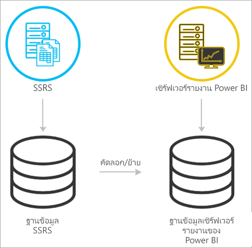
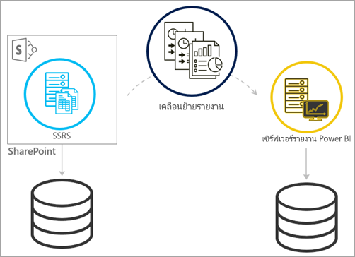
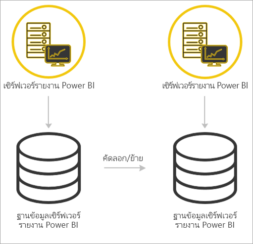

# <a name="migrate-a-report-server-installation"></a>ย้ายการติดตั้งเซิร์ฟเวอร์รายงาน

เรียนรู้วิธีการย้ายอินสแตนซ์ SQL Server Reporting Services (SSRS) ที่มีอยู่ของคุณไปยังอินสแตนซ์ของเซิร์ฟเวอร์รายงาน Power BI

การย้ายได้รับการกำหนดให้เป็นการย้ายไฟล์ข้อมูลของแอปพลิเคชันไปยังอินสแตนซ์เซิร์ฟเวอร์รายงาน Power BI ใหม่ ต่อไปนี้เป็นเหตุผลทั่วไปที่คุณอาจต้องย้ายการติดตั้งของคุณ:

* คุณต้องการย้ายจาก SQL Server Reporting Services ไปยังเซิร์ฟเวอร์รายงาน Power BI
  
  > [!NOTE]
  > ไม่มีการอัปเกรด inplace จาก SQL Server Reporting Services ไปยังเซิร์ฟเวอร์รายงาน Power BI จำเป็นต้องมีการย้าย

* คุณมีการใช้งานมาตราส่วนขนาดใหญ่ หรือข้อกำหนดการอัปเดต
* คุณกำลังเปลี่ยนฮาร์ดแวร์หรือโทโพโลยีของการติดตั้งของคุณ
* คุณพบปัญหาที่บล็อกการอัปเกรด

## <a name="migrating-to-power-bi-report-server-from-ssrs-native-mode"></a>ย้ายไปยังเซิร์ฟเวอร์รายงาน Power BI จาก SSRS (โหมดเนทิฟ)

ย้ายจากอินสแตนซ์ SSRS (โหมดเนทิฟ) ไปยังเซิร์ฟเวอร์รายงาน Power BI ที่ประกอบด้วยบางขั้นตอน



> [!NOTE]
> SQL Server 2008 Reporting Services และรุ่นที่ใหม่กว่าที่สนับสนุนการย้าย

* ฐานข้อมูลสำรอง แอปพลิเคชัน และไฟล์การกำหนดค่า
* สำรองข้อมูลคีย์การเข้ารหัสลับ
* โคลนฐานข้อมูลเซิร์ฟเวอร์รายงานของคุณที่โฮสต์รายงานของคุณ
* ติดตั้งเซิร์ฟเวอร์รายงาน Power BI ถ้าคุณกำลังใช้ฮาร์ดแวร์ที่เหมือนกัน คุณสามารถติดตั้งเซิร์ฟเวอร์รายงาน Power BI บนเซิร์ฟเวอร์เดียวกันกับอินสแตนซ์ SSRS สำหรับข้อมูลเพิ่มเติมเกี่ยวกับการติดตั้งเซิร์ฟเวอร์รายงาน Power BI ดูที่[ติดตั้งเซิร์ฟเวอร์รายงาน Power BI](install-report-server.md)

> [!NOTE]
> ชื่ออินสแตนซ์สำหรับเซิร์ฟเวอร์รายงาน Power BI จะเป็น*PBIRS*

* กำหนดค่าเซิร์ฟเวอร์รายงานโดยใช้ตัวจัดการการกำหนดค่าเซิร์ฟเวอร์รายงาน และเชื่อมต่อกับฐานข้อมูลที่ได้รับการโคลน
* ดำเนินการล้างข้อมูลที่จำเป็นสำหรับอินสแตนซ์ SSRS (โหมดเนทิฟ)

## <a name="migration-to-power-bi-report-server-from-ssrs-sharepoint-integrated-mode"></a>การย้ายไปยังเซิร์ฟเวอร์รายงาน Power BI จาก SSRS (โหมดการรวม SharePoint)

การย้ายจากการ SSRS (โหมดการรวม SharePoint) ไปยังเซิร์ฟเวอร์รายงาน Power BI จะไม่ตรงไปตรงมาเหมือนโหมดเนทิฟ ขั้นตอนเหล่านี้ให้คำแนะนำบางส่วน คุณอาจมีไฟล์และสินทรัพย์อื่นๆภายใน SharePoint คุณที่จำเป็นต้องจัดการภายนอกขั้นตอนเหล่านี้



คุณจะต้องย้ายเนื้อหาเซิร์ฟเวอร์รายงานเฉพาะจาก SharePoint ไปยังเซิร์ฟเวอร์ของคุณรายงาน Power BI คุณต้องติดตั้งเซิร์ฟเวอร์รายงาน Power BI ไว้บางที่ในสภาพแวดล้อมของคุณให้เรียบร้อย สำหรับข้อมูลเพิ่มเติมเกี่ยวกับการติดตั้งเซิร์ฟเวอร์รายงาน Power BI ดูที่[ติดตั้งเซิร์ฟเวอร์รายงาน Power BI](install-report-server.md)

ถ้าคุณต้องการคัดลอกเนื้อหาของเซิร์ฟเวอร์รายงานจากสภาพแวดล้อมของ SharePoint ของคุณไปยังเซิร์ฟเวอร์รายงาน Power BI คุณจะต้องใช้เครื่องมือ เช่น**rs.exe**เพื่อคัดลอกเนื้อหา ด้านล่างนี้คือตัวอย่างของสิ่งที่สคริปต์จะคัดลอกเนื้อหาของเซิร์ฟเวอร์รายงานจาก SharePoint ไปยัง เซิร์ฟเวอร์รายงาน Power BI

> [!NOTE]
> สคริปต์ตัวอย่างควรทำงานร่วมกับ SharePoint 2010 และรุ่นที่ใหม่กว่าและ SQL Server 2008 Reporting Services และรุ่นที่ใหม่กว่า

### <a name="sample-script"></a>สคริปต์ตัวอย่าง

```
Sample Script
rs.exe
-i ssrs_migration.rss -e Mgmt2010
-s https://SourceServer/_vti_bin/reportserver
-v st="sites/bi" -v f="Shared Documents“
-u Domain\User1 -p Password
-v ts=https://TargetServer/reportserver
-v tu="Domain\User" -v tp="Password"
```

## <a name="migrating-from-one-power-bi-report-server-to-another"></a>ย้ายจากเซิร์ฟเวอร์รายงาน Power BI ไปยังที่อื่น

ย้ายจากเซิร์ฟเวอร์รายงาน Power BI เป็นกระบวนการเดียวกันกับการย้ายจาก SSRS (โหมดเนทิฟ)



* ฐานข้อมูลสำรอง แอปพลิเคชัน และไฟล์การกำหนดค่า
* สำรองข้อมูลคีย์การเข้ารหัสลับ
* โคลนฐานข้อมูลเซิร์ฟเวอร์รายงานของคุณที่โฮสต์รายงานของคุณ
* ติดตั้งเซิร์ฟเวอร์รายงาน Power BI คุณ *ไม่สามารถ* ติดตั้งเซิร์ฟเวอร์รายงาน Power BI บนเซิร์ฟเวอร์เดียวกันกับเซิร์ฟเวอร์ที่คุณกำลังย้ายจาก สำหรับข้อมูลเพิ่มเติมเกี่ยวกับการติดตั้งเซิร์ฟเวอร์รายงาน Power BI ดูที่[ติดตั้งเซิร์ฟเวอร์รายงาน Power BI](install-report-server.md)

> [!NOTE]
> ชื่ออินสแตนซ์สำหรับเซิร์ฟเวอร์รายงาน Power BI จะเป็น*PBIRS*

* กำหนดค่าเซิร์ฟเวอร์รายงานโดยใช้ตัวจัดการการกำหนดค่าเซิร์ฟเวอร์รายงาน และเชื่อมต่อกับฐานข้อมูลที่ได้รับการโคลน
* ดำเนินการล้างข้อมูลต่างๆที่จำเป็นสำหรับการติดตั้งเซิร์ฟเวอรรายงาน์ Power BI แบบเดิม

## <a name="next-steps"></a>ขั้นตอนถัดไป

[ภาพรวมของผู้ดูแลระบบ](admin-handbook-overview.md)  
[ติดตั้ง Power BI Report Server](install-report-server.md)  
[สคริปต์กับ rs.exe Utility และ Web Service](https://docs.microsoft.com/sql/reporting-services/tools/script-with-the-rs-exe-utility-and-the-web-service)

มีคำถามเพิ่มเติมหรือไม่ [ลองถามชุมชน Power BI](https://community.powerbi.com/)