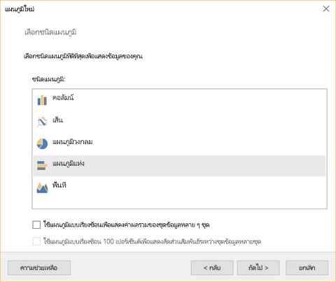
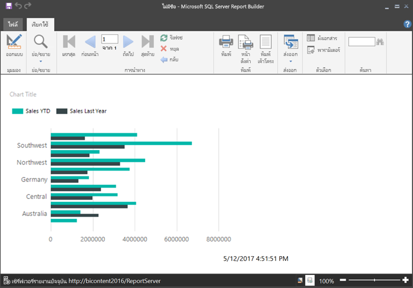

# สร้างรายงานแบบแบ่งหน้าสำหรับเซิร์ฟเวอร์รายงาน Power BI
ตามชื่อแนะนำ รายงานแบบแบ่งหน้าสามารถเรียกใช้งานกับหน้ามากมาย พวกเขากำลังวางเค้าโครงในรูปแบบคงที่ และเสนอการกำหนดค่าอย่างแม่นยำ รายงานแบบแบ่งหน้าคือ ไฟล์ .rdl

คุณสามารถจัดเก็บและจัดการกับรายงานแบบแบ่งหน้าในเว็บพอร์ทัลเซิร์ฟเวอร์รายงาน Power BI เหมือนกับที่คุณสามารถทำได้ในเว็บพอร์ทัล SQL Server Reporting Services (SSRS) คุณสามารถสร้าง และแก้ไขไฟล์ใน “ตัวสร้างรายงาน” หรือ “ตัวออกแบบรายงาน” ในเครื่องมือข้อมูลเซิร์ฟเวอร์ SQL (SSDT), แล้วเผยแพร่ไปยังเว็บพอร์ทัล จากนั้น ผู้อ่านรายงานในองค์กรของคุณสามารถดูข้อมูลได้ ในเบราว์เซอร์ หรือ ในแอป Power BI บนมือถือในอุปกรณ์เคลื่อนที่ของพวกเขา

ถ้าคุณเคยสร้างรายงานแบบแบ่งหน้าใน “ตัวสร้างรายงาน” หรือ “ตัวออกแบบรายงาน” ดังนั้นคุณก็พร้อมที่จะสร้างรายงานแบบแบ่งหน้าสำหรับเซิร์ฟเวอร์รายงาน Power BI ถ้าไม่เคย นี่คือขั้นตอนด่วนที่จะช่วยคุณเริ่มต้นใช้งาน

## ขั้นตอนที่ 1: ติดตั้งและเริ่มใช้งาน “ตัวสร้างรายงาน”
คุณอาจมีการติดตั้งตัวสร้างรายงานเพื่อสร้างรายงานสำหรับเซิร์ฟเวอร์ SSRS แล้ว คุณสามารถใช้รุ่นเดียวกัน หรือใช้ตัวสร้างรายงานเพื่อสร้างรายงานสำหรับเซิร์ฟเวอร์รายงาน Power BI ถ้าคุณยังไม่ได้ทำการติดตั้ง คุณสามารถติดตั้งได้ง่ายๆ

1. ในเว็บพอร์ทัลเซิร์ฟเวอร์ Power BI เลือก**สร้างรายงาน** > **แบบแบ่งหน้าใหม่**
   
    
   
    ถ้าคุณยังไม่ได้ติดตั้ง “ตัวสร้างรายงาน” คุณจะถูกนำเข้าสู่กระบวนการติดตั้งตอนนี้
2. หลังจากติดตั้งแล้ว “ตัวสร้างรายงาน” จะเปิดขึ้นใน**หน้าจอชุดข้อมูลหรือ**รายงานใหม่
   
    
3. เลือกตัวช่วยสร้างสำหรับชนิดของรายงานที่คุณต้องการสร้าง:
   
   * ตารางหรือเมทริกซ์
   * แผนภูมิ
   * แผนที่
   * ว่าง
4. มาเริ่มต้นด้วยตัวช่วยสร้างแผนภูมิ
   
    ตัวช่วยสร้างแผนภูมิจะช่วยแนะนำขั้นตอนการสร้างแผนภูมิพื้นฐานในรายงานให้กับคุณ จากที่นั่น คุณสามารถปรับแต่งรายงานของคุณได้เกือบทุกวิธีแบบไม่จำกัด

## ขั้นตอนที่ 2: ไปที่ตัวช่วยสร้างแผนภูมิ
ตัวช่วยสร้างแผนภูมิจะช่วยแนะนำขั้นตอนพื้นฐานของการสร้างการแสดงภาพในรายงาน

รายงานแบบแบ่งหน้าสามารถเชื่อมต่อกับแหล่งข้อมูลที่หลากหลาย จากเซิร์ฟเวอร์ Microsoft SQL และ ฐานข้อมูล Microsoft Azure SQL ไปยัง Oracle, Hyperion และอื่นๆ อีกมากมาย อ่านเกี่ยวกับ [แหล่งข้อมูลที่ได้รับการสนับสนุนโดยรายงานแบบแบ่งหน้า](connect-data-sources.md)

ในหน้าแรกของช่วยสร้างแผนภูมิ**เลือกชุดข้อมูล**คุณสามารถสร้างชุดข้อมูลหรือเลือกชุดข้อมูลที่ใช้ร่วมกันบนเซิร์ฟเวอร์ได้ *ชุดข้อมูล*ส่งกลับข้อมูลรายงานจากแบบสอบถามบนแหล่งข้อมูลภายนอก

1. เลือก**เรียกดู** > เลือกชุดข้อมูลที่ใช้ร่วมกันบนเซิร์ฟเวอร์ > **เปิด** > **ถัดไป**
   
    
   
     ต้องการสร้างชุดข้อมูลหรือไม่ ดูที่[สร้างชุดข้อมูลที่ใช้ร่วมกันหรือชุดข้อมูลที่ฝัง](https://docs.microsoft.com/sql/reporting-services/report-data/create-a-shared-dataset-or-embedded-dataset-report-builder-and-ssrs)
2. เลือกชนิดแผนภูมิ - ในกรณีนี้ แผนภูมิแท่ง
   
    
3. จัดเรียงเขตข้อมูลโดยการลากไปยัง**ประเภท**, **ชุด**และ**กล่อง**ค่า
   
    
4. เลือก**ถัดไป** > **เสร็จสิ้น**

## ขั้นตอนที่ 3: ออกแบบรายงานของคุณ
ในตอนนี้คุณอยู่ในมุมมองการออกแบบรายงาน จะสังเกตเห็นว่าข้อมูลเป็นข้อมูลตัวอย่างที่จะแสดงผล ไม่ใช่ข้อมูลของคุณ

* เมื่อต้องการดูข้อมูลของคุณ เลือก**เรียกใช้**
  
     
* เมื่อต้องการย้อนกลับไปยังมุมมองการออกแบบ เลือก**ออกแบบ**

คุณสามารถปรับเปลี่ยนแผนภูมิคุณเพิ่งสร้าง เปลี่ยนเค้าโครง ค่า คำอธิบายแผนภูมิ...หรือปรับเปรี่ยนอะไรก็ได้

และคุณสามารถเพิ่มการเรียงลำดับทั้งหมดของการแสดงภาพต่างๆ เช่น ตัววัด ตาราง เมทริกซ์ ตาราง แผนที่ และอื่นๆ คุณสามารถเพิ่มหัวกระดาษและท้ายกระดาษสำหรับหลายหน้า ดู[บทช่วยสอนตัวสร้างรายงาน](https://docs.microsoft.com/sql/reporting-services/report-builder-tutorials)เพื่อลองด้วยตัวคุณเอง

## ขั้นตอนที่ 4: บันทึกรายงานของคุณไปยังเซิร์ฟเวอร์รายงาน
เมื่อรายงานของคุณพร้อมแล้ว บันทึกไปยังเซิร์ฟเวอร์รายงาน Power BI

1. ไปที่**เมนู**ไฟล์ เลือก**บันทึกเป็น**และบันทึกไปยังเซิร์ฟเวอร์รายงาน 
2. ในตอนนี้คุณสามารถดูรายงานได้ในเบราว์เซอร์
   
    

## ขั้นตอนถัดไป
มีทรัพยากรที่ยอดเยี่ยมมากมายสำหรับการออกแบบรายงานใน “ตัวสร้างรายงาน” และใน “ตัวออกแบบรายงาน” ในเครื่องมือข้อมูลเซิร์ฟเวอร์ SQL บทช่วยสอนตัวสร้างรายงานเหมาะสำหรับการเริ่มต้น

* [บทช่วยสอนตัวสร้างรายงาน](https://docs.microsoft.com/sql/reporting-services/report-builder-tutorials)
* [เซิร์ฟเวอร์รายงาน Power BI คืออะไร](get-started.md)  

มีคำถามเพิ่มเติมหรือไม่ [ลองถามชุมชน Power BI](https://community.powerbi.com/)

