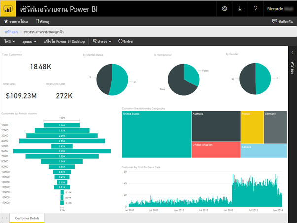
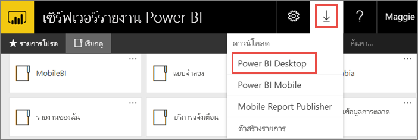
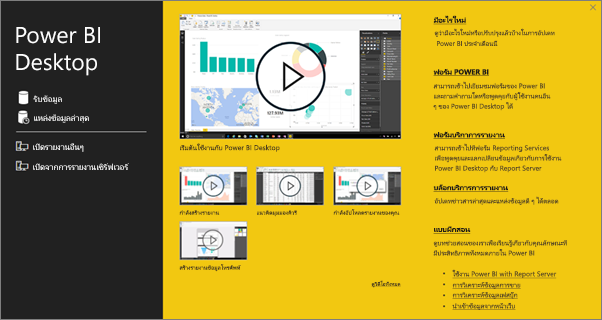
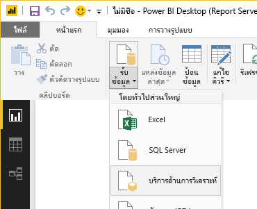
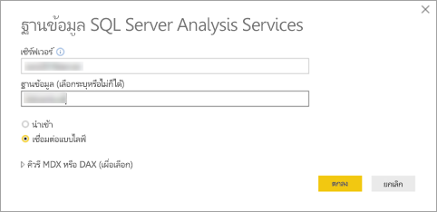
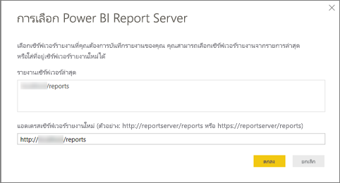
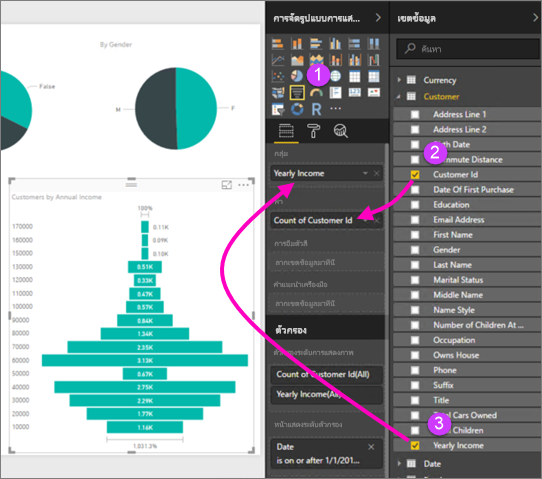
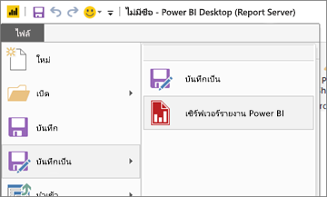

# สร้างรายงาน Power BI สำหรับเซิร์ฟเวอร์รายงาน Power BI
คุณสามารถจัดเก็บ และจัดการรายงาน Power BI ภายในองค์กร ในพอร์ทัลของเว็บเซิร์ฟเวอร์รายงาน Power BI เช่นเดียวกับที่คุณสามารถจัดเก็บรายงาน Power BI ในระบบคลาวด์ในบริการของ Power BI (https://powerbi.com) ได้ คุณสร้างและแก้ไขรายงานใน Power BI Desktop แล้วเผยแพร่ไปยังพอร์ทัลของเว็บ จากนั้น ผู้อ่านรายงานในองค์กรของคุณ สามารถดูรายงานได้ในเบราว์เซอร์ หรือในแอปมือถือ Power BI บนอุปกรณ์เคลื่อนที่ของพวกเขา

ต่อไปนี้เป็นสี่ขั้นตอนด่วน ที่ช่วยให้คุณเริ่มต้น

## ขั้นตอนที่ 1: ติดตั้ง Power BI Desktop ที่ปรับให้เหมาะสำหรับเซิร์ฟเวอร์รายงาน Power BI

ถ้าคุณเคยสร้างรายงาน Power BI ใน Power BI Desktop แล้ว คุณเกือบพร้อมที่จะสร้างรายงาน Power BI สำหรับเซิร์ฟเวอร์รายงาน Power BI เราขอแนะนำให้ติดตั้งเวอร์ชันของ Power BI Desktop ที่ปรับให้เหมาะสำหรับเซิร์ฟเวอร์รายงาน Power BI เพื่อให้คุณมั่นใจว่าเซิร์ฟเวอร์ และแอปจะซิงค์กันอยู่เสมอ คุณสามารถมี Power BI Desktop ทั้งสองเวอร์ชันบนคอมพิวเตอร์เครื่องเดียวกัน

1. ในพอร์ทัลของเว็บเซิร์ฟเวอร์รายงาน เลือกลูกศร**ดาวน์โหลด** > **Power BI Desktop**

    

    หรือตรงไปที่ [Microsoft Power BI Desktop](https://www.microsoft.com/download/details.aspx?id=56723) (ปรับให้เหมาะสำหรับเซิร์ฟเวอร์รายงาน Power BI - มีนาคม 2018) ในศูนย์ดาวน์โหลดของ Microsoft

2. ในหน้าศูนย์ดาวน์โหลด เลือก**ดาวน์โหลด**

3. ขึ้นอยู่กับคอมพิวเตอร์ของคุณ เลือก:

    - **PBIDesktopRS.msi** (เวอร์ชัน 32 บิต) หรือ

    - **PBIDesktopRS_x64.msi** (เวอร์ชัน 64 บิต)

4. หลังจากที่คุณดาวน์โหลดตัวติดตั้งแล้ว เรียกใช้ตัวช่วยสร้างการติดตั้ง Power BI Desktop (มีนาคม 2018)

2. ในตอนท้ายของการติดตั้ง ทำเครื่องหมายที่**เริ่มต้น Power BI Desktop ทันที**
   
    จะเริ่มต้นโดยอัตโนมัติ และคุณก็พร้อมที่จะไปต่อ คุณบอกได้ว่า คุณมีเวอร์ชันที่เหมาะสม เนื่องจากมี "Power BI Desktop (มีนาคม 2018)" อยู่ในแถบชื่อเรื่อง

    

3. ถ้าคุณไม่คุ้นเคยกับ Power BI Desktop ลองดูวิดีโอบนหน้าจอยินดีต้อนรับ
   
    

## ขั้นตอนที่ 2: เลือกแหล่งข้อมูล
คุณสามารถเชื่อมต่อกับแหล่งข้อมูลที่หลากหลาย อ่านเพิ่มเติมเกี่ยวกับ[การเชื่อมต่อกับแหล่งข้อมูล](connect-data-sources.md)

1. จากหน้าจอยินดีต้อนรับ เลือก**รับข้อมูล**
   
    หรือบนการแท็บ**หน้าแรก** เลือก**รับข้อมูล**
2. เลือกแหล่งข้อมูลของคุณ - ในตัวอย่างนี้เป็น **Analysis Services**
   
    
3. กรอกค่า**เซิร์ฟเวอร์** และใส่**ฐานข้อมูล**ถ้าจำเป็น ตรวจสอบให้แน่ใจว่าตัวเลือก**เชื่อมต่อแบบไลฟ์**ถูกเลือก > **ตกลง**
   
    
4. เลือกเซิร์ฟเวอร์รายงานที่คุณจะบันทึกรายงานของคุณ
   
    

## ขั้นตอนที่ 3: ออกแบบรายงานของคุณ
ต่อไปนี้เป็นเรื่องสนุก: คุณจะสร้างวิชวลที่แสดงข้อมูลของคุณ

ตัวอย่างเช่น คุณสามารถสร้างแผนภูมิกรวยของลูกค้าและจัดกลุ่มตามรายได้รายปี

1. ใน**การจัดรูปแบบการแสดงข้อมูล** เลือก**แผนภูมิกรวย**
2. ลากเขตข้อมูลที่จะนับลงใน **ค่า** ถ้าเขตข้อมูลไม่ใช่ตัวเลข Power BI Desktop จะทำการ*นับจำนวน*ค่าให้โดยอัตโนมัติ
3. ลากเขตข้อมูลที่จะจัดกลุ่มลงใน **กลุ่ม**

อ่านเพิ่มเติมเกี่ยวกับ[การออกแบบรายงาน Power BI](../desktop-report-view.md)

## ขั้นตอนที่ 4: บันทึกรายงานของคุณไปยังเซิร์ฟเวอร์รายงาน
เมื่อรายงานของคุณพร้อมแล้ว คุณบันทึกไปยังเซิร์ฟเวอร์รายงาน Power BI ที่คุณเลือกในขั้นตอนที่ 2

1. บนเมนู**แฟ้ม** เลือก**บันทึกเป็น** > **เซิร์ฟเวอร์รายงาน Power BI**
   
    
2. ตอนนี้ คุณสามารถดูรายงานได้ในพอร์ทัลของเว็บ
   
    

## ข้อควรพิจารณาและข้อจำกัด
รายงานในเซิร์ฟเวอร์รายงาน Power BI และบริการของ Power BI (http://powerbi.com) ทำงานเกือบเหมือนกัน แต่มีความแตกต่างในบางคุณลักษณะ

### ในเบราว์เซอร์
รายงานในเซิร์ฟเวอร์รายงาน Power BI สนับสนุนการแสดงภาพทั้งหมด รวมถึง:

* วิชวลแบบกำหนดเอง

รายงานในเซิร์ฟเวอร์รายงาน Power BI ไม่สนับสนุน:

* วิชวล R
* แผนที่ ArcGIS
* การนำทางแบบแสดงเส้นนำทาง
* คุณลักษณะที่เป็นตัวอย่างใน Power BI Desktop

### ในแอปสำหรับอุปกรณ์เคลื่อนที่ Power BI
รายงานในเซิร์ฟเวอร์รายงาน Power BI สนับสนุนฟังก์ชันพื้นฐานทั้งหมดใน[แอปสำหรับอุปกรณ์เคลื่อนที่ Power BI](../mobile-apps-for-mobile-devices.md) รวมถึง:

* [เค้าโครงรายงานโทรศัพท์](../desktop-create-phone-report.md): คุณสามารถรายงานให้เหมาะสำหรับแอปสำหรับอุปกรณ์เคลื่อนที่ Power BI ได้ บนโทรศัพท์มือถือของคุณ รายงานที่ปรับให้เหมาะสมมีไอคอนพิเศษ  และเค้าโครงที่เหมาะกับมือถือ
  
    

รายงานในเซิร์ฟเวอร์รายงาน Power BI ไม่สนับสนุนคุณลักษณะเหล่านี้ในแอปสำหรับอุปกรณ์เคลื่อนที่ Power BI:

* วิชวล R
* แผนที่ ArcGIS
* การแสดงผลด้วยภาพแบบกำหนดเอง
* การนำทางแบบแสดงเส้นนำทาง
* การกรองทางภูมิศาสตร์ หรือบาร์โคด

## ขั้นตอนถัดไป
### Power BI Desktop
มีทรัพยากรที่ยอดเยี่ยมมากมายสำหรับการสร้างรายงานใน Power BI Desktop ลิงก์นี้เป็นจุดเริ่มต้นที่ดี

* [เริ่มต้นใช้งาน Power BI Desktop](../desktop-getting-started.md)
* การเรียนรู้พร้อมคำแนะนำ:[เริ่มต้นใช้งาน Power BI Desktop](../guided-learning/gettingdata.yml?tutorial-step=2)

### เซิร์ฟเวอร์รายงาน Power BI
* [ติดตั้ง Power BI Desktop ที่ปรับให้เหมาะสำหรับ Power BI Report Server](install-powerbi-desktop.md)  
* [เซิร์ฟเวอร์รายงาน Power BI คืออะไร?](get-started.md)  

มีคำถามเพิ่มเติมหรือไม่ [ลองถามชุมชน Power BI](https://community.powerbi.com/)
