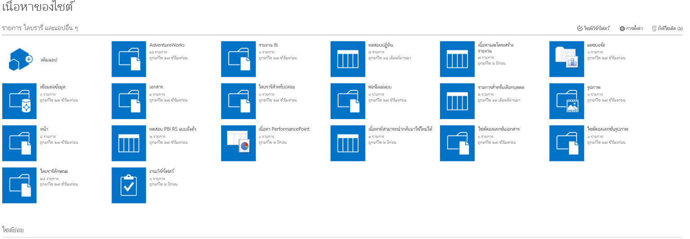

# <a name="quickstart-embed-a-power-bi-report-server-report-using-an-iframe-in-sharepoint-server"></a>เริ่มต้นใช้งานด่วน: ฝังรายงานเซิร์ฟเวอร์รายงาน Power BI โดยใช้ iFrame ใน SharePoint Server

ในการเริ่มต้นด่วนนี้ คุณจะได้เรียนรู้วิธีการฝังรายงานเซิร์ฟเวอร์รายงาน Power BI โดยใช้ iFrame ในหน้า SharePoint ถ้าคุณกำลังทำงานกับ SharePoint Online เซิร์ฟเวอร์รายงาน Power BI ต้องสามารถเข้าถึงแบบสาธารณะได้ ใน SharePoint Online, Power BI Web Part ที่ทำงานกับบริการของ Power BI ไม่ทำงานกับเซิร์ฟเวอร์รายงาน Power BI 


## <a name="prerequisites"></a>ข้อกำหนดเบื้องต้น
* คุณจะต้องมี[เซิร์ฟเวอร์รายงาน Power BI](https://powerbi.microsoft.com/report-server/) ที่ติดตั้งและกำหนดค่าแล้ว
* คุณจะต้องมี [Power BI Desktop ที่ปรับให้เหมาะสำหรับเซิร์ฟเวอร์รายงาน Power BI](install-powerbi-desktop.md) ติดตั้งแล้ว
* คุณจะต้องมีสภาพแวดล้อม [SharePoint](https://docs.microsoft.com/sharepoint/install/install) ที่ติดตั้งและกำหนดค่าแล้ว

## <a name="creating-the-power-bi-report-server-report-url"></a>การสร้าง URL รายงานเซิร์ฟเวอร์รายงาน Power BI

1. ดาวน์โหลดตัวอย่างจาก GitHub - [การสาธิตบล็อก](https://github.com/Microsoft/powerbi-desktop-samples)

    

2. เปิดไฟล์ PBIX ตัวอย่างจาก GitHub ใน **Power BI Desktop ที่ปรับให้เหมาะสำหรับเซิร์ฟเวอร์รายงาน Power BI**

    

3. บันทึกรายงานไปยัง**เซิร์ฟเวอร์รายงาน Power BI** 

    

4. ดูรายงานใน**พอร์ทัลของเว็บ**

    

### <a name="capturing-the-url-parameter"></a>การจับพารามิเตอร์ URL

เมื่อคุณมี URL ของคุณแล้ว คุณสามารถสร้าง iFrame ภายในหน้า SharePoint เพื่อโฮสต์รายงาน สำหรับ URL รายงานเซิร์ฟเวอร์รายงาน Power BI ใด ๆ คุณสามารถเพิ่มพารามิเตอร์ querystring `?rs:embed=true` เพื่อฝังรายงานของคุณลงใน iFrame ได้ 

   ตัวอย่างเช่น:
    ``` 
    http://myserver/reports/powerbi/Sales?rs:embed=true
    ```
## <a name="embedding-a-power-bi-report-server-report-in-a-sharepoint-iframe"></a>การฝังรายงานเซิร์ฟเวอร์รายงาน Power BI ใน SharePoint iFrame

1. นำทางไปยัง SharePoint หน้า**เนื้อหาของไซต์**

    

2. เลือกหน้าที่คุณต้องการเพิ่มรายงานของคุณ

    

3. เลือกที่รูปเฟืองด้านบนขวา แล้วเลือก**แก้ไขหน้า**

    

4. เลือก**เพิ่ม Web Part**

    

5. ภายใต้**ประเภท** เลือก**สื่อและเนื้อหา** ภายใต้**ส่วน** เลือก**ตัวแก้ไขเนื้อหา** แล้วเลือก**เพิ่ม**

     

6. เลือก**คลิกที่นี่เพื่อเพิ่มเนื้อหาใหม่**

    

7. ใน ribbon เลือกแท็บ**รูปแบบข้อความ** แล้วเลือก**แก้ไขแหล่งข้อมูล**

     

8. ในหน้าต่างแก้ไขแหล่งข้อมูล วางรหัส iFrame ของคุณ แล้วเลือกตกลง

    

     ตัวอย่างเช่น:
     ```html
     <iframe width="800" height="600" src="http://myserver/reports/powerbi/Sales?rs:embed=true" frameborder="0" allowFullScreen="true"></iframe>
     ```

9. ใน ribbon เลือกแท็บ**หน้า** และเลือก**หยุดการแก้ไข**

    

10. ตอนนี้ คุณควรจะเห็นรายงานบนหน้า

    

## <a name="next-steps"></a>ขั้นตอนถัดไป

[เริ่มต้นใช้งานด่วน: สร้างรายงาน Power BI สำหรับเซิร์ฟเวอร์รายงาน Power BI](quickstart-create-powerbi-report.md)  
[เริ่มต้นใช้งานด่วน: สร้างรายงานแบบแบ่งหน้าสำหรับเซิร์ฟเวอร์รายงาน Power BI](quickstart-create-paginated-report.md)  

มีคำถามเพิ่มเติมหรือไม่? [ลองถามชุมชน Power BI](https://community.powerbi.com/) 