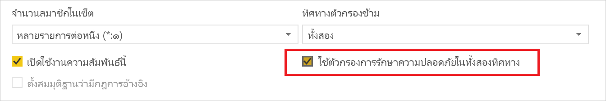
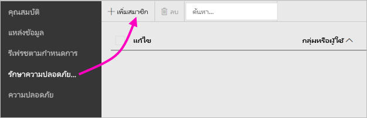
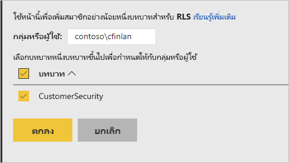
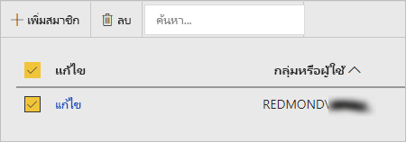

# การรักษาความปลอดภัยระดับแถว (RLS) ในเซิร์ฟเวอร์รายงาน Power BI

การตั้งค่าความปลอดภัยระดับแถว (RLS) กับเซิร์ฟเวอร์รายงาน Power BI สามารถจำกัดการเข้าถึงข้อมูลสำหรับผู้ใช้ที่กำหนด ตัวกรองจำกัดการเข้าถึงข้อมูลในระดับแถว และคุณสามารถกำหนดตัวกรองภายในบทบาทได้  หากคุณใช้การอนุญาตเริ่มต้นในเซิร์ฟเวอร์รายงาน Power BI ผู้ใช้ใด ๆ ที่มีสิทธิ์ผู้เผยแพร่หรือตัวจัดการเนื้อหาสำหรับรายงาน Power BI สามารถกำหนดสมาชิกให้กับบทบาทสำหรับรายงานนั้น    

คุณสามารถกำหนดค่า RLS สำหรับรายงานที่นำเข้าไปยัง Power BI ด้วย Power BI Desktop คุณยังสามารถกำหนดค่า RLS บนรายงานที่ใช้ DirectQuery เช่น SQL Server ได้อีกด้วย  โปรดทราบว่า RLS จะไม่ปฏิบัติตามหากการเชื่อมต่อ DirectQuery ของคุณใช้การตรวจสอบสิทธิ์แบบรวมสำหรับโปรแกรมอ่านรายงาน ในส่วนการเชื่อมต่อสดของ Analysis Services คุณสามารถกำหนดค่ารักษาความปลอดภัยระดับแถวบนแบบจำลองภายในองค์กรได้ ตัวเลือกความปลอดภัยจะไม่แสดงสำหรับชุดข้อมูลที่เชื่อมต่อสด 

[!INCLUDE [rls-desktop-define-roles](../includes/rls-desktop-define-roles.md)]

## การกรองแบบข้ามสองทิศทาง

ตามค่าเริ่มต้น การกรอง row-level security จะใช้ตัวกรองทิศทางเดียว โดยไม่คำนึงว่าการตั้งค่าความสัมพันธ์เป็นแบบทิศทางเดียวหรือสองทิศทาง คุณสามารถเปิดใช้งานการกรองแบบข้ามสองทิศทาง ด้วยความปลอดภัยระดับแถวด้วยตนเองได้

- เลือกความสัมพันธ์ และทำเครื่องหมายบนกล่องกาเครื่องหมาย **ใช้ตัวกรองความปลอดภัยในทั้งสองทิศทาง** 

    

ทำเครื่องหมายที่ช่องนี้เมื่อใช้งาน[การรักษาความปลอดภัยระดับแถวแบบไดนามิก](https://docs.microsoft.com/analysis-services/tutorial-tabular-1200/supplemental-lesson-implement-dynamic-security-by-using-row-filters)ตามชื่อผู้ใช้หรือรหัสล็อกอิน 

เพื่อเรียนรู้เพิ่มเติม ดูที่[ตัวกรองไขว้แบบสองทิศทางที่ใช้ DirectQuery ใน Power BI Desktop](../transform-model/desktop-bidirectional-filtering.md)และบทความเชิงเทคนิคของ[การรักษาความปลอดภัยแบบลำจองภาษา BI แบบตาราง](https://download.microsoft.com/download/D/2/0/D20E1C5F-72EA-4505-9F26-FEF9550EFD44/Securing%20the%20Tabular%20BI%20Semantic%20Model.docx)

[!INCLUDE [rls-desktop-view-as-roles](../includes/rls-desktop-view-as-roles.md)]

## เพิ่มสมาชิกไปยังบทบาท 

หลังจากคุณบันทึกรายงานของคุณใน Power BI Report Server แล้วคุณจะจัดการความปลอดภัยและเพิ่มหรือลบสมาชิกบนเซิร์ฟเวอร์ได้ เฉพาะผู้ใช้ที่ มีสิทธิ์ผู้เผยแพร่หรือผู้จัดการเนื้อหาสำหรับรายงานที่มีตัวเลือกการรักษาความปลอดภัยระดับแถวพร้อมใช้งานและไม่เป็นสีเทาเท่านั้น

 ถ้ารายงานไม่มีบทบาทจำเป็น คุณจำเป็นเมื่อต้องเปิดใน Power BI Desktop เพิ่มหรือปรับเปลี่ยนบทบาท จาก นั้นบันทึกกลับไปยังเซิร์ฟเวอร์รายงาน Power BI 

1. ใน Power BI Desktop บันทึกรายงานไปยังเซิร์ฟเวอร์รายงาน Power BI คุณจะต้องมีเวอร์ชั่น Power BI Desktop ที่ปรับให้เหมาะสำหรับเซิร์ฟเวอร์รายงาน Power BI
2. ในบริการ Power BI รายงาน เลือกจุดไข่ปลา ( **...** ) ถัดจากรายงาน 

3. เลือก**จัดการ** > **ความปลอดภัยระดับแถว** 

     

    บนหน้า **การรักษาความปลอดภัยระดับแถว** คุณสามารถเพิ่มสมาชิกบทบาทที่คุณสร้างขึ้นใน Power BI Desktop ได้

5. เมื่อต้องเพิ่มสมาชิก เลือก**เพิ่มสมาชิก**

1. ป้อนผู้ใช้หรือกลุ่มในกล่องข้อความในรูปแบบชื่อผู้ใช้ (DOMAIN\user) และเลือกบทบาทที่คุณต้องการกำหนดให้กับพวกเขา สมาชิกรายนี้จะต้องอยู่ภายในองค์กรของคุณ   

    

    ทั้งนี้ขึ้นอยู่กับวิธีที่คุณตั้งค่า Active Directory ไว้ การป้อนชื่อผู้ใช้หลักที่นี่ก็ใช้ได้ ในกรณีนั้น เซิร์ฟเวอร์รายงานจะแสดงชื่อผู้ใช้ที่เกี่ยวข้องในรายการ

1. คลิก**ตกลง**เพื่อนำไปใช้   

8. หากต้องการลบสมาชิก ให้ทำเครื่องหมายที่ช่องถัดจากชื่อและเลือก **ลบ**  คุณสามารถลบสมาชิกหลายคนพร้อมกันได้ 

    

## username () และ userprincipalname ()

คุณสามารถใช้ประโยชน์จากฟังก์ชัน DAX username() หรือ userprincipalname() ภายในชุดข้อมูลของคุณได้ คุณสามารถใช้กับนิพจน์ใน Power BI Desktop ได้ เมื่อคุณเผยแพร่โมเดลของคุณ เซิร์ฟเวอร์ Power BI Report จะใช้โมเดลเหล่านั้น

ภายใน Power BI Desktop username() จะส่งผู้ใช้กลับในรูปแบบของ DOMAIN\User และ userprincipalname() จะส่งผู้ใช้กลับในรูปแบบของ user@contoso.com

ภายในเซิร์ฟเวอร์รายงาน Power BI ชื่อผู้ใช้ () และ userprincipalname () ทั้งคู่ส่งคืนชื่อผู้ใช้หลัก (UPN) ของผู้ใช้ซึ่งคล้ายกับที่อยู่อีเมล

หากคุณใช้การรับรองความถูกต้องที่กำหนดเองใน Power BI Report Server จะส่งคืนรูปแบบชื่อผู้ใช้ที่คุณตั้งค่าสำหรับผู้ใช้  

## ข้อจำกัด 

นี่คือข้อจำกัดในปัจจุบันสำหรับการรักษาความปลอดภัยระดับแถวในโมเดล Power BI 

ผู้ใช้ที่มีรายงานโดยใช้ชื่อผู้ใช้ () ฟังก์ชั่น DAX จะสังเกตเห็นพฤติกรรมใหม่ในขณะนี้ซึ่งชื่อผู้ใช้หลัก (UPN) จะถูกส่งคืนยกเว้นเมื่อใช้ DirectQuery กับการรักษาความปลอดภัยแบบรวม  เนื่องจาก RLS ไม่ได้ปฏิบัติตามในสถานการณ์นั้น ลักษณะการทำงานในสถานการณ์นั้นจะไม่เปลี่ยนแปลง

คุณสามารถกำหนด RLS บนชุดข้อมูลที่สร้างขึ้นด้วย Power BI Desktop เท่านั้น เพื่อเปิดใช้งาน RLS สำหรับชุดข้อมูลที่สร้างขึ้นโดยใช้ Excel คุณจะต้องแปลงไฟล์ของคุณให้เป็นไฟล์ Power BI Desktop (PBIX) ก่อน เรียนรู้เพิ่มเติมเกี่ยวกับ[การแปลงแฟ้ม Excel](../connect-data/desktop-import-excel-workbooks.md)

เฉพาะการสกัด แปลง และโหลดข้อมูล (ETL) และการเชื่อมต่อ DirectQuery โดยใช้ข้อมูลประจำตัวจะได้รับการสนับสนุน การเชื่อมต่อแบบสดไปยังบริการการวิเคราะห์และการเชื่อมต่อ DirectQuery โดยใช้การรับรองความถูกต้องแบบรวมถูกจัดการในแหล่งข้อมูลพื้นฐาน 

ถ้าคุณกำลังใช้การรักษาความปลอดภัยแบบรวมกับ DirectQuery แล้วผู้ใช้ของคุณอาจสังเกตเห็น:
- RLS ถูกปิดใช้งาน และข้อมูลทั้งหมดจะถูกส่งกลับ
- ผู้ใช้ไม่สามารถอัปเดตการกำหนดบทบาทและรับข้อผิดพลาดในหน้า RLS Manage ได้
- สำหรับฟังก์ชั่นชื่อผู้ใช้ DAX คุณจะได้รับชื่อผู้ใช้เป็น DOMAIN \ USER ต่อไป 

ผู้เขียนรายงานไม่มีสิทธิ์เข้าถึงเพื่อดูข้อมูลรายงานใน Power BI Report Server จนกว่าพวกเขาจะกำหนดบทบาทให้ตัวเองหลังจากอัปโหลดรายงานแล้ว 

 

## คำถามที่ถามบ่อย 

### ฉันสามารถสร้างบทบาทเหล่านี้สำหรับแหล่งข้อมูล Analysis Services ได้หรือไม่ 

คุณสามารถสร้างได้ถ้าคุณนำเข้าข้อมูลลงใน Power BI Desktop ถ้าคุณกำลังใช้ข้อมูลแบบ live connection คุณไม่สามารถกำหนดค่า RLS ภายในบริการ Power BI RLS จะได้รับการกำหนดภายใน Analysis Services แบบจำลองภายในองค์กร 

### ฉันสามารถใช้ RLS เพื่อจำกัดคอลัมน์หรือหน่วยวัดที่สามารถเข้าถึงโดยผู้ใช้ของฉันได้หรือไม่ 

หมายเลข ถ้าผู้ใช้มีสิทธิ์เข้าถึงแถวเฉพาะของข้อมูล พวกเขาสามารถเห็นคอลัมน์ทั้งหมดของข้อมูลสำหรับแถวนั้น 

### RLS อนุญาตให้ฉันซ่อนข้อมูลรายละเอียด แต่ให้สิทธิ์การเข้าถึงข้อมูลที่สรุปไว้ในภาพหรือไม่? 

ไม่ ถึงแม่ว่าคุณรักษาข้อมูลของแต่ละแถว แต่ผู้ใช้สามารถดูรายละเอียดหรือข้อมูลสรุปได้ตลอดเวลา 

### ฉันสามารถเพิ่มบทบาทใหม่ใน Power BI Desktop ได้หรือไม่ถ้าฉันมีบทบาทและสมาชิกที่กำหนดอยู่แล้ว? 

ใช่ ถ้าคุณมีการกำหนดบทบาทที่มีอยู่แล้วและสมาชิกที่ได้รับมอบหมายใน Power BI Report Server คุณสามารถสร้างบทบาทเพิ่มเติมและเผยแพร่รายงานของคุณโดยไม่มีผลกับการมอบหมายปัจจุบัน 
 

## ขั้นตอนถัดไป

[เซิร์ฟเวอร์รายงาน Power BI คืออะไร](get-started.md) 
[ภาพรวมของผู้ดูแลระบบ](admin-handbook-overview.md)  

มีคำถามเพิ่มเติมหรือไม่ [ลองถามชุมชน Power BI](https://community.powerbi.com/)

