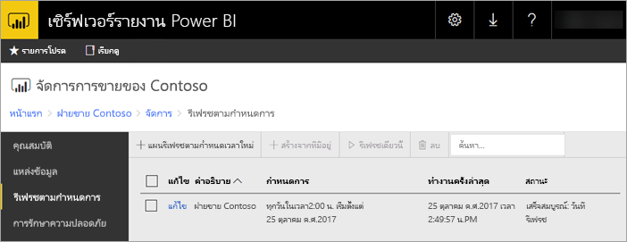

# รายงาน Power BI รีเฟรชตามกำหนดการในเซิร์ฟเวอร์รายงาน Power BI
การรีเฟรชตามกำหนดการสำหรับรายงาน Power BI จะช่วยให้ข้อมูลสำหรับรายงานได้รับการอัปเดตอยู่เสมอ

การรีเฟรชตามกำหนดการจะใช้เฉพาะกับรายงาน Power BI ที่มีแบบจำลองที่ฝัง ซึ่งหมายความว่า คุณนำเข้าข้อมูลลงในรายงานแทนการใช้การเชื่อมต่อแบบรายงานสดหรือ DirectQuery เมื่อนำเข้าข้อมูลของคุณ จซึ่งะไม่ได้เชื่อมต่อจากแหล่งข้อมูลต้นฉบับ และจำเป็นต้องอัปเดตเพื่อทำให้ข้อมูลใหม่อยู่เสมอ การรีเฟรชตามกำหนดการเป็นวิธีที่จะทำให้ข้อมูลของคุณอัปเดตอยู่เสมอ

การรีเฟรชตามกำหนดการได้รับการกำหนดค่าภายในส่วนการจัดการของรายงาน สำหรับข้อมูลเพิ่มเติมเกี่ยวกับวิธีการกำหนดค่าการรีเฟรชตามกำหนดการ ดูที่[วิธีการกำหนดค่าการรีเฟรชตามกำหนดการของรายงาน Power BI](configure-scheduled-refresh.md)

## วิธีการทำงาน
มีส่วนประกอบมากมายที่เกี่ยวข้องเมื่อมีการใช้การรีเฟรชตามกำหนดการสำหรับรายงาน Power BI ของคุณ

* SQL Server Agent เป็นตัวจับเวลาการสร้างเหตุการณ์ตามกำหนดการ
* งานที่กำหนดจะถูกเพิ่มลงในคิวของเหตุการณ์และการแจ้งเตือนในฐานข้อมูลเซิร์ฟเวอร์รายงาน ในการใช้งาน scale-out คิวจะได้รับการแชร์ทั่วทั้งเซิร์ฟเวอร์รายงานทั้งหมดในการใช้งาน
* การประมวลผลรายงานทั้งหมดที่เกิดขึ้นเนื่องจากผลลัพธ์ของกำหนดการเหตุการณ์ทำหน้าที่เป็นกระบวนการพื้นหลัง
* โหลดแบบจำลองข้อมูลภายในอินสแตนซ์ Analysis Services
* สำหรับบางแหล่งข้อมูล กลไกจัดการโต้ตอบกับผู้ใช้ Power Query ถูกใช้เพื่อเชื่อมต่อกับแหล่งข้อมูล และแปลงข้อมูล แหล่งข้อมูลอื่นๆอาจเชื่อมต่อโดยตรงจากบริการ Analysis Services ที่ใช้สำหรับการโฮสต์แบบจำลองข้อมูลสำหรับเซิร์ฟเวอร์รายงาน Power BI
* โหลดข้อมูลใหม่ลงในแบบจำลองข้อมูลภายใน Analysis Services
* Analysis Services ประมวลผลข้อมูล และดำเนินการการคำนวณที่จำเป็นต่างๆ

เซิร์ฟเวอร์รายงาน power BI จะรักษาคิวของเหตุการณ์สำหรับการดำเนินการที่กำหนดไว้ทั้งหมด ซึ่งจะทำการสำรวจคิวตามเวลาปกติเพื่อตรวจสอบเหตุการณ์ใหม่ ตามค่าเริ่มต้น คิวจะได้รับการสแกนที่ช่วงเวลา 10 วินาที คุณสามารถเปลี่ยนช่วงเวลาโดยการปรับเปลี่ยน**PollingInterval**, **IsNotificationService**และ**IsEventService**ตั้งค่าการกำหนดค่าในตัวไฟล์ RSReportServer.config **IsDataModelRefreshService**ยังสามารถใช้เพื่อตั้งค่าว่ากระบวนการของเซิร์ฟเวอร์รายงานกำหนดเหตุการณ์ไว้หรือไม่

### Analysis Services
สร้างรายงาน Power BI รวมถึงการดำเนินการรีเฟรชตามกำหนดการ จำเป็นต้องโหลดแบบจำลองข้อมูลของรายงาน Power BI ใน Analysis Services กระบวนการ Analysis Services จะทำงานร่วมกับเซิร์ฟเวอร์รายงาน Power BI Report

## ข้อควรพิจารณาและข้อจำกัด
### เมื่อไม่สามารถใช้การรีเฟรชตามกำหนดการ
รายงาน Power BI ทั้งหมดไม่สามารถมีแผนการรีเฟรชตามกำหนดการที่ถูกสร้างขึ้นบนรายงานเหล่านั้น รายการต่อไปนี้คือรายงาน Power BI ที่คุณไม่สามารถสร้างแผนการรีเฟรชตามกำหนดการได้

* รายงานของคุณประกอบด้วยแหล่งข้อมูล Analysis Services อย่างน้อยหนึ่งแหล่งที่ใช้การเชื่อมต่อแบบรายงานสด
* รายงานของคุณประกอบด้วยแหล่งข้อมูลอย่างน้อยหนึ่งแหล่งที่ใช้ DirectQuery
* รายงานของคุณไม่มีแหล่งข้อมูล ตัวอย่างเช่น ข้อมูลที่ป้อนด้วยตนเองผ่านทาง*ป้อนข้อมูล*หรือรายงานมีเนื้อหาแบบค่าคงที่เท่านั้น เช่น รูปภาพ ข้อความ และอื่นๆ

นอกเหนือจากรายการด้านบน ยังมีสถานการณ์เฉพาะที่มีแหล่งข้อมูลในโหมด*นำเข้า* ที่คุณไม่สามารถสร้างแผนการรีเฟรชได้

* ถ้าแหล่งข้อมูล*ไฟล์*หรือ*โฟลเดอร์* ถูกใช้และเส้นทางของไฟล์เป็นเส้นทางท้องถิ่น (เช่น C:\Users\user\Documents), แผนการรีเฟรชจะไม่สามารถสร้างได้ เส้นทางจะต้องเป็นเส้นทางที่เซิร์ฟเวอร์รายงานสามารถเชื่อมต่อเหมือนกับการแชร์เครือข่าย ตัวอย่างเช่น *\\myshare\Documents*
* ถ้าแหล่งข้อมูลสามารถเชื่อมต่อโดยใช้เฉพาะ OAuth (ตัวอย่างเช่น Facebook, Google Analytics, Salesforce และอื่นๆ), แผนการรีเฟรช cache จะไม่สามารถสร้างได้ ในขณะนี้ RS ไม่สนับสนุนการรับรองความถูกต้อง OAuth สำหรับแหล่งข้อมูลใดๆ ไม่ว่าจะเป็นสำหรับแบ่งหน้า เคลื่อนที่ หรือรายงาน Power BI

### ขีดจำกัดหน่วยความจำ
ปริมาณงานแบบดั้งเดิมสำหรับเซิร์ฟเวอร์รายงานเหมือนกับเว็บแอปพลิเคชัน ความสามารถในการอัปโหลดรายงานที่มีข้อมูลที่นำเข้า หรือ DirectQuery และความสามารถในการดำเนินการรีเฟรชตามกำหนดการ ขึ้นอยู่กับอินสแตนซ์ Analysis Services ที่ถูกโฮสต์ควบคู่ไปกับเซิร์ฟเวอร์รายงาน จากผลที่ได้อาจทำให้เกิดความดันหน่วยความจำที่ไม่คาดคิดบนเซิร์ฟเวอร์ วางแผนการใช้งานเซิร์ฟเวอร์ของคุณให้สอดคล้องกับ Analysis Services ที่อาจจะสามารถใช้หน่วยความจำควบคู่ไปกับเซิร์ฟเวอร์รายงาน

สำหรับข้อมูลเกี่ยวกับวิธีการตรวจสอบอินสแตนซ์ Analysis Services ดูที่[ตรวจสอบอินสแตนซ์ Analysis Services](https://docs.microsoft.com/sql/analysis-services/instances/monitor-an-analysis-services-instance)

สำหรับข้อมูลเกี่ยวกับการตั้งค่าหน่วยความจำภายใน Analysis Services ดู[คุณสมบัติหน่วยความจำ](https://docs.microsoft.com/sql/analysis-services/server-properties/memory-properties)

## ขั้นตอนถัดไป
กำหนดค่า[การรีเฟรชตามกำหนดการ](configure-scheduled-refresh.md)ในรายงาน Power BI

คุณมีคำถามเพิ่มเติมหรือไม่ [ลองถามชุมชน Power BI](https://community.powerbi.com/)

