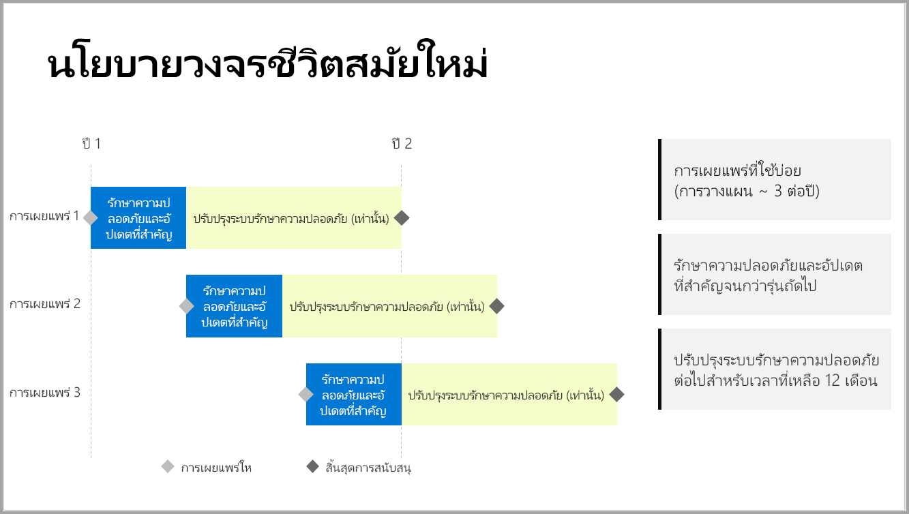

# การสนับสนุนเบราว์เซอร์สำหรับ Power BI Report Server

Power BI Report Server เผยแพร่เพียงไม่กี่ครั้งต่อปี ความปลอดภัยและการอัปเดตที่สำคัญมีพร้อมใช้งานจนกว่าการเผยแพร่ถัดไปจะพร้อมใช้งานโดยทั่วไป (GA) หลังจากการเผยแพร่ถัดไป การเผยแพร่ก่อนหน้าจะยังคงได้รับการอัปเดตความปลอดภัยสำหรับส่วนที่เหลือของช่วงอายุการเผยแพร่ 12 เดือน

นโยบายสนับสนุนนี้ช่วยให้เราส่งมอบนวัตกรรมให้แก่ลูกค้าในอัตราที่รวดเร็วในขณะที่ยังมีความยืดหยุ่นสำหรับลูกค้าเพื่อปรับใช้นวัตกรรมตามความเร็วของตน

* ระยะให้บริการด้านความปลอดภัยและการอัปเดตที่สำคัญ - เมื่อเรียกใช้ Power BI Report Server เวอร์ชันล่าสุดที่เป็นปัจจุบัน คุณจะได้รับทั้งความปลอดภัยและการอัปเดตที่สำคัญ
* ระยะให้บริการอัปเดตความปลอดภัย (เท่านั้น) - หลังจากที่มีการเผยแพร่เวอร์ชันใหม่ การสนับสนุนเวอร์ชันที่เก่ากว่าจะลดลงเหลือเพียงการอัปเดตความปลอดภัยสำหรับช่วงอายุการสนับสนุน 12 เดือนที่เหลือ (แสดงในรูปภาพ 1)

    

## ประวัติเวอร์ชั่น

| **เวอร์ชัน** | **วันที่พร้อมใช้งาน** | **วันที่สิ้นสุดการสนับสนุน** |
| --- | --- | --- |
| มิถุนายน 2017 |12 มิถุนายน 2017 |ไม่สนับสนุนอีกต่อไป |
| ตุลาคม 2017 |31 ตุลาคม 2017 | ไม่สนับสนุนอีกต่อไป |
| มีนาคม 2018 | 19 มีนาคม 2018 | 19 มีนาคม 2019 |
| สิงหาคม 2018 | 15 สิงหาคม 2018 | 15 สิงหาคม 2019 |
| มกราคม 2019 | 23 มกราคม 2019 | 23 มกราคม 2020 |

เมื่อต้องการดาวน์โหลด Power BI Report Server และ Power BI Desktop ซึ่งปรับให้เหมาะสมที่สุดกับ Power BI Report Server ไปที่ [การรายงานภายในองค์กรกับ Power BI Report Server](https://powerbi.microsoft.com/report-server/)

## ขั้นตอนถัดไป
[มีอะไรใหม่ใน Power BI Report Server](whats-new.md)  
[เซิร์ฟเวอร์รายงาน Power BI คืออะไร](get-started.md)
[ภาพรวมของผู้ดูแลระบบ](admin-handbook-overview.md)  
[ติดตั้ง Power BI Report Server](install-report-server.md)  

มีคำถามเพิ่มเติมหรือไม่? [ลองถามชุมชน Power BI](https://community.powerbi.com/)