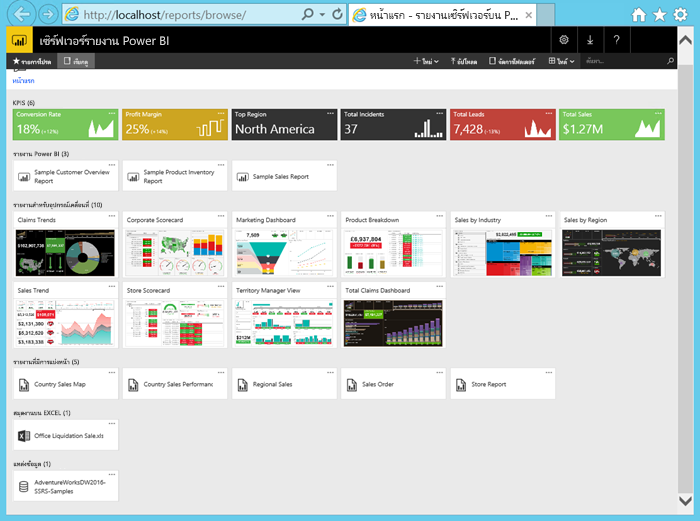

# บทช่วยสอน: สำรวจพอร์ทัลเว็บ Power BI Report Server ใน VM
ในบทช่วยสอนนี้ คุณสร้างเครื่องเสมือน Azure ที่มีการติดตั้ง Power BI Report Server ไว้แล้วได้ ดังนั้นคุณสามารถดู แก้ไข และจัดการตัวอย่าง Power BI และรายงานที่มีการแบ่งหน้า และ KPI ได้

นี่คืองานที่คุณต้องทำในบทช่วยสอนนี้:

> [!div class="checklist"]
> * สร้างและเชื่อมต่อกับ VM
> * เริ่มและสำรวจพอร์ทัลเว็บ Power BI Report Server
> * ติดแท็กรายการที่คุณชื่นชอบ
> * ดูและแก้ไขรายงาน Power BI
> * ดู จัดการ และแก้ไขรายงานที่มีการแบ่งหน้า
> * ดูเวิร์กบุ๊ก Excel ใน Excel Online

สำหรับบทช่วยสอนนี้ คุณจำเป็นต้องมีการสมัครใช้งาน Azure ถ้าคุณยังไม่มีการสมัครใช้งาน Azure สร้าง[บัญชีฟรี](https://azure.microsoft.com/free/?WT.mc_id=A261C142F)ก่อนที่คุณจะเริ่ม

## สร้าง Power BI Report Server VM

โชคดีที่ทีม Power BI ได้สร้าง VM ที่มาพร้อมกับ Power BI Report Server แบบติดตั้งไว้แล้ว

1. ใน Azure Marketplace เลือกเซิร์ฟเวอร์รายงาน Power BI ลิงก์นี้จะเปิดขึ้นโดยตรง: [เซิร์ฟเวอร์รายงาน Power BI](https://azuremarketplace.microsoft.com/marketplace/apps/reportingservices.technical-preview?tab=Overview)  

2. เลือก**รับทันที**
3. ในการยอมรับข้อตกลงการใช้งานและนโยบายความเป็นส่วนตัวของผู้ให้บริการ เลือก**ดำเนินการต่อ**

4. เลือก **สร้าง**

    

5. ใน**ขั้นตอนที่ 1 ข้อมูลพื้นฐาน** สำหรับ**ชื่อ VM** เรียกว่า**reportservervm**

    ชื่อ Power BI Report Server VM ไม่สามารถมีเครื่องหมายขีดคั่นได้

5. สร้างชื่อผู้ใช้และรหัสผ่าน

6. สำหรับ**กลุ่มทรัพยากร** เลือก**สร้างใหม่**ต่อไป และเรียกว่า**reportserverresourcegroup** > **ตกลง**

    ถ้าคุณเลื่อนผ่านบทช่วยสอนมากกว่าหนึ่งครั้ง คุณจำเป็นต้องตั้งชื่อกลุ่มทรัพยากรเป็นชื่ออื่นหลังจากครั้งแรก คุณไม่สามารถใช้ชื่อกลุ่มทรัพยากรเดียวกันสองครั้งในการสมัครใช้งานหนึ่ง 

    

7. ใช้ค่าเริ่มต้นอื่น ๆ ต่อไป > **ตกลง**

8. ใน **ขั้นตอนที่ 2 การตั้งค่า** ใช้ค่าเริ่มต้นต่อไป > **ตกลง**
 
    บัญชี **ที่เก็บข้อมูล SQL** และ**ค่าบัญชีที่เก็บข้อมูลการวินิจฉัย**ต้องไม่ซ้ำกัน ถ้าคุณเลื่อนผ่านบทช่วยสอนมากกว่าหนึ่งครั้ง คุณจำเป็นต้องตั้งเป็นชื่ออื่น

9. ใน**สรุปขั้นตอนที่ 3**ตรวจสอบการเลือกของคุณ >**ตกลง**

10. ใน **ขั้นตอนซื้อที่ 4** ตรวจทานข้อกำหนดของนโยบายผู้ใช้และความเป็นส่วนตัว > **สร้าง**

    กระบวนการ**ส่งการปรับใช้สำหรับเซิร์ฟเวอร์รายงาน Power BI** อาจใช้เวลาหลายนาที

## เชื่อมต่อกับเครื่องเสมือนของคุณ

1. ในแผงนำทาง Azure ให้เลือก**เครื่องเสมือน** 

2. ในกล่อง**กรองตามชื่อ** พิมพ์ "รายงาน" 

3. เลือก VM ที่ชื่อว่า **REPORTSERVERVM**

    

4. ใต้เครื่องเสมือน REPORTSERVERVM เลือก**เชื่อมต่อ**

    

5. ในบานหน้าต่าง**เชื่อมต่อกับเครื่องเสมือน**ให้เก็บค่าเริ่มต้นและเลือก**ดาวน์โหลดไฟล์ RDP**

1. ในกล่องโต้ตอบการ**เชื่อมต่อเดสก์ท็อประยะไกล** เลือก**เชื่อมต่อ**

6. ใส่ชื่อและรหัสผ่านที่คุณสร้างขึ้นสำหรับการ VM > **ตกลง**

7. กล่องโต้ตอบถัดไประบุว่า**ไม่สามารถระบุข้อมูลประจำตัวของคอมพิวเตอร์ระยะไกลได้** เลือก**ใช่**

   Voila, VM ใหม่ของคุณเปิดขึ้น

## เซิร์ฟเวอร Power BI Report บน VM

เมื่อ VM ของคุณเปิดขึ้น ต่อไปนี้คือรายการที่คุณเห็นบนเดสก์ท็อป

|ตัวเลข  |คืออะไร  |
|---------|---------|
| | รายงาน Power BI ตัวอย่าง (.PBIX) |
| | ลิงก์ไปยังเอกสารประกอบเซิร์ฟเวอร์รายงาน Power BI |
| | เริ่มต้น Power BI Desktop ที่ปรับให้เหมาะสมสำหรับเซิร์ฟเวอร์รายงาน Power BI (มกราคม 2019) |
| | พอร์ทัลเว็บเซิร์ฟเวอร์รายงาน Power BI เปิดขึ้นในเบราว์เซอร์ |
| | เริ่มต้นเครื่องมือข้อมูล SQL Server สำหรับสร้างรายงานที่มีการแบ่งหน้า (.RDL) |

ดับเบิลคลิกที่ไอคอน**พอร์ทัลเว็บเซิร์ฟเวอร์รายงาน** เบราว์เซอร์เปิดขึ้น`https://localhost/reports/browse` ในพอร์ทัลเว็บคุณจะเห็นไฟล์ต่าง ๆ ที่ถูกจัดกลุ่มแยกตามประเภท 

|ตัวเลข  |คืออะไร  |
|---------|---------|
| | KPI ที่สร้างขึ้นในพอร์ทัลเว็บ |
| |  รายงาน Power BI (.PBIX)  |
| | รายงานมือถือที่สร้างขึ้นใน SQL Server Mobile Report Publisher  |
| |  รายงานที่มีการแบ่งหน้าที่สร้างขึ้นในตัวสร้างรายงานหรือเครื่องมือข้อมูล SQL Server  |
| | เวิร์กบุ๊ก Excel   | 
| | แหล่งข้อมูลสำหรับรายงานที่มีการแบ่งหน้า | 

## แท็กรายการโปรดของคุณ
คุณสามารถแท็กรายงานและ KPI ที่คุณต้องการทำให้เป็นรายการโปรด ง่ายต่อการค้นหาเนื่องจากทั้งหมดถูกรวบรวมไว้ในโฟลเดอร์รายการโปรดเดียว ทั้งในพอร์ทัลของเว็บ และในแอป Power BI สำหรับอุปกรณ์เคลื่อนที่ 

1. เลือกจุดไข่ปลา ( **...** ) ที่มุมขวาบนของ**อัตราผลกำไร** KPI > **เพิ่มไปยังรายการโปรด**
   
    
2. เลือก**รายการโปรด**บน Ribbon พอร์ทัลของเว็บเพื่อดูพร้อมกับรายการโปรดอื่นๆ ของคุณบนหน้ารายการโปรดในพอร์ทัลของเว็บ
   
    

3. เลือก**เรียกดู** เพื่อกลับไปยังพอร์ทัลเว็บ
   
## ดูรายการในมุมมองรายการ
ตามค่าเริ่มต้น พอร์ทัลของเว็บจะแสดงเนื้อหาในมุมมองไทล์

คุณสามารถสลับเป็นมุมมองรายการ ซึ่งเป็นเรื่องง่ายเมื่อต้องย้าย หรือลบหลายรายการในแต่ละครั้ง 

1. เลือก**รายการ** > **ไทล์**
   
    

2. ย้อนกลับไปยังมุมมองไทล์: เลือก**รายการ** > **ไทล์**

## รายงาน Power BI

คุณสามารถดูและโต้ตอบกับรายงาน Power BI ในพอร์ทัลเว็บ และเริ่มต้น Power BI Desktop ได้โดยตรงจากพอร์ทัลเว็บ

### ดูรายงาน Power BI

1. ในพอร์ทัลเว็บใต้**รายงาน Power BI** เลือก**รายงานภาพรวมของลูกค้าตัวอย่าง** รายงานเปิดขึ้นในเบราว์เซอร์

1. เลือกช่วงสหรัฐอเมริกาในแผนภูมิต้นไม้เพื่อดูวิธีดังกล่าวไฮไลต์ค่าที่เกี่ยวข้องในภาพอื่น

    

### แก้ไขใน Power BI Desktop

1. เลือก**แก้ไขใน Power BI Desktop**

1. เลือก**อนุญาต** เพื่ออนุญาตให้เว็บไซต์นี้เปิดโปรแกรมบนคอมพิวเตอร์ของคุณ 

     หน้ารายงานเปิดขึ้นใน Power BI Desktop โปรดสังเกตชื่อในแถบด้านบน "Power BI Desktop (มกราคม 2019)" นี่เป็นเวอร์ชันที่ปรับให้เหมาะสำหรับเซิร์ฟเวอร์รายงาน Power BI

    ใช้เวอร์ชัน Power BI Desktop ที่ติดตั้งไว้บน VM คุณไม่สามารถอัปโหลดรายงานข้ามโดเมนได้

3. ในบานหน้าต่างเขตข้อมูล ขยายตารางลูกค้าและลากเขตข้อมูลอาชีพไปยังตัวกรองระดับรายงาน

    

1. บันทึกรายงาน

1. กลับไปยังรายงานในเบราว์เซอร์แล้วเลือกไอคอน**รีเฟรช**เบราว์เซอร์

    

8. ขยายบานหน้าต่าง**ตัวกรอง**ทางด้านขวาเพื่อดูตัวกรอง**อาชีพ**ที่คุณเพิ่ม เลือก **Professional**

    

3. เลือก**เรียกดู** เพื่อกลับไปยังพอร์ทัลเว็บ

## รายงานที่มีการแบ่งหน้า (.RDL)

คุณสามารถดูและจัดการรายงานที่มีการแบ่งหน้าและเปิดใช้ตัวสร้างรายงาน จากพอร์ทัลเว็บได้

### จัดการรายงานที่มีการแบ่งหน้า

1. ในพอร์ทัลเว็บใต้**รายงานที่มีการแบ่งหน้า** ให้เลือก **ตัวเลือกเพิ่มเติม** (...) ถัดจาก **ใบสั่งขาย** > **จัดการ**

1. เลือก**พารามิเตอร์** เปลี่ยนค่าเริ่มต้นสำหรับ **SalesOrderNumber** เป็น **SO50689** > **นำไปใช้**

   

3. เลือก**เรียกดู** เพื่อกลับไปยังพอร์ทัลเว็บ

### ดูรายงานที่มีการแบ่งหน้า

1. เลือก**ใบสั่งซื้อ**ในพอร์ทัลเว็บ
 
3.  คุณจะเห็นว่าเปิดไปยังพารามิเตอร์**คำสั่งซื้อ**ที่คุณตั้งค่า **SO50689** 

    

    คุณสามารถเปลี่ยนพารามิเตอร์ได้ที่นี่พร้อมกับพารามิเตอร์อื่น ๆ โดยไม่ต้องเปลี่ยนค่าเริ่มต้น

1. เลือก **คำสั่ง** **SO48339** > **ดูรายงาน**

4. คุณจะเห็นว่านี่คือหน้า 1 จาก 2 หน้า เลือกลูกศรขวาเพื่อดูหน้าที่สอง ตารางมีต่อไปยังหน้านั้น

    

5. เลือก**เรียกดู** เพื่อกลับไปยังพอร์ทัลเว็บ

### แก้ไขรายงานที่มีการแบ่งหน้า

คุณสามารถแก้ไขรายงานที่มีการแบ่งหน้าได้ในตัวสร้างรายงาน และคุณสามารถเริ่มตัวสร้างรายงานได้จากเบราว์เซอร์ดังกล่าว

1. ในพอร์ทัลเว็บ ให้เลือก **ตัวเลือกเพิ่มเติม** (...) ถัดจาก **ใบสั่งขาย** > **แก้ไขในตัวสร้างรายงาน**

1. เลือก**อนุญาต** เพื่ออนุญาตให้เว็บไซต์นี้เปิดโปรแกรมบนคอมพิวเตอร์ของคุณ

1. รายงานใบสั่งซื้อเปิดขึ้นในมุมมองออกแบบในตัวสร้างรายงาน

    

1. เลือก**เรียกใช้** เพื่อแสดงตัวอย่างรายงาน

    

5. ปิดตัวสร้างรายงานและย้อนกลับไปยังเบราว์เซอร์

## ดูเวิร์กบุ๊ก Excel

คุณสามารถดูและโต้ตอบกับเวิร์กบุ๊ก Excel ได้ใน Excel Online ในเซิร์ฟเวอร์รายงาน Power BI 

1. เลือกเวิร์กบุ๊ก Excel **Office Liquidation Sale.xlsx** ระบบอาจขอให้กรอกข้อมูลประจำตัว เลือก**ยกเลิก** 
    จะเปิดขึ้นในพอร์ทัลเว็บ
1. เลือก**อุปกรณ์**ในตัวแบ่งส่วนข้อมูล

    

1. เลือก**เรียกดู** เพื่อกลับไปยังพอร์ทัลเว็บ

## ล้างแหล่งข้อมูล

ตอนนี้คุณได้เรียนรู้บทช่วยสอนนี้เสร็จสิ้นแล้ว ลบกลุ่มทรัพยากร เครื่องเสมือน และแหล่งข้อมูลทั้งหมดที่เกี่ยวข้อง 

- เมื่อต้องการทำเช่นนั้น เลือกกลุ่มทรัพยากรสำหรับ VM และเลือก**ลบ**

## ขั้นตอนถัดไป

ในบทช่วยสอนนี้คุณได้สร้าง VM ด้วยเซิร์ฟเวอร์รายงาน Microsoft Power BI คุณได้ลองใช้ฟังก์ชันการทำงานของพอร์ทัลเว็บบางส่วน และคุณได้เปิดรายงาน Power BI และรายงานที่แบ่งหน้าในตัวแก้ไขที่เกี่ยวข้องแล้ว VM นี้มีการติดตั้งแหล่งข้อมูลของ SQL Server Analysis Services ดังนั้นคุณสามารถลองสร้าง Power BI และรายงานที่แบ่งหน้าของคุณเองได้ด้วยแหล่งข้อมูลเดียวกันเหล่านั้น 

เมื่อต้องการเรียนรู้เพิ่มเติมเกี่ยวกับการสร้างรายงานสำหรับเซิร์ฟเวอร์รายงาน Power BI ให้ไปต่อ

> [!div class="nextstepaction"]
> [สร้างรายงาน Power BI สำหรับเซิร์ฟเวอร์รายงาน Power BI](./quickstart-create-powerbi-report.md)

