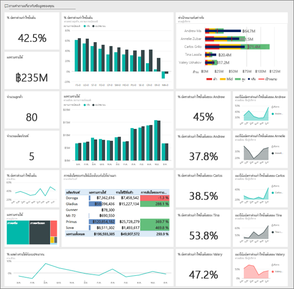
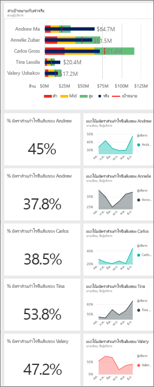
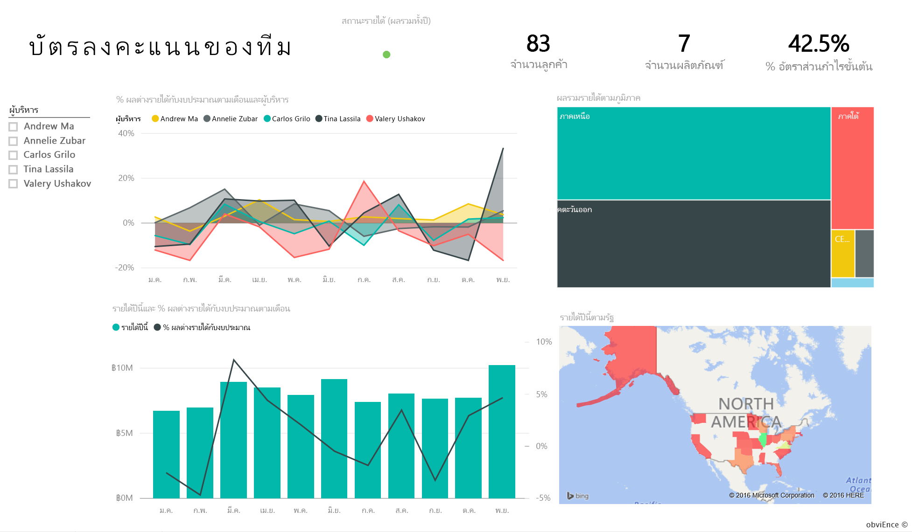
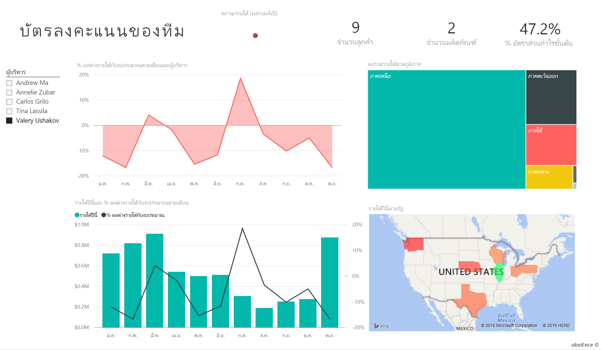
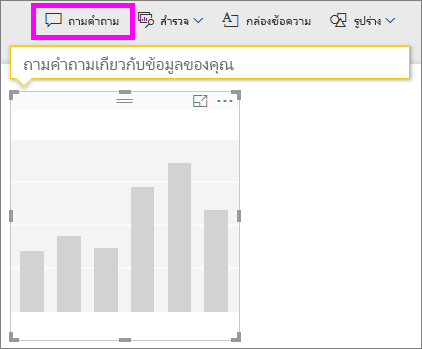
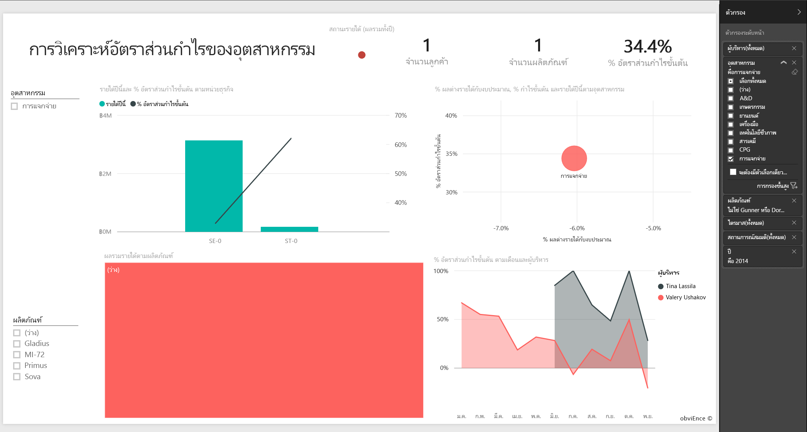
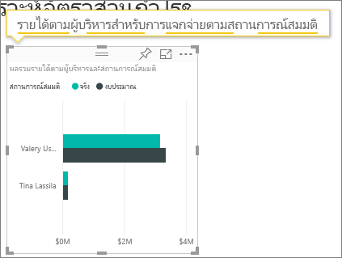

# ตัวอย่างความสามารถในการทำกำไรลูกค้าสำหรับ Power BI: ชมการแนะนำ

## ภาพรวมของตัวอย่างความสามารถในการทำกำไรลูกค้า
ชุดเนื้อหา "ตัวอย่างความสามารถในการทำกำไรลูกค้า" ประกอบด้วยแดชบอร์ด รายงาน และชุดข้อมูลสำหรับบริษัทที่ผลิตเอกสารทางการตลาด แดชบอร์ดนี้ถูกสร้างขึ้นโดย CFO เพื่อดูเมตริกสำคัญเกี่ยวกับผู้จัดการหน่วยธุรกิจ 5 ราย (หรือผู้บริการ) ผลิตภัณฑ์ ลูกค้า และอัตราส่วนกำไรขั้นต้น (GM) เธอมองเห็นปัจจัยที่ส่งผลต่อความสามารถในการทำกำไรได้ในทันที

ตัวอย่างนี้เป็นส่วนหนึ่งของชุดตัวอย่าง ที่แสดงให้เห็นวิธีการที่คุณสามารถใช้ Power BI กับข้อมูล รายงาน และแดชบอร์ดที่เกี่ยวข้องกับธุรกิจ นี่เป็นข้อมูลจริงจาก obviEnce ([www.obvience.com](http://www.obvience.com/)) ที่ตัวตนต่าง ๆ ได้ถูกลบออกไป ข้อมูลมีให้ใช้งานหลายรูปแบบ: ชุดเนื้อหา/แอป, เวิร์กบุ๊ก Excel, หรือไฟล์ Power BI Desktop .pbix ดู[ตัวอย่างชุดข้อมูล](sample-datasets.md)

## ข้อกำหนดเบื้องต้น
คุณต้องการทำตามหรือไม่? บทช่วยสอนนี้ใช้บริการของ Power BI และชุดเนื้อหาของตัวอย่าง "ความสามารถในการทำกำไรลูกค้า"  เนื่องจากประสบการณ์การใช้รายงานจะคล้ายคลึงกัน ดังนั้นคุณสามารถใช้ Power BI Desktop กับไฟล์ PBIX ตัวอย่างแทนได้ คำแนะนำสำหรับการเชื่อมต่อกับชุดเนื้อหาและไฟล์ PBIX จะอยู่ด้านล่าง

### รับชุดเนื้อหาสำหรับตัวอย่างนี้

1. เปิดบริการ Power BI (app.powerbi.com) และเข้าสู่ระบบ
2. ที่มุมด้านล่างซ้าย เลือก**รับข้อมูล**

    
3. บนหน้า รับข้อมูล ที่ปรากฏขึ้น เลือกไอคอน**ตัวอย่าง**

   
4. เลือก**ตัวอย่างความสามารถในการทำกำไรลูกค้า** แล้วเลือก**เชื่อมต่อ**  

   
5. Power BI นำเข้าชุดเนื้อหา และเพิ่มแดชบอร์ด รายงาน และชุดข้อมูลใหม่ไปยังพื้นที่ทำงานปัจจุบันของคุณ เนื้อหาใหม่จะถูกทำเครื่องหมายด้วยเครื่องหมายดอกจันสีเหลือง ใช้ตัวอย่างเหล่านี้ เพื่อนำ Power BI มาการทดสอบการใช้งาน  

   

### รับไฟล์ .pbix สำหรับตัวอย่างนี้

อีกทางเลือกหนึ่งคือ คุณสามารถดาวน์โหลดตัวอย่างเป็นไฟล์ .pbix ซึ่งถูกออกแบบมาสำหรับใช้กับ Power BI Desktop
[ตัวอย่างความสามารถในการทำกำไรลูกค้า](http://download.microsoft.com/download/6/A/9/6A93FD6E-CBA5-40BD-B42E-4DCAE8CDD059/Customer%20Profitability%20Sample%20PBIX.pbix)

### รับเวิร์กบุ๊ก Excel สำหรับตัวอย่างนี้

ถ้าคุณต้องการเจาะลึกลงในแหล่งข้อมูลสำหรับตัวอย่างนี้ ตัวอย่างนี้ยังมีให้ในรูปแบบ[(เวิร์กบุ๊ก Excel)](http://go.microsoft.com/fwlink/?LinkId=529781) เวิร์กบุ๊กประกอบด้วยแผ่นงาน Power View ที่คุณสามารถดู และปรับเปลี่ยน เมื่อต้องการดูข้อมูลดิบ เลือก**Power Pivot > จัดการ**

## แดชบอร์ดของเราบอกอะไรให้เราได้บ้าง?

ภายใต้ **พื้นที่ทำงานของฉัน** ค้นหาแดชบอร์ดสำหรับตัวอย่างความสามารถในการทำกำไรลูกค้า:

### ไทล์แดชบอร์ดระดับทั่วทั้งบริษัท
1. เปิดแดชบอร์ดในบริการ Power BI ไทล์แดชบอร์ดให้มุมมองเมตริกระดับสูงที่สำคัญของบริษัทแก่ CFO  เมื่อเธอเห็นสิ่งใดที่น่าสนใจ เธอสามารถเลือกไทล์เพื่อเจาะลึกลงในข้อมูลนั้นได้

2. ตรวจดูไทล์ที่อยู่ด้านซ้ายของแดชบอร์ด

    

- อัตราส่วนกำไรขั้นต้นของบริษัทเราคือ 42.5%
- เรามีลูกค้า 80 ราย
- เราขายผลิตภัณฑ์ที่แตกต่างกัน 5 ผลิตภัณฑ์
- เรามี % ความแปรปรวนของรายได้ต่ำที่สุด ในการจัดงบประมาณเดือนกุมภาพันธ์ ตามด้วยค่าสูงสุดของเราในเดือนมีนาคม
- ส่วนใหญ่ของรายได้ของเรามาจากภูมิภาคตะวันออกและเหนือ อัตราส่วนกำไรขั้นต้นไม่เคยเกินงบประมาณ โดยที่ ER-0 และ MA-0 จะต้องมีการตรวจสอบเพิ่มเติม
- รายได้รวมสำหรับปีใกล้เคียงกับงบประมาณ

### ไทล์แดชบอร์ดเฉพาะผู้จัดการ
ไทล์ทางด้านขวาของแดชบอร์ดมีดัชนีที่ชี้วัดทีม CFO จำเป็นต้องติดตามผู้จัดการของเธอ และไทล์เหล่านี้ให้ภาพรวมระดับสูงของกำไร – โดยใช้ GM% ถ้าแนวโน้มของ GM% เป็นแบบที่ไม่คาดคิดสำหรับผู้จัดการคนใดคนหนึ่ง เธอจะสามารถตรวจสอบเพิ่มเติมได้

- ผู้บริหารทั้งหมด ยกเว้น Carlos ทำยอดขายได้เกินเป้าหมายแล้ว แต่ยอดขายจริงของคุณ Carlos มีค่าสูงสุด
- GM% ของ Annelie มีค่าต่ำสุด แต่เราเห็นการค่อย ๆ เพิ่มขึ้นนับตั้งแต่เดือนมีนาคม
- ในทางกลับกัน Valery มีค่า GM% ของเธอลดลงอย่างมาก
- และ Andrew ก็มีปีที่ผันผวนมาก

## สำรวจข้อมูลพื้นฐานของแดชบอร์ด
แดชบอร์ดนี้มีไทล์ที่เชื่อมโยงไปยังรายงาน และเวิร์กบุ๊ก Excel

### เปิดแหล่งข้อมูล Excel Online
สองไทล์บนแดชบอร์ดนี้ "เป้าหมายเทียบกับค่าจริง" และ "การเติบโตของรายได้ปีต่อปี" ถูกปักหมุดจากเวิร์กบุ๊ก Excel ดังนั้น เมื่อคุณเลือกไทล์ใดไทล์หนึ่ง Power BI จะเปิดแหล่งข้อมูลซึ่งในกรณีนี้คือ Excel Online

1. เลือกไทล์ใดไทล์หนึ่งที่ถูกปักหมุดจาก Excel Excel Online เปิดขึ้นภายในบริการ Power BI
2. โปรดสังเกตว่า เวิร์กบุ๊ก มีข้อมูลทั้งหมด 3 แท็บ เปิด "รายได้"
3. เรามาดูว่าในทำไม Carlos ไม่สามารถทำตามเป้าหมายของเขาได้  
    a. จากแถบเลื่อน "ผู้บริหาร" เลือก**Carlos Grilo**   
    b. PivotTable แรกบอกเราว่ารายได้ของ Carlos สำหรับผลิตภัณฑ์อันดับหนึ่งของเขา ซึ่งก็คือ Primus ลดลง 152% เทียบกับปีที่แล้ว และแผนภูมิ YoY แสดงให้เห็นว่า เขาทำต่ำกว่างบประมาณในเดือนส่วนใหญ่  

    

    

4. สำรวจต่อไป และถ้าคุณพบบางสิ่งที่น่าสนใจ ให้เลือก **ปักหมุด**  จากมุมบนขวาเพื่อ [ปักหมุดไปยังแดชบอร์ด](service-dashboard-pin-tile-from-excel.md)

5. ใช้ปุ่มย้อนกลับของเบราว์เซอร์ของคุณเพื่อกลับไปยังแดชบอร์ด

### เปิดรายงาน Power BI พื้นฐาน
ไทล์ส่วนใหญ่บนแดชบอร์ดตัวอย่างความสามารถในการทำกำไรลูกค้า ถูกปักหมุดจาก รายงานตัวอย่างความสามารถในการทำกำไรลูกค้าอีกทีหนึ่ง

1. เลือกไทล์ใดไทล์หนึ่งเหล่านี้ เพื่อเปิดรายงานในมุมมองการอ่าน

2. รายงานมีอยู่ด้วยกัน 3 หน้า แต่ละแท็บที่ด้านล่างของรายงานแทนหน้า ๆ หนึ่ง

    

    * "ดัชนีชี้วัดทีม" มุ่งไปที่ประสิทธิภาพการทำงานของผู้จัดการ 5 คนและ "บัญชีของธุรกิจ" ของพวกเขา
    * "การวิเคราะห์อัตราส่วนกำไรของอุตสาหกรรม" ให้การวิเคราะห์ความสามารถในการทำกำไรของเรา เทียบกับสิ่งที่เป็นไปในทั้งอุตสาหกรรมของเรา
    * "ดัชนีชี้วัดผู้บริหาร" มีมุมมองของผู้จัดการแต่ละคน จัดรูปแบบเพื่อดูใน Cortana

### หน้าดัชนีชี้วัดทีม

มาดูสมาชิกในทีมสองคนโดยละเอียด และดูว่ามีข้อมูลเชิงลึกอะไรบ้างที่ค้นพบได้จากในนี้ ในตัวแบ่งส่วนข้อมูลทางด้านซ้าย เลือกชื่อของ Andrew เพื่อกรองหน้ารายงานให้แสดงเฉพาะข้อมูลเกี่ยวกับ Andrew

* ดู KPI แบบเร็ว ๆ ตัวหนึ่ง ดูที่**สถานะรายได้**ของ Andrew - เขาเป็นสีเขียว เขาทำงานได้ดี
* แผนภูมิพื้นที่ "% ความแปรปรวนของรายได้เทียบกับงบประมาณ ตามเดือน" แสดงว่า Andrew ทำค่อนข้างดีโดยภาพรวม จะมีตกลงก็แค่เดือนกุมภาพันธ์ ภูมิภาคหลักของเขาคือตะวันออก และเขาดูแลลูกค้า 49 รายและผลิตภัณฑ์ 5 ตัว (จากทั้งหมด 7 ผลิตภัณฑ์) GM% ของเขาไม่ได้สูงที่สุด หรือต่ำที่สุด
* "รายได้ปีนี้ และ %ความแปรปรวนรายได้เทียบกับงบประมาณ ตามเดือน" แสดงให้เห็นกำไรที่เสมอต้นเสมอปลาย แต่เมื่อคุณกรองข้อมูลโดยคลิกที่รูปสี่เหลี่ยมสำหรับภูมิภาค**กลาง**ในแผนที่ต้นไม้ คุณพบว่า Andrew มีรายได้ในเดือนมีนาคมเท่านั้น และ ในรัฐ Indiana เท่านั้น นี่คือนี้ความจงใจ หรือมีบางอย่างที่ต้องเข้าไปดูเพิ่มเติม

ตอนนี้ ไปต่อที่ Valery ในตัวแบ่งส่วนข้อมูล เลือกชื่อของ Valery เพื่อกรองหน้ารายงานให้แสดงเฉพาะข้อมูลเกี่ยวกับเธอ  

* โปรดสังเกตว่า KPI มีสีแดงสำหรับ**สถานะรายได้ปีนี้** นี่ต้องตรวจสอบเพิ่มเติมอย่างแน่นอน
* ค่าความแปรปรวนของรายได้ของเธอให้ภาพที่น่ากังวล – เธอไม่สามารถทำตามเป้าหมายส่วนอัตรากำไรได้
* Valery มีลูกค้าแค่ 9 รายเท่านั้น จัดการผลิตภัณฑ์แค่ 2 ตัว และทำงานกับลูกค้าเกือบจะเฉพาะทางตอนเหนือ ความเฉพาะเจาะจงนี้ สามารถอธิบายความผันผวนที่มากในเมตริกของเธอ
* เลือกรูปสี่เหลี่ยม**เหนือ**ในแผนที่ต้นไม้ แสดงให้เห็นว่าอัตราส่วนกำไรขั้นต้นของ Valery ในอเมริกาเหนือสอดคล้องอัตราส่วนกำไรของเธอโดยรวม
* เลือกรูปสี่เหลี่ยม**ภูมิภาค**อื่น ๆ จะบอกเล่าเรื่องราวน่าสนใจ: ช่วง GM% มีตั้งแต่ 23% ไปจนถึง 79% และตัวเลขของเธอรายได้ ในทุกภูมิภาคทั้งหมดยกเว้นเหนือ เปลี่ยนแปลงมากตามฤดูกาล

ลองขุดลึกลงไปว่าทำไมพื้นที่ของ Valery ทำผลงานได้ไม่ดี ดูที่ภูมิภาค หน่วยธุรกิจอื่น ๆ และหน้าถัดไปในรายงาน – "การวิเคราะห์อัตราส่วนกำไรของอุตสาหกรรม"

### การวิเคราะห์อัตราส่วนกำไรของอุตสาหกรรม
หน้ารายงานนี้แบ่งชิ้นส่วนของข้อมูลอีกแบบ ซึ่งดูที่อัตราส่วนกำไรขั้นต้นสำหรับทั้งอุตสาหกรรม แบ่งย่อยตามเซกเมนต์ CFO ใช้หน้านี้เพื่อเปรียบเทียบ บริษัทและเมตริกวัดหน่วยธุรกิจ เทียบกับเมตริกของอุตสาหกรรม เพื่อช่วยให้อธิบายแนวโน้มและความสามารถในการทำกำไรให้กับเธอ คุณอาจสงสัยว่า ทำไมแผนภูมิพื้นที่ "อัตราส่วนกำไรขั้นต้นตามเดือนและชื่อผู้บริหาร" อยู่บนหน้านี้ ถึงแม้ว่าจะเป็นข้อมูลเฉพาะทีม การที่มีอยู่ในหน้านี้ ช่วยให้เราสามารถกรองหน้า ตามผู้จัดการหน่วยธุรกิจได้  

ความสามารถในการทำกำไรแตกต่างไปตามอุตสาหกรรมอย่างไร? ผลิตภัณฑ์และลูกค้าเป็นอย่างไรเมื่อแบ่งตามอุตสาหกรรม? เลือกหนึ่งหรือหลายอุตสาหกรรมจากด้านบนซ้าย (เริ่มจากอุตสาหกรรม CPG) เมื่อต้องการล้างตัวกรอง เลือกที่ไอคอนยางลบ

บนแผนภูมิฟอง CFO มองหาฟองที่ใหญ่ที่สุด เนื่องจากนั่นคือสิ่งที่ส่งผลต่อรายได้มากที่สุด กรองข้อมูลหน้าตามผู้จัดการ โดยคลิกที่ชื่อของพวกเขาในแผนภูมิพื้นที่ เพื่อดูผลกระทบของผู้จัดการผู้จัดการแต่ละคน ตามเซ็กเมนต์อุตสาหกรรม

* พื้นที่ที่ Andrew มีอิทธิพลถึง ครอบคลุมหลายเซ็กเมนต์อุตสาหกรรม ที่มี GM% และ Var % แตกต่างกันมาก (ส่วนใหญ่ของ GM% เป็นทางด้านบวก)
* แผนภูมิของ Annelie จะคล้ายกัน เว้นแต่ว่าเธอเน้นเพียงเซ็กเมนต์อุตสาหกรรมเพียงหยิบมือเดียว และเน้นหนักไปยังเซกเมนต์ของภาครัฐและโฟกัสบนผลิตภัณฑ์ Gladius
* Carlos มีโฟกัสที่ชัดเจนบนเซ็กเมนต์บริการ ด้วยกำไรที่ดี เขาได้ปรับปรุง % ความแปรปรวน สำหรับเซกเมนต์ด้านไฮเท็คได้ดี และเซ็กเมนต์ใหม่ของเขา ซึ่งก็คือ อุตสาหกรรม ดำเนินการไปได้ดีเยี่ยมเมื่อเทียบกับงบประมาณ
* Tina ทำงานกับเซ็กเมนต์หยิบมือเดียว และมี GM% สูงสุด แต่ขนาดของฟองของเธอส่วนใหญ่มีขนาดเล็ก แสดงว่าผลของเธอต่อกำไรของบริษัทมีไม่มาก
* Valery ที่รับผิดชอบผลิตภัณฑ์เดียว ทำงานในในแค่ 5 เซ็กเมนต์อุตสาหกรรมเท่านั้น ผลกระทบของเธอต่ออุตสาหกรรมเป็นตามฤดูกาล แต่มักก่อให้เกิดฟองขนาดใหญ่ แสดงว่ามีผลอย่างมากต่อกำไรของบริษัท อุตสาหกรรมสามารถใช้อธิบายประสิทธิภาพที่ไม่ดีของเธอได้หรือไม่?

### บัตรลงคะแนนของผู้บริหาร
หน้านี้ถูกจัดรูปแบบให้อยู่ในรูป การ์ดคำตอบสำหรับ Cortana เมื่อต้องการเรียนรู้เพิ่มเติม ดู[สร้างการ์ดคำตอบสำหรับ Cortana](service-cortana-answer-cards.md)

## เจาะลึกลงไปในข้อมูล ด้วยการถามคำถามกับ Q&A
สำหรับการวิเคราะห์ของเรา จะเป็นประโยชน์มากที่จะหาว่าอุตสาหกรรมไหนที่สร้างรายได้ส่วนใหญ่ให้กับ Valery มาใช้ถามตอบกัน

1. เปิดรายงานในมุมมองการแก้ไข โดยการเลือก**แก้ไขรายงาน** มุมมองการแก้ไข มีให้คุณใช้ก็ต่อเมื่อคุณ "เป็นเจ้าของ" รายงาน ซึ่งในบางครั้งจะเรียกว่าโหมด**ผู้สร้าง** ถ้ารายงานนี้ได้ถูกแชร์ให้กับคุณ คุณจะไม่สามารถเปิดในมุมมองการแก้ไข

2.  จากแถบเมนูด้านบน เลือก**ถามคำถาม** เพื่อเปิดกล่องคำถาม Q&A

    

3. พิมพ์**ผลรวมรายได้ตามอุตสาหกรรมสำหรับ Valery** สังเกตว่า การแสดงผลจะเปลี่ยนไปขณะที่คุณพิมพ์คำถาม

    

   ด้านการจัดจำหน่าย คือด้านที่สร้างรายได้มากที่สุดให้แก่ Valery

### เจาะลึกลงไป โดยการเพิ่มตัวกรอง
ลองมาดูอุตสาหกรรม*การจัดจำหน่าย*  

1. เปิดหน้ารายงาน "การวิเคราะห์อัตราส่วนกำไรของอุตสาหกรรม"
2. ยังไม่ต้องเลือกการแสดงภาพแบบใด ๆ บนหน้ารายงาน ขยายบานหน้าต่างตัวกรองบนด้านขวา (ถ้ายังไม่ได้ขยาย) บานหน้าต่าง ตัวกรอง ควรแสดงเฉพาะ ตัวกรองระดับหน้า  

   
3. ค้นหาตัวกรองสำหรับ**อุตสาหกรรม** และเลือกที่ลูกศรเพื่อขยายรายการ ลองเพิ่มตัวกรองหน้า สำหรับอุตสาหกรรมการจัดจำหน่วย ก่อนอื่น ให้ล้างการเลือกทั้งหมด โดยเอาเครื่องหมายที่กล่องกาเครื่องหมาย**เลือกทั้งหมด**ออก จากนั้น ให้เลือกเฉพาะ**การจัดจำหน่าย**  

   
4. แผนภูมิพื้นที่ "อัตราส่วนกำไรขั้นต้นตามเดือนและชื่อผู้บริหาร" บอกเราว่าเฉพาะ Valery และ Tina เท่านั้นที่มีลูกค้าในอุตสาหกรรมนี้ และ Valery ทำงานกับนี้อุตสาหกรรมแค่เดือนมิถุนายนถึงพฤศจิกายนเท่านั้น   
5. เลือก **Tina** แล้วเลือก **Valery** ในคำอธิบายแผนภูมิพื้นที่ "อัตราส่วนกำไรขั้นต้นตามเดือนและผู้บริหาร" สังเกตว่า ส่วนของ "รายได้รวมตามผลิตภัณฑ์” ของ Tina มีขนาดเล็กจริง ๆ เมื่อเทียบกับของ Valery
6. เมื่อต้องการดูตัวเลขรายได้จริง ใช้ Q&A เพื่อถาม**ผลรวมรายได้ตามผู้บริหารสำหรับการจัดจำหน่ายตามสถานการณ์สมมุติ**  

     

    เราสามารถสำรวจดูอุตสาหกรรมอื่น ๆ และแม้แต่เพิ่มลูกค้าในวิชวลของเรา เพื่อเข้าใจสาเหตุที่ส่งผลต่อประสิทธิภาพการทำงานของ Valery

นี่เป็นสภาพแวดล้อมที่ปลอดภัยที่จะทดลองสิ่งต่าง ๆ คุณสามารถเลือกที่จะไม่บันทึกการเปลี่ยนแปลงของคุณ แต่ถ้าคุณบันทึกมันไปแล้ว คุณสามารถไป**รับข้อมูล**สำหรับสำเนาใหม่ของตัวอย่างนี้เสมอ

คุณยังสามารถ[ดาวน์โหลดเพียงชุดข้อมูล (เวิร์กบุ๊ก Excel) สำหรับตัวอย่างนี้](http://go.microsoft.com/fwlink/?LinkId=529781)ได้

## ขั้นตอนถัดไป: เชื่อมต่อไปยังข้อมูลของคุณ
เราหวังว่าการแนะนำนี้ ได้แสดงให้เห็นว่าแดชบอร์ด, Q&A และรายงาน Power BI สามารถให้ข้อมูลเชิงลึกในข้อมูลของลูกค้า ตอนนี้ถึงตาคุณแล้ว — ลองเชื่อมต่อกับข้อมูลของคุณเอง ด้วย Power BI คุณสามารถเชื่อมต่อกับแหล่งข้อมูลที่หลากหลาย เรียนรู้เพิ่มเติมเกี่ยวกับ[เริ่มต้นใช้งาน Power BI](service-get-started.md)

[กลับไปยังตัวอย่างใน Power BI](sample-datasets.md)  
