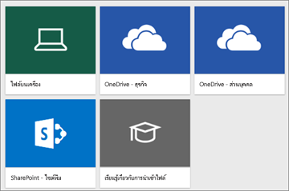
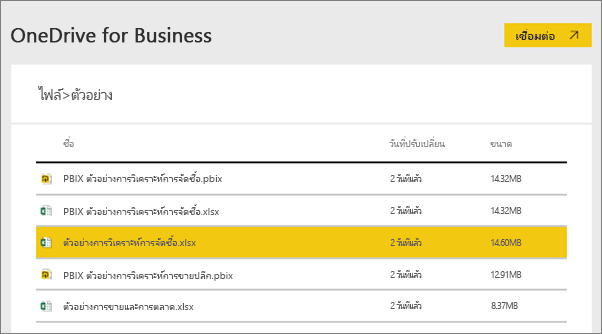
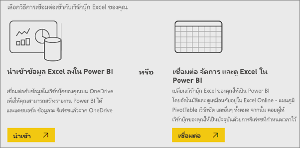
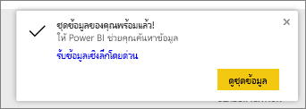
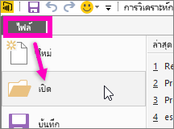

# รับข้อมูลตัวอย่างสำหรับ Power BI
สมมุติว่าคุณยังใหม่กับ Power BI และต้องการทดลองใช้ แต่คุณไม่มีข้อมูลใด ๆ  หรือบางทีคุณอาจมีชุดข้อมูลอยู่แล้ว แต่คุณยังไม่เข้าใจว่า Power BI ทำงานอย่างไร คุณกังวลว่าคุณอาจทำให้ชุดข้อมูลของคุณเสียหาย

ไม่จำเป็นต้องเครียดอีกต่อไป! obviEnce ([www.obvience.com](http://www.obvience.com/)) และ Microsoft ได้สร้างตัวอย่างให้คุณใช้ จนกว่าคุณจะรู้สึกมั่นใจขึ้นกับ Power BI  ข้อมูลถูกลบตัวตนออก และเป็นตัวอย่างจากอุตสาหกรรมที่แตกต่างกัน: การเงิน, HR, การขาย และอีกมากมาย นอกจากนี้ เอกสารออนไลน์ของเรายังใช้ตัวอย่างเดียวกันนี้ในแบบช่วยสอนและตัวอย่าง ดังนั้นคุณจะสามารถทำตามได้      

   

แต่ละตัวอย่างเหล่านี้ มีให้ใช้งานในหลายรูปแบบ: เป็นชุดเนื้อหา เป็นเวิร์กบุ๊ก Excel และ เป็นไฟล์ .pbix ถ้าคุณไม่ทราบว่าสิ่งเหล่านี้คืออะไร หรือไปรับมาได้อย่างไร - ไม่ต้องกังวล เราจะอธิบายทั้งหมดนั้นในบทความนี้ต่อไป และสำหรับแต่ละตัวอย่างที่เราได้สร้าง*การนำเสนอ* การนำเสนอคือบทความที่บอกเรื่องราวเบื้องหลังตัวอย่าง และแนะนำคุณเกี่ยวกับสถานการณ์สมมติที่หลากหลาย สถานการณ์หนึ่งอาจสามารถตอบคำถามสำหรับผู้จัดการของคุณ แต่อีกสถานการณ์อาจเป็นการมองหาข้อมูลเชิงลึกด้านความสามารถในการแข่งขัน หรือสร้างรายงานและแดชบอร์ดเพื่อแชร์ หรืออธิบายการเปลี่ยนแปลงทางธุรกิจ   

ก่อนที่เราจะเริ่มต้น นี่คือคำแนะนำด้านกฎหมายเกี่ยวกับการใช้งานตัวอย่างเหล่านั้น หลังจากนั้น เราจะแนะนำตัวอย่างและแสดงวิธีการใช้งาน   

## แนวทางการใช้งานตัวอย่างเวิร์กบุ๊ก Excel สำหรับ Power BI

© 2015 Microsoft Corporation All rights reserved. เอกสารและเวิร์กบุ๊กมีไว้ให้ “ตามที่เป็น” ข้อมูลและมุมมองที่แสดงอยู่ในเวิร์กบุ๊ก รวมถึง URL และเว็บไซต์อินเทอร์เน็ตอ้างอิงอื่น ๆ อาจเปลี่ยนแปลงโดยไม่ต้องแจ้งให้ทราบ คุณรับผิดชอบความเสี่ยงเองจากการใช้งาน ตัวอย่างบางส่วนใช้สำหรับประกอบเท่านั้น และเป็นเรื่องสมมุติขึ้น ไม่มีความสัมพันธ์ใด ๆ กับสิ่งที่มีอยู่จริง ไม่ว่าจะตั้งใจหรืออนุมานได้ ไมโครซอฟท์ไม่มีการรับประกันใด ๆ ไม่ว่าจะระบุโดยแจ้ง หรือโดยนัย แก่ข้อมูลที่ให้ไว้ที่นี่

เวิร์กบุ๊กนี้ไม่ให้สิทธิ์ทางกฎหมายใด ๆ ในทรัพย์สินทางปัญญาในผลิตภัณฑ์ของ Microsoft คุณสามารถคัดลอก และใช้เวิร์กบุ๊กนี้สำหรับการอ้างอิงภายในของคุณ

เวิร์กบุ๊กและข้อมูลที่เกี่ยวข้อง จัดหามาให้โดย obviEnce [www.obvience.com](http://www.obvience.com)

ObviEnce คือ ISV และ Incubator ทรัพย์สินทางปัญญา (IP) ที่เน้นบน Microsoft Business Intelligence ObviEnce ทำงานใกล้ชิดกับ Microsoft เพื่อพัฒนาแนวทางปฏิบัติและความเป็นผู้นำทางความคิดที่ดีที่สุด สำหรับการเริ่มต้นและการปรับใช้โซลูชันของ Microsoft Business Intelligence

เวิร์กบุ๊กและข้อมูลที่เป็นทรัพย์สินของ obviEnce, LLC และแชร์ให้ด้วยวัตถุประสงค์เพียงอย่างเดียว คือเพื่อแสดงขีดความสามารถของ Power BI ด้วยข้อมูลตัวอย่างทางอุตสาหกรรม

การใช้งานใด ๆ ของเวิร์กบุ๊ก และ/หรือข้อมูล ต้องมีข้อความระบุแหล่งที่มาที่ปรากฏด้านบน (ซึ่งอยู่บนเวิร์กชีตข้อมูล ที่รวมอยู่ในแต่ละเวิร์กบุ๊กด้วย) เวิร์กบุ๊กและแสดงภาพใด ๆ ต้องจะมาพร้อมกับข้อความลิขสิทธิ์ต่อไปนี้: obviEnce ©

การคลิกที่ลิงก์ใดลิงก์หนึ่งด้านล่างเพื่อดาวน์โหลดไฟล์เวิร์กบุ๊ก Excel หรือไฟล์ .pbix แสดงว่าคุณได้ยอมรับข้อตกลงด้านบน

## ตัวอย่างที่มีให้
มีแปดตัวอย่างที่พร้อมให้คุณได้ใช้  แต่ละตัวอย่างแทนอุตสาหกรรมที่แตกต่างกัน

### ตัวอย่างความสามารถในการทำกำไรสำหรับลูกค้า  
[ชมการแนะนำของตัวอย่างความสามารถในการทำกำไรลูกค้า](sample-customer-profitability.md)

ตัวอย่างอุตสาหกรรมนี้วิเคราะห์เมตริกหลัก ๆ ของ CFO สำหรับใช้กับผู้บริหาร ผลิตภัณฑ์ และลูกค้าของบริษัท คุณสามารถตรวจสอบปัจจัยที่ส่งผลกระทบต่อกำไรของบริษัทนี้ได้

### ตัวอย่างทรัพยากรบุคคล  
[ชมการแนะนำของตัวอย่าง HR](sample-human-resources.md)

ตัวอย่างอุตสาหกรรมนี้มุ่งเน้นกลยุทธ์การจ้างงานสำหรับบริษัทโดยการวิเคราะห์การจ้างงานใหม่ พนักงานที่ทำงานอยู่ และพนักงานที่ได้ออกไปแล้ว  โดยการสำรวจข้อมูล คุณสามารถค้นหาแนวโน้มการออกจากงานโดยความสมัครใจ และความอคติในกลยุทธ์การจ้างงาน

### ตัวอย่างการวิเคราะห์ค่าใช้จ่ายในด้านไอที... 
[ชมการแนะนำของตัวอย่างการวิเคราะห์การใช้จ่ายด้าน IT](sample-it-spend.md)

ในตัวอย่างอุตสาหกรรมนี้ เราจะวิเคราะห์ต้นทุนที่วางแผนไว้เทียบกับต้นทุนจริงของแผนก IT ของบริษัทแห่งหนึ่ง การเปรียบเทียบนี้ช่วยให้เรา เข้าใจว่าบริษัทวางแผนไว้สำหรับปีได้ดีแค่ไหน และตรวจสอบด้านที่มีความแตกต่างอย่างมากจากแผน บริษัทในตัวอย่างนี้ ใช้การวางแผนรายปี จากนั้นก็มีการประเมินล่าสุด (Latest Estimation, LE) รายไตรมาส เพื่อช่วยวิเคราะห์การเปลี่ยนแปลงของรายจ่าย IT ตลอดช่วงปีงบประมาณ

### ตัวอย่างการวิเคราะห์โอกาส  
[ชมการแนะนำของตัวอย่างการวิเคราะห์โอกาสทางการขาย](sample-opportunity-analysis.md)

ตัวอย่างอุตสาหกรรมนี้สำรวจช่องทางการขายของบริษัทซอฟต์แวร์ ผู้จัดการฝ่ายขายเฝ้าดูช่องทางการขาย ทั้งทางตรงและของคู่ค้า โดยการติดตามโอกาสทางการขายและรายได้ตามภูมิภาค ขนาดข้อเสนอ และช่องทางการขาย

### ตัวอย่างการวิเคราะห์ด้านการจัดซื้อ  
[ชมการแนะนำของตัวอย่างการวิเคราะห์การจัดซื้อ](sample-procurement.md)

ตัวอย่างอุตสาหกรรมนี้วิเคราะห์เมตริกหลัก ๆ ของ CFO สำหรับใช้กับผู้บริหาร ผลิตภัณฑ์ และลูกค้าของบริษัท คุณสามารถตรวจสอบปัจจัยที่ส่งผลกระทบต่อกำไรของบริษัทนี้ได้

### ตัวอย่างการวิเคราะห์การค้าปลีก  
[ชมการแนะนำของตัวอย่างการวิเคราะห์ด้านการขายปลีก](sample-retail-analysis.md)

ตัวอย่างอุตสาหกรรมนี้ วิเคราะห์ข้อมูลขายปลีกของสินค้าที่ขายในร้านค้าจำนวนมากและในหลายเขต เมตริกเปรียบเทียบประสิทธิภาพในปีนี้เทียบกับปีที่แล้ว ในด้านต่าง ๆ เหล่านี้: ยอดขาย จำนวนหน่วยที่ขาย อัตรากำไรขั้นต้น และความแปรปรวน เช่นเดียวกับการวิเคราะห์สาขาใหม่

### ตัวอย่างการขายและการตลาด  
[ชมการแนะนำของตัวอย่างยอดขายและการตลาด](sample-sales-and-marketing.md)

ตัวอย่างอุตสาหกรรมนี้วิเคราะห์บริษัทผลิตที่ชื่อ VanArsdel Ltd. ซึ่งอนุญาตให้ประธานฝ่ายการตลาด เฝ้าดูอุตสาหกรรมและส่วนแบ่งตลาดของ VanArsdel  โดยการค้นคว้าตัวอย่าง คุณสามารถหาส่วนแบ่งตลาดของบริษัท ปริมาณการผลิต ยอดขาย และความคิดเห็นต่อผลิตภัณฑ์

### ตัวอย่างคุณภาพผู้จัดหาสินค้า  
[ชมการแนะนำของตัวอย่างคุณภาพผู้จัดหาสินค้า](sample-supplier-quality.md)

ตัวอย่างอุตสาหกรรมนี้ มุ่งเน้นความท้าทายหนึ่งในห่วงโซ่อุปทานที่พบโดยทั่วไป — การวิเคราะห์คุณภาพของผู้จัดหาสินค้า การวิเคราะห์นี้ใช้เมตริกหลักสองอย่าง: ผลรวมจำนวนที่บกพร่องและผลรวมเวลาที่ไม่ได้ทำงานที่เกิดขึ้นจากข้อบกพร่องเหล่านี้ ตัวอย่างนี้มีสองวัตถุประสงค์หลัก: ทำความเข้าใจว่าใครคือผู้จัดหาสินค้าที่ดีที่สุดและแย่ที่สุด และระบุโรงงานไหนค้นพบและปฏิเสธของที่บกพร่องได้ดีกว่า เพื่อลดระยะเวลาหยุดทำงาน

ตอนนี้คุณทราบแล้วว่ามีอะไรให้ใช้งาน ถึงเวลาแล้ว ที่จะการเรียนรู้วิธีรับตัวอย่างเหล่านี้  

## วิธีรับตัวอย่าง
ตามที่คุณอ่านข้างต้น ตัวอย่างมีให้ในหลายรูปแบบ: ชุดเนื้อหา, เวิร์กบุ๊ก Excel และไฟล์ .pbix เราจะอธิบายวิธีใช้แต่ละรูปแบบนี้โดยเริ่มจากชุดเนื้อหา

## ตัวอย่าง Power BI ในรูปชุดเนื้อหา
ชุดเนื้อหา จะเป็นรูปแบบตัวอย่างมีใน Power BI เลย คุณไม่ต้องออกจาก Power BI เพื่อหามัน ชุดเนื้อหา จริง ๆ แล้ว คือการนำแดชบอร์ด ชุดข้อมูล และรายงานที่มีคนสร้างไว้ หนึ่งหรือหลายรายการมารวมเข้าด้วยกัน และสามารถใช้กับบริการของ Power BI ผู้คนสร้างชุดเนื้อหาขึ้นมาเพื่อแชร์กับเพื่อนร่วมงาน แต่ละชุดเนื้อหาตัวอย่าง Power BI ประกอบด้วยชุดข้อมูล รายงาน และแดชบอร์ด  ชุดเนื้อหา ไม่สามารถใช้กับ Power BI Desktop ได้ ถ้าคุณต้องการเรียนรู้เพิ่มเติมเกี่ยวกับชุดเนื้อหา อ่าน[แนะนำชุดเนื้อหาใน Power BI](service-organizational-content-pack-introduction.md)

### รับ และเปิดชุดเนื้อหาตัวอย่างในบริการ Power BI
1. เปิดบริการของ Power BI (app.powerbi.com) และลงชื่อเข้าใช้
2. ในมุมด้านล่างซ้าย เลือก**รับข้อมูล**

    
3. บนหน้า รับข้อมูล ที่ปรากฏขึ้น เลือกไอคอน**ตัวอย่าง**

   
4. เลือกหนึ่งในตัวอย่างเพื่อเปิดดูคำอธิบายของตัวอย่างนั้น จากนั้น เลือก**เชื่อมต่อ**  

   
5. Power BI นำเข้าชุดเนื้อหา และเพิ่มแดชบอร์ด รายงาน และชุดข้อมูลใหม่ไปยังพื้นที่ทำงานปัจจุบันของคุณ เนื้อหาใหม่จะถูกทำเครื่องหมายด้วยเครื่องหมายดอกจันสีเหลือง ใช้ตัวอย่างเหล่านี้ เพื่อนำ Power BI มาการทดสอบการใช้งาน  

   

ตอนนี้คุณมีข้อมูลแล้ว คุณกำลังไปได้ดี  ลองเข้า บทช่วยสอนของเราบางเรื่อง โดยใช้ชุดเนื้อหาตัวอย่าง หรือแค่ลองเปิดบริการ Power BI และสำรวจ

## ตัวอย่าง Power BI ในรูปไฟล์ Excel
แต่ละชุดเนื้อหาตัวอย่าง ยังมีให้ในรูปของเวิร์กบุ๊ก Excel เวิร์กบุ๊ก Excel ถูกออกแบบมาเพื่อใช้ได้กับบริการ Power BI  

1. ดาวน์โหลดไฟล์ทีละไฟล์โดยใช้ลิงก์ด้านล่าง หรือ[ดาวน์โหลดไฟล์ zip ที่มีไฟล์ตัวอย่างทั้งหมด](https://go.microsoft.com/fwlink/?LinkId=535020) ถ้าคุณเป็นผู้ใช้ขั้นสูง คุณอาจต้องการดาวน์โหลดเวิร์กบุ๊ก Excel เพื่อสำรวจ หรือแก้ไขรูปแบบข้อมูล

   * [ตัวอย่างการวิเคราะห์ด้านการขายปลีก](https://go.microsoft.com/fwlink/?LinkId=529778)
   * [ตัวอย่างการวิเคราะห์คุณภาพผู้จัดหาสินค้า](https://go.microsoft.com/fwlink/?LinkId=529779)
   * [ตัวอย่างทรัพยากรบุคคล](https://go.microsoft.com/fwlink/?LinkId=529780)
   * [ตัวอย่างความสามารถในการทำกำไรลูกค้า](https://go.microsoft.com/fwlink/?LinkId=529781)
   * [ตัวอย่างการติดตามโอกาสทางการขาย](https://go.microsoft.com/fwlink/?LinkId=529782)
   * [ตัวอย่างการวิเคราะห์การใช้จ่ายด้าน IT](https://go.microsoft.com/fwlink/?LinkId=529783)
   * [ตัวอย่างการวิเคราะห์การจัดซื้อ](https://go.microsoft.com/fwlink/?LinkId=529784)
   * [ตัวอย่างยอดขายและการตลาด](https://go.microsoft.com/fwlink/?LinkId=529785)
2. บันทึกไฟล์ที่ดาวน์โหลด ตำแหน่งที่คุณบันทึกไฟล์ มีผลแตกต่างกัน

   *   **ภายในเครื่อง** - ถ้าคุณบันทึกไฟล์ของคุณลงในไดรฟ์ภายในเครื่องบนคอมพิวเตอร์ของคุณ หรือตำแหน่งอื่นในองค์กรของคุณ จาก Power BI คุณสามารถนำเข้าไฟล์ของคุณลงใน Power BI ได้ ไฟล์ของคุณจะยังคงอยู่บนไดรฟ์ภายในเครื่อง ดังนั้นไฟล์ทั้งหมดไม่ถูกนำเข้าไปใน Power BI สิ่งที่เกิดขึ้นคือชุดข้อมูลใหม่ถูกสร้างขึ้นในไซต์ Power BI และโหลดข้อมูลลงในชุดข้อมูลนั้น บางกรณีเป็นรูปแบบข้อมูล ถ้าไฟล์ของคุณมีรายงานใด ๆ รายงานเหล่านั้นจะปรากฏในไซต์ Power BI ของคุณภายใต้รายงาน
   * **OneDrive - ธุรกิจ**– ถ้าคุณมี OneDrive for Business และคุณลงชื่อเข้าใช้ด้วยบัญชีเดียวกันกับที่ลงชื่อเข้าใช้ Power BI OneDrive for Business เป็นวิธีที่มีประสิทธิภาพที่สุดที่จะทำให้งานของคุณใน Excel, Power BI หรือไฟล์ .CSV มีข้อมูลให้ตรงกันกับชุดข้อมูล รายงาน และแดชบอร์ดใน Power BI เนื่องจากทั้ง Power BI และ OneDrive อยู่ในระบบคลาวด์ Power BI จะเชื่อมต่อกับไฟล์ของคุณบน OneDrive ประมาณทุกชั่วโมง ถ้าพบการเปลี่ยนแปลงใด ๆ ก็ตาม Power BI จะอัปเดต ชุดข้อมูล รายงาน และแดชบอร์โดยอัตโนมัติ
   *  **OneDrive - ส่วนบุคคล** – ถ้าคุณบันทึกไฟล์ของคุณไปยังบัญชี OneDrive ของคุณเอง คุณจะยังได้รับประโยชน์หลายอย่างแบบเดียวกับที่คุณได้จาก OneDrive for Business ความแตกต่างที่สำคัญที่สุด คือเมื่อคุณเชื่อมต่อกับไฟล์ของคุณ (โดยใช้ รับข้อมูล > ไฟล์ > OneDrive – ส่วนบุคคล) คุณจำเป็นต้องลงชื่อเข้าใช้ OneDrive ของคุณด้วยบัญชี Microsoft ของคุณ ซึ่งโดยปกติแล้วจะแตกต่างจากที่คุณใช้ลงชื่อเข้าใช้ Power BI เมื่อลงชื่อเข้าใช้ OneDrive ของคุณด้วยบัญชี Microsoft ให้แน่ใจว่าได้เลือกตัวเลือก คงการลงชื่อเข้าใช้ของฉันไว้เสมอ ด้วยวิธีนี้ Power BI จะสามารถเชื่อมต่อกับไฟล์ของคุณประมาณทุกชั่วโมง และทำให้คุณแน่ใจว่า ชุดข้อมูลของคุณใน Power BI มีข้อมูลที่ตรงกัน
   * **SharePoint Team - ไซต์** การบันทึกไฟล์ Power BI ของคุณไปยัง SharePoint - ของไซต์ของทีม จะเหมือนกันการบันทึกไปยัง OneDrive for Business มาก ความแตกต่างที่สำคัญที่สุดคือ วิธีที่คุณเชื่อมต่อไปยังไฟล์จาก Power BI คุณสามารถระบุ URL หรือเชื่อมต่อไปยังโฟลเดอร์รากฐานได้
1. เปิดบริการของ Power BI (app.powerbi.com) และลงชื่อเข้าใช้

   > [!TIP]
   > ในตอนนี้ คุณอาจต้องการสร้างแดชบอร์ดใหม่ และตั้งชื่อตามไฟล์ที่คุณจะนำเข้า  มิฉะนั้น เมื่อคุณนำเข้าชุดข้อมูล Excel แล้ว Power BI จะไม่สร้างแดชบอร์ดใหม่ที่มีชื่อเดียวกับตัวอย่าง แต่จะเพิ่มไทล์ไปยังแดชบอร์ดที่คุณกำลังเปิดอยู่แทน การเลือกที่ไทล์นั้น ถึงจะนำคุณไปยังรายงานของชุดข้อมูล นี่ไม่ใช่เรื่องใหญ่โตอะไร เพราะคุณสามารถสร้างแดชบอร์ดใหม่ได้เสมอ แต่การเริ่มต้นด้วยแดชบอร์ดใหม่ช่วยคุณประหยัดหนึ่งหรือสองขั้นตอน
   >
   >
4. ในมุมด้านล่างซ้าย เลือก**รับข้อมูล**

    
5. บนหน้า รับข้อมูล ที่ปรากฏขึ้น เลือก**ไฟล์ > รับ**

     
6. ไปยังตำแหน่งที่คุณดาวน์โหลด และบันทึกตัวอย่าง

   
7. เลือกไฟล์ ในกรณีนี้คือ **Procurement Analysis Sample.xlsx** ซึ่งถูกบันทึกไว้บน OneDrive for Business และเลือก **เชื่อมต่อ**

   
8. เลือกว่า จะนำเข้าข้อมูล หรือจะนำเวิร์กบุ๊กไปยัง Power BI และดูว่ามันเหมือนกับที่อยู่ใน Excel online หรือไม่

    
9. ถ้าคุณเลือก**นำเข้า** Power BI จะนำเข้าเวิร์กบุ๊กตัวอย่าง และเพิ่มเป็นชุดข้อมูลใหม่ที่ชื่อว่า**ตัวอย่างการวิเคราะห์การจัดซื้อ**  ถ้าเวิร์กบุ๊กมีแผ่นงาน ตารางหรือช่วง หรือรูปแบบข้อมูลของ Power View ใด ๆ Power BI จะสร้างรายงาน (ที่มีชื่อเดียวกัน) และถ้าคุณไม่มีแดชบอร์ดที่เปิดเอาไว้แล้ว Power BI จะสร้างแดชบอร์ดใหม่ให้ (ถ้าคุณมีแดชบอร์ดเปิดขึ้นอยู่ก่อนเมื่อคุณคลิก**รับข้อมูล** คุณจะเห็นไทล์เปล่าอันใหม่บนแดชบอร์ดนั้น  คลิกที่ไทล์จะนำคุณไปยังรายงานสำหรับชุดข้อมูลคุณเพิ่งเพิ่มเข้ามา) เนื้อหาใหม่จะตั้งชื่อตามตัวอย่าง และถูกทำเครื่องหมาย ด้วยเครื่องหมายดอกจันสีเหลือง
10. เมื่อหน้าจอ**ชุดข้อมูลของคุณพร้อมแล้ว!** หน้าจอจะปรากฏขึ้น เลือก**ดูชุดข้อมูล** หรือ**รับข้อมูลเชิงลึกด่วน** หรือใช้บานหน้าต่างนำทางของ Power BI เพื่อค้นหาและเปิดรายงานหรือแดชบอร์ดที่เกี่ยวข้อง  

     

### (ไม่บังคับ) ลองดูตัวอย่าง Excel จากภายใน Excel เอง
ต้องการทำความเข้าใจว่าข้อมูลในเวิร์กบุ๊ก Excel ถูกแปลงเป็นชุดข้อมูลและรายงาน Power BI ได้อย่างไรหรือไม่? เปิดตัวอย่าง Excel ***ใน Excel*** และสำรวจแผ่นงานซึ่งให้คำตอบบางคำตอบ

* เมื่อคุณเริ่มเปิดเวิร์กบุ๊กตัวอย่างใน Excel คุณอาจเห็นข้อความเตือนสองข้อความ คำเตือนแรกบอกว่าเวิร์กบุ๊กอยู่ในมุมมองที่ได้รับการป้องกัน เลือก**เปิดใช้งานการแก้ไข** คำเตือนที่สองบอกว่าเวิร์กบุ๊กมีการเชื่อมต่อข้อมูลภายนอก เลือก**เปิดใช้งานเนื้อหา**
* แต่ละเวิร์กบุ๊กประกอบด้วย Power View หลายแผ่น ถ้าคุณต้องการดูแผ่นงาน Power View ใน Excel คุณจำเป็นต้อง[เปิดใช้งาน add-in ของ Power View ](https://support.office.com/article/flash-silverlight-and-shockwave-controls-blocked-in-microsoft-office-55738f12-a01d-420e-a533-7cef1ff6aeb1)โดยการดาวน์โหลดแพคเกจของรีจิสทรีคีย์
* ดังนั้น ข้อมูลจริง ๆ อยู่ตรงไหน? มันอยู่ในรูปแบบข้อมูล Power Pivot คุณไม่จำเป็นต้องใช้แผ่นงาน Power View เพื่อดูข้อมูล บนแท็บ **PowerPivot** เลือก**จัดการ**

    ไม่เห็นแท็บ **PowerPivot** ใช่หรือไม่ [เปิดใช้งาน Power Pivot add-in](https://support.office.com/article/Start-Power-Pivot-in-Microsoft-Excel-2013-add-in-A891A66D-36E3-43FC-81E8-FC4798F39EA8)

    ใน Power Pivot คุณสามารถดูข้อมูลในตารางพื้นฐานทั้งหมด รวมถึงสูตร DAX ทั้งหมด 

* แท็บข้อมูลมีข้อมูลเกี่ยวกับ obviEnce บริษัทที่สร้างตัวอย่างขึ้นมา

## ตัวอย่าง Power BI ในรูปไฟล์ .pbix
แต่ละชุดเนื้อหาตัวอย่าง มีให้ในรูปของไฟล์ .pbix ของ Power BI ด้วย ไฟล์ .pbix ถูกออกแบบมาเพื่อใช้กับ Power BI Desktop  

1. ดาวน์โหลดไฟล์ทีละไฟล์โดยใช้ลิงก์ด้านล่าง การเลือกลิงก์เหล่านี้จะบันทึกไฟล์โดยอัตโนมัติไปยังโฟลเดอร์ดาวน์โหลดของคุณ 

   * [ตัวอย่างการวิเคราะห์ร้านค้าปลีก PBIX](https://download.microsoft.com/download/9/6/D/96DDC2FF-2568-491D-AAFA-AFDD6F763AE3/Retail%20Analysis%20Sample%20PBIX.pbix)
   * [ตัวอย่างการวิเคราะห์คุณภาพผู้ขาย PBIX](https://download.microsoft.com/download/8/C/6/8C661638-C102-4C04-992E-9EA56A5D319B/Supplier-Quality-Analysis-Sample-PBIX.pbix)
   <!-- Previous link doesn't work -->
   * [ตัวอย่างทรัพยากรบุคคล PBIX](https://download.microsoft.com/download/6/9/5/69503155-05A5-483E-829A-F7B5F3DD5D27/Human%20Resources%20Sample%20PBIX.pbix)
   * [ตัวอย่างความสามารถในการทำกำไรของลูกค้า PBIX](https://download.microsoft.com/download/6/A/9/6A93FD6E-CBA5-40BD-B42E-4DCAE8CDD059/Customer%20Profitability%20Sample%20PBIX.pbix)
   * [ตัวอย่างการติดตามโอกาสทางการขาย PBIX](https://download.microsoft.com/download/9/1/5/915ABCFA-7125-4D85-A7BD-05645BD95BD8/Opportunity%20Analysis%20Sample%20PBIX.pbix)
   * [ตัวอย่างการวิเคราะห์การใช้จ่ายด้าน ITของ PBIX](https://download.microsoft.com/download/E/9/8/E98CEB6D-CEBB-41CF-BA2B-1A1D61B27D87/IT%20Spend%20Analysis%20Sample%20PBIX.pbix)
   * [ตัวอย่างการวิเคราะห์การจัดซื้อ PBIX](https://download.microsoft.com/download/D/5/3/D5390069-F723-413B-8D27-5888500516EB/Procurement%20Analysis%20Sample%20PBIX.pbix)
   * [ตัวอย่างยอดขายและการตลาด PBIX](https://download.microsoft.com/download/9/7/6/9767913A-29DB-40CF-8944-9AC2BC940C53/Sales%20and%20Marketing%20Sample%20PBIX.pbix)

1. จาก Power BI เดสก์ท็อป เลือก**ไฟล์ > เปิด** และไปยังตำแหน่งที่คุณบันทึก .pbix ตัวอย่าง

   
4. เลือกไฟล์ .pbix เพื่อเปิดใน Power BI เดสก์ท็อป

## ขั้นตอนถัดไป
[แนวคิดพื้นฐานสำหรับนักออกแบบในบริการ Power BI](service-basic-concepts.md)

[บทช่วยสอน: เชื่อมต่อกับตัวอย่างของ Power BI](sample-tutorial-connect-to-the-samples.md)

[แหล่งข้อมูลสำหรับ Power BI](service-get-data.md)

มีคำถามเพิ่มเติมหรือไม่ [ลองไปที่ชุมชน Power BI](https://community.powerbi.com/)
