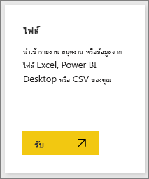

# รับตัวอย่างสำหรับ Power BI
สมมุติว่าคุณยังใหม่กับ Power BI และต้องการทดลองใช้ แต่คุณไม่มีข้อมูลใด ๆ  หรือคุณอาจต้องการดูรายงานที่แสดงให้เห็นถึงบางความสามารถของ Power BI เราเตรียมไว้ให้คุณแล้ว

Power BI เสนอตัวอย่างหลากหลายประเภท เพื่อจุดประสงค์ที่แตกต่างกัน: 
- **[รายงาน Power BI](#sales--returns-sample-pbix-file) (ไฟล์ .pbix)** ที่คุณสามารถดูได้ในแกลเลอรีเรื่องราวข้อมูล เปิดและสำรวจใน Power BI Desktop หรืออัปโหลดไปยังบริการ Power BI
- **[แอปตัวอย่าง](#sample-app-from-appsource)** ที่คุณดาวน์โหลดจาก AppSource ยังเหมาะสมในบริการ Power BI แอปรวมถึง แดชบอร์ด รายงาน และชุดข้อมูล คุณสามารถแก้ไขได้ จากนั้นแจกจ่ายให้กับเพื่อนร่วมงานของคุณ

- **[แปดตัวอย่างต้นฉบับที่มีอยู่ภายใน](#eight-original-samples)** ในบริการ Power BI เป็น *ชุดเนื้อหา* ที่ประกอบด้วยแดชบอร์ ดรายงาน และชุดข้อมูล คุณได้ติดตั้งไว้ในบริการ Power BI ตัวอย่างที่มีอยู่ภายในจะพร้อมใช้งานในรูปแบบรายงาน Power BI (.pbix) และสมุดงาน Excel (.xlsx)
- เวอร์ชัน **[สมุดงาน Excel](#download-sample-excel-files)** ของตัวอย่างที่มีอยู่ภายในประกอบด้วยรูปแบบข้อมูลและแผ่นงาน Power View คุณสามารถสำรวจหรือแก้ไขรูปแบบข้อมูลใน Excel ใช้สมุดงาน Excel เป็นแหล่งข้อมูลสำหรับรายงาน Power BI คุณยังสามารถอัปโหลดสมุดงานเป็นไฟล์ Excel และแสดงวิชวล Excel และ PivotTables ในรายงาน Power BI ได้ 
- นอกจากนี้ยังมี **[เวิร์กบุ๊กตัวอย่างข้อมูลทางการเงิน](sample-financial-download.md)** เป็นตารางแฟล็ตอย่างง่ายในไฟล์ Excel ที่พร้อมใช้งานสำหรับการดาวน์โหลด ซึ่งประกอบด้วยข้อมูลที่เป็นนิรนามพร้อมผลิตภัณฑ์ที่สมมติขึ้นและพร้อมกับยอดขายแบ่งตามเซ็กเมนต์และประเทศ
 โดยจะทำให้เกิดแหล่งข้อมูลพื้นฐานที่มีประโยชน์สำหรับรายงาน Power BI

เอกสารออนไลน์ของเรายังใช้ตัวอย่างเดียวกันนี้ในบทช่วยสอนและตัวอย่าง ดังนั้นคุณจึงสามารถทำตามได้

## ไฟล์ .pbix ตัวอย่างการขายและรับคืน

:::image type="content" source="media/sample-datasets/sales-returns-sample-pbix.png" alt-text="ไฟล์ .pbix ตัวอย่างการขายและรับคืน":::

*รายงานตัวอย่างการขายและรับคืน*

ผู้ออกแบบ รายงาน Power BI คือ  Miguel Myers และ Chris Hamill ได้สร้างไฟล์ .pbix การขายและรับคืน เพื่อแสดงให้เห็นคุณลักษณะใหม่หลายรายการใน Power BI ประกอบด้วย ปุ่มต่างๆ การดูข้อมูลรายละเอียด การจัดรูปแบบตามเงื่อนไข what-if และคำแนะนำเครื่องมือที่กำหนดเอง 

สถานการณ์สำหรับรายงานนี้ คือ บริษัทที่จำหน่ายสเก็ตบอร์ดในธีม Microsoft พวกเขาต้องการดูสถานะของยอดขายและการรับคืน และวิเคราะห์วิธีการที่พวกเขาควรใช้ปรับเปลี่ยนการดำเนินการของพวกเขา 

คุณสามารถสำรวจได้โดยวิธีการเหล่านี้:

- ดูและโต้ตอบกับใน [แกลเลอรีเรื่องราวข้อมูล](https://community.powerbi.com/t5/Data-Stories-Gallery/Sales-amp-Returns-Sample-Report/m-p/876607) ในชุมชน Power BI
- ดาวน์โหลดไฟล์ .pbix และสำรวจโดยละเอียด ดู "เบื้องหลังม่าน" เพื่อดูว่า Miguel ทำอย่างไร การเลือกลิงก์นี้จะดาวน์โหลดไฟล์โดยอัตโนมัติ: [รายงานตัวอย่างการขายและรับคืน](https://go.microsoft.com/fwlink/?linkid=2113239)
- อ่านเกี่ยวกับรายงานในบล็อกโพสต์  Power BI [ชมการแนะนำรายงานตัวอย่างการขายและรับคืน](https://powerbi.microsoft.com/blog/take_a_tour_of_the_new_sales_returns_sample_report/)

## แอปตัวอย่างจาก AppSource

*แอป* การตลาดและการขาย มีพร้อมให้ใช้งานจาก Microsoft AppSource แอปนี้เป็นประเภทเนื้อหา Power BI ที่รวมแดชบอร์ดและรายงานที่เกี่ยวข้องทั้งหมดไว้ในที่เดียวกัน แอปสามารถมีแดชบอร์ดอย่างน้อยหนึ่งรายการและรายงานอย่างน้อยหนึ่งรายงานทั้งหมดรวมเข้าด้วยกัน คุณสามารถดาวน์โหลดแอปการตลาดและการขายจาก**แอป**  ในบริการ Power BI หรือโดยไปที่ AppSource ในเบราว์เซอร์ของคุณ

- บทความ [ติดตั้งและใช้แอป](consumer/end-user-app-view.md) อธิบายวิธีการดาวน์โหลดแอปจากภายในบริการ Power BI
- ลิงก์นี้จะนำคุณไปยัง [แอปการขายและการตลาด](https://appsource.microsoft.com/product/power-bi/microsoft-retail-analysis-sample.salesandmarketingsample?tab=Overview) ใน AppSource

หลังจากที่คุณติดตั้งแล้ว คุณจะเห็นแอปในคอลเลกชันของคุณ

:::image type="content" source="media/sample-datasets/power-bi-sales-marketing-app.png" alt-text="ไทล์แอปการขายและการตลาด":::

เมื่อคุณเปิดใช้งาน เลือก **สำรวจด้วยข้อมูลตัวอย่าง** 

:::image type="content" source="media/sample-datasets/power-bi-explore-app.png" alt-text="สำรวจแอป":::

คุณจะเห็นมุมมองแอป ด้วยแดชบอร์ดและหน้ารายงานแต่ละรายการในบานหน้าต่างนำทาง 

:::image type="content" source="media/sample-datasets/power-bi-sales-marketing-app-navigation.png" alt-text="บานหน้าต่างนำทางแอป":::

เนื่องจากคุณได้ติดตั้งแล้ว คุณยังสามารถเปิด *พื้นที่ทำงาน* และแก้ไของค์ประกอบของแอป เลือกไอคอนดินสอ **แก้ไข** เพื่อเปิดพื้นที่ทำงาน

:::image type="content" source="media/sample-datasets/power-bi-app-edit-pencil.png" alt-text="แก้ไขแอป":::

ในตอนนี้คุณจะเห็นแดชบอร์ด รายงาน และชุดข้อมูลจากแอปในมุมมองรายการของพื้นที่ทำงาน ในพื้นที่ทำงานนี้ คุณสามารถแก้ไขแต่ละรายการได้

:::image type="content" source="media/sample-datasets/power-bi-sales-marketing-workspace.png" alt-text="พื้นที่ทำงานการขายและการตลาด":::

คุณสามารถกระจายแอปนี้กับทุกคนในองค์กรของคุณได้หากคุณต้องการ เลือก**อัปเดตแอป**

:::image type="content" source="media/sample-datasets/power-bi-update-app.png" alt-text="อัปเดตปุ่มแอปฯ":::

ทำ **แท็บการตั้งค่า** ให้เสร็จสมบูรณ์ซึ่งรวมถึงการเลือก**สีธีมของ** แอป 

:::image type="content" source="media/sample-datasets/power-bi-app-setup.png" alt-text="เลือกการตั้งค่าแอป":::

เสร็จสิ้น**การนำทาง** และ **สิทธิ์** แท็บจากนั้นเลือก **Update app**

:::image type="content" source="media/sample-datasets/power-bi-select-update-app.png" alt-text="เลือกอัปเดตแอปเพื่อเผยแพร่":::

อ่านเพิ่มเติมเกี่ยวกับ [การเผยแพร่แอปใน Power BI](service-create-distribute-apps.md)

## แปดตัวอย่างเดิม
มีแปดตัวอย่างที่พร้อมให้คุณได้ใช้ แต่ละตัวอย่างแทนอุตสาหกรรมที่แตกต่างกัน คุณสามารถมีส่วนร่วมกับแต่ละรูปแบบที่แตกต่างกัน:

- ติดตั้ง [ชุดเนื้อหาที่มีอยู่แล้วภายใน](#install-built-in-content-packs) ในบริการ Power BI
- ดาวน์โหลด [ไฟล์รายงาน Power BI](#download-original-sample-power-bi-files) (.pbix)
- ดาวน์โหลด [ไฟล์สมุดงาน Excel](#download-sample-excel-files) (.xlsx) จากนั้นอัปโหลดไปยังบริการ Power BI
- สำรวจ [ไฟล์ Excel ใน Excel](#explore-excel-samples-inside-excel)

บริษัท obviEnce ([www.obvience.com](http://www.obvience.com/)) และ Microsoft ร่วมมือกันเพื่อสร้างตัวอย่างต่างๆ เพื่อให้คุณสามารถใช้กับ Power BI ได้  ข้อมูลถูกลบตัวตนออก และเป็นตัวอย่างจากอุตสาหกรรมที่แตกต่างกัน: การเงิน, HR, การขาย และอีกมากมาย 

แต่ละตัวอย่างเหล่านี้ มีให้ใช้งานในหลายรูปแบบ: เป็นชุดเนื้อหา เป็นเวิร์กบุ๊ก Excel และเป็นไฟล์ .pbix ใน Power BI ถ้าคุณไม่ทราบว่าสิ่งเหล่านี้คืออะไร หรือไปรับมาได้อย่างไร - ไม่ต้องกังวล บทความนี้จะอธิบายทั้งหมด สำหรับแต่ละตัวอย่างเหล่านี้ เราได้สร้าง *การแนะนำ* ไว้ การแนะนำ คือ บทความที่บอกเรื่องราวเบื้องหลังตัวอย่าง และอธิบายให้คุณทราบเกี่ยวกับสถานการณ์ที่หลากหลาย สถานการณ์หนึ่งอาจสามารถตอบคำถามสำหรับผู้จัดการของคุณ แต่อีกสถานการณ์อาจเป็นการมองหาข้อมูลเชิงลึกด้านความสามารถในการแข่งขัน หรือสร้างรายงานและแดชบอร์ดเพื่อแชร์ หรืออธิบายการเปลี่ยนแปลงทางธุรกิจ

ก่อนที่เราจะเริ่มต้น นี่คือคำแนะนำด้านกฎหมายเกี่ยวกับการใช้งานตัวอย่างเหล่านี้ หลังจากนั้น เราจะแนะนำตัวอย่างและแสดงวิธีการใช้งาน

### แนวทางการใช้งานตัวอย่างเวิร์กบุ๊ก Excel

&copy;2015 Microsoft Corporation All rights reserved. เอกสารและเวิร์กบุ๊กมีไว้ให้ “ตามที่เป็น” ข้อมูลและมุมมองที่แสดงอยู่ในเวิร์กบุ๊ก รวมถึง URL และเว็บไซต์อินเทอร์เน็ตอ้างอิงอื่น ๆ อาจเปลี่ยนแปลงโดยไม่ต้องแจ้งให้ทราบ คุณรับผิดชอบความเสี่ยงเองจากการใช้งาน ตัวอย่างบางส่วนใช้สำหรับประกอบเท่านั้น และเป็นเรื่องสมมุติขึ้น ไม่มีความสัมพันธ์ใด ๆ กับสิ่งที่มีอยู่จริง ไม่ว่าจะตั้งใจหรืออนุมานได้ ไมโครซอฟท์ไม่มีการรับประกันใด ๆ ไม่ว่าจะระบุโดยแจ้ง หรือโดยนัย แก่ข้อมูลที่ให้ไว้ที่นี่

เวิร์กบุ๊กนี้ไม่ให้สิทธิ์ทางกฎหมายใด ๆ ในทรัพย์สินทางปัญญาในผลิตภัณฑ์ของ Microsoft คุณสามารถคัดลอก และใช้เวิร์กบุ๊กนี้สำหรับการอ้างอิงภายในของคุณ

เวิร์กบุ๊กและข้อมูลที่เกี่ยวข้อง จัดหามาให้โดย obviEnce [www.obvience.com](http://www.obvience.com)

ObviEnce คือ ISV และ Incubator ทรัพย์สินทางปัญญา (IP) ที่เน้นบน Microsoft Business Intelligence ObviEnce ทำงานใกล้ชิดกับ Microsoft เพื่อพัฒนาแนวทางปฏิบัติและความเป็นผู้นำทางความคิดที่ดีที่สุด สำหรับการเริ่มต้นและการปรับใช้โซลูชันของ Microsoft Business Intelligence

เวิร์กบุ๊กและข้อมูลที่เป็นทรัพย์สินของ obviEnce, LLC และแชร์ให้ด้วยวัตถุประสงค์เพียงอย่างเดียว คือเพื่อแสดงขีดความสามารถของ Power BI ด้วยข้อมูลตัวอย่างทางอุตสาหกรรม

การใช้งานใด ๆ ของเวิร์กบุ๊ก และ/หรือข้อมูล ต้องมีข้อความระบุแหล่งที่มาที่ปรากฏด้านบน (ซึ่งอยู่บนเวิร์กชีตข้อมูล ที่รวมอยู่ในแต่ละเวิร์กบุ๊กด้วย) เวิร์กบุ๊กและแสดงภาพใดๆ ต้องจะมาพร้อมกับข้อความลิขสิทธิ์ต่อไปนี้: obviEnce &copy;

การคลิกที่ลิงก์ใดลิงก์หนึ่งต่อไปนี้เพื่อดาวน์โหลดไฟล์เวิร์กบุ๊ก Excel หรือไฟล์ .pbix แสดงว่าคุณได้ยอมรับข้อตกลงด้านบน

### ตัวอย่างความสามารถในการทำกำไรสำหรับลูกค้า  
[ชมการแนะนำของตัวอย่างความสามารถในการทำกำไรลูกค้า](sample-customer-profitability.md)

ตัวอย่างอุตสาหกรรมนี้วิเคราะห์เมตริกหลัก ๆ ของ CFO สำหรับใช้กับผู้บริหาร ผลิตภัณฑ์ และลูกค้าของบริษัท คุณสามารถตรวจสอบปัจจัยที่ส่งผลกระทบต่อกำไรของบริษัทนี้ได้

### ตัวอย่างทรัพยากรบุคคล 
[ชมการแนะนำของตัวอย่าง HR](sample-human-resources.md)

ตัวอย่างอุตสาหกรรมนี้มุ่งเน้นกลยุทธ์การจ้างงานสำหรับบริษัทโดยการวิเคราะห์การจ้างงานใหม่ พนักงานที่ทำงานอยู่ และพนักงานที่ได้ออกไปแล้ว  โดยการสำรวจข้อมูล คุณสามารถค้นหาแนวโน้มการออกจากงานโดยความสมัครใจ และความอคติในกลยุทธ์การจ้างงาน

### ตัวอย่างการวิเคราะห์ค่าใช้จ่ายในด้านไอที... 
[ชมการแนะนำของตัวอย่างการวิเคราะห์การใช้จ่ายด้าน IT](sample-it-spend.md)

ในตัวอย่างอุตสาหกรรมนี้ เราจะวิเคราะห์ต้นทุนที่วางแผนไว้เทียบกับต้นทุนจริงของแผนก IT ของบริษัทแห่งหนึ่ง การเปรียบเทียบนี้ช่วยให้เรา เข้าใจว่าบริษัทวางแผนไว้สำหรับปีได้ดีแค่ไหน และตรวจสอบด้านที่มีความแตกต่างอย่างมากจากแผน บริษัทในตัวอย่างนี้ ใช้การวางแผนรายปี จากนั้นก็มีการประเมินล่าสุด (Latest Estimation, LE) รายไตรมาส เพื่อช่วยวิเคราะห์การเปลี่ยนแปลงของรายจ่าย IT ตลอดช่วงปีงบประมาณ

### ตัวอย่างการวิเคราะห์โอกาส 
[ชมการแนะนำของตัวอย่างการวิเคราะห์โอกาสทางการขาย](sample-opportunity-analysis.md)

ตัวอย่างอุตสาหกรรมนี้สำรวจช่องทางการขายของบริษัทซอฟต์แวร์ ผู้จัดการฝ่ายขายเฝ้าดูช่องทางการขาย ทั้งทางตรงและของคู่ค้า โดยการติดตามโอกาสทางการขายและรายได้ตามภูมิภาค ขนาดข้อเสนอ และช่องทางการขาย

### ตัวอย่างการวิเคราะห์ด้านการจัดซื้อ  
[ชมการแนะนำของตัวอย่างการวิเคราะห์การจัดซื้อ](sample-procurement.md)

ตัวอย่างอุตสาหกรรมนี้วิเคราะห์เมตริกหลัก ๆ ของ CFO สำหรับใช้กับผู้บริหาร ผลิตภัณฑ์ และลูกค้าของบริษัท คุณสามารถตรวจสอบปัจจัยที่ส่งผลกระทบต่อกำไรของบริษัทนี้ได้

### ตัวอย่างการวิเคราะห์การค้าปลีก  
[ชมการแนะนำของตัวอย่างการวิเคราะห์ด้านการขายปลีก](sample-retail-analysis.md)

ตัวอย่างอุตสาหกรรมนี้ วิเคราะห์ข้อมูลขายปลีกของสินค้าที่ขายในร้านค้าจำนวนมากและในหลายเขต เมตริกเปรียบเทียบประสิทธิภาพในปีนี้เทียบกับปีที่แล้ว ในด้านต่าง ๆ เหล่านี้: ยอดขาย จำนวนหน่วยที่ขาย อัตรากำไรขั้นต้น และความแปรปรวน เช่นเดียวกับการวิเคราะห์สาขาใหม่

### ตัวอย่างการขายและการตลาด  
[ชมการแนะนำของตัวอย่างยอดขายและการตลาด](sample-sales-and-marketing.md)

ตัวอย่างอุตสาหกรรมนี้วิเคราะห์บริษัทผลิตที่ชื่อ VanArsdel Ltd. ซึ่งอนุญาตให้ประธานฝ่ายการตลาด เฝ้าดูอุตสาหกรรมและส่วนแบ่งตลาดของ VanArsdel  โดยการค้นคว้าตัวอย่าง คุณสามารถหาส่วนแบ่งตลาดของบริษัท ปริมาณการผลิต ยอดขาย และความคิดเห็นต่อผลิตภัณฑ์

### ตัวอย่างคุณภาพผู้จัดหาสินค้า  
[ชมการแนะนำของตัวอย่างคุณภาพผู้จัดหาสินค้า](sample-supplier-quality.md)

ตัวอย่างอุตสาหกรรมนี้ มุ่งเน้นความท้าทายหนึ่งในห่วงโซ่อุปทานที่พบโดยทั่วไป — การวิเคราะห์คุณภาพของผู้จัดหาสินค้า การวิเคราะห์นี้ใช้เมตริกหลักสองอย่าง: ผลรวมจำนวนที่บกพร่องและผลรวมเวลาที่ไม่ได้ทำงานที่เกิดขึ้นจากข้อบกพร่องเหล่านี้ ตัวอย่างนี้มีสองวัตถุประสงค์หลัก: ทำความเข้าใจว่าใครคือผู้จัดหาสินค้าที่ดีที่สุดและแย่ที่สุด และระบุโรงงานไหนค้นพบและปฏิเสธของที่บกพร่องได้ดีกว่า เพื่อลดระยะเวลาหยุดทำงาน

### ติดตั้งชุดเนื้อหาที่มีอยู่แล้วภายใน

มาเริ่มต้นด้วย *ชุดเนื้อหา* ตัวอย่างที่มีอยู่ภายในมีให้พร้อมใช้งานในบริการ Power BI คุณไม่จำเป็นต้องออกจาก Power BI เพื่อค้นหาตัวอย่างเหล่านั้น ชุดเนื้อหา คือการนำแดชบอร์ด ชุดข้อมูล และรายงานที่มีคนสร้างไว้ หนึ่งหรือหลายรายการมารวมเข้าด้วยกัน และสามารถใช้กับบริการ Power BI ได้ แต่ละชุดเนื้อหาตัวอย่าง Power BI ประกอบด้วยชุดข้อมูล รายงาน และแดชบอร์ด  ชุดเนื้อหาจะยังคงพร้อมใช้งานแต่กำลังถูกยกเลิกการสนับสนุน ไม่สามารถใช้กับ Power BI Desktop ได้

1. เปิดบริการ Power BI (app.powerbi.com) และลงชื่อเข้าใช้
2. นำทางไปยังพื้นที่ทำงานของฉันหรือพื้นที่ทำงานอื่นที่คุณต้องการติดตั้งตัวอย่าง 
2. ในมุมด้านล่างซ้าย เลือก**รับข้อมูล**

    
3. บนหน้า **รับข้อมูล** ที่ปรากฏขึ้น เลือก ตัวอย่าง

   
4. เลือกหนึ่งในตัวอย่างเพื่อเปิดดูคำอธิบายของตัวอย่างนั้น และเลือก **เชื่อมต่อ**  

   
5. Power BI นำเข้าชุดเนื้อหา และเพิ่มแดชบอร์ด รายงาน และชุดข้อมูลใหม่ไปยังพื้นที่ทำงานปัจจุบันของคุณ ใช้ตัวอย่างเหล่านี้ เพื่อนำ Power BI มาการทดสอบการใช้งาน  

   

ตอนนี้คุณมีข้อมูลแล้ว คุณกำลังไปได้ดี  ลองเข้าดูบทช่วยสอนของเราบางเรื่อง โดยใช้ชุดเนื้อหาตัวอย่าง หรือแค่ลองเปิดบริการ Power BI และสำรวจดู

### ดาวน์โหลดไฟล์ Power BI ตัวอย่างเดิม
แต่ละชุดเนื้อหาตัวอย่าง มีให้ในรูปของไฟล์ .pbix ของ Power BI ด้วย ไฟล์ .pbix ถูกออกแบบมาเพื่อใช้กับ Power BI Desktop  

1. ดาวน์โหลดไฟล์ทีละไฟล์โดยใช้ลิงก์ด้านล่าง การเลือกลิงก์เหล่านี้จะบันทึกไฟล์โดยอัตโนมัติไปยังโฟลเดอร์ดาวน์โหลดของคุณ 

   - [ตัวอย่างความสามารถในการทำกำไรของลูกค้า PBIX](https://download.microsoft.com/download/6/A/9/6A93FD6E-CBA5-40BD-B42E-4DCAE8CDD059/Customer%20Profitability%20Sample%20PBIX.pbix)
   - [ตัวอย่างทรัพยากรบุคคล PBIX](https://download.microsoft.com/download/6/9/5/69503155-05A5-483E-829A-F7B5F3DD5D27/Human%20Resources%20Sample%20PBIX.pbix)
   - [ตัวอย่างการวิเคราะห์การจัดซื้อ PBIX](https://download.microsoft.com/download/D/5/3/D5390069-F723-413B-8D27-5888500516EB/Procurement%20Analysis%20Sample%20PBIX.pbix)
   - [ตัวอย่างการวิเคราะห์ร้านค้าปลีก PBIX](https://download.microsoft.com/download/9/6/D/96DDC2FF-2568-491D-AAFA-AFDD6F763AE3/Retail%20Analysis%20Sample%20PBIX.pbix)
   - [ตัวอย่างยอดขายและการตลาด PBIX](https://download.microsoft.com/download/9/7/6/9767913A-29DB-40CF-8944-9AC2BC940C53/Sales%20and%20Marketing%20Sample%20PBIX.pbix)
   - [ตัวอย่างการวิเคราะห์คุณภาพผู้ขาย PBIX](https://download.microsoft.com/download/8/C/6/8C661638-C102-4C04-992E-9EA56A5D319B/Supplier-Quality-Analysis-Sample-PBIX.pbix)

1. ใน Power BI Desktop เลือก **ไฟล์ > เปิด** และไปยังตำแหน่งที่คุณบันทึกไฟล์ตัวอย่าง .pbix 

4. เลือกไฟล์ .pbix เพื่อเปิดใน Power BI เดสก์ท็อป

### ดาวน์โหลดไฟล์ Excel ตัวอย่าง
แต่ละชุดเนื้อหาตัวอย่าง ยังมีให้ในรูปของเวิร์กบุ๊ก Excel เวิร์กบุ๊ก Excel ถูกออกแบบมาเพื่อใช้กับบริการ Power BI  

1. ดาวน์โหลดไฟล์ทีละไฟล์โดยใช้ลิงก์ด้านล่าง หรือ[ดาวน์โหลดไฟล์ zip ที่มีไฟล์ตัวอย่างทั้งหมด](https://go.microsoft.com/fwlink/?LinkId=535020) ถ้าคุณเป็นผู้ใช้ขั้นสูง คุณอาจต้องการดาวน์โหลดเวิร์กบุ๊ก Excel เพื่อสำรวจ หรือแก้ไขรูปแบบข้อมูล

   - [ตัวอย่างความสามารถในการทำกำไรลูกค้า](https://go.microsoft.com/fwlink/?LinkId=529781)
   - [ตัวอย่างทรัพยากรบุคคล](https://go.microsoft.com/fwlink/?LinkId=529780)
   - [ตัวอย่างการติดตามโอกาสทางการขาย](https://go.microsoft.com/fwlink/?LinkId=529782)
   - [ตัวอย่างการวิเคราะห์การจัดซื้อ](https://go.microsoft.com/fwlink/?LinkId=529784)
   - [ตัวอย่างการวิเคราะห์ด้านการขายปลีก](https://go.microsoft.com/fwlink/?LinkId=529778)
   - [ตัวอย่างการขายและการตลาด](https://go.microsoft.com/fwlink/?LinkId=529785)
   - [ตัวอย่างการวิเคราะห์คุณภาพผู้จัดหา](https://go.microsoft.com/fwlink/?LinkId=529779)

2. บันทึกไฟล์ที่ดาวน์โหลด ตำแหน่งที่คุณบันทึกไฟล์ มีผลแตกต่างกัน

      **ภายในเครื่อง** - ถ้าคุณบันทึกไฟล์ของคุณลงในไดรฟ์ภายในเครื่องบนคอมพิวเตอร์ของคุณ หรือตำแหน่งอื่นในองค์กรของคุณ จาก Power BI คุณสามารถนำเข้าไฟล์ของคุณลงใน Power BI ได้ ไฟล์ของคุณยังคงอยู่ในไดรฟ์ในเครื่องของคุณ ดังนั้นไฟล์ทั้งหมดจะไม่ถูกนำเข้าไปยัง Power BI สิ่งที่เกิดขึ้นคือชุดข้อมูลใหม่ถูกสร้างขึ้นในไซต์ Power BI และโหลดข้อมูลลงในชุดข้อมูลนั้น บางกรณีเป็นรูปแบบข้อมูล ถ้าไฟล์ของคุณมีรายงานใด ๆ รายงานเหล่านั้นจะปรากฏในไซต์ Power BI ของคุณภายใต้รายงาน
    
    **OneDrive - ธุรกิจ**– ถ้าคุณมี OneDrive for Business และคุณลงชื่อเข้าใช้ด้วยบัญชีเดียวกันกับที่ลงชื่อเข้าใช้ Power BI OneDrive for Business เป็นวิธีที่มีประสิทธิภาพที่สุดที่จะทำให้งานของคุณใน Excel, Power BI หรือไฟล์ .CSV มีข้อมูลให้ตรงกันกับชุดข้อมูล รายงาน และแดชบอร์ดใน Power BI เนื่องจากทั้ง Power BI และ OneDrive อยู่ในระบบคลาวด์ Power BI จะเชื่อมต่อกับไฟล์ของคุณบน OneDrive ประมาณทุกชั่วโมง ถ้าพบการเปลี่ยนแปลงใด ๆ ก็ตาม Power BI จะอัปเดต ชุดข้อมูล รายงาน และแดชบอร์โดยอัตโนมัติ
    
    **SharePoint Team - ไซต์** การบันทึกไฟล์ Power BI ของคุณไปยัง SharePoint - ของไซต์ของทีม จะเหมือนกันการบันทึกไปยัง OneDrive for Business มาก ความแตกต่างที่สำคัญที่สุดคือ วิธีที่คุณเชื่อมต่อไปยังไฟล์จาก Power BI คุณสามารถระบุ URL หรือเชื่อมต่อไปยังโฟลเดอร์รากฐานได้
1. เปิดบริการ Power BI (app.powerbi.com) และลงชื่อเข้าใช้

1. นำทางไปยังพื้นที่ทำงานของฉันหรือไปยังพื้นที่ทำงานอื่น หรือสร้างพื้นที่ทำงานสำหรับตัวอย่างโดยฉพาะ

4. ที่มุมล่างซ้ายของบานหน้าต่างนำทาง เลือก **รับข้อมูล** 

    
5. บนหน้า **รับข้อมูล** ที่ปรากฏขึ้น เลือก **ไฟล์ > รับ**

    
6. เลือกตำแหน่งที่คุณได้ดาวน์โหลด และบันทึกตัวอย่าง

    
7. เลือกไฟล์ ขึ้นอยู่กับตำแหน่งที่คุณบันทึกไฟล์ ให้เลือก **เชื่อมต่อ** หรือ **เปิด**

8. เลือกว่า จะนำเข้าข้อมูล หรือจะนำเวิร์กบุ๊กไปยัง Power BI และดูว่ามันเหมือนกับที่อยู่ใน Excel online หรือไม่

    
9. ถ้าคุณเลือก **นำเข้า** Power BI จะนำเข้าเวิร์กบุ๊กตัวอย่าง และเพิ่มเป็นแดชบอร์ด รายงาน และชุดข้อมูลใหม่ ซึ่งในกรณีนี้ แต่ละรายการจะมีชื่อว่า**ตัวอย่างการวิเคราะห์การจัดซื้อ**

    - เนื่องจากเวิร์กบุ๊กมีแผ่นงาน Power View อยู่ Power BI จะสร้างรายงานที่มีหน้าสำหรับแต่ละแผ่นงาน Power BI 
    - Power BI สร้างแดชบอร์ดใหม่ด้วยไทล์เปล่าใหม่  การเลือกไทล์นั้นจะนำคุณไปยังรายงานที่คุณเพิ่งเพิ่ม

10. เปิดรายงาน เลือกองค์ประกอบที่แตกต่างกันของรายงานเพื่อสำรวจการโต้ตอบของพวกเขา 

    

### สำรวจตัวอย่าง Excel ภายใน Excel

(ไม่บังคับ) ต้องการทำความเข้าใจว่าข้อมูลในเวิร์กบุ๊ก Excel ถูกแปลงเป็นชุดข้อมูลและรายงาน Power BI ได้อย่างไร ใช่หรือไม่? เปิดตัวอย่าง Excel *ใน Excel* และสำรวจแผ่นงานซึ่งให้คำตอบบางคำตอบ

- เมื่อคุณเริ่มเปิดเวิร์กบุ๊กตัวอย่างใน Excel คุณอาจเห็นข้อความเตือนสองข้อความ คำเตือนแรกบอกว่าเวิร์กบุ๊กอยู่ในมุมมองที่ได้รับการป้องกัน เลือก**เปิดใช้งานการแก้ไข** คำเตือนที่สองบอกว่าเวิร์กบุ๊กมีการเชื่อมต่อข้อมูลภายนอก เลือก**เปิดใช้งานเนื้อหา**
- แต่ละเวิร์กบุ๊กประกอบด้วย Power View หลายแผ่น ถ้าคุณต้องการดูแผ่นงาน Power View ใน Excel คุณจำเป็นต้อง[เปิดใช้งาน add-in ของ Power View ](https://support.office.com/article/flash-silverlight-and-shockwave-controls-blocked-in-microsoft-office-55738f12-a01d-420e-a533-7cef1ff6aeb1)โดยการดาวน์โหลดแพคเกจของรีจิสทรีคีย์
- ดังนั้น ข้อมูลจริง ๆ อยู่ตรงไหน? มันอยู่ในรูปแบบข้อมูล Power Pivot คุณไม่จำเป็นต้องใช้แผ่นงาน Power View เพื่อดูข้อมูล บนแท็บ **PowerPivot** เลือก**จัดการ**

    ไม่เห็นแท็บ **PowerPivot** ใช่หรือไม่ [เปิดใช้งาน Power Pivot add-in](https://support.office.com/article/Start-Power-Pivot-in-Microsoft-Excel-2013-add-in-A891A66D-36E3-43FC-81E8-FC4798F39EA8)

    ใน Power Pivot คุณสามารถดูข้อมูลในตารางพื้นฐานทั้งหมด รวมถึงสูตร DAX ทั้งหมด 

- แท็บข้อมูลมีข้อมูลเกี่ยวกับ obviEnce บริษัทที่สร้างตัวอย่างขึ้นมา

## ขั้นตอนถัดไป
[แนวคิดพื้นฐานสำหรับนักออกแบบในบริการ Power BI](service-basic-concepts.md)

[บทช่วยสอน: เชื่อมต่อกับตัวอย่างของ Power BI](sample-tutorial-connect-to-the-samples.md)

[แหล่งข้อมูลสำหรับ Power BI](service-get-data.md)

มีคำถามเพิ่มเติมหรือไม่ [ลองไปที่ชุมชน Power BI](https://community.powerbi.com/)
