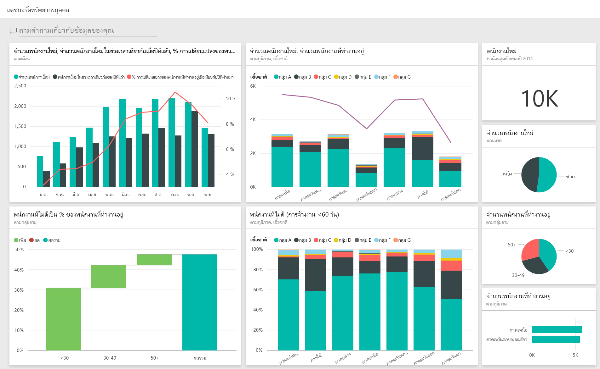
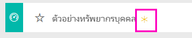
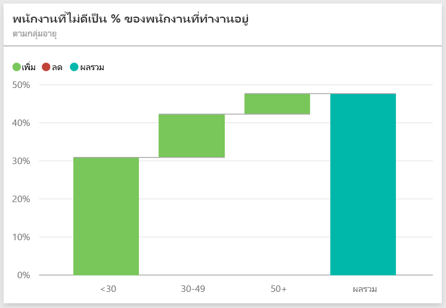
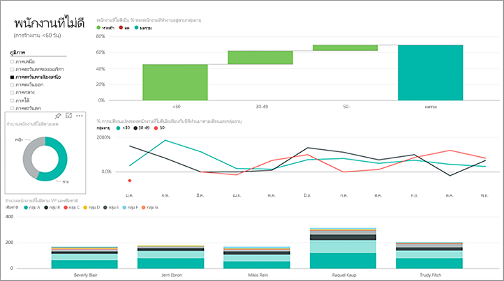
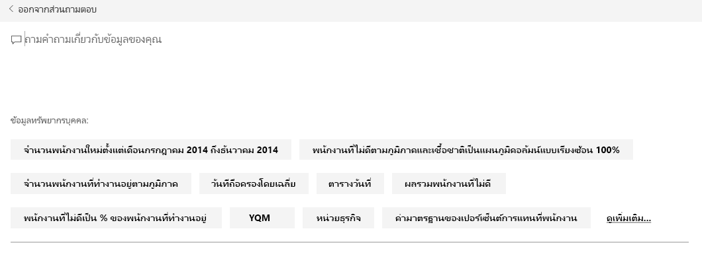
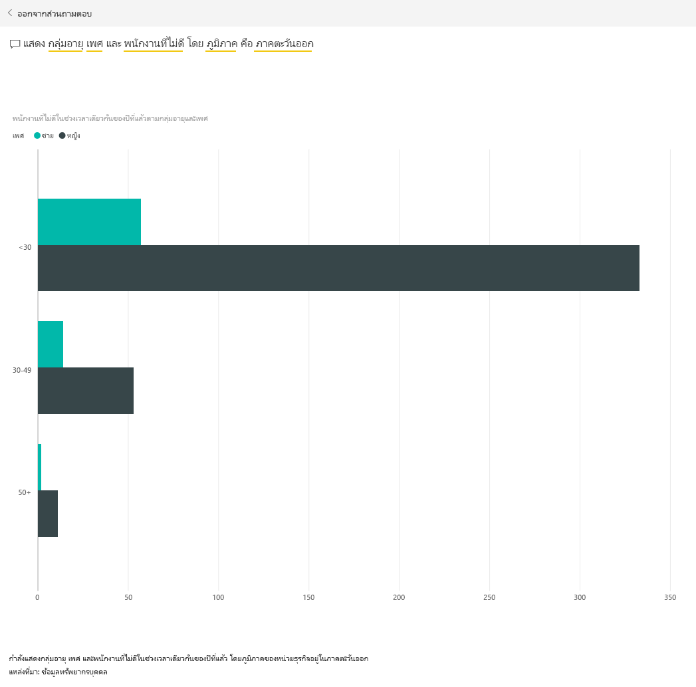

# ตัวอย่างทรัพยากรบุคคลสำหรับ Power BI: ชมการแนะนำ

## ภาพรวมของตัวอย่างทรัพยากรบุคคล
แผนกทรัพยากรบุคคลมีรูปแบบการรายงานเดียวกันในทุกๆ บริษัท แม้ว่าจะอยู่ในอุตสาหกรรมต่างกันหรือมีขนาดต่างกันก็ตาม ตัวอย่างนี้จะเน้นไปที่พนักงานใหม่ พนักงานที่ทำงานอยู่ และพนักงานที่ลาออก และพยายามแสดงแนวโน้มในกลยุทธ์การจ้างงาน วัตถุประสงค์หลักของเราคือ ทำความเข้าใจเกี่ยวกับ:

* เราจ้างใคร
* อคติในกลยุทธ์การจ้างงานของเรา
* แนวโน้มการลาออกตามความสมัครใจ

ตัวอย่างนี้เป็นส่วนหนึ่งของชุดตัวอย่าง ที่แสดงให้เห็นวิธีการที่คุณสามารถใช้ Power BI กับข้อมูล รายงาน และแดชบอร์ดที่เกี่ยวข้องกับธุรกิจ นี่เป็นข้อมูลจริงจาก obviEnce ([www.obvience.com)](http://www.obvience.com/) ที่ตัวตนต่าง ๆ ได้ถูกลบออกไป ข้อมูลมีให้ใช้งานหลายรูปแบบ: ชุดเนื้อหา/แอป, เวิร์กบุ๊ก Excel, หรือไฟล์ Power BI Desktop .pbix ต้องการเรียนรู้เพิ่มเติม ดู [ตัวอย่างชุดข้อมูล](sample-datasets.md)

## ข้อกำหนดเบื้องต้น

 ก่อนที่คุณสามารถใช้ตัวอย่าง คุณต้องดาวน์โหลดในรูปแบบ [ชุดเนื้อหา](https://docs.microsoft.com/power-bi/sample-human-resources#get-the-content-pack-for-this-sample), [ไฟล์.pbix](http://download.microsoft.com/download/6/9/5/69503155-05A5-483E-829A-F7B5F3DD5D27/Human-Resources-Sample-PBIX.pbix) หรือ[เวิร์กบุ๊ก Excel](http://go.microsoft.com/fwlink/?LinkId=529780)

### รับชุดเนื้อหาสำหรับตัวอย่างนี้

1. เปิดบริการ Power BI (app.powerbi.com) และเข้าสู่ระบบ
2. ที่มุมด้านล่างซ้าย เลือก**รับข้อมูล**
   
    
3. บนหน้า รับข้อมูล ที่ปรากฏขึ้น เลือกไอคอน**ตัวอย่าง**
   
   
4. เลือก**ตัวอย่างทรัพยากรบุคคล** แล้วเลือก**เชื่อมต่อ**  
   
   
5. Power BI นำเข้าชุดเนื้อหา และเพิ่มแดชบอร์ด รายงาน และชุดข้อมูลใหม่ไปยังพื้นที่ทำงานปัจจุบันของคุณ เนื้อหาใหม่จะถูกทำเครื่องหมายด้วยเครื่องหมายดอกจันสีเหลือง 
   
   
  
### รับไฟล์ .pbix สำหรับตัวอย่างนี้

อีกทางเลือกหนึ่งคือ คุณสามารถดาวน์โหลดตัวอย่างเป็นไฟล์ .pbix ซึ่งถูกออกแบบมาสำหรับใช้กับ Power BI Desktop 

 * [ตัวอย่างทรัพยากรบุคคล](http://download.microsoft.com/download/6/9/5/69503155-05A5-483E-829A-F7B5F3DD5D27/Human Resources Sample PBIX.pbix)

### รับเวิร์กบุ๊ก Excel สำหรับตัวอย่างนี้
คุณยังสามารถ[ดาวน์โหลดเพียงชุดข้อมูล (เวิร์กบุ๊ก Excel)](http://go.microsoft.com/fwlink/?LinkId=529780) สำหรับตัวอย่างนี้ได้ เวิร์กบุ๊กประกอบด้วยแผ่นงาน Power View ที่คุณสามารถดู และปรับเปลี่ยน เมื่อต้องการดูข้อมูลดิบเลือก **Power Pivot > จัดการ**

## การจ้างใหม่
เรามาสำรวจพนักงานจ้างใหม่กันก่อน

1. ในพื้นที่ทำงานของคุณ เลือกแท็บ**แดชบอร์ด** และเปิดแดชบอร์ดทรัพยากรบุคคล
2. บนแดชบอร์ด เลือกไทล์ **จำนวนการจ้างใหม่, การจ้างใหม่ช่วงเวลาเดียวกันปีที่แล้ว, % การเปลี่ยนแปลง YoY พนักงานที่ทำงาน** **ตามเดือน**  
     

   รายงาน ตัวอย่างทรัพยากรบุคคล จะเปิดไปยังหน้า **การจ้างใหม่**  

   

โปรดสังเกตสิ่งต่อไปนี้:

* แผนภูมิผสม **จำนวนการจ้างใหม่, การจ้างใหม่ช่วงเวลาเดียวกันปีที่แล้ว, % การเปลี่ยนแปลง YoY พนักงานที่ทำงาน ตามเดือน** แสดงให้เห็นว่าเราจ้างคนจำนวนมากกว่าปีที่แล้วทุกเดือน &#151; และบางเดือนก็จ้างเพิ่มขึ้นมาก
* ในแผนภูมิผสม **จำนวนการจ้างใหม่ และพนักงานที่ทำงานอยู่ แบ่งตามภูมิภาคและเชื้อชาติ** เราเห็นว่าเรากำลังจ้างพนักงานในภูมิภาค**ตะวันออก**น้อยลง
* แผนภูมิแบบน้ำตก**ความแปรปรวนของจ้างใหม่ YoY แบ่งตามกลุ่มอายุ** แสดงให้เห็นว่าเรากำลังจ้างคนที่มีอายุน้อยเป็นหลัก ซึ่งอาจจากมาจากลักษณะงานที่ไม่เต็มเวลา
* แผนภูมิวงกลม**จำนวนการจ้างใหม่แบ่งตามเพศ** แสดงระดับใกล้เคียงกัน

คุณสามารถค้นพบข้อมูลเชิงลึกเพิ่มเติม เช่น ภูมิภาคที่การจ้างงานแต่ละเพศมีความแตกต่างกันมาก ได้หรือไม่? เลือกกลุ่มอายุและเพศที่แตกต่างกันในแผนภูมิ เพื่อสำรวจความสัมพันธ์ระหว่างอายุ เพศ ภูมิภาค และกลุ่มเชื้อชาติ

เลือกชื่อของแดชบอร์ดจากแถบนำทางด้านบนเพื่อกลับไปยังแดชบอร์ด

## เปรียบเทียบพนักงานปัจจุบันกับอดีตพนักงาน
ลองสำรวจข้อมูลพนักงานปัจจุบันและพนักงานที่ไม่ได้ทำงานในบริษัทแล้ว

บนแดชบอร์ด เลือกไทล์**จำนวนพนักงานที่ทำงานอยู่ตามกลุ่มอายุ**  

รายงาน ตัวอย่างทรัพยากรบุคคล จะเปิดไปยังหน้า**พนักงานปัจจุบัน เทียบกับ พนักงานที่ออกจากงาน**  

**สิ่งที่น่าสนใจ**:

* แผนภูมิผสมทางด้านซ้าย แสดงการเปลี่ยนแปลงปีต่อปี สำหรับพนักงานที่ทำงานอยู่และที่ออกไป เรามีพนักงานที่ทำงานอยู่ในปีนี้มากขึ้น เพราะมีการจ้างเพิ่มขึ้น แต่การออกจากงานก็มีมากกว่าปีที่แล้วด้วย
* ในเดือนสิงหาคม เรามีพนักงานออกไปมากเทียบกับเดือนอื่น ๆ ลองเลือกกลุ่มอายุ เพศ หรือภูมิภาค ที่ต่างกันดู เพื่อดูว่าคุณสามารถหาค่าที่ผิดปกติได้หรือไม่
* ดูที่แผนภูมิวงกลม เราสังเกตการลาออกของพนักงานของเราตามเพศและกลุ่มอายุมีค่าพอ ๆ กัน ลองเลือกกลุ่มอายุอื่นดู ดูว่าสัดส่วนของเพศที่กลุ่มอายุต่าง ๆ เป็นอย่างไร สัดส่วนของเพศมีค่าใกล้เคียงกันในทุกกลุ่มอายุหรือไม่?

## เหตุผลของการออกจากงาน
มาดูที่รายงาน ในมุมมองการแก้ไขกัน เลือก**แก้ไขรายงาน**ตรงมุมบนซ้าย

เปลี่ยนแผนภูมิวงกลมเพื่อแสดงข้อมูลพนักงานที่ออกไป แทนที่จะเป็นพนักงานที่ทำงานอยู่

1. เลือกแผนภูมิวงกลม**จำนวนพนักงานที่ทำงานอยู่ตามกลุ่มอายุ**
2. ใน**เขตข้อมูล** เลือกลูกศรที่อยู่ถัดจาก**พนักงาน** เพื่อขยายตารางพนักงาน ยกเลิกการกาเครื่องหมายที่อยู่ติดกับ**จำนวนพนักงานที่ทำงานอยู่** เพื่อเอาเขตข้อมูลนั้นออก
3. กาเครื่องหมายที่อยู่ติดกับ**จำนวนการออกจากงาน**ในตารางพนักงาน เพื่อเพิ่มไปยังกล่อง**ค่า**ในเขตข้อมูล
4. กลับไปบนพื้นที่รายงาน เลือกแท่ง**ความสมัครใจ**ในแผนภูมิแท่ง**จำนวนการออกจากงานแยกตามเหตุผลการออกจากงาน** การทำแบบนี้จะไปเน้นผู้ที่ออกจากงานโดยสมัครใจในวิชวลอื่น ๆ ในรายงาน
5. คลิกที่กลุ่มอายุ 50+ ของ แผนภูมิวงกลม จำนวนการออกจากงานตามกลุ่มอายุ

   ดูที่แผนภูมิเส้น การออกจากงานแยกตามเหตุผล ที่มุมล่างขวา แผนภูมินี้จะถูกกรองให้แสดงเฉพาะการออกจากงานตามความสมัครใจ  
   

   สังเกตเห็นแนวโน้มในกลุ่มอายุ 50+ ได้หรือไม่? ในช่วงหลังของปี มีพนักงานอายุเกิน 50 ออกจากงานโดยสมัครใจมากขึ้น นี่เป็นด้านที่น่านำไปตรวจสอบต่อ โดยใช้ข้อมูลเพิ่มเติม
6. คุณสามารถทำตามขั้นตอนเดียวกัน กับแผนภูมิ**จำนวนพนักงานที่ทำงานอยู่แยกตามเพศ** แต่เปลี่ยนเป็นการออกจากงานแทนที่จะเป็นพนักงานที่ยังทำงานอยู่ ดูข้อมูลการออกจากงานโดยสมัครใจ แยกตามเพศว่าคุณเห็นอะไรมากขึ้นบ้าง
7. คลิก **Power BI** ในแถบนำทางด้านบนเพื่อกลับไปยังแดชบอร์ด คุณสามารถบันทึกการเปลี่ยนแปลงคุณที่ทำกับรายงานหรือไม่ก็ได้

## การจ้างที่ไม่ดี
ด้านสุดท้ายที่จะสำรวจคือการจ้างงานที่ไม่ดี เรานิยามการจ้างงานที่ไม่ดี ว่าเป็นพนักงานที่อยู่กับเราได้ไม่เกิน 60 วันแล้วก็ออกไป เรากำลังจ้างคนใหม่อย่างรวดเร็ว เรากำลังจ้างตัวเลือกที่ถูกต้องหรือไม่?

1. เลือกไทล์แดชบอร์ด **% การจ้างงานที่ไม่ดีเทียบกับพนักงานที่ทำ แยกตามกลุ่มอายุ** ซึ่งจะเปิดรายงานไปยังหน้า 3 "การจ้างที่ไม่ดี"

     
2. เลือกกล่องกาเครื่องหมาย**ตะวันตกเฉียงเหนือ** ในตัวแบ่งส่วนข้อมูลภูมิภาคทางด้านซ้าย และเลือกชิ้น **ชาย** ในแผนภูมิโดนัท การจ้างงานที่ไม่ดีแบ่งตามเพศ  ดูที่แผนภูมิอื่น ๆ บนหน้า "การจ้างที่ไม่ดี" การจ้างงานที่ไม่ดีเป็นเพศชายมากกว่าเพศหญิง และมีการจ้างงานที่ไม่ดีในกลุ่ม A จำนวนมาก
     
3. ดูที่แผนภูมิโดนัท **การจ้างที่ไม่ดีแบ่งตามเพศ** และคลิกตัวแบ่งส่วนข้อมูลตาม**ภูมิภาค** เราสังเกตเห็นว่าภูมิภาคตะวันออกเป็นภูมิภาคเดียวที่มีการจ้างงานที่ไม่ดีที่เป็นเพศหญิงมากกว่าเพศชาย  
4. เลือกชื่อของแดชบอร์ดจากแถบนำทางด้านบนเพื่อกลับไปยังแดชบอร์ด

## ถามคำถามในกล่องถามตอบ
[กล่องคำถาม Q&A](power-bi-tutorial-q-and-a.md) เป็นที่ที่คุณพิมพ์คำถามโดยใช้ภาษาธรรมชาติ Q&A เข้าใจคำที่คุณพิมพ์เข้าไป และหาว่าคำตอบอยู่ตรงไหนในชุดข้อมูลของคุณ เพื่อหาคำตอบนั้น

1. คลิกใน กล่องคำถาม Q&A สังเกตว่าก่อนที่คุณจะเริ่มพิมพ์อะไรลงไป กล่อง Q&A มีคำแนะนำอยู่ก่อนแล้ว:

   
2. คุณสามารถเลือกคำแนะนำหนึ่งในนั้น หรือพิมพ์: **แสดงกลุ่มอายุ เพศ และการจ้างงานที่ไม่ดี ช่วงเวลาเดียวกันปีที่แล้ว (SPLY) โดยที่ภูมิภาคคือตะวันออก**  

   

   โปรดสังเกตว่า ส่วนใหญ่ของการจ้างงานเพศหญิงที่ไม่ดีอายุต่ำกว่า 30

นี่เป็นสภาพแวดล้อมที่ปลอดภัยที่จะทดลองสิ่งต่าง ๆ คุณสามารถเลือกที่จะไม่บันทึกการเปลี่ยนแปลงของคุณ ถ้าคุณบันทึก คุณสามารถ**รับข้อมูล**สำหรับสำเนาชุดใหม่ของตัวอย่างนี้ได้เสมอ

## ขั้นตอนถัดไป: เชื่อมต่อกับข้อมูลของคุณ
เราหวังว่าการแนะนำนี้ ได้แสดงให้เห็นว่าแดชบอร์ด, Q&A และรายงาน Power BI สามารถให้ข้อมูลเชิงลึกในข้อมูลทรัพยากรบุคคล ตอนนี้ถึงตาคุณแล้ว — ลองเชื่อมต่อกับข้อมูลของคุณเอง ด้วย Power BI คุณสามารถเชื่อมต่อกับแหล่งข้อมูลที่หลากหลาย เรียนรู้เพิ่มเติมเกี่ยวกับ[เริ่มต้นใช้งาน Power BI](service-get-started.md)  
