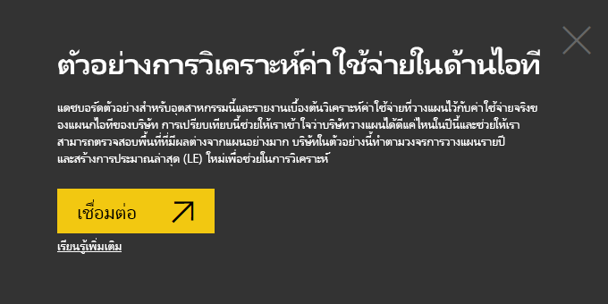
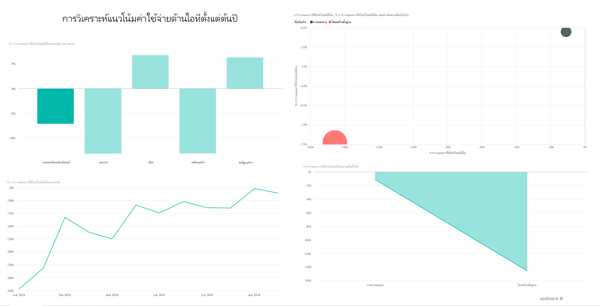
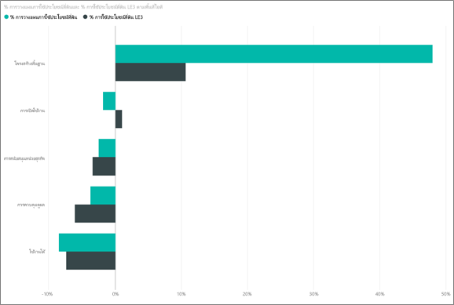
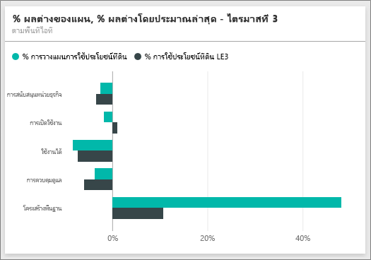

# ตัวอย่างการวิเคราะห์การใช้จ่ายด้าน IT สำหรับ Power BI: ชมการแนะนำ

## ภาพรวมของตัวอย่างการวิเคราะห์การใช้จ่ายด้าน IT
[ชุดเนื้อหา](service-organizational-content-pack-introduction.md) (แดชบอร์ รายงาน และชุดข้อมูล) การวิเคราะห์การใช้จ่ายด้าน IT วิเคราะห์ค่าใช้จ่ายที่วางแผนเทียบกับที่ใช้จริงของแผนก IT การเปรียบเทียบนี้ช่วยให้เรา เข้าใจว่าบริษัทวางแผนไว้สำหรับปีได้ดีแค่ไหน และตรวจสอบด้านที่มีความแตกต่างอย่างมากจากแผน บริษัทในตัวอย่างนี้ ใช้การวางแผนรายปี จากนั้นก็มีการประเมินล่าสุด (Latest Estimation, LE) รายไตรมาส เพื่อช่วยวิเคราะห์การเปลี่ยนแปลงของรายจ่าย IT ตลอดช่วงปีงบประมาณ

ตัวอย่างนี้เป็นส่วนหนึ่งของชุดตัวอย่าง ที่แสดงให้เห็นวิธีการที่คุณสามารถใช้ Power BI กับข้อมูล รายงาน และแดชบอร์ดที่เกี่ยวข้องกับธุรกิจ นี่เป็นข้อมูลจริงจาก obviEnce (<http://obvience.com/>) ที่ตัวตนต่าง ๆ ได้ถูกลบออกไป

## ข้อกำหนดเบื้องต้น

 ก่อนที่คุณสามารถใช้ตัวอย่าง คุณต้องดาวน์โหลดในรูปแบบ [ชุดเนื้อหา](https://docs.microsoft.com/power-bi/sample-it-spend#get-the-content-pack-for-this-sample), [ไฟล์.pbix](http://download.microsoft.com/download/E/9/8/E98CEB6D-CEBB-41CF-BA2B-1A1D61B27D87/IT-Spend-Analysis-Sample-PBIX.pbix) หรือ[เวิร์กบุ๊ก Excel](http://go.microsoft.com/fwlink/?LinkId=529783)

### รับชุดเนื้อหาสำหรับตัวอย่างนี้

1. เปิดบริการ Power BI (app.powerbi.com) และเข้าสู่ระบบ
2. ที่มุมด้านล่างซ้าย เลือก**รับข้อมูล**
   
    
3. บนหน้า รับข้อมูล ที่ปรากฏขึ้น เลือกไอคอน**ตัวอย่าง**
   
   
4. เลือก**ตัวอย่างการวิเคราะห์การใช้จ่ายด้าน IT** แล้วเลือก**เชื่อมต่อ**  
  
   
   
5. Power BI นำเข้าชุดเนื้อหา และเพิ่มแดชบอร์ด รายงาน และชุดข้อมูลใหม่ไปยังพื้นที่ทำงานปัจจุบันของคุณ เนื้อหาใหม่จะถูกทำเครื่องหมายด้วยเครื่องหมายดอกจันสีเหลือง 
   
   
  
### รับไฟล์ .pbix สำหรับตัวอย่างนี้

อีกทางเลือกหนึ่งคือ คุณสามารถดาวน์โหลดตัวอย่างเป็นไฟล์ .pbix ซึ่งถูกออกแบบมาสำหรับใช้กับ Power BI Desktop 

 * [IT ตัวอย่างการวิเคราะห์การใช้จ่าย](http://download.microsoft.com/download/E/9/8/E98CEB6D-CEBB-41CF-BA2B-1A1D61B27D87/IT%20Spend%20Analysis%20Sample%20PBIX.pbix)

### รับเวิร์กบุ๊ก Excel สำหรับตัวอย่างนี้
คุณยังสามารถ[ดาวน์โหลดเพียงชุดข้อมูล (เวิร์กบุ๊ก Excel)](http://go.microsoft.com/fwlink/?LinkId=529783) สำหรับตัวอย่างนี้ได้ เวิร์กบุ๊กประกอบด้วยแผ่นงาน Power View ที่คุณสามารถดู และปรับเปลี่ยน เมื่อต้องการดูข้อมูลดิบ เลือก **Power Pivot > จัดการ**

## แดชบอร์ดตัวอย่างการวิเคราะห์การใช้จ่ายด้าน IT
ไทล์ตัวเลขสองไทล์ บนแดชบอร์ด **%แปรปรวน แผน**และ **%แปรปรวน ประเมินล่าสุด ไตรมาสที่ 3** บอกภาพรวมว่าเราดำเนินไปอย่างไร เทียบกับแผน และเทียบกับการประเมินในไตรมาสล่าสุด (LE3 =ประเมินล่าสุดไตรมาส 3) โดยรวมแล้ว เราผิดไปจากแผนประมาณ 6% เราลองมาสำรวจสาเหตุของความแปรปรวนนี้ – เมื่อไร ที่ไหน และประเภทใด

## หน้า "การวิเคราะห์แนวโน้มการใช้จ่ายด้าน IT YTD" (YTD=ตั้งแต่ต้นปีถึงปัจจุบัน)
เลือกที่ไทล์แดชบอร์ด **%ความแปรปรวน แผน ตามภูมิภาค** จะนำคุณไปยังหน้า "การวิเคราะห์แนวโน้มการใช้จ่ายด้าน IT" ของรายงานตัวอย่างการวิเคราะห์การใช้จ่ายด้าน IT เราเห็นได้อย่างรวดเร็วว่า เรามีค่าความแปรปรวนด้านบวกในสหรัฐอเมริกา และยุโรป และด้านลบในแคนาดา ละตินอเมริกา และออสเตรเลีย สหรัฐอเมริกามีค่าความแปรปรวน +LE ประมาณ 6% และออสเตรเลียมีค่าความแปรปรวน -LE ประมาณ 7%

แต่เพียงแค่ดูแผนภูมินี้และสรุป สามารถทำให้เข้าใจผิดได้ เราจำเป็นต้องดูที่จำนวนเงินจริง ๆ เพื่อให้เห็นภาพที่ถูกต้องยิ่งขึ้น

1. เลือก**ออสเตรเลียและนิวซีแลนด์** ในแผนภูมิ %ความแปรปรวน แผน ตามภูมิภาค และดูแผนภูมิ ความแปรปรวน แผน ตามด้านของ IT

   
2. ตอนนี้ เลือก**สหรัฐอเมริกา** คุณน่าจะคิดได้แล้ว — ออสเตรเลียเป็นเพียงส่วนเล็ก ๆ ของการใช้จ่ายของเราเมื่อเทียบกับสหรัฐอเมริกา

    ดังนั้น เราบีบให้แคบลงเหลือแค่สหรัฐอเมริกา แล้วเราต้องทำอะไรต่อ เรามาสำรวจว่าส่วนไหนในสหรัฐอเมริกาที่ทำให้เกิดความแปรปรวน

## ถามคำถามจากข้อมูล
1. เลือก**ตัวอย่างการวิเคราะห์การใช้จ่ายด้าน IT** ในแถบนำทางด้านบนเพื่อกลับไปยังแดชบอร์ด
2. ในกล่องคำถาม พิมพ์ "แสดงด้านของ IT, %ความแปรปรวน แผน, %ความแปรปรวน le3 แผนภูมิแท่ง"

   

   ในด้านแรกของ IT ซึ่งก็คือ **โครงสร้างพื้นฐาน** เปอร์เซ็นต์มีการเปลี่ยนแปลงอย่างรวดเร็ว ระหว่างค่าความแปรปรวนของแผนเริ่มต้น และค่าความแปรปรวนของแผนจากการประเมินล่าสุด

## หน้า "การใช้จ่าย ตามประเภทค่าใช้จ่าย YTD"
ย้อนกลับไปยังแดชบอร์ด และดูไทล์แดชบอร์ด **%ความแปรปรวน แผน %ความแปรปรวน LE3**

โครงสร้างพื้นฐาน เป็นรายการที่เด่นออกมา ด้วยค่าความแปรปรวนเป็นบวกที่ใหญ่มาก

1. คลิกที่ไทล์นี้ เพื่อต่อไปยังหน้า "การใช้จ่าย ตามประเภทค่าใช้จ่าย YTD" ของรายงานตัวอย่างการวิเคราะห์การใช้จ่ายด้าน IT
2. คลิกที่แท่ง**โครงสร้างพื้นฐาน**ในแผนภูมิ "%ความแปรปรวน แผน %ความแปรปรวน LE3 ตามด้านของ IT" ในด้านล่างซ้าย และสังเกตค่าความแปรปรวนเทียบกับแผนใน "%ความแปรปรวน แผน ตามภูมิภาคการขาย" ทางด้านซ้าย

    
3. คลิกที่ชื่อของแต่ละ ประเภทค่าใช้จ่าย ในตัวแบ่งส่วนข้อมูลเพื่อค้นหา ประเภทค่าใช้จ่ายที่มีค่าความแปรปรวนขนาดใหญ่
4. เมื่อมีการเลือก**อื่น ๆ**แล้ว ให้คลิก**โครงสร้างพื้นฐาน**ในด้านของ IT และคลิกด้านย่อยในตัวแบ่งส่วนข้อมูล ด้านย่อยของ IT เพื่อค้นหาด้านย่อย ที่มีความแปรปรวนมากที่สุด  

   เราเห็นความแปรปรวนขนาดใหญ่ใน**เครือข่าย**

   บริษัทตัดสินใจให้บริการโทรศัพท์แก่พนักงานเป็นสวัสดิการ แต่เรื่องนี้ไม่ได้วางแผนเอาไว้ก่อน

## หน้า "การวิเคราะห์ความแปรปรวนของแผน"
ยังอยู่ในรายงาน คลิกที่แท็บ "การวิเคราะห์ความแปรปรวนของแผน" ที่ด้านล่างของรายงานเพื่อไปที่หน้า 3 ของรายงาน

ในแผนภูมิผสม "ความแปรปรวนแผน, %ความแปรปรวนแผน ตามด้านของธุรกิจ" ทางด้านซ้าย คลิกที่คอลัมน์ โครงสร้างพื้นฐาน เพื่อไฮไลต์ค่าโครงสร้างพื้นฐานในส่วนเหลือของหน้า

สังเกตว่า บนแผนภูมิ “%ความแปรปรวนแผน ตามเดือนและด้านของธุรกิจ" โครงสร้างพื้นฐานเริ่มที่จะมีค่าความแปรปรวนเป็นบวกราว ๆ เดือนกุมภาพันธ์ และเพิ่มขึ้นอย่างต่อเนื่องหลังจากนั้น นอกจากนี้ยังสังเกตว่า ค่าความแปรปรวนของแผน สำหรับโครงสร้างพื้นฐาน แตกต่างกันตามประเทศ เทียบกับค่าของทุก ๆ ด้านของธุรกิจ ใช้ตัวแบ่งส่วนข้อมูล "ด้านของ IT" และ "ด้านย่อยของ IT" ทางด้านขวาเพื่อกรองค่าในส่วนเหลือของหน้า แทนที่จะไฮไลต์พวกนั้น คลิกที่ด้านของ IT ด้านต่าง ๆ ทางด้านขวาเพื่อสำรวจข้อมูลในอีกวิธีหนึ่ง คุณยังสามารถคลิกด้านย่อยของ IT และดูค่าความแปรปรวนที่ระดับนั้น

## แก้ไขรายงาน
คลิก**แก้ไขรายงาน**ในมุมบนซ้าย และสำรวจในมุมมองการแก้ไข

* ดูว่าหน้าถูกสร้างขึ้นอย่างไร – เขตข้อมูลในแต่ละแผนภูมิ ตัวกรองบนหน้า
* เพิ่มหน้าและแผนภูมิที่มาจากข้อมูลเดียวกัน
* เปลี่ยนชนิดของการแสดงภาพสำหรับแต่ละแผนภูมิ
* ปักหมุดเหล่านั้นไปยังแดชบอร์ดของคุณ

นี่เป็นสภาพแวดล้อมที่ปลอดภัยที่จะทดลองสิ่งต่าง ๆ คุณสามารถเลือกที่จะไม่บันทึกการเปลี่ยนแปลงของคุณ ถ้าคุณบันทึก คุณสามารถรับข้อมูล สำหรับสำเนาชุดใหม่ของตัวอย่างนี้ได้เสมอ

## ขั้นตอนถัดไป: เชื่อมต่อกับข้อมูลของคุณ
เราหวังว่าการแนะนำนี้ ได้แสดงให้เห็นว่าแดชบอร์ด, Q&A และรายงาน Power BI สามารถให้ข้อมูลเชิงลึกในข้อมูลการใช้จ่ายด้าน IT ตอนนี้ถึงตาคุณแล้ว — ลองเชื่อมต่อกับข้อมูลของคุณเอง ด้วย Power BI คุณสามารถเชื่อมต่อกับแหล่งข้อมูลที่หลากหลาย เรียนรู้เพิ่มเติมเกี่ยวกับ[เริ่มต้นใช้งาน Power BI](service-get-started.md)
