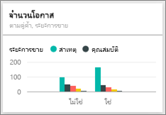

# ตัวอย่างการวิเคราะห์โอกาสทางการขายสำหรับ Power BI: ชมการแนะนำ

ชุดเนื้อหาตัวอย่างการวิเคราะห์โอกาสทางการขายประกอบไปด้วยแดชบอร์ด รายงาน และชุดข้อมูลสำหรับบริษัทซอฟต์แวร์ที่มีช่องทางขาย 2 ช่องทาง: *โดยตรง*และ*ผ่านคู่ค้า* ผู้จัดการฝ่ายขายสร้างแดชบอร์ดนี้เพื่อติดตามโอกาสและรายได้ตามภูมิภาค ขนาดโอกาส และช่องทาง

ตัวอย่างนี้อาศัยตัววัดรายได้สองตัว:

* รายได้: ยอดประเมินจากเจ้าหน้าที่ฝ่ายขายเกี่ยวกับรายได้ที่จะได้รับ
* รายได้ตามปัจจัย: คำนวณจากรายได้ X % ความน่าจะเป็น และเป็นที่ยอมรับว่าค่านี้เป็นค่าที่ใช้คาดการณ์ยอดขายจริงได้แม่นยำกว่า ความน่าเป็นกำหนดจาก*ขั้นตอนการขาย*ปัจจุบันของข้อตกลง
  * ลูกค้าเป้าหมาย: 10%  
  * คุณสมบัติ: 20%  
  * วิธีการแก้ไข: 40%  
  * ข้อเสนอ: 60%  
  * เสร็จสิ้น: 80%

ตัวอย่างนี้เป็นส่วนหนึ่งของชุดตัวอย่าง ที่แสดงให้เห็นวิธีการที่คุณสามารถใช้ Power BI กับข้อมูล รายงาน และแดชบอร์ดที่เกี่ยวข้องกับธุรกิจ ตัวอย่างนี้ถูกสร้างขึ้นจากข้อมูลจริงจาก[obviEnce](http://www.obvience.com/) ที่ไม่มีการระบุชื่อ ข้อมูลมีให้ใช้งานหลายรูปแบบ: ชุดเนื้อหา ไฟล์ Power BI Desktop .pbix หรือเวิร์กบุ๊ก Excel ดู [ตัวอย่างสำหรับ Power BI](sample-datasets.md) 

บทช่วยสอนนี้จะสำรวจชุดเนื้อหาของตัวอย่างการวิเคราะห์โอกาสทางการขายในบริการของ Power BI เนื่องจากประสบการณ์การใช้รายงานจะคล้ายคลึงกันใน Power BI Desktop ดังนั้นคุณสามารถใช้ Power BI Desktop กับไฟล์ .pbix ตัวอย่างใน Power BI Desktop ได้ 

คุณไม่จำเป็นต้องมีสิทธิการใช้งาน Power BI ในการสำรวจตัวอย่างใน Power BI Desktop ถ้าคุณไม่มีสิทธิการใช้งาน Power BI Pro คุณสามารถบันทึกตัวอย่างไปยังพื้นที่ทำงานของฉันในบริการของ Power BI ได้ 

## รับตัวอย่าง

ก่อนที่คุณสามารถใช้ตัวอย่าง คุณต้องดาวน์โหลดในรูปแบบ[ชุดเนื้อหา](#get-the-content-pack-for-this-sample) [ไฟล์ .pbix](#get-the-pbix-file-for-this-sample) หรือ[เวิร์กบุ๊ก Excel](#get-the-excel-workbook-for-this-sample)

### รับชุดเนื้อหาสำหรับตัวอย่างนี้

1. เปิดบริการ Power BI (app.powerbi.com) ลงชื่อเข้าใช้ และเปิดพื้นที่ทำงานที่คุณต้องการบันทึกตัวอย่าง 

    ถ้าคุณไม่มีสิทธิการใช้งาน Power BI Pro คุณสามารถบันทึกตัวอย่างไปยังพื้นที่ทำงานของฉัน

2. ที่มุมด้านล่างซ้าย เลือก**รับข้อมูล**

    
3. บนหน้า **รับข้อมูล** ที่ปรากฏขึ้น เลือก **ตัวอย่าง**

4. เลือก**ตัวอย่างการวิเคราะห์โอกาสทางการขาย** แล้วเลือก**เชื่อมต่อ**  

   
5. Power BI นำเข้าชุดเนื้อหา จากนั้นเพิ่มแดชบอร์ด รายงาน และชุดข้อมูลใหม่ไปยังพื้นที่ทำงานปัจจุบันของคุณ

   

### รับไฟล์ .pbix สำหรับตัวอย่างนี้

อีกทางเลือกหนึ่งคือ คุณสามารถดาวน์โหลดตัวอย่างการวิเคราะห์โอกาสทางการขายเป็น[ไฟล์ .pbix](http://download.microsoft.com/download/9/1/5/915ABCFA-7125-4D85-A7BD-05645BD95BD8/Opportunity%20Analysis%20Sample%20PBIX.pbix) ซึ่งถูกออกแบบมาสำหรับใช้กับ Power BI Desktop

### รับเวิร์กบุ๊ก Excel สำหรับตัวอย่างนี้

ถ้าคุณต้องการดูแหล่งข้อมูลสำหรับตัวอย่างนี้ ตัวอย่างนี้ยังมีให้ในรูปแบบ[เวิร์กบุ๊ก Excel](http://go.microsoft.com/fwlink/?LinkId=529782) เวิร์กบุ๊กประกอบด้วยแผ่นงาน Power View ที่คุณสามารถดู และปรับเปลี่ยน หากต้องการดูข้อมูลดิบ ให้เปิดใช้งาน add-in การวิเคราะห์ข้อมูล แล้วจากนั้นเลือก**Power Pivot > จัดการ** หากต้องการเปิดใช้งาน Power View และ Power Pivot add-in โปรดดทีู่[ดูตัวอย่าง Excel จากใน Excel เอง](sample-datasets.md#optional-take-a-look-at-the-excel-samples-from-inside-excel-itself)สำหรับรายละเอียด

## แดชบอร์ดกำลังบอกอะไรแก่เรา
ผู้จัดการฝ่ายขายของเราได้สร้างแดชบอร์ดเพื่อติดตามเมตริกที่สำคัญที่สุดของเธอ เมื่อเธอเห็นสิ่งใดที่น่าสนใจ เธอสามารถเลือกไทล์เพื่อค้นหาข้อมูลนั้นได้:

- รายได้ของบริษัทคือ 2 พันล้านเหรียญ และรายได้ที่แยกแยะแล้ว คือ 461 ล้านเหรียญ
- จำนวนโอกาสทางการขายและรายได้ เป็นไปตามรูปแบบกรวยที่คุ้นเคย โดยค่าผลรวมมีค่าที่ทยอยลดลงเมื่อผ่านไปยังขั้นตอนถัด ๆ ไป
- โอกาสทางการขายของเรา ส่วนใหญ่อยู่ในภูมิภาคตะวันออก
- โอกาสที่มีขนาดใหญ่กว่าจะสร้างรายได้ให้มากกว่าโอกาสขนาดกลางหรือโอกาสขนาดเล็ก
- ข้อเสนอของพันธมิตรรายใหญ่สร้างรายได้เพิ่มขึ้น: $ 8 ล้านโดยเฉลี่ยเมื่อเทียบกับ $ 6 ล้านสำหรับการขายตรง

เนื่องจากความพยายามเพื่อให้ได้ข้อตกลงมีเท่ากัน ไม่ว่าข้อตกลงนั้นจะจัดเป็นขนาดใหญ่ กลาง หรือเล็ก บริษัทของเราควรวิเคราะห์ข้อมูลเพื่อศึกษาเพิ่มเติมเกี่ยวกับโอกาสขนาดใหญ่

1. ในพื้นที่ทำงานที่คุณบันทึกตัวอย่าง เปิดแท็บ **แดชบอร์ด** จาก นั้นค้นหาแดชบอร์ด**ตัวอย่างการวิเคราะห์โอกาสทางการขาย** และเลือก

2. เลือกไทล์ **จำนวนโอกาสทางการขายตามการขับเคลื่อนของคู่ค้า ขั้นตอนการขาย** เพื่อเปิดหน้าแรกของรายงานตัวอย่างการวิเคราะห์โอกาสทางการขาย 

    

## สำรวจหน้าต่าง ๆ ในรายงาน

ดูแต่ละหน้าในรายงานโดยการเลือกแท็บหน้าที่ด้านล่าง

### หน้าภาพรวมจำนวนโอกาสทางการขาย

บันทึกรายละเอียดดังต่อไปนี้:
* ตะวันออก คือภูมิภาคที่ใหญ่ที่สุดของเราในแง่จำนวนโอกาสทางการขาย  
* บนแผนภูมิวงกลม**จำนวนโอกาสทางการขายตามภูมิภาค** เลือกแต่ละภูมิภาคเพื่อกรองหน้าตามภูมิภาคตามลำดับ สำหรับแต่ละภูมิภาค โปรดสังเกตว่าคู่ค้าจะพยายามคว้าหาโอกาสขนาดใหญ่มากกว่า   
* แผนภูมิคอลัมน์**จำนวนโอกาสตามการขับเคลื่อนของคู่ค้าและขนาดของโอกาส** แสดงให้เห็นว่าโอกาสขนาดใหญ่ส่วนใหญ่ถูกขับเคลื่อนโดยคู่ค้า ขณะที่โอกาสขนาดเล็กและขนาดกลางอีกมากมายไม่ได้ถูกขับเคลื่อนโดยคู่ค้า
* ในแผนภูมิแท่ง **จำนวนโอกาสทางการขายตามขั้นตอนการขาย** เลือกแต่ละ**ขั้นตอนการขาย**ตามลำดับเพื่อดูความแตกต่างของจำนวนภูมิภาค โปรดสังเกตว่าแม้ว่าภูมิภาคตะวันออกจะมีโอกาสทางการขายครั้งใหญ่ที่สุด แต่ภูมิภาคทั้งสามในโซลูชัน ข้อเสนอ และขั้นตอนการขายสุดท้ายนั้นมีจำนวนใกล้เคียงกัน ผลลัพธ์นี้หมายความว่าเราสามารถปิดการขายในภูมิภาคกลางและตะวันตกด้วยเปอร์เซ็นต์ที่สูงกว่า

### หน้าการวิเคราะห์รายได้
หน้านี้จะดูที่ข้อมูลคล้ายกัน แต่ใช้มุมมองของรายได้แทนที่จะเป็นการนับจำนวน  

บันทึกรายละเอียดดังต่อไปนี้:
* ภูมิภาคตะวันออกเป็นภูมิภาคที่ใหญ่ที่สุดของเรา ไม่เพียงแค่จำนวนโอกาสแต่ยังรวมถึงรายได้ด้วย  
* ถ้าคุณกรองแผนภูมิ **รายได้ตามขั้นตอนการขายและการขับเคลื่อนโดยคู่ค้า**โดยการเลือก**ใช่**สำหรับ**การขับเคลื่อนโดยคู่ค้า** คุณจะเห็นรายได้ $1.5 พันล้านเหรียญและรายได้ตามปัจจัย $294 ล้านเหรียญ เปรียบเทียบจำนวนเหล่านี้กับ $644 ล้านเหรียญ และ $166 ล้านเหรียญสำหรับรายได้ที่ไม่ได้มาจากการขับเคลื่อนโดยคู่ค้า 
* รายได้เฉลี่ยสำหรับบัญชีขนาดใหญ่มีขนาดมากกว่า 8 ล้านถ้าโอกาสทางการขายมาจากการขับเคลื่อนของคู่ค้า เทียบกับตัวเลข 6 ล้าน สำหรับธุรกิจที่ไม่ได้มาจากการขับเคลื่อนของคู่ค้า  
* สำหรับธุรกิจที่ขับเคลื่อนโดยคู่ค้า รายได้เฉลี่ยต่อโอกาสทางการขายขนาดใหญ่ เกือบจะเป็นสองเท่าของโอกาสทางการขายขนาดกลาง  
* รายได้เฉลี่ยสำหรับธุรกิจขนาดเล็กและขนาดกลาง มีค่าใกล้เคียงกันทั้งที่ขับเคลื่อนโดยคู่ค้า และไม่ได้ขับเคลื่อนโดยคู่ค้า   

ชัดเจนแล้วว่าคู่ค้าของเราขายให้กับลูกค้าได้ดีกว่าบริษัทที่ไม่ใช่คู่ค้า จึงสมเหตุสมผลที่จะส่งต่อข้อเสนอไปทางคู่ค้าให้มากขึ้น

### จำนวนโอกาสทางการขายตามภูมิภาคและขั้นตอน
หน้านี้ของรายงานดูที่ข้อมูลคล้ายกับข้อมูลในหน้าก่อนหน้า แต่แยกตามภูมิภาคและขั้นตอน 

บันทึกรายละเอียดดังต่อไปนี้:
* ถ้าคุณเลือก**ตะวันออก**ในแผนภูมิวงกลม**จำนวนโอกาสทางการขายตามภูมิภาค**เพื่อกรองตามภูมิภาคตะวันออก คุณเห็นว่าโอกาสทางการขายในขอบเขตนี้จะถูกแบ่งออกระหว่างโอกาสจากการขับเคลื่อนของคู่ค้าและโอกาสที่ไม่ได้มาจากการชับเคลื่อนของคู่ค้าเกือบเท่ากัน
* โอกาสขนาดใหญ่พบได้มากสุดในภูมิภาคส่วนกลาง โอกาสขนาดเล็กพบมากในภูมิภาคตะวันออก และโอกาสขนาดกลางพบมากสุดในภูมิภาคตะวันตก

### หน้าโอกาสทางการขายที่จะเกิดขึ้นตามเดือน
สำหรับหน้านี้ เรากำลังดูปัจจัยที่คล้ายกัน แต่จากมุมมองของวันที่และเวลา 
 

CFO ของเราใช้หน้านี้เพื่อจัดสรรปริมาณงาน โดยดูที่โอกาสของรายได้ ตามขั้นตอนการขายและเดือน เธอสามารถวางแผนตามนั้น

บันทึกรายละเอียดดังต่อไปนี้:
* รายได้เฉลี่ยสำหรับขั้นตอนการขายสุดท้ายมีค่าสูงสุด การปิดข้อเสนอเหล่านี้ คือสิ่งสำคัญที่สุด
* หากคุณกรองตามเดือน (โดยการเลือกเดือนในตัวแบ่งส่วนข้อมูล**เดือน**) คุณจะเห็นว่าเดือนมกราคมมีข้อเสนอขนาดใหญ่ในขั้นตอนการสุดท้ายเป็นสัดส่วนที่สูงด้วยรายได้ตามปัจจัยที่ $75 ล้านเหรียญ ในทางกลับกัน เดือนกุมภาพันธ์มีข้อเสนอปานกลางในขั้นตอนการขายของโซลูชันและข้อเสนอเป็นส่วนใหญ่
* โดยทั่วไป ตัวเลขรายได้ที่แยกแยะแล้ว ผันผวนตาม ขั้นตอนการขาย จำนวนโอกาส และขนาดของข้อเสนอ เพิ่มตัวกรองสำหรับปัจจัยเหล่านี้โดยใช้บานหน้าต่าง **ตัวกรอง** เพื่อค้นหาข้อมูลเชิงลึกเพิ่มเติม

## ขั้นตอนถัดไป: เชื่อมต่อไปยังข้อมูลของคุณ
สภาพแวดล้อมนี้มีความปลอดภัยให้ดำเนินการต่าง ๆ ได้ เนื่องจากคุณสามารถเลือกที่จะไม่บันทึกการเปลี่ยนแปลงของคุณ ถ้าคุณบันทึก คุณสามารถเลือก **รับข้อมูล** สำหรับสำเนาชุดใหม่ของตัวอย่างนี้ได้เสมอ

เราหวังว่าการแนะนำนี้ได้แสดงให้เห็นว่าแดชบอร์ด Q&A และรายงาน Power BI สามารถให้ข้อมูลเชิงลึกในข้อมูลตัวอย่าง ตอนนี้ถึงตาคุณแล้ว ลองเชื่อมต่อกับข้อมูลของคุณเอง ด้วย Power BI คุณสามารถเชื่อมต่อกับแหล่งข้อมูลที่หลากหลาย เมื่อต้องการเรียนรู้เพิ่มเติม ดู[เริ่มต้นใช้งานบริการ Power BI](service-get-started.md)

