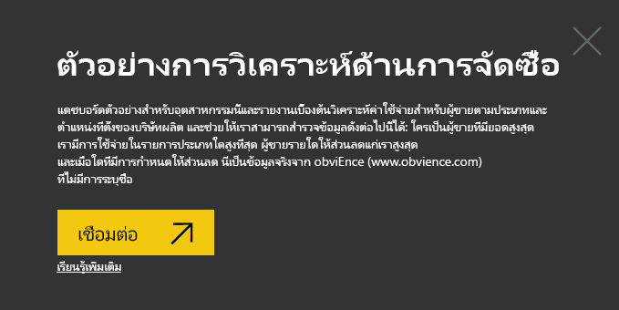
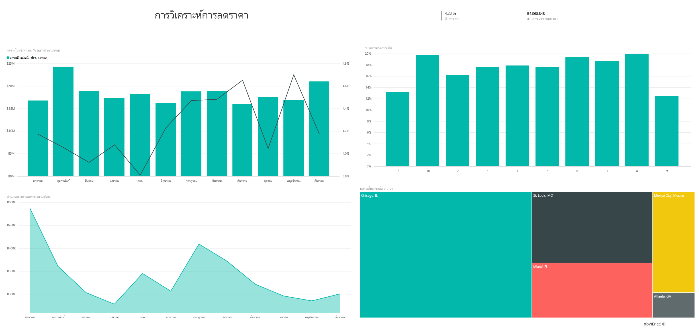
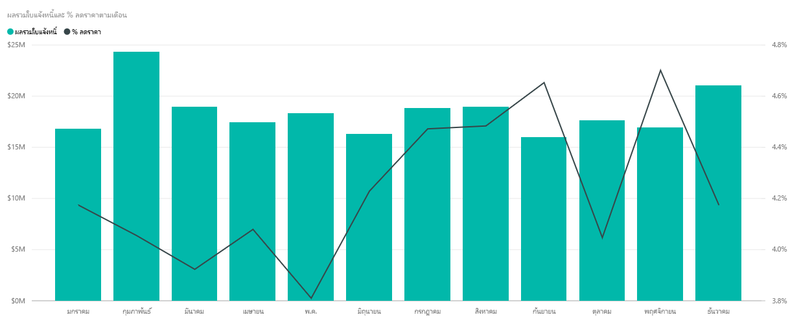
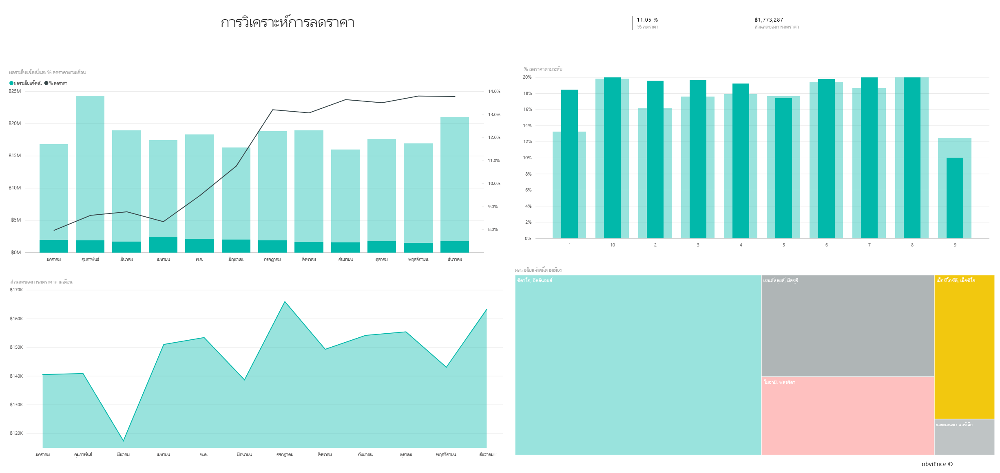

# ตัวอย่างการวิเคราะห์การจัดซื้อสำหรับ Power BI: ชมการแนะนำ

ชุดเนื้อหาตัวอย่างการวิเคราะห์การจัดซื้อประกอบด้วยแดชบอร์ด รายงาน และชุดข้อมูลที่วิเคราะห์ค่าใช้จ่ายเกี่ยวกับผู้จัดจำหน่ายของบริษัทผลิตตามประเภทและตำแหน่งที่ตั้ง ในตัวอย่าง เราสำรวจด้านต่าง ๆ เหล่านี้:

* ใครคือผู้จัดจำหน่ายที่ติดอันดับสูงสุด
* ค่าใช้จ่ายประเภทใดที่เราจ่ายมากที่สุด
* ผู้จัดจำหน่ายรายใดที่ให้ส่วนลดแก่เราสูงสุด และเมื่อใด

ตัวอย่างนี้เป็นส่วนหนึ่งของชุดตัวอย่าง ที่แสดงให้เห็นวิธีการที่คุณสามารถใช้ Power BI กับข้อมูล รายงาน และแดชบอร์ดที่เกี่ยวข้องกับธุรกิจ ซึ่งสร้างขึ้นโดย [obviEnce](http://www.obvience.com/) ด้วยข้อมูลจริงที่ไม่มีการระบุชื่อ ข้อมูลมีให้ใช้งานหลายรูปแบบ: ชุดเนื้อหา ไฟล์ Power BI Desktop .pbix หรือเวิร์กบุ๊ก Excel ดู [ตัวอย่างสำหรับ Power BI](sample-datasets.md) 

บทช่วยสอนนี้จะสำรวจชุดเนื้อหาของตัวอย่างการวิเคราะห์การจัดซื้อในบริการของ Power BI เนื่องจากประสบการณ์การใช้รายงานจะคล้ายคลึงกันใน Power BI Desktop ดังนั้นคุณสามารถใช้ Power BI Desktop กับไฟล์ .pbix ตัวอย่างใน Power BI Desktop ได้ 

คุณไม่จำเป็นต้องมีสิทธิการใช้งาน Power BI ในการสำรวจตัวอย่างใน Power BI Desktop ถ้าคุณไม่มีสิทธิการใช้งาน Power BI Pro คุณสามารถบันทึกตัวอย่างไปยังพื้นที่ทำงานของฉันในบริการของ Power BI ได้ 

## รับตัวอย่าง

ก่อนที่คุณสามารถใช้ตัวอย่าง คุณต้องดาวน์โหลดในรูปแบบ[ชุดเนื้อหา](#get-the-content-pack-for-this-sample)[ไฟล์ .pbix](#get-the-pbix-file-for-this-sample) หรือ[เวิร์กบุ๊ก Excel](#get-the-excel-workbook-for-this-sample)

### รับชุดเนื้อหาสำหรับตัวอย่างนี้

1. เปิดบริการ Power BI (app.powerbi.com) ลงชื่อเข้าใช้ และเปิดพื้นที่ทำงานที่คุณต้องการบันทึกตัวอย่าง 

    ถ้าคุณไม่มีสิทธิการใช้งาน Power BI Pro คุณสามารถบันทึกตัวอย่างไปยังพื้นที่ทำงานของฉัน

2. ที่มุมด้านล่างซ้าย เลือก**รับข้อมูล**

    
3. บนหน้า **รับข้อมูล** ที่ปรากฏขึ้น เลือก **ตัวอย่าง**

4. เลือก**ตัวอย่างการวิเคราะห์การจัดซื้อ** แล้วเลือก**เชื่อมต่อ**  
  
   
   
5. Power BI นำเข้าชุดเนื้อหา จากนั้นเพิ่มแดชบอร์ด รายงาน และชุดข้อมูลใหม่ไปยังพื้นที่ทำงานปัจจุบันของคุณ
   
   
  
### รับไฟล์ .pbix สำหรับตัวอย่างนี้

อีกทางเลือกหนึ่งคือ คุณสามารถดาวน์โหลดตัวอย่างการวิเคราะห์การจัดซื้อเป็น[ไฟล์ .pbix](https://download.microsoft.com/download/D/5/3/D5390069-F723-413B-8D27-5888500516EB/Procurement%20Analysis%20Sample%20PBIX.pbix) ซึ่งถูกออกแบบมาสำหรับใช้กับ Power BI Desktop 

### รับเวิร์กบุ๊ก Excel สำหรับตัวอย่างนี้

ถ้าคุณต้องการดูแหล่งข้อมูลสำหรับตัวอย่างนี้ ตัวอย่างนี้ยังมีให้ในรูปแบบ[เวิร์กบุ๊ก Excel](https://go.microsoft.com/fwlink/?LinkId=529784) เวิร์กบุ๊กประกอบด้วยแผ่นงาน Power View ที่คุณสามารถดู และปรับเปลี่ยน หากต้องการดูข้อมูลดิบ ให้เปิดใช้งาน add-in การวิเคราะห์ข้อมูล แล้วจากนั้นเลือก**Power Pivot > จัดการ** หากต้องการเปิดใช้งาน Power View และ Power Pivot add-in โปรดดทีู่[ดูตัวอย่าง Excel จากใน Excel เอง](sample-datasets.md#optional-take-a-look-at-the-excel-samples-from-inside-excel-itself)สำหรับรายละเอียด

## แนวโน้มค่าใช้จ่าย
ก่อนอื่น มาดูแนวโน้มค่าใช้จ่ายตามประเภทและตำแหน่งที่ตั้ง  

1. ในพื้นที่ทำงานที่คุณบันทึกตัวอย่าง เปิดแท็บ **แดชบอร์ด** จาก นั้นค้นหาแดชบอร์ด**ตัวอย่างการวิเคราะห์การจัดซื้อ** และเลือก 
2. เลือกไทล์แดชบอร์ด**ใบแจ้งหนี้รวมตามประเทศ/ภูมิภาค**ซึ่งเปิดขึ้นในหน้า**ภาพรวมการใช้จ่าย**ของรายงาน**ตัวอย่างการวิเคราะห์การจัดซื้อ**

    

บันทึกรายละเอียดดังต่อไปนี้:

* ในแผนภูมิเส้น**ใบแจ้งหนี้รวมตามเดือนและประเภท**: ประเภท**โดยตรง**มีการใช้จ่ายที่ค่อนข้างเสมอต้นเสมอปลาย ประเภท**ลอจิสติกส์**มีค่าสูงสุดในเดือนธันวาคม และประเภท**อื่น ๆ** มีการดีดขึ้นในเดือนกุมภาพันธ์
* ในแผนที่**ใบแจ้งหนี้รวมตามประเทศ/ภูมิภาค**: ส่วนใหญ่ของค่าใช้จ่ายของเราอยู่ในสหรัฐอเมริกา
* ในแผนภูมิคอลัมน์**ใบแจ้งหนี้รวมตามประเภทย่อย**: **ฮาร์ดแวร์**และ**สินค้าทางอ้อมและบริการ** เป็นประเภทมีค่าใช้จ่ายสูงที่สุด
* ในแผนภูมิแท่ง **ใบแจ้งหนี้รวมตามระดับ**: ธุรกิจส่วนใหญ่ของเราทำกับผู้จัดจำหน่ายระดับ 1 (10 อันดับแรก) การดำเนินการดังกล่าวช่วยให้เราสามารถจัดการความสัมพันธ์ผู้จัดจำหน่ายได้ดียิ่งขึ้น

## ค่าใช้จ่ายในเม็กซิโก
เรามาสำรวจค่าใช้จ่ายในเม็กซิโกกัน

1. ในแผนที่**ใบแจ้งหนี้รวมตามประเทศ/ภูมิภาค** เลือกแผนภูมิแบบฟอง **เม็กซิโก** โปรดสังเกตว่า ในแผนภูมิคอลัมน์ **ใบแจ้งหนี้รวมตามประเภทย่อย** ค่าใช้จ่ายส่วนใหญ่จะอยู่ในประเภทย่อย **สินค้าทางอ้อมและบริการ**

   
2. การดูรายละเอียดลึกลงไปในคอลัมน์**สินค้าทางอ้อมและบริการ**:

   * ในแผนภูมิ **ใบแจ้งหนี้รวมตามประเภทย่อย**เลือกลูกศรดูรายละเอียดแนวลึก ในมุมขวาบนของแผนภูมิ
   * เลือกคอลัมน์**สินค้าทางอ้อมและบริการ**

      ตามที่คุณเห็น ค่าใช้จ่ายสูงสุดโดยมากสำหรับประเภทย่อย **ยอดขายและการตลาด**
   * เลือก**เม็กซิโก**ในแผนที่อีกครั้ง

      สำหรับเม็กซิโก ค่าใช้จ่ายที่สำคัญที่สุดคือประเภทย่อย **การบำรุงรักษาและการซ่อมแซม**

      
3. เลือกลูกศรขึ้นที่มุมบนซ้ายของแผนภูมิเพื่อกลับขึ้นไปข้างบน
4. เลือกลูกศรดูรายละเอียดแนวลึกอีกครั้งเพื่อปิดการใช้รายละเอียดแนวลึก  
5. ในบานหน้าต่างนำทางด้านบน ให้เลือก**ตัวอย่างการวิเคราะห์การจัดซื้อ** เพื่อกลับไปยังแดชบอร์ด

## ประเมินเมืองต่าง ๆ
เราสามารถใช้การไฮไลต์ เพื่อประเมินค่าเมืองต่าง ๆ กัน

1. เลือกไทล์แดชบอร์ด**ใบแจ้งหนี้รวม, % ส่วนลดตามเดือน** ซึ่งเปิดขึ้นในหน้า**การวิเคราะห์ส่วนลด**ของรายงาน**ตัวอย่างการวิเคราะห์การจัดซื้อ**
2. ในแผนที่ต้นไม้**ใบแจ้งหนี้รวมตามเมือง** เลือกแต่ละเมืองเพื่อเปรียบเทียบกัน โปรดสังเกตว่าเกือบทั้งหมดของใบแจ้งหนี้ของเมืองไมอามีมาจากผู้จัดจำหน่ายระดับ 1

   

## ส่วนลดผู้จัดจำหน่าย
เรามาสำรวจส่วนลดจากผู้จัดจำหน่าย และรอบระยะเวลาที่เราได้รับส่วนลดมากที่สุด
* มีส่วนลดแตกต่างกันแต่ละเดือน หรือส่วนลดยังคงเหมือนเดิมหรือไม่
* มีเมืองบางที่ได้รับส่วนลดมากกว่าเมืองอื่น ๆ หรือไม่

### ส่วนลด ตามเดือน
หากดูที่แผนภูมิผสม**ใบแจ้งหนี้รวมและ%ส่วนลดตามเดือน** เราเห็นว่าเดือนกุมภาพันธ์คือเดือนที่ยุ่งที่สุด และเดือนกันยายนเป็นเดือนยุ่งน้อยที่สุด 

ดูที่เปอร์เซ็นต์ส่วนลดในช่วงเดือนเหล่านี้: เมื่อปริมาณเพิ่ม ส่วนลดจะลดลง และเมื่อปริมาณอยู่ในระดับต่ำ ส่วนลดจะเพิ่ม ยิ่งเราต้องการส่วนลด ข้อเสนอที่เราได้รับกลับยิ่งแย่ลง

### ส่วนลด ตามเมือง
อีกด้านหนึ่งที่จะสำรวจคือส่วนลดตามเมือง เลือกแต่ละเมืองตามลำดับในแผนที่ต้นไม้ และดูว่าแผนภูมิอื่น ๆ มีการเปลี่ยนแปลงอย่างไร

* เมืองเซนต์หลุยส์ มีการดีดขึ้นของจำนวนใบแจ้งหนี้ในเดือนกุมภาพันธ์ และการประหยัดจากส่วนลดได้ตกลงอย่างมากเดือนเมษายน
* เมืองเม็กซิโกซิตีมี %ส่วนลดสูงสุด (11.05%) และเมืองแอตแลนต้ามีส่วนลดน้อยที่สุด (0.08%)

### แก้ไขรายงาน
เลือก**แก้ไขรายงาน**ในมุมบนซ้าย และสำรวจในมุมมองการแก้ไข

* ดูว่าหน้าสร้างขึ้นได้อย่างไร
* เพิ่มหน้าและแผนภูมิที่มาจากข้อมูลเดียวกัน
* เปลี่ยนชนิดของการแสดงภาพของแผนภูมิ เช่น เปลี่ยนแผนที่ต้นไม้ ไปเป็นแผนภูมิโดนัท
* ปักหมุดแผนภูมิเหล่านั้นไปยังแดชบอร์ดของคุณ

## ขั้นตอนถัดไป: เชื่อมต่อไปยังข้อมูลของคุณ
สภาพแวดล้อมนี้มีความปลอดภัยให้ดำเนินการต่าง ๆ ได้ เนื่องจากคุณสามารถเลือกที่จะไม่บันทึกการเปลี่ยนแปลงของคุณ ถ้าคุณบันทึก คุณสามารถเลือก **รับข้อมูล** สำหรับสำเนาชุดใหม่ของตัวอย่างนี้ได้เสมอ

เราหวังว่าการแนะนำนี้ได้แสดงให้เห็นว่าแดชบอร์ด Q&A และรายงาน Power BI สามารถให้ข้อมูลเชิงลึกในข้อมูลตัวอย่าง ตอนนี้ถึงตาคุณแล้ว ลองเชื่อมต่อกับข้อมูลของคุณเอง ด้วย Power BI คุณสามารถเชื่อมต่อกับแหล่งข้อมูลที่หลากหลาย เมื่อต้องการเรียนรู้เพิ่มเติม ดู[เริ่มต้นใช้งานบริการ Power BI](service-get-started.md)

