# ตัวอย่างการวิเคราะห์ร้านค้าปลีกสำหรับ Power BI: ชมการแนะนำ

แดชบอร์ดตัวอย่างสำหรับอุตสาหกรรมนี้และรายงานเบื้องต้นวิเคราะห์ข้อมูลการค้าปลีกของสินค้าที่ขายได้ในหลายร้านค้าและเขต เมตริกเปรียบเทียบประสิทธิภาพในปีนี้เทียบกับปีที่แล้ว ในด้านต่าง ๆ เหล่านี้: ยอดขาย จำนวนหน่วยที่ขาย อัตรากำไรขั้นต้น และความแปรปรวน เช่นเดียวกับการวิเคราะห์สาขาใหม่ นี่เป็นข้อมูลจริงจาก obviEnce ([www.obvience.com](http://www.obvience.com)) ที่ตัวตนต่าง ๆ ได้ถูกลบออกไป

## ข้อกำหนดเบื้องต้น

 ก่อนที่คุณสามารถใช้ตัวอย่าง คุณต้องดาวน์โหลดในรูปแบบ[ชุดเนื้อหา](https://docs.microsoft.com/power-bi/sample-datasets#get-and-open-a-sample-content-pack-in-power-bi-service) [ไฟล์ .pbix](http://download.microsoft.com/download/9/6/D/96DDC2FF-2568-491D-AAFA-AFDD6F763AE3/Retail-Analysis-Sample-PBIX.pbix) หรือ[เวิร์กบุ๊ก Excel](http://go.microsoft.com/fwlink/?LinkId=529778)

### รับชุดเนื้อหาสำหรับตัวอย่างนี้

1. เปิดบริการ Power BI (app.powerbi.com) และเข้าสู่ระบบ
2. ที่มุมด้านล่างซ้าย เลือก**รับข้อมูล**
   
    
3. บนหน้า รับข้อมูล ที่ปรากฏขึ้น เลือกไอคอน**ตัวอย่าง**
   
   
4. เลือก**ตัวอย่างการวิเคราะห์ด้านการขายปลีก** และเลือก**เชื่อมต่อ**  
  
   
   
5. Power BI นำเข้าชุดเนื้อหา และเพิ่มแดชบอร์ด รายงาน และชุดข้อมูลใหม่ไปยังพื้นที่ทำงานปัจจุบันของคุณ เนื้อหาใหม่จะถูกทำเครื่องหมายด้วยเครื่องหมายดอกจันสีเหลือง 
   
   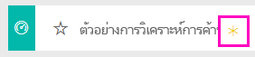
  
### รับไฟล์ .pbix สำหรับตัวอย่างนี้

อีกทางเลือกหนึ่งคือ คุณสามารถดาวน์โหลดตัวอย่างเป็นไฟล์ .pbix ซึ่งถูกออกแบบมาสำหรับใช้กับ Power BI Desktop 

 * [ตัวอย่างการวิเคราะห์ด้านการขายปลีก](http://download.microsoft.com/download/9/6/D/96DDC2FF-2568-491D-AAFA-AFDD6F763AE3/Retail%20Analysis%20Sample%20PBIX.pbix)

### รับเวิร์กบุ๊ก Excel สำหรับตัวอย่างนี้
คุณยังสามารถ[ดาวน์โหลดเพียงชุดข้อมูล (เวิร์กบุ๊ก Excel)](http://go.microsoft.com/fwlink/?LinkId=529778) สำหรับตัวอย่างนี้ได้ เวิร์กบุ๊กประกอบด้วยแผ่นงาน Power View ที่คุณสามารถดู และปรับเปลี่ยน เมื่อต้องการดูข้อมูลดิบ เลือก **Power Pivot > จัดการ**

## เริ่มต้นที่แดชบอร์ดและเปิดรายงาน
1. บนแดชบอร์ด เลือกไทล์ "ร้านค้ารวม":

     

   ซึ่งระบบจะนำคุณไปยังหน้า “ภาพรวมยอดขายของร้านค้า” ในรายงานนั้น คุณเห็นแล้วว่าเรามีร้านค้ารวม 104 และในจำนวนนั้นมี 10 ที่เป็นร้านค้าใหม่ เรามีสองเชนธุรกิจ นั่นคือ Fashions Direct และ Lindseys ร้านค้า Fashions Direct มีขนาดใหญ่กว่าเมื่อดูโดยเฉลี่ยแล้ว
2. ในแผนภูมิวงกลม เลือก**Fashions Direct**

   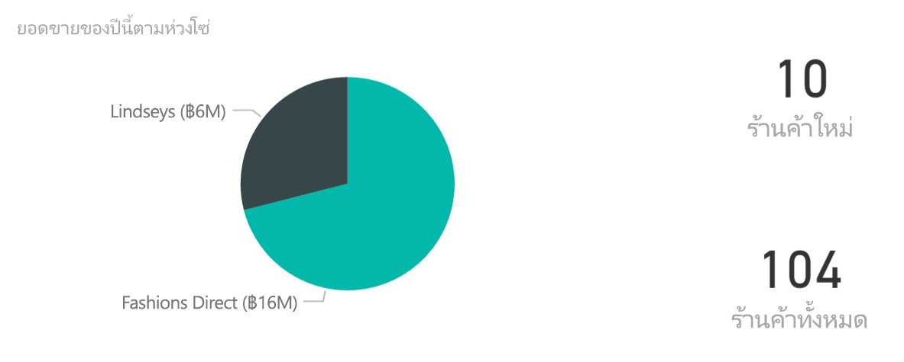  

   ให้สังเกตผลลัพธ์ในแผนภูมิฟอง:

   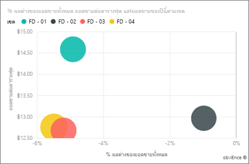  

   เขต FD-01 มียอดขายเฉลี่ยต่อตารางฟุตสูงสุด ส่วน FD-02 มีค่าความแปรปรวนต่ำสุดในยอดขายเมื่อเปรียบเทียบกับปีที่แล้ว ส่วน FD-03 และ FD-04 มีการประกอบการโดยรวมแย่ที่สุด
3. เลือกแต่ละฟองหรือแผนภูมิอื่น ๆ เพื่อดูการไฮไลท์ข้าม ซึ่งเผยให้เห็นผลกระทบของการเลือกของคุณ
4. เมื่อต้องการกลับไปยังแดชบอร์ด เลือกชื่อของแดชบอร์ดจากแถบนำทางด้านบน (Breadcrumb)

   
5. บนแดชบอร์ด เลือกไทล์ที่มี "ยอดขายของปีนี้ (This Year’s Sales)"

   

   ซึ่งจะเทียบเท่ากับการพิมพ์ "ยอดขายปีนี้ (This year sales)" ในกล่องคำถาม

   คุณจะเห็นหน้าจอนี้:

   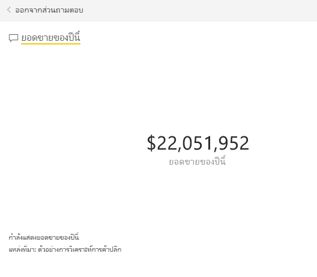

## ตรวจทานไทล์ที่สร้างขึ้นด้วย Power BI ถามตอบ
เรามาดูแบบเฉพาะเจาะจงมากขึ้นกัน

1. เพิ่ม "ยอดขายปีนี้**แยกตามเขต**" ลงในคำถามนั้น สังเกตผลลัพธ์: ระบบจะใส่คำตอบในแผนภูมิแท่งและแนะนำวลีอื่น ๆ โดยอัตโนมัติ:

   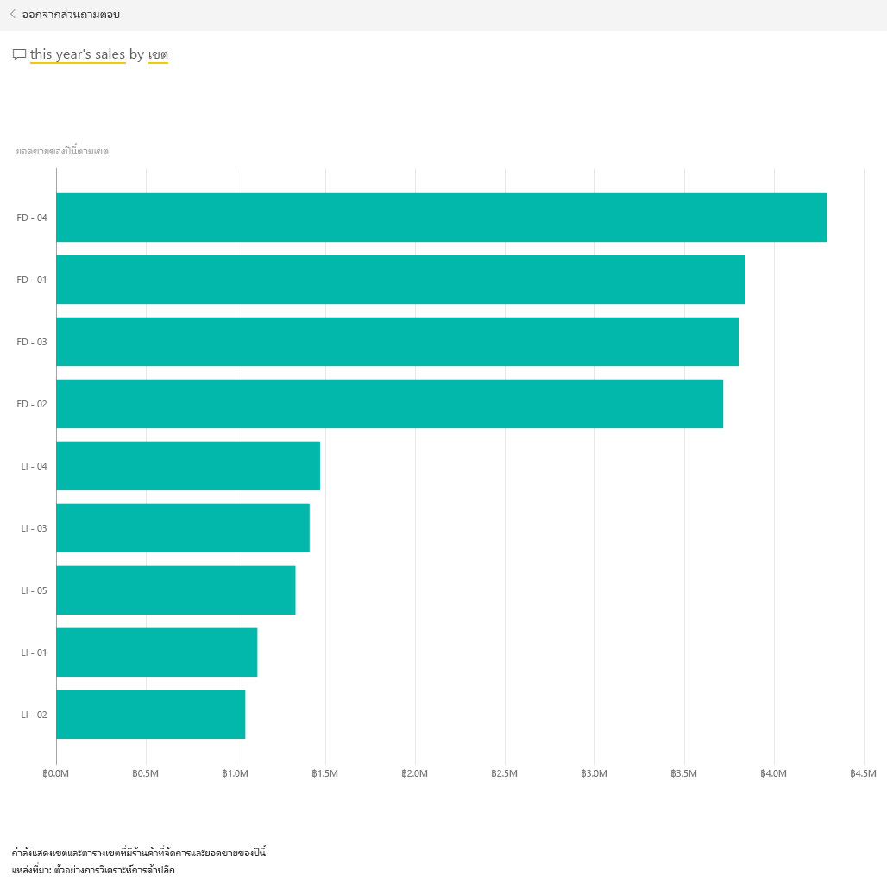
2. ตอนนี้เปลี่ยนคำถามเป็น "ยอดขายปีนี้**แยกตามเขตพื้นที่และเชนธุรกิจ**"

   โปรดสังเกตวิธีการที่ระบบตอบคำถามขณะที่คุณพิมพ์ด้วยแผนภูมิที่เหมาะสม
3. ลองใช้คำถามเพิ่มเติมและดูประเภทของผลลัพธ์ที่คุณได้
4. เมื่อคุณพร้อมแล้ว ให้ย้อนกลับไปยังแดชบอร์ด

## เจาะลึกลงในข้อมูลนั้น
ตอนนี้เรามาสำรวจในระดับที่ละเอียดยิ่งขึ้นโดยดูที่การดำเนินการของแต่ละเขต

1. บนแดชบอร์ด เลือกไทล์เพื่อเปรียบเทียบยอดขายของปีนี้กับปีที่แล้ว

   

   โปรดสังเกตความแปรผันอย่างมากใน % ค่าความแปรปรวนสำหรับปีที่แล้ว โดยที่เดือนมกราคม เมษายน และกรกฎาคมเป็นเดือนที่มีผลประกอบการแย่

   

   มาดูว่าเราสามารถดูรายละเอียดได้หรือไม่ว่าปัญหามาจากที่ใด
2. เลือกแผนภูมิฟอง และเลือก**020 Mens**

   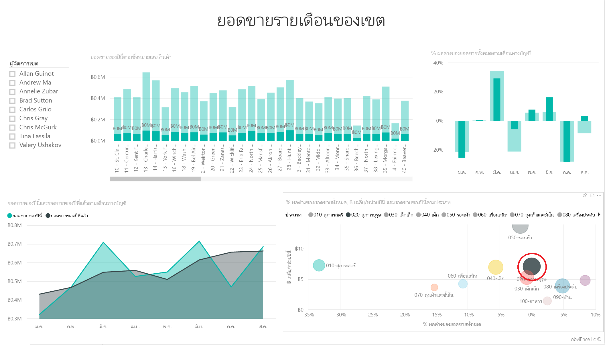  

   สังเกตสินค้าในหมวดสินค้าผู้ชายไม่ได้รับผลกระทบอย่างร้ายแรงในเดือนเมษายนตามผลประกอบการธุรกิจโดยรวม แต่เดือนมกราคมและกรกฎาคมยังยังคงเป็นเดือนที่มีปัญหา
3. ตอนนี้ เลือกแบบ**ฟองของ 010-Womens**

   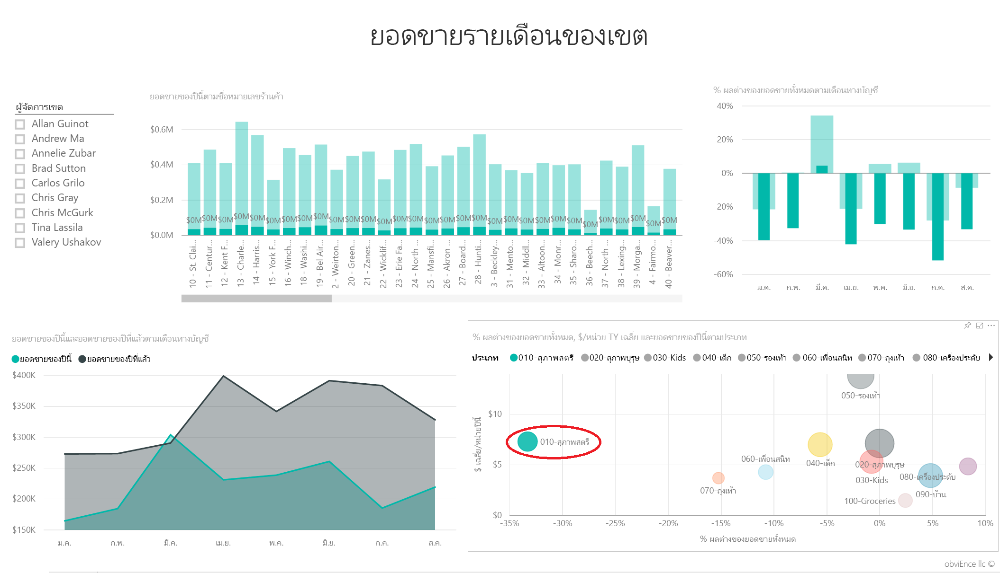

   คุณจะสังเกตเห็นว่าสินค้าในหมวดสินค้าผู้หญิงนั้นมีผลประกอบการแย่กว่าผลประกอบการโดยรวมในทุกเดือน และแย่กว่ามากในเกือบทุกเดือนเมื่อเทียบกับปีก่อนหน้านี้
4. เลือกแผนภูมิฟองอีกครั้งเพื่อล้างตัวกรอง

## ลองใช้ตัวแบ่งส่วนข้อมูล
มาดูว่าในบางเขตมีผลประกอบการเป็นอย่างไรบ้าง

1. เลือก Allan Guinot ในตัวแบ่งส่วนข้อมูลด้านบนซ้าย

   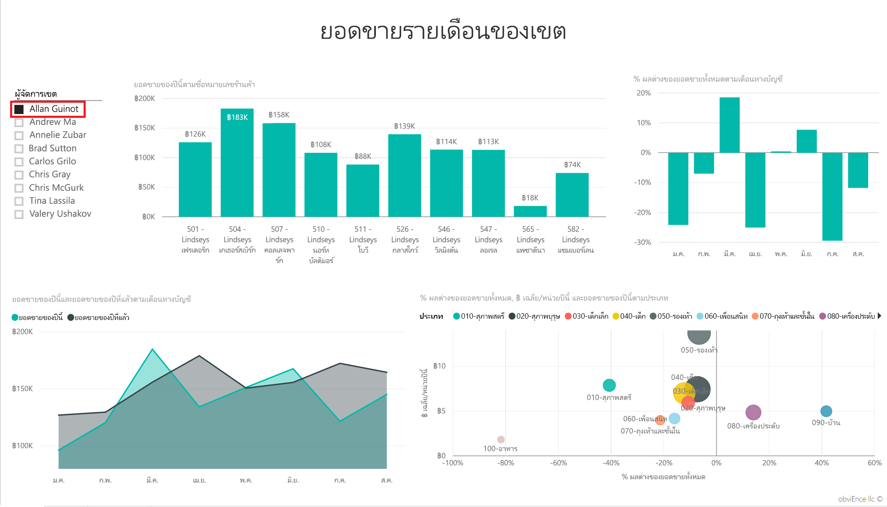

   โปรดทราบว่าเขตของ Allan มีผลประกอบการที่ดีกว่าที่อื่นในเดือนมีนาคมและเดือนมิถุนายนของปีที่แล้ว
2. ตอนนี้ ขณะที่ยังคงเลือก Allan ให้เลือกแผนภูมิฟองของสินค้าหมวดผู้หญิง (Women)

   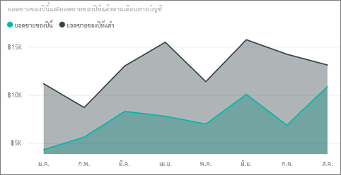

   โปรดทราบว่าสำหรับสินค้าในหมวดผู้หญิง เขตของ Allan ไม่เคยได้ตามเป้ายอดขายของปีที่แล้วแลย
3. สำรวจผู้จัดการเขตอื่นและสินค้าหมวดอื่น ข้อมูลเชิงลึกอื่น ๆ ที่คุณสามารถค้นหาได้ มีอะไรบ้าง?
4. เมื่อคุณพร้อมแล้ว ให้ย้อนกลับไปยังแดชบอร์ด

## ข้อมูลของเรากำลังบอกอะไรกับเราเกี่ยวกับการเติบโตยอดขายของปีนี้?
ส่วนสุดท้ายที่เราต้องการสำรวจคือการเติบโตของเรา มีร้านค้าใหม่ ๆ เปิดขึ้นในปีนี้

1. เลือกไทล์ร้านค้าใหม่ที่เปิดในปีนี้

   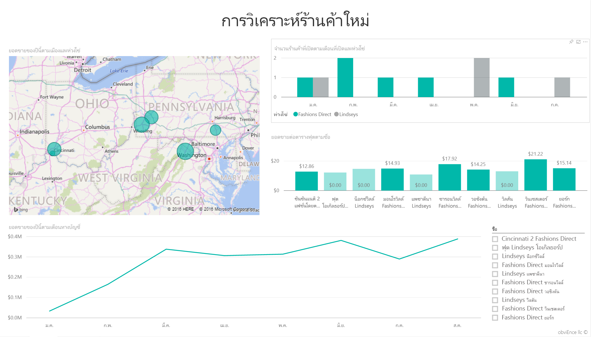

   มีร้านค้าของ Fashions Direct เปิดขึ้นในปีนี้มากกว่าร้านค้าของ Lindseys โดยเราจะเห็นได้ชัดเจนจากไทล์
2. สำรวจแผนภูมิ ‘ยอดขายต่อตารางฟุตแยกตามชื่อ’:

   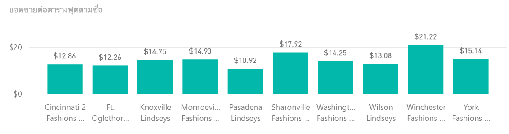

    ยอดขายเฉลี่ยต่อตารางฟุต (SQF) ทั่วทั้งร้านค้าใหม่มีความแตกต่างกันค่อนข้างมาก
3. คลิกที่รายการคำอธิบายแผนภูมิ Fashions Direct ในแผนภูมิบนขวา โปรดสังเกตว่าแม้แต่ธุรกิจเชนเดียวกัน ร้านค้าที่ดีที่สุด (Winchester Fashions Direct) มีผลประกอบการดีกว่าร้านค้าที่มีผลประกอบการแย่อย่างมีนัยสำคัญ (Cincinnati 2 Fashions Direct) โดยมีผลประกอบการ $21.22 เทียบกับ $12.86 ตามลำดับ

   
4. คลิกที่ Fashions Winchester Direct ที่ตัวแบ่งส่วนข้อมูล และสังเกตแผนภูมิเส้น มีการรายงานตัวเลขยอดขายแรกในเดือนกุมภาพันธ์
5. คลิก Cincinnati 2 Fashions Direct ที่ตัวแบ่งส่วนข้อมูล และคุณจะเห็นในแผนภูมิเส้นว่าร้านค้านี้เปิดในเดือนมิถุนายน และดูเหมือนว่าเป็นร้านที่มีผลประกอบการแย่ที่สุด
6. เช่นเคย สำรวจโดยการคลิกที่แถบ เส้นและฟองอื่น ๆ ตลอดทั้งแผนภูมิและดูข้อมูลเชิงลึกที่คุณสามารถค้นหาได้

นี่เป็นสภาพแวดล้อมที่ปลอดภัยที่จะทดลองสิ่งต่าง ๆ คุณสามารถเลือกที่จะไม่บันทึกการเปลี่ยนแปลงของคุณ ถ้าคุณบันทึก คุณสามารถรับข้อมูล สำหรับสำเนาชุดใหม่ของตัวอย่างนี้ได้เสมอ

## เชื่อมต่อไปยังข้อมูลของคุณ
เราหวังว่าการแนะนำนี้ ได้แสดงให้เห็นว่าแดชบอร์ด Q&A และรายงาน Power BI สามารถให้ข้อมูลเชิงลึกในข้อมูลสำหรับร้านค้าปลีก ตอนนี้ถึงตาคุณแล้ว — ลองเชื่อมต่อกับข้อมูลของคุณเอง ด้วย Power BI คุณสามารถเชื่อมต่อกับแหล่งข้อมูลที่หลากหลาย เรียนรู้เพิ่มเติมเกี่ยวกับ[เริ่มต้นใช้งาน Power BI](service-get-started.md)

## ขั้นตอนถัดไป
* [ดาวน์โหลดชุดเนื้อหาตัวอย่างการวิเคราะห์ร้านค้าปลีก](sample-tutorial-connect-to-the-samples.md)
* [ดาวน์โหลดไฟล์ zip ของไฟล์ตัวอย่างทั้งหมด](http://go.microsoft.com/fwlink/?LinkId=535020)    
* [ดาวน์โหลดเวิร์กบุ๊ก Excel สำหรับตัวอย่างนี้ Power BI](http://go.microsoft.com/fwlink/?LinkId=529778)    
* [รับข้อมูล (สำหรับ Power BI)](service-get-data.md)    
* [Power BI - แนวคิดพื้นฐาน](service-basic-concepts.md)    
* มีคำถามเพิ่มเติมหรือไม่? [ลองไปที่ชุมชน Power BI](http://community.powerbi.com/)
