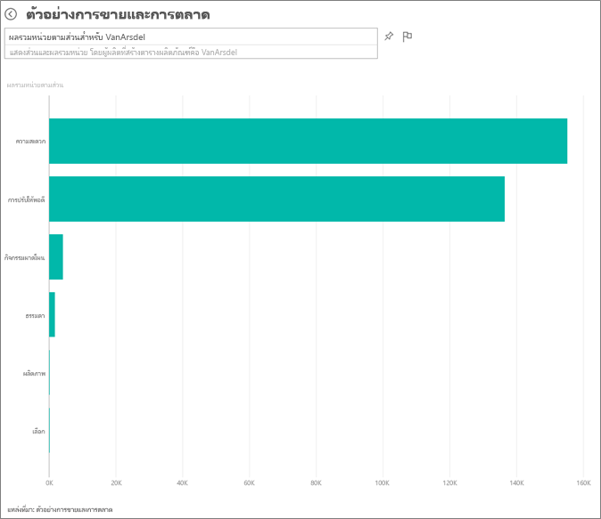
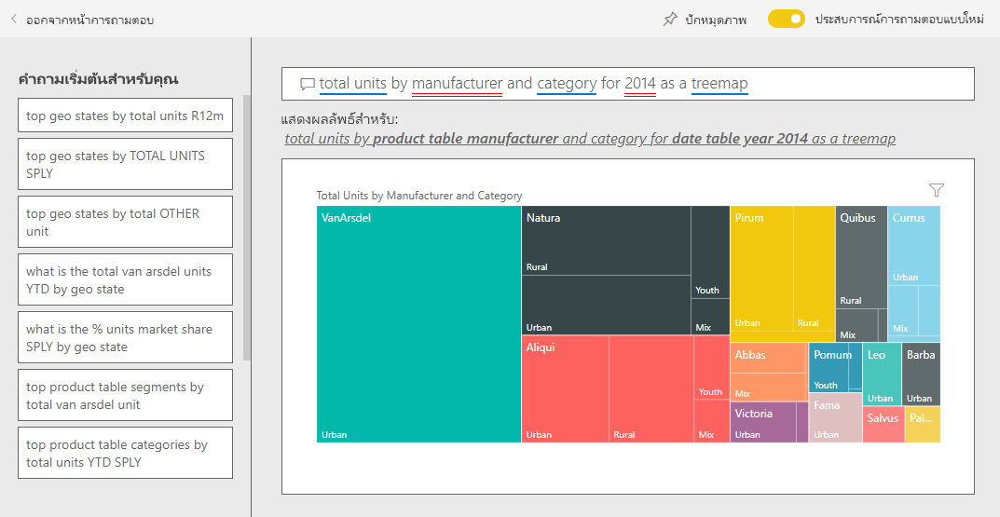

# ตัวอย่างการขายและการตลาดสำหรับ Power BI: ชมการแนะนำ

ตัวอย่างการขายและการตลาด มีแดชบอร์ดและรายงานในบริษัทผลิตที่สมมุติขึ้น ที่ชื่อว่า VanArsdel Ltd. เจ้าหน้าที่หัวหน้าฝ่ายตลาด (CMO) ของ VanArsdel สร้างแดชบอร์ดนี้ขึ้นเพื่อเฝ้าดูอุตสาหกรรม และส่วนแบ่งทางการตลาด จำนวนการผลิต ยอดขาย และความคิดเห็นต่อผลิตภัณฑ์ ของบริษัทของเขา

VanArsdel มีคู่แข่งหลายราย แต่ก็เป็นอันดับหนึ่งของตลาดในอุตสาหกรรม CMO ต้องการเพิ่มส่วนแบ่งทางการตลาด และค้นหาโอกาสการเติบโต แต่ด้วยเหตุผลบางประการ ส่วนแบ่งทางการตลาดของ VanArsdel ได้เริ่มลดลง และลดลงอย่างมีนัยสำคัญในเดือนมิถุนายน

ตัวอย่างนี้เป็นส่วนหนึ่งของชุดตัวอย่าง ที่แสดงให้เห็นวิธีการที่คุณสามารถใช้ Power BI กับข้อมูล รายงาน และแดชบอร์ดที่เกี่ยวข้องกับธุรกิจ ซึ่งสร้างขึ้นโดย [obviEnce](http://www.obvience.com/) ด้วยข้อมูลจริงที่ไม่มีการระบุชื่อ ข้อมูลมีให้ใช้งานหลายรูปแบบ: ชุดเนื้อหา ไฟล์ Power BI Desktop .pbix หรือเวิร์กบุ๊ก Excel ดู [ตัวอย่างสำหรับ Power BI](sample-datasets.md) 

บทช่วยสอนนี้จะสำรวจชุดเนื้อหาของตัวอย่างการขายและการตลาดในบริการของ Power BI เนื่องจากประสบการณ์การใช้รายงานจะคล้ายคลึงกันใน Power BI Desktop ดังนั้นคุณสามารถใช้ Power BI Desktop กับไฟล์ .pbix ตัวอย่างใน Power BI Desktop ได้ 

คุณไม่จำเป็นต้องมีสิทธิการใช้งาน Power BI ในการสำรวจตัวอย่างใน Power BI Desktop ถ้าคุณไม่มีสิทธิการใช้งาน Power BI Pro คุณสามารถบันทึกตัวอย่างไปยังพื้นที่ทำงานของฉันในบริการของ Power BI ได้ 

## รับตัวอย่าง

ก่อนที่คุณสามารถใช้ตัวอย่าง คุณต้องดาวน์โหลดในรูปแบบ[ชุดเนื้อหา](#get-the-content-pack-for-this-sample) [ไฟล์ .pbix](#get-the-pbix-file-for-this-sample) หรือ[เวิร์กบุ๊ก Excel](#get-the-excel-workbook-for-this-sample)

### รับชุดเนื้อหาสำหรับตัวอย่างนี้

1. เปิดบริการ Power BI (app.powerbi.com) ลงชื่อเข้าใช้ และเปิดพื้นที่ทำงานที่คุณต้องการบันทึกตัวอย่าง

   ถ้าคุณไม่มีสิทธิการใช้งาน Power BI Pro คุณสามารถบันทึกตัวอย่างไปยังพื้นที่ทำงานของฉัน

2. ที่มุมด้านล่างซ้าย เลือก**รับข้อมูล**
   
   
3. บนหน้า **รับข้อมูล** ที่ปรากฏขึ้น เลือก **ตัวอย่าง**
   
4. เลือก **ตัวอย่างการขายและการตลาด** แล้วเลือก**เชื่อมต่อ**   
  
   
   
5. Power BI นำเข้าชุดเนื้อหา จากนั้นเพิ่มแดชบอร์ด รายงาน และชุดข้อมูลใหม่ไปยังพื้นที่ทำงานปัจจุบันของคุณ
   
   
  
### รับไฟล์ .pbix สำหรับตัวอย่างนี้

อีกทางเลือกหนึ่งคือ คุณสามารถดาวน์โหลดตัวอย่างการขายและการตลาดเป็น [ไฟล์ .pbix](https://download.microsoft.com/download/9/7/6/9767913A-29DB-40CF-8944-9AC2BC940C53/Sales%20and%20Marketing%20Sample%20PBIX.pbix) ซึ่งถูกออกแบบมาสำหรับใช้กับ Power BI Desktop

### รับเวิร์กบุ๊ก Excel สำหรับตัวอย่างนี้

ถ้าคุณต้องการดูแหล่งข้อมูลสำหรับตัวอย่างนี้ ตัวอย่างนี้ยังมีให้ในรูปแบบ[เวิร์กบุ๊ก Excel](https://go.microsoft.com/fwlink/?LinkId=529785) เวิร์กบุ๊กประกอบด้วยแผ่นงาน Power View ที่คุณสามารถดู และปรับเปลี่ยน หากต้องการดูข้อมูลดิบ ให้เปิดใช้งาน add-in การวิเคราะห์ข้อมูล แล้วจากนั้นเลือก**Power Pivot > จัดการ** หากต้องการเปิดใช้งาน Power View และ Power Pivot add-in โปรดดทีู่[ดูตัวอย่าง Excel จากใน Excel เอง](sample-datasets.md#optional-take-a-look-at-the-excel-samples-from-inside-excel-itself)สำหรับรายละเอียด

## แดชบอร์ดกำลังบอกอะไรแก่เรา
มาเริ่มต้นการสำรวจของเราที่แดชบอร์ด และดูไทล์ที่ CMO เลือกมาปักหมุด เราเห็นข้อมูลเกี่ยวกับส่วนแบ่งทางการตลาด ยอดขาย และความคิดเห็นต่อผลิตภัณฑ์ และเราเห็นข้อมูลที่แบ่งย่อยตามภูมิภาค เวลา และการแข่งขัน

* ไทล์ตัวเลขไปทางคอลัมน์ด้านซ้าย แสดงปริมาณยอดขายของอุตสาหกรรมในปีที่ผ่านมา (50,000), ส่วนแบ่งการตลาด (32.86%), ปริมาณขาย (16,000), คะแนนความคิดเห็น (68), ช่องว่างความคิดเห็น (4), และจำนวนหน่วยทั้งหมดที่ขาย (1 ล้าน)
* แผนภูมิเส้นบนสุด ( **% ส่วนแบ่งตลาดของหน่วย เทียบกับ % ส่วนแบ่งตลาด 12 เดือน**) แสดงให้เห็นว่าการผันผวนของเรามีการใช้งานอย่างไรเมื่อเวลาผ่านไป โปรดสังเกตว่าลดลงมากในเดือนมิถุนายน นอกจากนี้ ส่วนแบ่ง 12 เดือน (R12M) ของเรา เพิ่มขึ้นอยู่ช่วงนึง แล้วก็เริ่มนิ่ง
* คู่แข่งที่ใหญ่ที่สุดของเราคือ Aliqui เห็นชัดเจนตรงไทล์แผนภูมิ คอลัมน์กลาง ( **% ความแตกต่างผลรวมหน่วยตั้งแต่ต้นปี**)
* ธุรกิจส่วนใหญ่ของเรา อยู่ในภูมิภาคตะวันออกและภูมิภาคส่วนกลาง
* แผนภูมิเส้นที่อยู่ด้านล่าง (**ผลรวมหน่วยสำหรับปี 2014**) แสดงให้เห็นว่า การตกของเราในเดือนมิถุนายนไม่ใช่เกิดจากฤดูกาล ไม่มีคู่แข่งของเรารายไหน ที่แสดงแนวโน้มแบบเดียวกัน
* **ไทล์ผลรวมหน่วยทั้งหมด** และ **ผลรวมหน่วย YTD** ทางด้านขวาแสดงหน่วยที่ขาย โดยเซกเมนต์และตามภูมิภาค/ผู้ผลิต เซ็กเมนต์ของตลาดที่ใหญ่ที่สุดของเราคือ **ประสิทธิภาพ** และ **ความสะดวกสบาย**

## ใช้การถามตอบเพื่อเจาะลึกลงไปอีกหน่อย

โดยใช้ถามตอบ คุณสามารถค้นหารายละเอียดเพิ่มเติมในข้อมูล

### เซ็กเมนต์ไหนที่ผลักดันยอดขายของเรา ตรงกับแนวโน้มอุตสาหกรรมหรือไม่
1. เลือกไทล์ **ผลรวมหน่วยโดยรวมตามส่วน** ที่เปิดถามตอบ และแสดงขึ้นด้วยคำถาม *ผลรวมหน่วยตามส่วน*
2. ในส่วนท้ายของคำถามที่มีอยู่แล้ว ให้เพิ่ม *สำหรับ VanArsdel* Q&A ตีความคำถาม และแสดงแผนภูมิที่ปรับปรุงแล้วเป็นคำตอบ โปรดสังเกตว่าปริมาณผลิตภัณฑ์ของเราส่วนใหญ่จากส่วน **ความสะดวก** และ **การควบคุม**

   
3. ส่วนแบ่งของเราในหมวดหมู่ **การดูแล** และ **ความสะดวก** สูง ส่วนเหล่านี้เป็นหนึ่งในสิ่งที่เราแข่งขัน
4. กลับไปยังแดชบอร์ดโดยการเลือก **ตัวอย่างการขายและการตลาด** ในบานหน้าต่างนำทางด้านบน

### ส่วนแบ่งทางการตลาดของจำนวนหน่วยรวมเป็นอย่างไร ในแต่ละประเภท (เทียบกับภูมิภาค)
1. สังเกตไทล์ **ผลรวมหน่วย YTD ตามผู้ผลิต ภูมิภาค** ผลรวมหน่วยส่วนแบ่งตลาดตามประเภท่คืออะไร

   
2. เลือกกล่องคำถามที่ด้านบนสุดของแดชบอร์ด และพิมพ์คำถาม *ผลรวมหน่วยตามผู้ผลิตและประเภท สำหรับ 2014 เป็นแผนที่ต้นไม้* สังเกตว่า การแสดงผลจะเปลี่ยนไปขณะที่คุณพิมพ์คำถาม

   
3. เพื่อเปรียบเทียบผลที่ได้ ปักหมุดแผนภูมิไปยังแดชบอร์ด สังเกตข้อเท็จจริงที่น่าสนใจนี้: ในปี 2014 VanArsdel จำหน่ายเฉพาะผลิตภัณฑ์ในประเภท **เมือง**
4. กลับไปยังแดชบอร์ด

## รายงานตัวอย่างการขายและการตลาด

แดชบอร์ดเป็นจุดที่จะเข้าไปยังรายงาน ถ้าไทล์ถูกสร้างขึ้นจากรายงานพื้นฐาน คลิกที่ไทล์นั้นจะเปิดรายงานขึ้นมา

บนแดชบอร์ดของเรา บรรทัด **% ส่วนแบ่งตลาดหน่วย R12M** ในแผนภูมิ **% ส่วนแบ่งตลาดหน่วย เทียบกับ % ส่วนแบ่งตลาดหน่วยย้อนหลัง 12 เดือน** แสดงว่าส่วนแบ่งตลาดของเราไม่เพิ่มขึ้นอีกเมื่อเวลาผ่านไป แต่กลับมีการลดลงของเล็กน้อย แล้วทำไมส่วนแบ่งตลาดของเรา ตกลงมามากในเดือนมิถุนายน 

รายงานสำหรับตัวอย่างการขายและการตลาดมีสี่หน้า
 
### VanArsdel - หน้าส่วนแบ่งตลาด
หน้าที่ 1 ของรายงานเรา มุ่งเน้นที่ส่วนแบ่งทางการตลาดของ VanArsdel

1. บนแดชบอร์ดเลือกแผนภูมิ **% ส่วนแบ่งตลาดหน่วย เปรียบเทียบกับ %ส่วนแบ่งตลาดหน่วยย้อนหลัง 12 เดือน** เพื่อเปิดหน้า **VanArsdel - ส่วนแบ่งตลาด** ของรายงานตัวอย่างการขายและการตลาด

   

2. ดูที่แผนภูมิคอลัมน์ **ผลรวมหน่วยตามเดือนและเป็นของ VanArsdel** ที่ด้านล่างของรายงาน คอลัมน์สีดำแทน VanArsdel (ผลิตภัณฑ์ของเรา) และคอลัมน์สีเขียวคือคู่แข่งของเรา การตกลงในเดือนมิถุนายนปี 2014 ที่ VanArsdel ประสบอยู่ ไม่พบในคู่แข่งของเรา

3. แผนภูมิแท่ง **ผลรวมปริมาณหมวดหมู่ตามเซกเมนต์** ทางด้านขวา จะถูกกรองเพื่อแสดงส่วนที่ 2 อันดับบนสุดของ VanArsdel ดูว่าตัวกรองนี้สร้างขึ้นได้อย่างไร:  

   a. เลือกแผนภูมิ **ปริมาณรวมของประเภทตามเซกเมนต์**

   b. เลือกบานหน้าต่าง **ตัวกรอง** ทางด้านขวาเพื่อขยาย  

   c. ภายใต้ **ตัวกรองระดับการมองเห็น** สังเกตว่า **เซกเมนต์** ได้รับการกรองเพื่อรวมเฉพาะส่วน **ความสะดวกสบาย** และ **ประหยัด** เท่านั้น  

   d. ปรับเปลี่ยนตัวกรองโดยการเลือก **เซกเมนต์** เพื่อขยายส่วนนั้น แล้วทำเครื่องหมาย **ประสิทธิภาพ** เพื่อเพิ่มเซกเมนต์นั้นลงไปด้วย  

4. ในแผนภูมิ **ผลรวมหน่วยตามเดือนและเป็นของ VanArsdel** เลือก **Yes** ในคำอธิบายแผนภูมิเพื่อกรองแบบไขว้หน้าโดย VanArsdel ในแผนภูมิ **ปริมาณรวมประเภทตามเซกเมนต์** สังเกตว่าเราไม่ได้กรอกเซกเมนต์ **ประสิทธิภาพ** ให้ครบถ้วน

5. เลือก **Yes** อีกครั้งเพื่อเอาตัวกรองออก

6. ดูที่แผนภูมิเส้น **%ส่วนแบ่งตลาดหน่วย และ %ส่วนแบ่งตลาด R12M ตามเดือน** จะแสดงส่วนแบ่งตลาดรายเดือน และส่วนแบ่งตลาดย้อนหลัง 12 เดือนของเรา ข้อมูลย้อนหลัง 12 เดือน ช่วยลดความผันผวนรายเดือน และแสดงให้เห็นแนวโน้มระยะยาว ในแผนภูมิแท่ง **ปริมาณรวมประเภทตามเซกเมนต์** ให้เลือก **ความสะดวก** จากนั้น **ความประหยัด** เพื่อดูความผันผวนของส่วนแบ่งตลาดสำหรับแต่ละเซกเมนต์ โปรดทราบว่าเซกเมนต์ **ความประหยัด** จะแสดงความผันผวนในส่วนแบ่งตลาดมากกว่า

เรายังคงกำลังมองหาว่า ทำไมส่วนแบ่งทางการตลาดของเราถึงตกลงมากในเดือนมิถุนายน ถัดไป เราจะตรวจสอบหน้า **การวิเคราะห์ความคิดเห็น** ของรายงาน

### หน้าการวิเคราะห์ความคิดเห็น
หน้าสามของรายงานเน้นไปที่ความคิดเห็นของผู้ใช้งาน

Tweets, Facebook, บล็อกและบทความล้วนแต่ส่งผลต่อความคิดเห็นของผู้ใช้งาน ซึ่งจะปรากฏในแผนภูมิเส้นสองแผนภูมิที่ด้านซ้ายของหน้า แผนภูมิ **VanArsdel - ความคิดเห็นรายเดือน** ที่มุมซ้ายบนแสดงว่าความคิดเห็นสำหรับผลิตภัณฑ์ของเราส่วนใหญ่ค่อนข้างเป็นกลางจนถึงเดือนกุมภาพันธ์ จากนั้นก็ตกลงมากตั้งแต่เดือนกุมภาพันธ์ และตกลงถึงจุดต่ำสุดในเดือนมิถุนายน เกิดอะไรขึ้นถึงทำให้ความคิดเห็นตกลงเช่นนี้ 

ต้องดูแหล่งข้อมูลภายนอก ในเดือนกุมภาพันธ์ มีหลายบทความ บล็อกโพสต์ ที่จัดอันดับการบริการลูกค้าของ VanArsdel ว่าแย่ที่สุดในอุตสาหกรรม ข่าวที่ไม่ดีนี้มีผลโดยตรงต่อความคิดเห็นของลูกค้าและการขาย VanArsdel พยายามอย่างหนักเพื่อปรับปรุงการบริการลูกค้า และลูกค้าและอุตสาหกรรมก็มองเห็น ในเดือนกรกฎาคม ความคิดเห็นเริ่มปรับตัวดีขึ้น และถึงจุดสูงสุดที่แถว หกสิบกว่า ๆ การเพิ่มขึ้นเล็กน้อยนี้ในความคิดเห็นนี้จะแสดงในแผนภูมิ **หน่วยรวมตามรายเดือน** ในหน้าหนึ่งและสองของรายงาน บางที นี่ช่วยอธิบายการตกลงของส่วนแบ่งทางการตลาดของเดือนมิถุนายนได้บางส่วน

ช่องว่างด้านความคิดเห็นอาจเป็นอีกหนึ่งพื้นที่ในการสำรวจ เขตใดบ้างที่มีช่องว่างด้านความคิดเห็นสูงสุด สามารถจัดการได้อย่างไรและสามารถทำซ้ำในเขตอื่น ๆ ได้อย่างไร

### หน้าการวิเคราะห์แนวโน้มประเภท YTD
หน้าสองของรายงานเน้นไปที่แนวโน้มหมวดหมู่ปีต่อวัน

โปรดสังเกตรายละเอียดดังต่อไปนี้:
* VanArsdel เป็นบริษัทขนาดใหญ่ที่สุดในหมวดหมู่นี้และคู่แข่งที่ใหญ่ที่สุดคือ Natura, Aliqui และ Pirium เราจะไม่ละสายตาจากพวกเขา
* Aliqui ก็กำลังเติบโต แต่ปริมาณของผลิตภัณฑ์เมื่อเทียบกับเราแล้ว ยังต่ำมาก
* แผนที่ต้นไม้แสดง VanArsdel เป็นสีเขียว ในภูมิภาคตะวันออก ผู้ใช้งานต้องการการแข่งขันของเราแต่ในภูมิภาคกลางเรากำลังดำเนินการ ส่วนแบ่งในภูมิภาคตะวันออกเป็นการใช้งานร่วมกันต่ำสุดของเรา
* ภูมิศาสตร์มีผลต่อจำนวนหน่วยที่ขายได้ ภูมิภาคตะวันออกเป็นภูมิภาคที่สำคัญสำหรับผู้ผลิตส่วนใหญ่ และ VanArsdel มีความแข็งแกร่งในภูมิภาคส่วนกลางเช่นกัน
* บนแผ่นภูมิ **% ความแปรผันของ YTD ในหน่วยรวมตามเดือนและบริษัทผู้ผลิต** ในด้านขวาล่าง โปรดสังเกตว่าเรามีความแปรผันเชิงบวก ซึ่งเป็นสัญญาณที่ดี เรากำลังทำได้ดีกว่าปีที่ผ่านมา แต่คู่แข่งของเรา Aliqui ก็เช่นกัน

### หน้าโอกาสทางการขาย
หน้าสี่ของรายงานเน้นไปที่การวิเคราะห์ผลิตภัณฑ์ที่แข่งขัน

โปรดสังเกตรายละเอียดดังต่อไปนี้:
* แผนภูมิ **หน่วยรวมตามความคิดเห็น** ในด้านล่างซ้ายแสดงเซ็กเมนต์ทุกประเภท ยกเว้นของเซ็กเมนต์ที่แข็งแกร่งที่สุดสองเซ็กเมนต์ของ VanArsdel เลือกแต่ละเซ็กเมนต์ตามลำดับเพื่อระบุพื้นที่การขยายที่อาจเกิดขึ้นสำหรับ VanArsdel 
* โปรดสังเกตว่าเซ็กเมนต์**ที่สุด**และ**ประสิทธิภาพ** กำลังเติบโตได้เร็วกว่าเซ็กเมนต์อื่น อย่างไรก็ตาม เราจะไม่แข่งขันในเซ็กเมนต์เหล่านั้น หากเราต้องการย้ายไปยังเซ็กเมนต์เหล่านี้ เราสามารถใช้ข้อมูลของเราเพื่อดูว่าเซ็กเมนต์ใดได้รับความนิยมในภูมิภาคใด เราสามารถตรวจสอบคำถามดังกล่าวเช่น ภูมิภาคใดกำลังเติบโตเร็วกว่า และใครจะมาเป็นคู่แข่งที่ใหญ่ที่สุดในเซ็กเมนต์นั้น
* ยังจำการตกลงของส่วนแบ่งทางการตลาดในเดือนมิถุนายนหรือไม่ มิถุนายนเป็นเดือนที่สำคัญสำหรับเซ็กเมนต์ **ประสิทธิภาพ** – เซ็กเมนต์ที่เราไม่แข่งขันเลย รายละเอียดนี้สามารถช่วยอธิบายการตกลงของส่วนแบ่งทางการตลาดในเดือนมิถุนายน

โดยการกรองการแสดงภาพ ตาม VanArsdel, ตามเซ็กเมนต์, ตามเดือน และ ตามภูมิภาค เราสามารถค้นพบโอกาสในการเติบโตสำหรับ VanArsdel

## ขั้นตอนถัดไป: เชื่อมต่อไปยังข้อมูลของคุณ
สภาพแวดล้อมนี้มีความปลอดภัยให้ดำเนินการต่าง ๆ ได้ เนื่องจากคุณสามารถเลือกที่จะไม่บันทึกการเปลี่ยนแปลงของคุณ ถ้าคุณบันทึก คุณสามารถเลือก **รับข้อมูล** สำหรับสำเนาชุดใหม่ของตัวอย่างนี้ได้เสมอ

เราหวังว่าการแนะนำนี้ ได้แสดงให้เห็นว่าแดชบอร์ด, Q&A และรายงาน Power BI สามารถให้ข้อมูลเชิงลึกในข้อมูลทรัพยากรบุคคล ตอนนี้ถึงตาคุณแล้ว ลองเชื่อมต่อกับข้อมูลของคุณเอง ด้วย Power BI คุณสามารถเชื่อมต่อกับแหล่งข้อมูลที่หลากหลาย เมื่อต้องการเรียนรู้เพิ่มเติม ดู[เริ่มต้นใช้งานบริการ Power BI](service-get-started.md)
