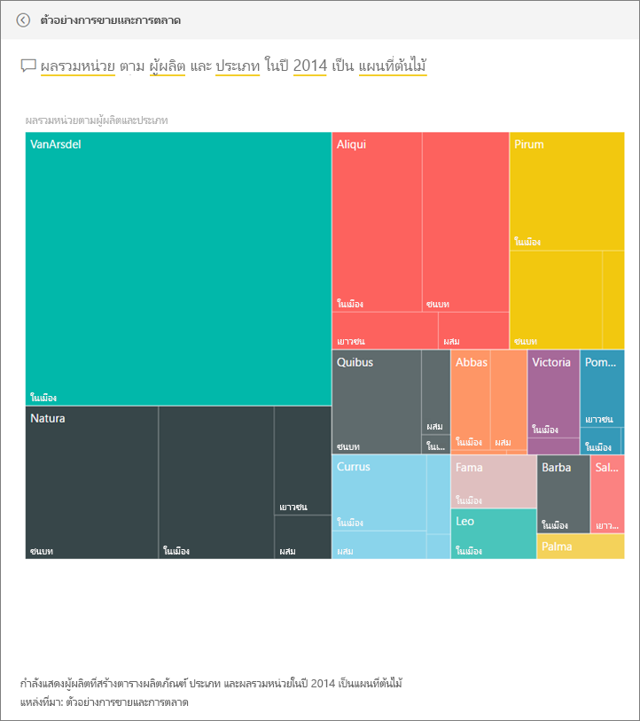

# ตัวอย่างการขายและการตลาดสำหรับ Power BI: ชมการแนะนำ

## ภาพรวมของตัวอย่างการขายและการตลาด
**ตัวอย่างการขายและการตลาด** มีแดชบอร์ดและรายงานในบริษัทผลิตที่สมมุติขึ้น ที่ชื่อว่า VanArsdel Ltd. แดชบอร์ดนี้ถูกสร้างขึ้นโดย เจ้าหน้าที่หัวหน้าฝ่ายตลาด (CMO) ของ VanArsdel เพื่อเฝ้าดูอุตสาหกรรม และส่วนแบ่งทางการตลาด จำนวนการผลิต ยอดขาย และความคิดเห็นต่อผลิตภัณฑ์ ของบริษัทของเขา

VanArsdel มีคู่แข่งหลายราย แต่ก็เป็นอันดับหนึ่งของตลาดในอุตสาหกรรม CMO ต้องการเพิ่มส่วนแบ่งทางการตลาด และค้นหาโอกาสการเติบโต แต่ด้วยเหตุผลบางประการ ส่วนแบ่งทางการตลาดของ VanArsdel ได้เริ่มลดลง และลดลงอย่างมีนัยสำคัญในเดือนมิถุนายน

ตัวอย่างนี้เป็นส่วนหนึ่งของชุดตัวอย่าง ที่แสดงให้เห็นวิธีการที่คุณสามารถใช้ Power BI กับข้อมูล รายงาน และแดชบอร์ดที่เกี่ยวข้องกับธุรกิจ นี่เป็นข้อมูลจริงจาก obviEnce (www.obvience.com) ที่ไม่มีการระบุชื่อ

## ข้อกำหนดเบื้องต้น

 ก่อนที่คุณสามารถใช้ตัวอย่าง คุณต้องดาวน์โหลดในรูปแบบ [ชุดเนื้อหา](https://docs.microsoft.com/power-bi/sample-sales-and-marketing#get-the-content-pack-for-this-sample), [.pbix](http://download.microsoft.com/download/9/7/6/9767913A-29DB-40CF-8944-9AC2BC940C53/Sales%20and%20Marketing%20Sample%20PBIX.pbix) หรือ[เวิร์กบุ๊ก Excel](http://go.microsoft.com/fwlink/?LinkId=529785)

### รับชุดเนื้อหาสำหรับตัวอย่างนี้

1. เปิดบริการ Power BI (app.powerbi.com) และเข้าสู่ระบบ
2. ที่มุมด้านล่างซ้าย เลือก**รับข้อมูล**
   
    
3. บนหน้า รับข้อมูล ที่ปรากฏขึ้น เลือกไอคอน**ตัวอย่าง**
   
   
4. เลือก**ตัวอย่างการขายและการตลาด** แล้วเลือก**เชื่อมต่อ**  
  
   
   
5. Power BI จะนำเข้าชุดเนื้อหานี้ และเพิ่มแดชบอร์ด รายงาน และชุดข้อมูลใหม่ ลงบนพื้นที่ทำงานปัจจุบันของคุณ เนื้อหาใหม่จะถูกทำเครื่องหมายด้วยเครื่องหมายดอกจันสีเหลือง 
   
   
  
### รับไฟล์ .pbix สำหรับตัวอย่างนี้

อีกทางเลือกหนึ่งคือ คุณสามารถดาวน์โหลดตัวอย่างเป็นไฟล์ .pbix ซึ่งถูกออกแบบมาสำหรับใช้กับ Power BI Desktop 

 * [ตัวอย่างการขายและการตลาด](http://download.microsoft.com/download/9/7/6/9767913A-29DB-40CF-8944-9AC2BC940C53/Sales%20and%20Marketing%20Sample%20PBIX.pbix)

### รับเวิร์กบุ๊ก Excel สำหรับตัวอย่างนี้
คุณยังสามารถ[ดาวน์โหลดเพียงชุดข้อมูล (เวิร์กบุ๊ก Excel)](http://go.microsoft.com/fwlink/?LinkId=529785) สำหรับตัวอย่างนี้ได้ เวิร์กบุ๊กประกอบด้วยแผ่นงาน Power View ที่คุณสามารถดู และปรับเปลี่ยน เมื่อต้องการดูข้อมูลดิบ เลือก **Power Pivot > จัดการ**

## แดชบอร์ดกำลังบอกอะไรแก่เรา
มาเริ่มต้นการสำรวจของเราที่แดชบอร์ด และดูไทล์ที่ CMO เลือกมาปักหมุด เราเห็นข้อมูลเกี่ยวกับส่วนแบ่งทางการตลาด ยอดขาย และความคิดเห็นต่อผลิตภัณฑ์ และเราเห็นข้อมูลที่แบ่งย่อยตามภูมิภาค เวลา และการแข่งขัน

* ไทล์ตัวเลขในคอลัมน์ด้านซ้ายลงมา แสดงปริมาณยอดขายของอุตสาหกรรมในปีที่ผ่านมา (50K), ส่วนแบ่งการตลาด (32.86%), ปริมาณขาย (16K), คะแนนความคิดเห็น (68), ช่องว่างความคิดเห็น (4), และจำนวนหน่วยทั้งหมดที่ขาย (1 ล้าน)
* แผนภูมิเส้นด้านบนสุดแสดงให้เห็นว่าส่วนแบ่งทางการตลาดของเราเปลี่ยนแปลงอย่างไรตามช่วงเวลา ส่วนแบ่งทางการตลาดของเราตกลงจริง ๆ ในเดือนมิถุนายน นอกจากนี้ ส่วนแบ่ง R12M (12 เดือนย้อนหลัง) ของเรา เพิ่มขึ้นอยู่ช่วงนึง แล้วก็เริ่มนิ่ง
* คู่แข่งที่ใหญ่ที่สุดของเราคือ Aliqui (เห็นชัดเจนตรงไทล์แผนภูมิ คอลัมน์กลาง)
* ธุรกิจส่วนใหญ่ของเรา อยู่ในภูมิภาคตะวันออกและภูมิภาคส่วนกลาง
* แผนภูมิเส้นที่อยู่ด้านล่าง แสดงให้เห็นว่า การตกของเราในเดือนมิถุนายนไม่ใช่เกิดจากฤดูกาล – ไม่มีคู่แข่งของเรารายไหน ที่แสดงแนวโน้มแบบเดียวกัน
* ไทล์สองไทล์ที่แสดง "จำนวนหน่วยทั้งหมด" แสดงหน่วยที่ขาย ตามเซ็กเมนต์ และตามภูมิภาค/ผู้ผลิต เซ็กเมนต์ของตลาดที่ใหญ่ที่สุดของเราคือ**ประสิทธิภาพ**และ**ความสะดวกสบาย**

### ใช้การถามตอบเพื่อเจาะลึกลงไปอีกหน่อย
#### เซ็กเมนต์ไหนที่ผลักดันยอดขายของเรา มันตรงกับแนวโน้มอุตสาหกรรมหรือไม่
1. เลือกไทล์ "จำนวนหน่วยทั้งหมด ตามเซ็กเมนต์" ซึ่งจะเปิด Q&A
2. พิมพ์**สำหรับ VanArsdel**ที่ส่วนท้ายของคำถามที่มีอยู่แล้ว Q&A ตีความคำถาม และแสดงแผนภูมิที่ปรับปรุงแล้วเป็นคำตอบ ปริมาณส่วนใหญ่ของสินค้าเรามาจากเซ็กเมนต์ สะดวก และ ประหยัด

   
3. ส่วนแบ่งในหมวด**ประหยัด**และ**ความสะดวกสบาย**มีสูงมาก เซ็กเมนต์เหล่านี้เป็นเซ็กเมนต์ที่เราแข่งขัน
4. นำทางกลับไปยังแดชบอร์ด โดยการเลือกชื่อแดชบอร์ดในแถบนำทางด้านบน (เส้นนำทาง)

#### ส่วนแบ่งทางการตลาดของจำนวนหน่วยรวมเป็นอย่างไร ในแต่ละประเภท (เทียบกับภูมิภาค)
1. สังเกต ไทล์ "จำนวนหน่วยรวม YTD ตามผู้ผลิต, ภูมิภาค" (YTD=ตั้งแต่ต้นปีถึงปัจจุบัน) ฉันสงสัยว่า ส่วนแบ่งทางการตลาดจำนวนหน่วยรวม เป็นอย่างไร ในผลิตภัณฑ์แต่ละประเภท

   
2. ในกล่องคำถามที่ด้านบนสุดของแดชบอร์ด พิมพ์คำถาม**จำนวนหน่วยรวม ตามผู้ผลิตและประเภท สำหรับ 2014 เป็นแผนที่ต้นไม้** สังเกตว่า การแสดงผลจะเปลี่ยนไปขณะที่คุณพิมพ์คำถาม
   
3. เพื่อเปรียบเทียบผลที่ได้ ปักหมุดแผนภูมิไปยังแดชบอร์ด น่าสนใจมาก ในปี 2014 VanArsdel ขายเฉพาะผลิตภัณฑ์ที่อยู่ในประเภท**ในเมือง**
4. กลับไปยังแดชบอร์ด

แดชบอร์ดก็ยังเป็นจุดที่จะเข้าไปยังรายงาน  ถ้าไทล์ถูกสร้างขึ้นจากรายงานพื้นฐาน คลิกที่ไทล์นั้นจะเปิดรายงานขึ้นมา

บนแดชบอร์ดของเรา เส้น R12M (ย้อนหลัง 12 เดือน) แสดงว่า ส่วนแบ่งทางการตลาดของเราไม่ได้เพิ่มขึ้นเมื่อเวลาผ่านไป มันยังลดลงเล็กน้อย แล้วทำไมส่วนแบ่งทางการตลาดของเรา ตกลงมากในเดือนมิถุนายน เพื่อตรวจสอบเพิ่มเติม คลิกที่ภาพนั้นเพื่อเปิดรายงานพื้นฐาน

### รายงานของเรามีทั้งหมด 4 หน้า
#### หน้าที่ 1 ของรายงานเรา มุ่งเน้นที่ส่วนแบ่งทางการตลาดของ VanArsdel

1. ดูที่แผนภูมิคอลัมน์ "จำนวนหน่วยรวม ตามเดือน และเป็นของ VanArsdel" ที่ด้านล่าง คอลัมน์สีดำแทน VanArsdel (ผลิตภัณฑ์ของเรา) และสีเขียวคือคู่แข่งของเรา การตกลงในเดือนมิถุนายนปี 2014 ที่ VanArsdel ประสบอยู่ ไม่พบในคู่แข่งของเรา
2. แผนภูมิแท่ง "จำนวนรวมของประเภท ตามเซ็กเมนต์" ตรงกลางบนด้านขวา จะถูกกรองให้แสดงเซ็กเมนต์ 2 อันดับแรกของ VanArsdel ดูว่าตัวกรองนี้สร้างขึ้นได้อย่างไร:  

   a.  ขยายบานหน้าต่างตัวกรองทางด้านขวา  
   b.  คลิกเพื่อเลือกที่แผนภูมินั้น  
   c.  ภายใต้ตัวกรองระดับการมองเห็น สังเกตเห็นว่า**เซ็กเมนต์**ถูกกรองให้รวมเฉพาะ**ความสะดวกสบาย**และ**ประหยัด**  
   d.  ปรับเปลี่ยนตัวกรองโดยการเลือกเซ็กเมนต์เพื่อขยายส่วนนั้น แล้วทำเครื่องหมาย**ประสิทธิภาพ**เพื่อเพิ่มเซ็กเมนต์นั้นลงไปด้วย  
3. ใน "จำนวนหน่วยรวม ตามเดือนและเป็นของ VanArsdel" เลือก "Yes" สีดำ ในคำอธิบายแผนภูมิเพื่อ กรองแบบไขว้ หน้าของ VanArsdel สังเกตว่า เราไม่แข่งขันในเซ็กเมนต์ประสิทธิภาพ
4. เลือก "Yes" สีดำอีกครั้งเพื่อเอาตัวกรองออก
5. ลองดูที่แผนภูมิเส้น มันแสดงส่วนแบ่งทางการตลาดรายเดือน และส่วนแบ่งย้อนหลัง 12 เดือนของเรา ข้อมูลย้อนหลัง 12 เดือน ช่วยลดความผันผวนรายเดือน และแสดงให้เห็นแนวโน้มระยะยาว เลือก ความสะดวกสบาย และจากนั้น ประหยัด ในแผนภูมิแท่งเพื่อดูว่า มีความผันผวนของส่วนแบ่งทางการตลาดแค่ไหนในแต่ละเซ็กเมนต์ ในเซ็กเมนต์ประหยัด แสดงความผันผวนในส่วนแบ่งทางการตลาดมากกว่าในเซ็กเมนต์ความสะดวกสบาย

เรายังคงกำลังมองหาว่า ทำไมส่วนแบ่งทางการตลาดของเราถึงตกลงมากในเดือนมิถุนายน เรามาลองตรวจสอบความคิดเห็น

#### หน้า 3 ของรายงานของเรา มุ่งเน้นไปที่ความคิดเห็น

ทวีต เฟสบุ๊ก บล็อก บทความ ฯลฯ ล้วนมีส่วนในข้อมูลความคิดเห็น ที่จะแสดงในแผนภูมิเส้นสองแผนภูมิ แผนภูมิความคิดเห็นด้านบนซ้าย แสดงว่าความคิดเห็นต่อผลิตภัณฑ์ของเราค่อนข้างเป็นกลางจนถึงเดือนกุมภาพันธ์ จากนั้นก็ตกลงมากตั้งแต่เดือนกุมภาพันธ์ และตกลงถึงจุดต่ำสุดในเดือนมิถุนายน เกิดอะไรขึ้นถึงทำให้ความคิดเห็นตกลงเช่นนี้ เราจำเป็นต้องดูแหล่งข้อมูลภายนอก ในเดือนกุมภาพันธ์ มีหลายบทความ บล็อกโพสต์ ที่จัดอันดับการบริการลูกค้าของ VanArsdel ว่าแย่ที่สุดในอุตสาหกรรม ข่าวที่ไม่ดีนี้มีผลโดยตรงต่อความคิดเห็นของลูกค้าและการขาย VanArsdel พยายามอย่างหนักเพื่อปรับปรุงการบริการลูกค้า และลูกค้าและอุตสาหกรรมก็มองเห็น ในเดือนกรกฎาคม ความคิดเห็นเริ่มปรับตัวดีขึ้น และถึงจุดสูงสุดที่แถว หกสิบกว่า ๆ การปรับขึ้นในความคิดเห็นนี้ สะท้อนมายัง "จำนวนหน่วยรวม ตามเดือน" บนหน้า 1 และหน้า 3 บางที นี่ช่วยอธิบายการตกลงของส่วนแบ่งทางการตลาดของเดือนมิถุนายนได้บางส่วน

ช่องว่างความคิดเห็น ก็เป็นอีกด้านที่จะสำรวจ: เขตไหนที่มีช่องว่างความคิดเห็นสูงสุด ฝ่ายบริหารสามารถใช้ประโยชน์จากสิ่งนี้อย่างไร และค้นหาวิธีที่จะนำไปใช้กับเขตอื่น ๆ

#### หน้า 2 ของรายงานของเรามุ่งเน้น แนวโน้มของแต่ละประเภทนับตั้งแต่ต้นปี

* จากบริษัททั้งหมดในประเภทนี้ VanArsdel มีขนาดใหญ่ที่สุด และคู่แข่งของเราที่ใหญ่ที่สุดคือ Natura, Aliqui และ Pirium เราจะไม่ละสายตาจากพวกเขา
* Aliqui ก็กำลังเติบโต แต่ปริมาณของผลิตภัณฑ์เมื่อเทียบกับเราแล้ว ยังต่ำมาก
* แผนที่ต้นไม้แสดง VanArsdel เป็นสีเขียว ในภูมิภาคตะวันออก ลูกค้านิยมของคู่แข่งมากกว่า ในภูมิภาคส่วนกลาง เราดำเนินการได้ดี และส่วนแบ่งของเราในภูมิภาคตะวันออกเป็นค่าที่ต่ำที่สุดของเรา
* ภูมิศาสตร์มีผลต่อจำนวนหน่วยที่ขายได้ ตะวันออกเป็นภูมิภาคที่สำคัญสำหรับผู้ผลิตส่วนใหญ่ และ VanArsdel มีความแข็งแกร่งในภูมิภาคส่วนกลางเช่นกัน
* บนแผนภูมิ "จำนวนหน่วยรวม YTD %ความแปรปรวน ตามเดือนและผู้ผลิต" ในด้านล่างขวา – เรามีค่าความแปรปรวนเป็นบวก และนั่นคือสัญญาณที่ดี เราทำได้ดีกว่าปีที่แล้ว แต่คู่แข่งอีกรายนึง ซึ่งก็คือ Aliqui ก็เป็นเช่นเดียวกัน

#### หน้า 4 ของรายงานของเรามุ่งเน้นไปที่ การวิเคราะห์การแข่งขันของผลิตภัณฑ์

* แผนภูมิด้านล่างซ้าย แสดงทุกประเภทของเซ็กเมนต์ ยกเว้นของเซ็กเมนต์ที่แข็งแกร่งที่สุดสองเซ็กเมนต์ของ VanArsdel กรองตามประเภท โดยคลิกที่แถบต่าง ๆ ช่วยบอกได้ว่า VanArsdel จะสามารถขยายไปยังด้านไหน ในเซ็กเมนต์**ที่สุด**และ**ประสิทธิภาพ** กำลังเติบโตได้เร็วกว่าเซ็กเมนต์อื่น
* แต่เราไม่แข่งขันในเซ็กเมนต์เหล่านี้ ถ้าเราต้องการเข้าไปยังด้านเหล่านี้ เราสามารถใช้ข้อมูลของเราเพื่อดูว่าเซ็กเมนต์ไหนได้รับความนิยมในภูมิภาคใดบ้าง เราสามารถตรวจสอบคำถามเช่น ภูมิภาคใดกำลังเติบโตเร็วกว่า และใครจะมาเป็นคู่แข่งที่ใหญ่ที่สุดในเซ็กเมนต์นั้น
* ยังจำการตกลงของส่วนแบ่งทางการตลาดในเดือนมิถุนายนหรือไม่ มิถุนายน คือเดือนที่ยิ่งใหญ่สำหรับเซ็กเมนต์ประสิทธิภาพ – เซ็กเมนต์ที่เราไม่แข่งขันเลย นี่สามารถช่วยอธิบายการตกลงของส่วนแบ่งทางการตลาดในเดือนมิถุนายน

โดยการกรองการแสดงภาพ ตาม VanArsdel, ตามเซ็กเมนต์, ตามเดือน และ ตามภูมิภาค เราสามารถค้นพบโอกาสในการเติบโตสำหรับ VanArsdel

นี่เป็นสภาพแวดล้อมที่ปลอดภัยที่จะทดลองสิ่งต่าง ๆ คุณสามารถเลือกที่จะไม่บันทึกการเปลี่ยนแปลงของคุณ ถ้าคุณบันทึก คุณสามารถ**รับข้อมูล**สำหรับสำเนาชุดใหม่ของตัวอย่างนี้ได้เสมอ

## ขั้นตอนถัดไป: เชื่อมต่อกับข้อมูลของคุณ
เราหวังว่าการแนะนำนี้ ได้แสดงให้เห็นว่าแดชบอร์ด, Q&A และรายงาน Power BI สามารถให้ข้อมูลเชิงลึกในข้อมูลการขายและการตลาด ตอนนี้ถึงตาคุณแล้ว — ลองเชื่อมต่อกับข้อมูลของคุณเอง ด้วย Power BI คุณสามารถเชื่อมต่อกับแหล่งข้อมูลที่หลากหลาย เรียนรู้เพิ่มเติมเกี่ยวกับ[เริ่มต้นใช้งาน Power BI](service-get-started.md)  
