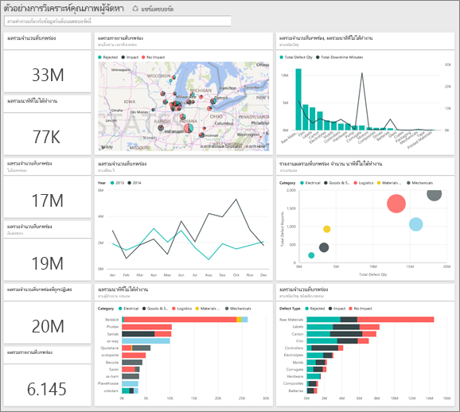
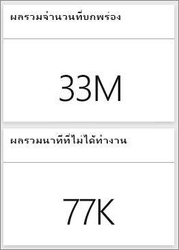
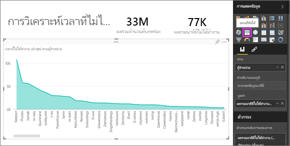
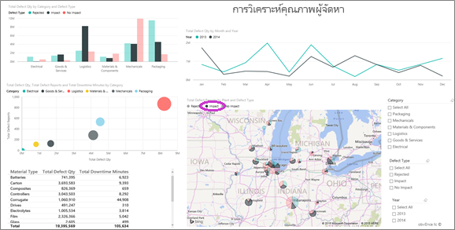
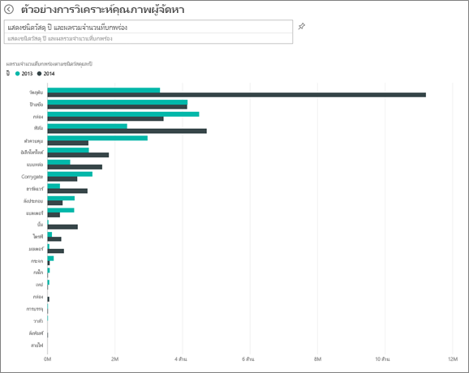
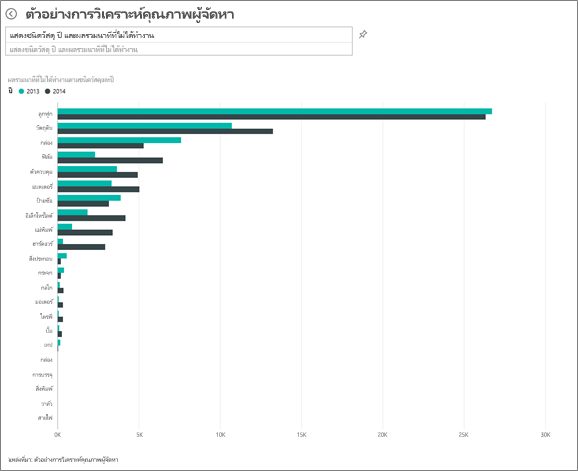
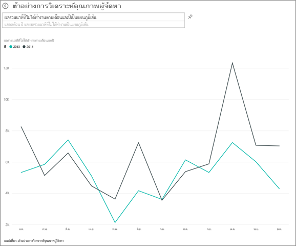

# ตัวอย่างการวิเคราะห์คุณภาพผู้จัดหาสินค้าสำหรับ Power BI: ชมการแนะนำ

## ภาพรวมแบบย่อของตัวอย่างการวิเคราะห์คุณภาพผู้จัดหาสินค้า
แดชบอร์ดตัวอย่างสำหรับอุตสาหกรรมนี้และรายงานเบื้องต้นเน้นไปที่หนึ่งในความท้าทายของห่วงโซ่อุปทานทั่วไป — การวิเคราะห์คุณภาพผู้จัดหา
การวิเคราะห์นี้ใช้เมตริกหลักสองอย่าง: ผลรวมจำนวนที่บกพร่องและผลรวมเวลาที่ไม่ได้ทำงานที่เกิดขึ้นจากข้อบกพร่องเหล่านี้ ตัวอย่างนี้มีสองวัตถุประสงค์หลัก:

* ทำความเข้าใจว่า ใครเป็นผู้จัดหาสินค้าที่มีคุณภาพดีที่สุดและแย่ที่สุด
* ระบุโรงงานไหนสามารถค้นพบและปฏิเสธวัสดุที่มีข้อบกพร่องได้ดีกว่า เพื่อลดเวลาที่ต้องหยุดทำงาน

ตัวอย่างนี้เป็นส่วนหนึ่งของชุดตัวอย่าง ที่แสดงให้เห็นวิธีการที่คุณสามารถใช้ Power BI กับข้อมูล รายงาน และแดชบอร์ดที่เกี่ยวข้องกับธุรกิจ
นี่เป็นข้อมูลจริงจาก obviEnce ([www.obvience.com](http://www.obvience.com/)) ที่ตัวตนต่าง ๆ ได้ถูกลบออกไป

## ข้อกำหนดเบื้องต้น

 ก่อนที่คุณสามารถใช้ตัวอย่าง คุณต้องดาวน์โหลดในรูปแบบ[ชุดเนื้อหา](https://docs.microsoft.com/power-bi/sample-supplier-quality#get-the-content-pack-for-this-sample) [ไฟล์ .pbix](http://download.microsoft.com/download/8/C/6/8C661638-C102-4C04-992E-9EA56A5D319B/Supplier-Quality-Analysis-Sample-PBIX.pbix) หรือ[เวิร์กบุ๊ก Excel](http://go.microsoft.com/fwlink/?LinkId=529779)

### รับชุดเนื้อหาสำหรับตัวอย่างนี้

1. เปิดบริการ Power BI (app.powerbi.com) และเข้าสู่ระบบ
2. ที่มุมด้านล่างซ้าย เลือก**รับข้อมูล**
   
    
3. บนหน้า รับข้อมูล ที่ปรากฏขึ้น เลือกไอคอน**ตัวอย่าง**
   
   
4. เลือก**ตัวอย่างการวิเคราะห์คุณภาพผู้จัดหาสินค้า** แล้วเลือก**เชื่อมต่อ**  
  
   
   
5. Power BI นำเข้าชุดเนื้อหา และเพิ่มแดชบอร์ด รายงาน และชุดข้อมูลใหม่ไปยังพื้นที่ทำงานปัจจุบันของคุณ เนื้อหาใหม่จะถูกทำเครื่องหมายด้วยเครื่องหมายดอกจันสีเหลือง 
   
   
  
### รับไฟล์ .pbix สำหรับตัวอย่างนี้

อีกทางเลือกหนึ่งคือ คุณสามารถดาวน์โหลดตัวอย่างเป็นไฟล์ .pbix ซึ่งถูกออกแบบมาสำหรับใช้กับ Power BI Desktop 

 * [ตัวอย่างการวิเคราะห์คุณภาพผู้ขาย PBIX](http://download.microsoft.com/download/8/C/6/8C661638-C102-4C04-992E-9EA56A5D319B/Supplier-Quality-Analysis-Sample-PBIX.pbix)

### รับเวิร์กบุ๊ก Excel สำหรับตัวอย่างนี้
คุณยังสามารถ[ดาวน์โหลดเพียงชุดข้อมูล (เวิร์กบุ๊ก Excel)](http://go.microsoft.com/fwlink/?LinkId=529779) สำหรับตัวอย่างนี้ได้ เวิร์กบุ๊กประกอบด้วยแผ่นงาน Power View ที่คุณสามารถดู และปรับเปลี่ยน เมื่อต้องการดูข้อมูลดิบ เลือก **Power Pivot > จัดการ**

## เวลาหยุดทำงานที่เกิดจากวัสดุที่มีข้อบกพร่อง
เรามาวิเคราะห์เวลาหยุดทำงานที่เกิดจากวัสดุที่มีข้อบกพร่อง และดูว่าผู้จัดหาสินค้ารายไหนที่เป็นผู้รับผิดชอบ  

1. บนแดชบอร์ด เลือกไทล์ตัวเลข**จำนวนข้อบกพร่องรวม** หรือไทล์ตัวเลข**เวลาหยุดทำงานรวม เป็นนาที**  

     

   รายงาน "อย่างการวิเคราะห์คุณภาพผู้จัดหา" จะเปิดไปยังหน้า "วิเคราะห์เวลาหยุดทำงาน" โปรดสังเกตว่า เรามีชิ้นส่วนที่มีข้อบกพร่องรวมทั้งหมด 33M ชิ้น และเวลาหยุดการทำงานทั้งหมดที่เกิดขึ้นจากชิ้นเหล่านี้อยู่ที่ 77K นาที วัสดุบางอย่างมีชิ้นที่บกพร่องน้อย แต่สามารถทำให้เกิดความล่าช้าและทำให้ต้องหยุดทำงานเป็นเวลานาน เรามาสำรวจมันบนหน้ารายงาน  
2. ดูที่เส้น**เวลาหยุดทำงานรวม เป็นนาที** ในแผนภูมิผสม**ข้อบกพร่องและเวลาหยุดทำงาน (นาที) ตามชนิดของวัสดุ** เราเห็นว่าวัสดุที่เป็นลอนก่อให้เกิดการหยุดทำงานสูงที่สุด  
3. เลือกคอลัมน์**เป็นลอน**ในแผนภูมิผสมเดียวกัน เพื่อดูว่าโรงงานไหนได้รับผลกระทบมากที่สุดจากข้อบกพร่องนี้ และผู้จัดหาสินค้ารายไหนที่เป็นผู้ที่รับผิดชอบ  

     
4. เลือกโรงงานแต่ละโรงงานในแผนที่ เพื่อดูว่าผู้จัดหาสินค้าหรือวัสดุไหนที่รับผิดชอบต่อการหยุดทำงานในโรงงานนั้น

### ผู้จัดหาสินค้ารายไหนเป็นผู้จัดหาที่แย่ที่สุด
 เราต้องการค้นหาผู้จัดหาสินค้าแปดรายที่แย่ที่สุด และหาว่า มีกี่เปอร์เซ็นต์ของเวลาหยุดทำงานทั้งหมดที่ของพวกเขาเป็นผู้รับผิดชอบ เราสามารถทำได้โดยการเปลี่ยนแผนภูมิพื้นที่**เวลาหยุดทำงาน (นาที) ตามผู้จัดหาสินค้า** ให้เป็นแผนที่ต้นไม้  

1. บนหน้า 3 ของรายงาน "การวิเคราะห์เวลาหยุดทำงาน" เลือก**แก้ไขรายงาน**ในมุมบนซ้าย  
2. เลือกแผนภูมิพื้นที่**เวลาหยุดทำงาน (นาที) ตามผู้จัดหาสินค้า** และในบานหน้าต่างการแสดงภาพ เลือกแผนที่ต้นไม้  

     

    แผนที่ต้นไม้จะเลือกเขตข้อมูล**ผู้จัดหาสินค้า** สำหรับ**จัดกลุ่ม**ให้โดยอัตโนมัติ  

      

   จากแผนที่ต้นไม้นี้ เราสามารถเห็นผู้จัดหาที่แย่ที่สุดแปดราย เป็นรูปสี่เหลี่ยมแปดรูป บนด้านซ้ายของแผนที่ต้นไม้ นอกจากนี้เรายังสามารถเห็นว่า พวกเขาทำให้เกิดการหยุดทำงานประมาณ 50% ของจำนวนนาทีทั้งหมด  
3. เลือก**ตัวอย่างการวิเคราะห์คุณภาพผู้จัดหาสินค้า**ในแถบนำทางด้านบนเพื่อย้อนกลับไปยังแดชบอร์ด

### เปรียบเทียบโรงงานต่าง ๆ
ในตอนนี้เรามาสำรวจกันว่า โรงงานไหนสามารถจัดการกับวัสดุที่มีข้อบกพร่อง ทำให้เกิดการหยุดทำงานน้อยกว่า  

1. เลือกไทล์แผนที่**รายงานข้อบกพร่องรวม ตามโรงงาน, ชนิดข้อบกพร่อง**  

    รายงานจะเปิดขึ้นไปยังหน้า "คุณภาพผู้จัดหาสินค้า"  

     
2. ในคำอธิบายของแผนที่ เลือกวงกลม**ผลกระทบ**  

      

    สังเกตว่า ในแผนภูมิฟอง **ลอจิสติกส์**คือประเภทที่สร้างปัญหามากที่สุด ทั้งในแง่ของจำนวนข้อบกพร่องรวม จำนวนรายงานความบกพร่อง และนาทีที่หยุดทำงานทั้งหมด เรามาสำรวจประเภทนี้กันเพิ่มเติม  
3. เลือกฟองลอจิสติกส์ในแผนภูมิฟอง และสังเกตโรงงานในเมืองสปริงฟิลด์ รัฐอิลลินอยส์ และเนเปอร์วิลล์ รัฐอิลลินอยส์ เนเปอร์วิลล์ ดูเหมือนว่าจะจัดการกับข้อบกพร่องได้ดีกว่า เนื่องจากมีของที่ถูกปฏิเสธมากและมีผลกระทบน้อย เมื่อเทียบกับตัวเลขผลกระทบที่มากของสปริงฟิลด์  

     
4. เลือก**ตัวอย่างการวิเคราะห์คุณภาพผู้จัดหาสินค้า**ในแถบนำทางด้านบนเพื่อกลับไปยังพื้นที่ทำงานของคุณที่ใช้งานอยู่

## วัสดุชนิดไหนที่จัดการได้ดีที่สุด
วัสดุที่ได้รับการจัดการดีที่สุด คือวัสดุที่มีเวลาหยุดทำงานต่ำที่สุดหรือไม่มีเลย โดยไม่ขึ้นกับปริมาณวัสดุที่มีข้อบกพร่อง

* ในแดชบอร์ด ลองดูที่ไทล์**จำนวนข้อบกพร่องรวม ตามชนิดของวัสดุ, ชนิดของข้อบกพร่อง**

  

สังเกตว่า **วัตถุดิบ**มีข้อบกพร่องรวมมาก แต่ส่วนใหญ่ข้อบกพร่องจะถูกปฏิเสธหรือไม่มีผลกระทบ

เรามาตรวจสอบเพื่อยืนยันว่า วัตถุดิบไม่ก่อให้เกิดการหยุดทำงานมากนัก แม้ว่าจะมีจำนวนข้อบกพร่องที่สูง

* ในแดชบอร์ด ดูที่ไทล์**จำนวนข้อพร่องรวม เวลาหยุดทำงานรวมเป็นนาที ตามชนิดของวัสดุ**

  

เห็นได้ว่า การจัดการวัตถุดิบทำได้ดี: ถึงแม้ว่ามีจำนวนข้อบกพร่องมากกว่า แต่จำนวนนาทีรวมที่หยุดทำงานต่ำกว่า

### เปรียบเทียบข้อบกพร่องกับเวลาหยุดทำงาน ตามปี
1. เลือกไทล์แผนที่**รายงานความบกพร่องรวม ตามโรงงาน, ชนิดข้อบกพร่อง** เพื่อเปิดรายงานไปยังรายงานหน้าแรกที่ชื่อ คุณภาพผู้จัดหาสินค้า
2. สังเกตว่า**จำนวนข้อบกพร่อง**ในปี 2014 สูงกว่าปี 2013  

      
3. ข้อบกพร่องที่มากกว่า ลงผลให้เกิดเวลาหยุดทำงานที่มากขึ้นหรือไม่ เราสามารถถามคำถามในกล่อง Q&A เพื่อหาคำตอบ  
4. เลือก**ตัวอย่างการวิเคราะห์คุณภาพผู้จัดหาสินค้า**ในแถบนำทางด้านบนเพื่อย้อนกลับไปยังแดชบอร์ด  
5. เนื่องจากเราทราบว่า วัตถุดิบมีข้อบกพร่องจำนวนสูงที่สุด ในกล่องคำถาม พิมพ์ "แสดงชนิดของวัสดุ ปี และจำนวนข้อบกพร่องรวม"  

    มีข้อบกพร่องที่เกิดจากวัตถุดิบในปี 2014 มากกว่าของปี 2013  

      
6. ตอนนี้ เปลี่ยนคำถามเป็น "แสดงชนิดของวัสดุ ปี และเวลาหยุดทำงานรวมเป็นนาที"  

   

เวลาหยุดทำงานเนื่องจากวัตถุดิบ ของปี 2013 และปี 2014 มีค่าใกล้เคียงกัน ถึงแม้ว่าจะมีข้อบกพร่องจากวัตถุดิบในปี 2014 มากกว่ามาก

ปรากฏว่าจำนวนข้อบกพร่องของวัตถุดิบที่เพิ่มขึ้นในปี 2014 ไม่ได้นำไปสู่เวลาหยุดทำงานจากวัตถุดิบที่เพิ่มขึ้นในปี 2014

### เปรียบเทียบข้อบกพร่องกับเวลาหยุดทำงาน เทียบเดือนต่อเดือน
มาดูไทล์แดชบอร์ดอีกอันหนึ่ง ซึ่งเกี่ยวข้องกับจำนวนข้อบกพร่องรวม  

1. เลือกลูกศรย้อนกลับที่มุมซ้ายด้านบนของกล่องคำถามเมื่อต้องการกลับไปยังแดชบอร์ด  

    ดูที่ไทล์**จำนวนข้อบกพร่องรวม ตามเดือน, ปี**อย่างใกล้ ๆ พบว่า ครึ่งปีแรกของปี 2014 มีจำนวนข้อบกพร่องที่คล้ายกับของปี 2013 แต่ในครึ่งปีหลังของปี 2014 จำนวนข้อบกพร่องดีดขึ้นอย่างมาก  

      

    เรามาดูว่า การเพิ่มจำนวนข้อบกพร่องนี้ ส่งผลให้เกิดเวลาหยุดทำงานเป็นนาทีในระดับที่เท่ากันหรือไม่  
2. ในกล่องคำถาม พิมพ์ "เวลาหยุดทำงานรวมเป็นนาที ตามเดือนและปี เป็นแผนภูมิเส้น"  

   

   เราเห็นการกระโดดขึ้นของเวลาหยุดทำงานในเดือนมิถุนายนและตุลาคม แต่นอกเหนือไปจากนั้น จำนวนข้อบกพร่องที่เพิ่มขึ้นไม่ได้ทำให้เกิดเวลาหยุดทำงานเพิ่มขึ้นอย่างมีนัยสำคัญ ซึ่งแสดงให้เห็นว่าเราจัดการกับข้อบกพร่องนี้ได้ดีทีเดียว  
3. เมื่อต้องการปักหมุดแผนภูมินี้ไปยังแดชบอร์ด เลือกไอคอนหมุดทางด้านขวาของกล่องคำถาม  
4. เพื่อจะสำรวจเดือนที่มีค่าแตกต่างจากเดือนอื่นมาก ลองดูจำนวนนาทีในเดือนตุลาคม ตามชนิดของวัสดุ ตำแหน่งโรงงาน ประเภท ฯลฯ โดยการถามคำถามเช่น "เวลาหยุดทำงานรวมเป็นนาที ในเดือนตุลาคม ตามโรงงาน"    
5. เลือกลูกศรย้อนกลับที่มุมซ้ายด้านบนของกล่องคำถามเมื่อต้องการกลับไปยังแดชบอร์ด

นี่เป็นสภาพแวดล้อมที่ปลอดภัยที่จะทดลองสิ่งต่าง ๆ คุณสามารถเลือกที่จะไม่บันทึกการเปลี่ยนแปลงของคุณ ถ้าคุณบันทึก คุณสามารถ**รับข้อมูล**สำหรับสำเนาชุดใหม่ของตัวอย่างนี้ได้เสมอ

## ขั้นตอนถัดไป: เชื่อมต่อกับข้อมูลของคุณ
เราหวังว่าการแนะนำนี้ ได้แสดงให้เห็นว่าแดชบอร์ด, Q&A และรายงาน Power BI สามารถให้ข้อมูลเชิงลึกในข้อมูลคุณภาพผู้จัดหาสินค้า ตอนนี้ถึงตาคุณแล้ว — ลองเชื่อมต่อกับข้อมูลของคุณเอง ด้วย Power BI คุณสามารถเชื่อมต่อกับแหล่งข้อมูลที่หลากหลาย เรียนรู้เพิ่มเติมเกี่ยวกับ[เริ่มต้นใช้งาน Power BI](service-get-started.md)
