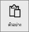
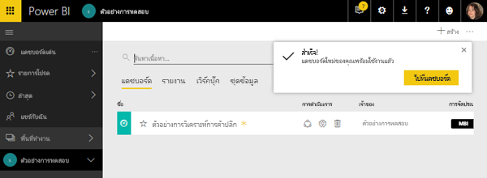
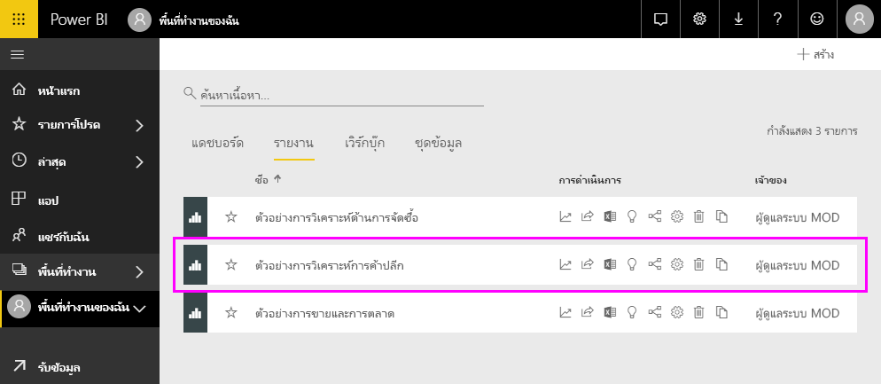
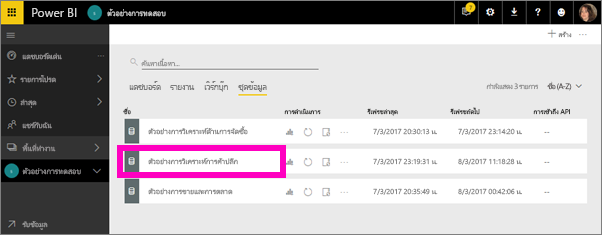
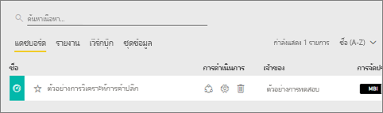
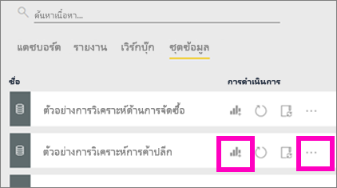
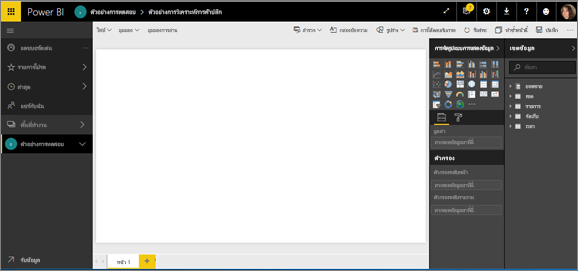
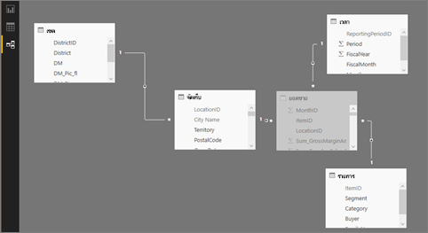

#  เชื่อมต่อกับตัวอย่างบริการ Power BI

บทช่วยสอนนี้สอนให้คุณรู้จักวิธี: 
- นำเข้าชุดเนื้อหาตัวอย่างเพิ่มไปยังบริการ Power BI และเปิดดูเนื้อหา *ชุดเนื้อหา*คือตัวอย่างชนิดหนึ่ง ที่มีการรวมชุดข้อมูลกับแดชบอร์ดและรายงาน 
- เปิดไฟล์ .pbix ตัวอย่างใน Power BI Desktop

หากคุณอยากรู้รายละเอียดความเป็นมาก่อน เราขอแนะนำให้เริ่มต้นด้วยบทความ[ตัวอย่างชุดข้อมูลสำหรับ Power BI](sample-datasets.md) ในบทความดังกล่าว คุณจะได้เรียนรู้เกี่ยวกับตัวอย่าง วิธีรับตัวอย่างเหล่านั้น จะบันทึกมันตรงไหน จะใช้มันอย่างไร และบางส่วนของเรื่องราวที่แต่ละตัวอย่างบอกออกมา หลังจากนั้น เมื่อคุณมีความเข้าใจพื้นฐานแล้ว ค่อยกลับมาบทช่วยสอนนี้   

## ข้อกำหนดเบื้องต้น
มีตัวอย่างให้สำหรับบริการ Power BI และ Power BI Desktop สำหรับผู้ที่ต้องการทำตาม เราจะใช้ตัวอย่างการวิเคราะห์ด้านการขายปลีก

ชุดเนื้อหาตัวอย่างการ*วิเคราะห์ด้านการขายปลีก*ที่ใช้ในบทช่วยสอนนี้ประกอบด้วยแดชบอร์ด รายงาน และชุดข้อมูล
ทำความคุ้นเคยกับชุดเนื้อหานี้ และสถานการณ์ของมัน คุณอาจต้องการ[ชมการแนะนำของตัวอย่างการวิเคราะห์ด้านการขายปลีก](sample-retail-analysis.md)ก่อนที่คุณจะเริ่มได้

## ตัวอย่างและบริการของ Power BI

1. เปิดและลงชื่อเข้าใช้บริการของ Power BI (app.powerbi.com)
2. เลือกปุ่ม**รับข้อมูล**ที่ด้านล่างของพื้นที่นำทางด้านซ้ายมือ ถ้าคุณไม่เห็น**รับข้อมูล**ขยายบานหน้าต่างนำทาง โดยการเลือก
   
   
5. เลือก**ตัวอย่าง**  
   
   
6. เลือก*ตัวอย่างการวิเคราะห์ด้านการขายปลีก* และเลือก**เชื่อมต่อ**   
   
   

## อะไรกันแน่ที่ถูกนำเข้า?
ด้วยตัวอย่างชุดเนื้อหา เมื่อคุณเลือก**เชื่อมต่อ** จริง ๆ แล้ว Power BI จะนำสำเนาของชุดเนื้อหานั้น มาเก็บไว้ให้คุณในคลาวด์ เนื่องจากบุคคลที่สร้างชุดเนื้อหา รวมชุดข้อมูล รายงาน และแดชบอร์ด -- นั่นคือสิ่งที่คุณจะได้รับเมื่อคุณคลิก**เชื่อมต่อ** 

1. Power BI สร้างแดชบอร์ดใหม่ และแสดงรายการในแท็บ**แดชบอร์ด**ของคุณ เครื่องหมายดอกจันสีเหลือง บอกให้คุณทราบว่าเป็นใหม่
   
   
2. เปิดแท็บ**รายงาน**  ที่นี่คุณจะเห็นรายงานใหม่ที่มีชื่อ*ตัวอย่างการวิเคราะห์ด้านการขายปลีก*
   
   
   
   และตรวจสอบแท็บ**ชุดข้อมูล**  มีชุดข้อมูลใหม่ที่นั่นเช่นเดียวกัน
   
   

## สำรวจเนื้อหาใหม่ของคุณ
ตอนนี้ ลองสำรวจแดชบอร์ด ชุดข้อมูล และรายงานด้วยตัวคุณเอง มีหลายวิธีที่จะนำทางไปยังแดชบอร์ด รายงาน และชุดข้อมูล วิธีหนึ่งในหลายวิธีเหล่านั้นจะอธิบายไว้ด้านล่าง  

> [!TIP]
> ต้องการการนำทางไหม?  ลอง[แนะนำของตัวอย่างการวิเคราะห์ด้านการขายปลีก](sample-retail-analysis.md)สำหรับการสาธิตตัวอย่างนี้ให้ดูทีละขั้นตอน
> 
> 

1. ย้อนกลับไปยังแท็บ**แดชบอร์ด**ของคุณ และเลือกแดชบอร์ด*ตัวอย่างการวิเคราะห์ด้านการขายปลีก*เพื่อเปิด    
   
   
2. แดชบอร์ดจะเปิดขึ้นมา  มีไทล์แสดงข้อมูลให้เห็นหลากหลายแบบในนั้น
   
   
3. เลือกไทล์หนึ่งในนั้นเพื่อเปิดรายงานพื้นฐาน  ในตัวอย่างนี้ เราจะเลือกแผนภูมิพื้นที่ (มีเค้าร่างเป็นสีชมพูในภาพก่อนหน้า) รายงานจะเปิดออกเป็นหน้าที่มีแผนภูมิพื้นที่นั้นอยู่ข้างใน
   
    
   
   > [!NOTE]
   > ถ้าไทล์ถูกสร้างด้วย[Power BI Q&A](power-bi-tutorial-q-and-a.md) หน้าถามตอบจะเปิดขึ้นแทน ถ้าไทล์เป็นการ[ปักหมุดจาก Excel](service-dashboard-pin-tile-from-excel.md) จะเปิด Excel Online ขึ้นภายใน Power BI
   > 
   > 
1. กลับไปที่แท็บ**ชุดข้อมูล**ของคุณ คุณมีหลายตัวเลือกในการสำรวจชุดข้อมูลของคุณ  คุณจะไม่สามารถเปิดมัน และดูแถวและคอลัมน์ที่มีอยู่ทั้งหมด (เหมือนที่คุณทำได้ใน Power BI Desktop หรือ Excel)  เมื่อมีบางคนแชร์ชุดเนื้อหากับเพื่อนร่วมงาน พวกเขามักต้องการแชร์ข้อมูลเชิงลึก ไม่ได้ให้เพื่อนร่วมงานของพวกเขาเข้าถึงข้อมูลโดยตรง แต่นั่นไม่ได้หมายความว่า คุณไม่สามารถสำรวจชุดข้อมูล  
   
   
   
   * วิธีหนึ่งในการสำรวจชุดข้อมูล ก็โดยการสร้างการแสดงภาพและรายงานของคุณเองตั้งแต่เริ่มต้น  เลือกไอคอนแผนภูมิ  เพื่อเปิดชุดข้อมูลในโหมดการแก้ไขรายงาน
     
       
   * อีกวิธีหนึ่งในการสำรวจชุดข้อมูล คือการเรียกใช้[ข้อมูลเชิงลึกด่วน](consumer/end-user-insights.md) เลือกจุดไข่ปลา (...) แล้วเลือก**รับข้อมูลเชิงลึก** เมื่อข้อมูลเชิงลึกพร้อมแล้ว เลือก**ดูข้อมูลเชิงลึก**
     
       

## ตัวอย่างและ Power BI Desktop 
เมื่อคุณเริ่มเปิดไฟล์ PBIX ตัวอย่าง จะแสดงในมุมมองรายงาน ที่คุณสามารถสำรวจ สร้าง และปรับเปลี่ยนตัวเลขใด ๆ ของหน้ารายงานที่มีการแสดงผลเป็นภาพ มุมมองรายงาน ออกแบบให้ได้ประสบการณ์แบบเดียวกับ มุมมองการแก้ไขรายงาน ในบริการ Power BI คุณสามารถย้ายภาพไปรอบ ๆ คัดลอกและวาง ผสาน เป็นต้น

สิ่งที่แตกต่างกันคือ เมื่อใช้ Power BI Desktop คุณสามารถทำงานกับคิวรีของคุณ และการวางรูปแบบข้อมูลของคุณ เพื่อให้แน่ใจว่า ข้อมูลของคุณรองรับข้อมูลเชิงลึกที่ดีที่สุดในรายงานของคุณ จากนั้นคุณสามารถบันทึกไฟล์ Power BI Desktop ของคุณได้ทุกที่ที่คุณต้องการ ไม่ว่าจะเป็นไดรฟ์ในเครื่อง หรือไปยังระบบคลาวด์

1. เปิด[ไฟล์ .pbix ตัวอย่างการวิเคราะห์ด้านการขายปลีก](http://download.microsoft.com/download/9/6/D/96DDC2FF-2568-491D-AAFA-AFDD6F763AE3/Retail%20Analysis%20Sample%20PBIX.pbix)ใน Power BI Desktop 

    

1. ไฟล์เปิดขึ้นในมุมมองรายงาน โปรดสังเกต 4 แท็บที่ด้านล่างของตัวแก้ไขรายงานหรือไม่? นั่นหมายความว่า ในรายงานนี้มีหน้าทั้งหมด 4 หน้า และหน้า "ร้านค้าใหม่" กำลังถูกเลือกในตอนนี้ 

    .

3. สำหรับการเจาะลึกลงในตัวแก้ไขรายงาน ดู[ชมการแนะนำของตัวแก้ไขรายงาน](service-the-report-editor-take-a-tour.md)

## อะไรกันแน่ที่ถูกนำเข้า?
เมื่อคุณเปิดไฟล์ PBIX ตัวอย่างในเดสก์ท็อป จริง ๆ แล้ว Power BI จะนำสำเนาของชุดเนื้อหานั้น มาเก็บไว้ให้คุณในคลาวด์ จากเดสก์ท็อป คุณสามารถเข้าถึงรายงาน***และชุดข้อมูลพื้นฐาน*** เมื่อข้อมูลถูกโหลด Power BI Desktop จะพยายามค้นหา และสร้างความสัมพันธ์สำหรับคุณ  

1. สลับไปยัง[มุมมองข้อมูล](desktop-data-view.md)โดยการเลือกไอคอนตาราง 
 
    

    มุมมองข้อมูล ช่วยให้คุณตรวจสอบ สำรวจ และทำความเข้าใจข้อมูลในรูปแบบ Power BI Desktop มันแตกต่างจากวิธีคุณที่ดูตาราง คอลัมน์ และข้อมูลในตัวแก้ไขคิวรี ด้วยมุมมองข้อมูล คุณกำลังดูข้อมูลของคุณหลังจากที่โหลดเข้ามาในรูปแบบเรียบร้อยแล้ว

    เมื่อคุณกำลังจัดรูปแบบข้อมูลของคุณ บางครั้งคุณต้องการดูว่ามีอะไรอยู่ในตารางหรือคอลัมน์จริง ๆ ซึ่งมักจะลงลึกไปในระดับแถว โดยไม่ต้องสร้างวิชวลบนพื้นที่รายงาน โดยเฉพาะอย่างยิ่งเมื่อคุณกำลังจะสร้างการวัดและคอลัมน์จากการคำนวณ หรือคุณจำเป็นต้องระบุชนิดข้อมูลหรือประเภทข้อมูล

1. สลับไปยัง[มุมมองความสัมพันธ์](desktop-relationship-view.md)โดยเลือกไอคอน
 
    

    มุมมองความสัมพันธ์ แสดงตาราง คอลัมน์ และความสัมพันธ์ทั้งหมดในรูปแบบข้อมูลของคุณ จากที่นี่ คุณสามารถดู เปลี่ยน และสร้างความสัมพันธ์ใหม่

## สำรวจเนื้อหาใหม่ของคุณ
ตอนนี้ คุณลองสำรวจชุดข้อมูล ความสัมพันธ์ และรายงานด้วยตัวคุณเอง สำหรับความช่วยเหลือเพื่อให้คุณเริ่มต้นใช้งานได้ ไปที่[คำแนะนำที่เริ่มต้นใช้งานเดสก์ท็อป](desktop-getting-started.md)    

## ขั้นตอนถัดไป

- [แนวคิดพื้นฐานของ power BI](consumer/end-user-basic-concepts.md)
- [ตัวอย่างสำหรับบริการ Power BI](sample-datasets.md)
- [แหล่งข้อมูลสำหรับ Power BI](service-get-data.md)

คุณมีคำถามเพิ่มเติมหรือไม่ [ลองไปที่ชุมชน Power BI](http://community.powerbi.com/)
