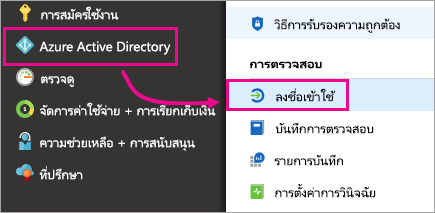
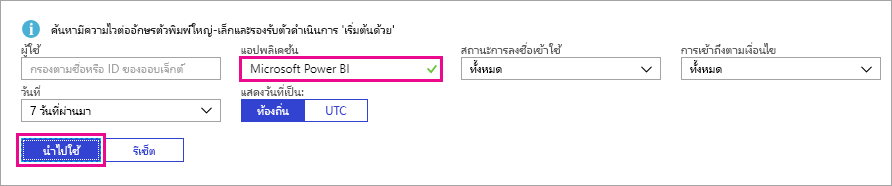

# ค้นหาผู้ใช้ Power BI ที่มีการลงชื่อเข้าใช้

ถ้าคุณเป็นผู้ดูแลระบบผู้เช่า และต้องการดูว่าใครได้ลงชื่อเข้าใช้ Power BI ใช้[รายงานการเข้าถึงและใช้งาน Azure Active Directory](/azure/active-directory/reports-monitoring/concept-sign-ins)เพื่อให้สามารถมองเห็น

<iframe width="640" height="360" src="https://www.youtube.com/embed/1AVgh9w9VM8?showinfo=0" frameborder="0" allowfullscreen></iframe>

> [!NOTE]
> การ**ลงชื่อเข้า**รายงานมีข้อมูลที่เป็นประโยชน์ แต่จะไม่สามารถระบุชนิดของแต่ละผู้ใช้มีสิทธิ์การใช้งาน การใช้ศูนย์การจัดการ Microsoft 365 เพื่อดูสิทธิ์การใช้งาน

## ข้อกำหนด

ผู้ใช้ใด ๆ (รวมถึงที่ไม่ใช่ผู้ดูแลระบบ) สามารถดูรายงานการลงชื่อเข้าใช้ของตนเองได้ แต่คุณต้องตรงตามข้อกำหนดต่อไปนี้เพื่อดูรายงานผู้ใช้ทั้งหมด

* ผู้เช่าของคุณต้องมีสิทธิ์การใช้งานของ Azure Active Directory Premium เชื่อมโยงด้วย

* คุณต้องได้รับมอบหมายหน้าที่ดังต่อไปนี้: ผู้ดูแลระบบส่วนกลาง ผู้ดูแลความปลอดภัย หรือตัวอ่านความปลอดภัย

## ใช้พอร์ทัล Azure เพื่อดูการลงชื่อเข้าใช้

หากต้องการดูกิจกรรมการลงชื่อเข้าใช้ ให้ปฏิบัติตามขั้นตอนเหล่านี้

1. ใน **พอร์ทัล Azure** เลือก **Azure Active Directory**

1. ใต้ **การตรวจสอบ** เลือก **ลงชื่อเข้า**
   
    

1. กรองแอปพลิเคชันตาม **Microsoft Power BI** หรือ **Power BI Gateway** อย่างใดอย่างหนึ่ง แล้วเลือก **นำไปใช้**

    **Microsoft Power BI**ตัวกรองเพื่อลงชื่อเข้าใช้ในกิจกรรมที่เกี่ยวข้องกับบริการ ขณะ**Power BI Gateway**ตัวกรองเพื่อลงชื่อเข้าใช้กิจกรรมเฉพาะเกตเวย์ข้อมูลภายในองค์กร
   
    

## ส่งออกข้อมูล

คุณสามารถ[ดาวน์โหลดลงในรายงาน](/azure/active-directory/reports-monitoring/quickstart-download-sign-in-report)ในหนึ่งในรูปแบบที่สอง: ไฟล์ CSV หรือไฟล์ JSON ได้

ที่ด้านบนของคำ**ลงชื่อเข้าใช้**รายงาน เลือก**ดาวน์โหลด**แล้ว เลือกหนึ่งในตัวเลือกต่อไปนี้:

* **CSV**ดาวน์โหลดไฟล์ CSV สำหรับข้อมูลที่ถูกกรองในขณะนี้

* **JSON**ดาวน์โหลดไฟล์ JSON สำหรับข้อมูลที่ถูกกรองในขณะนี้

## การเก็บรักษาข้อมูล

ข้อมูลที่เกี่ยวข้องกับการลงชื่อเข้าใช้สามารถใช้งานได้สูงสุด 30 วัน สำหรับข้อมูลเพิ่มเติม ดู[นโยบายการเก็บข้อมูลรายงานของ Azure Active Directory](/azure/active-directory/reports-monitoring/reference-reports-data-retention)

## ขั้นตอนถัดไป

[ใช้การตรวจสอบภายในองค์กรของคุณ](service-admin-auditing.md)

มีคำถามเพิ่มเติมหรือไม่? [ลองถามชุมชน Power BI](https://community.powerbi.com/)