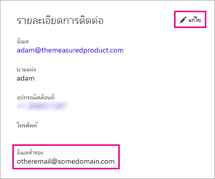

# <a name="using-an-alternate-email-address"></a>การใช้ที่อยู่อีเมลสำรอง

เมื่อคุณลงทะเบียนใช้งาน Power BI คุณต้องให้ที่อยู่อีเมล โดยค่าเริ่มต้น Power BI จะใช้ที่อยู่นี้เพื่อส่งอัปเดตเกี่ยวกับกิจกรรมในบริการ ตัวอย่างเช่น เมื่อมีบุคคลแจ้งเชิญเพื่อใช้งานร่วมกัน ก็จะส่งไปยังที่อยู่นี้

ในบางกรณี คุณอาจต้องการส่งอีเมลเหล่านี้ไปยังที่อยู่อีเมลสำรองแทนที่อยู่อีเมลที่ใช้ลงทะเบียน บทความนี้จะอธิบายวิธีการระบุที่อยู่อีเมลสำรองใน Office 365 และ ใน PowerShell นอกจากนี้ยังอธิบายวิธีแก้ไขที่อยู่อีเมลใน Azure Active Directory (Azure AD) ด้วย

> [!NOTE]
> การระบุที่อยู่สำรองจะไม่มีผลต่อที่อยู่อีเมลที่ Power BI ใช้สำหรับอัปเดตบริการ, จดหมายข่าว และการติดต่อสื่อสารด้านการส่งเสริมการขายอื่น ๆ  การติดต่อสื่อสารเหล่านั้นจะถูกส่งไปยังที่อยู่อีเมลที่คุณใช้ลงทะเบียนใช้งาน Power BI เสมอ

## <a name="use-office-365"></a>ใช้ Office 365

หากต้องการระบุที่อยู่สำรองใน Office 365 ให้ปฏิบัติตามขั้นตอนเหล่านี้

1. เปิด [หน้าข้อมูลส่วนบุคคล Office 365](https://portal.office.com/account/#personalinfo) ให้ลงชื่อเข้าใช้ด้วย ที่อยู่อีเมลและรหัสผ่านที่คุณใช้สำหรับ Power BI หากมีการร้องขอ

1. บนเมนูทางด้านซ้าย เลือก **ข้อมูลส่วนบุคคล**

1. ในส่วน **รายละเอียดการติดต่อ** เลือก **แก้ไข**

    หากไม่สามารถแก้ไขรายละเอียดของคุณได้ แสดงว่าผู้ดูแลระบบ Office 365 ของคุณเป็นผู้จัดการที่อยู่อีเมลของคุณ โปรดติดต่อผู้ดูแลระบบของคุณเพื่ออัปเดตที่อยู่อีเมลของคุณ

    

1. ในเขตข้อมูล **อีเมลสำรอง** ใส่ที่อยู่อีเมลที่คุณต้องการให้ส่งการอัปเดต Power BI

## <a name="use-powershell"></a>ใช้ PowerShell

หากต้องระบุที่อยู่สำรองใน PowerShell ให้ใช้คำสั่ง [Set-AzureADUser](/powershell/module/azuread/set-azureaduser/)

```powershell
Set-AzureADUser -ObjectId john@contoso.com -OtherMails "otheremail@somedomain.com"
```

## <a name="email-address-resolution-in-azure-ad"></a>การแก้ไขปัญหาที่อยู่อีเมลใน Azure AD

เมื่อจับโทเค็น Active Azure Directory (AAD) แบบฝังสำหรับ Power BI คุณสามารถใช้อีเมลที่แตกต่างกันสามชนิด:

* ที่อยู่อีเมลหลักที่เชื่อมโยงกับบัญชี Azure AD ของผู้ใช้

* ที่อยู่อีเมล UserPrincipalName (UPN)

* แอตทริบิวต์แบบอาร์เรย์อื่น ๆ ที่เก็บ *ที่อยู่อีเมล*

Power BI จะเลือกว่าจะใช้อีเมลใดจากลำดับต่อไปนี้:

1. หากแอตทริบิวต์จดหมายในออบเจ็กต์ผู้ใช้ Azure AD แสดงขึ้น แสดงว่า Power BI ใช้แอตทริบิวต์จดหมายนั้นสำหรับที่อยู่อีเมล

1. หากอีเมล UPN *ไม่*ใช่โดเมนที่อยู่อีเมล**\*onmicrosoft.com** (ข้อมูลหลังจากสัญลักษณ์ "\@") Power BI จะใช้แอตทริบิวต์จดหมายนั้นสำหรับอยู่อีเมล

1. หากแอตทริบิวต์แบบอาร์เรย์อื่น ๆ ที่เก็บ*ที่อยู่อีเมล* ในออบเจ็กต์ผู้ใช้แสดงขึ้น แสดงว่าอีเมลแรกในรายการนั้น (เนื่องจากสามารถมีอีเมลได้หลายอีเมลในแอตทริบิวต์นี้) ถูกใช้

1. หากไม่ตรงกับเงื่อนไขทั้งหมดดังกล่าว จะใช้ที่อยู่ UPN

มีคำถามเพิ่มเติมหรือไม่? [ลองไปที่ชุมชน Power BI](http://community.powerbi.com/)

