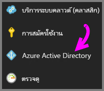
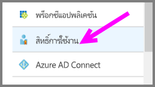
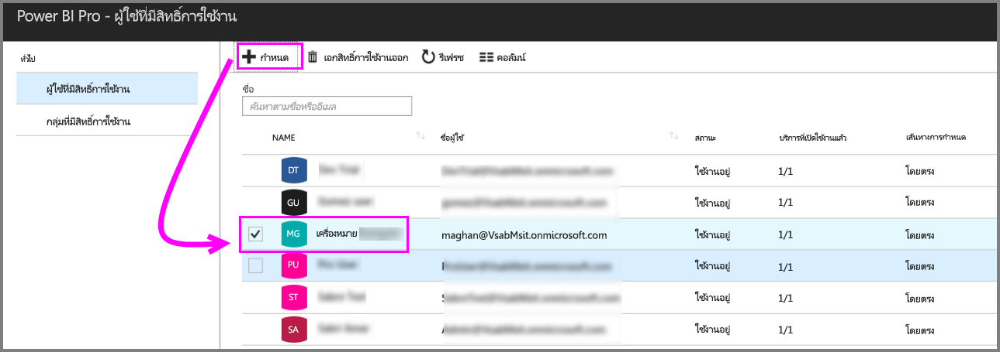

# เริ่มต้นใช้งานด่วน: กำหนดสิทธิ์การใช้งาน Power BI Pro ใน Azure

Power BI Pro เป็นสิทธิ์การใช้งานสำหรับแต่ละบุคคล ที่ให้การเข้าถึงเนื้อหาและความสามารถทั้งหมดในบริการของ Power BI รวมถึงความสามารถในการแชร์เนื้อหาและทำงานร่วมกับผู้ใช้อื่นที่มีสิทธิ์การใช้งานแบบ Pro ได้ เฉพาะผู้ใช้แบบ Pro เท่านั้นที่สามารถเผยแพร่เนื้อหา หรือใช้เนื้อหาจากพื้นที่ทำงานจากแอป, แชร์แดชบอร์ด และสมัครสมาชิกแดชบอร์ดและรายงานได้ บทความนี้อธิบายวิธีการกำหนดสิทธิ์การใช้งาน Power BI Pro ใน Azure คุณยังสามารถ[กำหนดสิทธิ์การใช้งานใน Office 365](service-admin-assigning-power-bi-pro-licenses.md) ได้

## ข้อกำหนดเบื้องต้น

คุณต้องเป็นเจ้าของการสมัครใช้งาน Azure ที่ Power BI ใช้สำหรับการค้นหา Active Directory

คุณต้อง[ซื้อสิทธิ์การใช้งานอย่างน้อยหนึ่งสิทธิ์](service-admin-purchasing-power-bi-pro.md)ก่อนที่คุณจะเริ่ม

## กำหนดสิทธิ์การใช้งานให้กับบัญชีผู้ใช้แต่ละราย

ทำตามขั้นตอนต่อไปนี้เพื่อกำหนดสิทธิ์การใช้งาน Power BI Pro ให้กับบัญชีผู้ใช้แต่ละราย:

1. เปิด[พอร์ทัล Azure](https://ms.portal.azure.com/#@microsoft.onmicrosoft.com/dashboard/private/39bc3cf7-31a4-43f6-954c-f2d69ca2f0) 

2. ในแถบนำทางด้านซ้าย คลิกที่ **Azure Active Directory**

    

3. ภายใต้ **Azure Active Directory** เลือก**สิทธิ์การใช้งาน**

    

4. ภายใต้**สิทธิ์การใช้งาน** เลือก**ผลิตภัณฑ์ทั้งหมด** จากนั้นเลือก **Power BI Pro** เพื่อแสดงรายการของผู้ใช้ที่มีสิทธิ์ใช้งาน

    

5. เลือก**กำหนด**เพื่อเพิ่มสิทธิ์การใช้งาน Power BI Pro ให้กับบัญชีผู้ใช้เพิ่มเติม

    

## ขั้นตอนถัดไป

ตอนนี้ คุณได้กำหนดสิทธิ์การใช้งานแล้ว เรียนรู้เพิ่มเติมเกี่ยวกับ Power BI Pro

[Power BI Pro ในองค์กรของคุณ](service-admin-power-bi-pro-in-your-organization.md)

[ค้นหาผู้ใช้ Power BI ที่มีการลงชื่อเข้าใช้](service-admin-access-usage.md)

มีคำถามเพิ่มเติมหรือไม่ [ลองถามชุมชน Power BI](https://community.powerbi.com/)