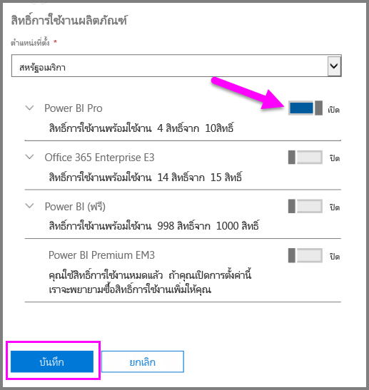
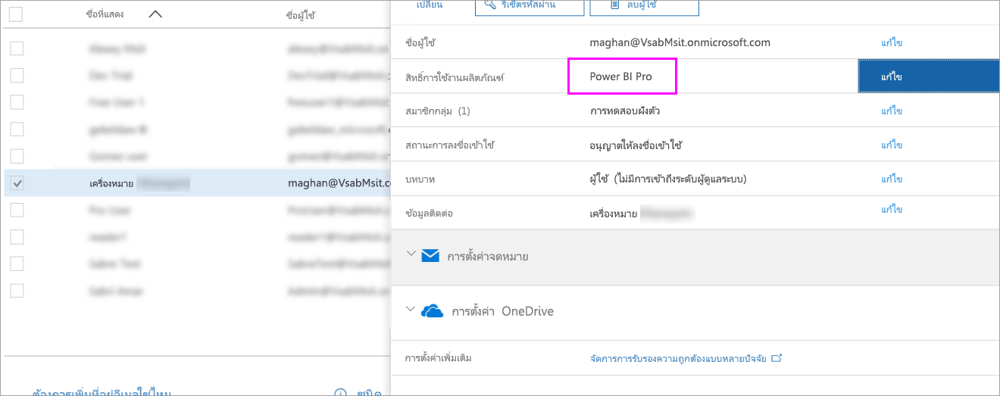

# เริ่มต้นใช้งานด่วน: กำหนดสิทธิ์การใช้งาน Power BI Pro ใน Office 365

Power BI Pro เป็นสิทธิ์การใช้งานสำหรับแต่ละบุคคล ที่ให้การเข้าถึงเนื้อหาและความสามารถทั้งหมดในบริการของ Power BI รวมถึงความสามารถในการแชร์เนื้อหาและทำงานร่วมกับผู้ใช้อื่นที่มีสิทธิ์การใช้งานแบบ Pro ได้ เฉพาะผู้ใช้แบบ Pro เท่านั้นที่สามารถเผยแพร่เนื้อหา หรือใช้เนื้อหาจากพื้นที่ทำงานจากแอป, แชร์แดชบอร์ด และสมัครสมาชิกแดชบอร์ดและรายงานได้ บทความนี้อธิบายวิธีการกำหนดสิทธิ์การใช้งาน Power BI Pro ใน Office 365 คุณยังสามารถ[กำหนดสิทธิ์การใช้งานใน Azure](service-admin-assigning-power-bi-pro-licenses-azure.md) ได้

## ข้อกำหนดเบื้องต้น

คุณต้องเป็นสมาชิกของบทบาท[**ผู้ดูแลระบบส่วนกลาง** หรือ **ผู้ดูแลการเรียกเก็บเงิน**](https://support.office.com/article/about-office-365-admin-roles-da585eea-f576-4f55-a1e0-87090b6aaa9d?ui=en-US&rs=en-US&ad=US)ใน Office 365

คุณต้อง[ซื้อสิทธิ์การใช้งานอย่างน้อยหนึ่งสิทธิ์](service-admin-purchasing-power-bi-pro.md)ก่อนที่คุณจะเริ่ม

## กำหนดสิทธิ์การใช้งานให้กับบัญชีผู้ใช้แต่ละราย

ทำตามขั้นตอนต่อไปนี้เพื่อกำหนดสิทธิ์การใช้งาน Power BI Pro ให้กับบัญชีผู้ใช้แต่ละราย:

1. เปิด[ศูนย์การจัดการ Office 365](https://portal.office.com/adminportal/home#/homepage)

2. ในบานหน้าต่างด้านซ้าย ขยาย**ผู้ใช้** แล้วเลือก**ผู้ใช้ที่ใช้งานอยู่**

    

3. เลือกผู้ใช้ จากนั้นภายใต้**สิทธิ์การใช้งานผลิตภัณฑ์**เลือก**แก้ไข**

    

4. ภายใต้ **Power BI Pro** สลับการตั้งค่าเป็น**เปิด** แล้วเลือก**บันทึก**

    

5. ภายใต้**สถานะ**ของบัญชีที่เลือก ตรวจสอบว่าที่มีการกำหนดสิทธิ์การใช้งาน Power BI Pro เรียบร้อยแล้ว

    

## ขั้นตอนถัดไป

ตอนนี้ คุณได้กำหนดสิทธิ์การใช้งานแล้ว เรียนรู้เพิ่มเติมเกี่ยวกับ Power BI Pro

[Power BI Pro ในองค์กรของคุณ](service-admin-power-bi-pro-in-your-organization.md)

[ค้นหาผู้ใช้ Power BI ที่มีการลงชื่อเข้าใช้](service-admin-access-usage.md)

มีคำถามเพิ่มเติมหรือไม่ [ลองถามชุมชน Power BI](https://community.powerbi.com/)