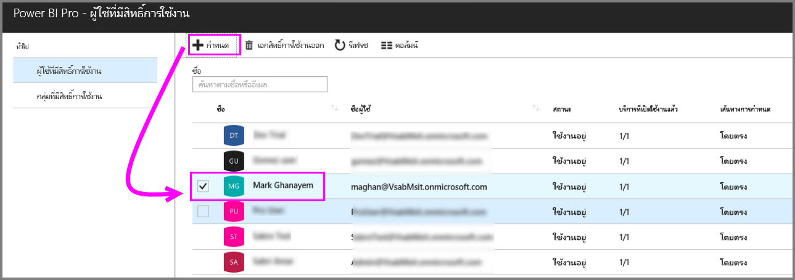
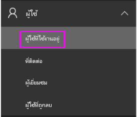
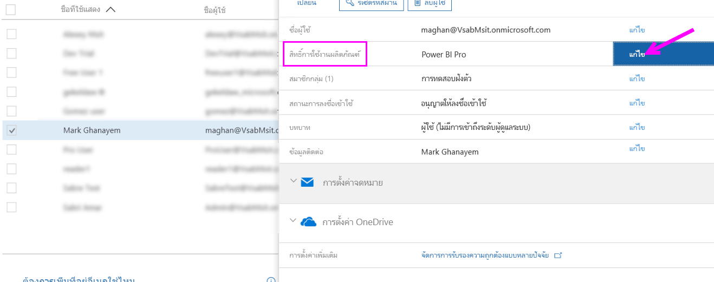
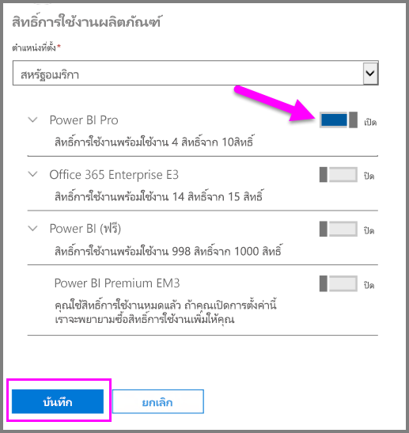
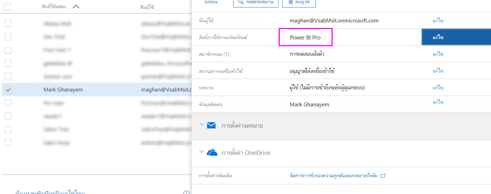

# กำหนดสิทธิ์การใช้งาน Power BI Pro

ผู้ดูแลระบบสามารถเลือกจากพอร์ทัลการจัดการและคำสั่ง Cmdlet ของ PowerShell ที่หลากหลายเพื่อกำหนดสิทธิ์การใช้งาน Power BI Pro ให้กับผู้ใช้ การจัดการสิทธิ์การใช้งานของ Power BI ได้รับการสนุบสนุนโดย Azure Active Directory (Azure AD)

* ผู้เป็นเจ้าของการสมัครใช้งาน Azure สามารถใช้พาเนล Azure Active Directory ใน[พอร์ทัล Azure](https://ms.portal.azure.com/#@microsoft.onmicrosoft.com/dashboard/private/39bc3cf7-31a4-43f6-954c-f2d69ca2f0)ได้ 

* ผู้ดูแลระบบส่วนกลางและผู้ดูแลบัญชีผู้ใช้สามารถใช้[ศูนย์การจัดการ Office 365](https://portal.office.com/AdminPortal/Home#/homepage)ได้

## การจัดการสิทธิ์การใช้งาน Power BI Pro ในพอร์ทัล Azure

Power BI ใช้ Azure AD เป็นบริการพื้นฐาน Azure AD เก็บบัญชีและกลุ่มผู้ใช้ นอกจากนี้ยังจัดเก็บการตั้งค่าอื่นๆ เช่นข้อมูลเกี่ยวกับผลิตภัณฑ์ที่ซื้อ

### การกำหนดสิทธิ์การใช้งานให้กับบัญชีผู้ใช้แต่ละราย

ถ้าคุณเป็นเจ้าของการสมัครใช้งาน Azure กรุณาทำตามขั้นตอนต่อไปนี้เพื่อกำหนดสิทธิ์การใช้งาน Pro ให้กับบัญชีผู้ใช้แต่ละราย

1. ไปที่[พอร์ทัล Azure](https://ms.portal.azure.com/#@microsoft.onmicrosoft.com/dashboard/private/39bc3cf7-31a4-43f6-954c-f2d69ca2f0) 

2. ในแถบนำทางด้านซ้าย คลิกที่ Azure Active Directory

    

3. ในพาเนล Azure Active Directory คลิกที่ “สิทธิ์การใช้งาน”

    

4. ในพาเนล “สิทธิ์การใช้งาน” คลิกที่ “ผลิตภัณฑ์ทั้งหมด” จากนั้นคลิกที่ Power BI Pro เพื่อแสดงรายชื่อผู้ใช้ที่มีสิทธิ์ใช้งาน

    

5. คลิกที่ “กำหนด” เพื่อเพิ่มสิทธิ์การใช้งาน Power BI Pro ให้กับบัญชีผู้ใช้เพิ่มเติม

    

> [!NOTE]
> ถึงแม้ว่าจะสามารถจัดการด้านสิทธิ์การใช้งานส่วนใหญ่ได้ แต่ไม่สามารถซื้อสิทธิ์การใช้งาน Power BI Pro ในพอร์ทัล Azure ได้ ใช้ศูนย์การจัดการ Office 365 เพื่อซื้อการสมัครใช้งาน Power BI Pro โปรดดูที่[การซื้อ Power BI Pro](https://docs.microsoft.com/en-us/power-bi/service-admin-purchasing-power-bi-pro)เพื่อศึกษาข้อมูลเพิ่มเติม
>

## การจัดการสิทธิ์การใช้งาน Power BI Pro ในศูนย์การจัดการ Office 365

ถ้าคุณเป็นผู้ดูแลระบบส่วนกลาง ดังนั้นคุณสามารถซื้อการสมัครใช้งาน Power BI Pro และจัดการสิทธิ์การใช้งานที่เกี่ยวข้องสำหรับองค์กรได้ที่ศูนย์การจัดการ Office 365

ถ้าคุณเป็นผู้ดูแลระบบ Office 365 กรุณาทำตามขั้นตอนต่อไนี้นี้เพื่อกำหนดสิทธิ์การใช้งาน Pro ให้กับบัญชีผู้ใช้แต่ละราย

1. ไปที่ศูนย์การจัดการ Office 365

2. ในบานหน้าต่างนำทางด้านซ้ายให้ขยาย “ผู้ใช้” และคลิกที่ “ผู้ใช้ที่ใช้งานอยู่”

    

3. เลือกผู้ใช้หนึ่งรายหรือหลายราย จากนั้นคลิกที่ “แก้ไขสิทธิ์การใช้งานผลิตภัณฑ์”

    

4. ใต้ Power BI Pro สลับการตั้งค่าเป็น “เปิด” แล้วคลิก “บันทึก”

    

5. ตรวจสอบใต้ “สถานะ” ของบัญชีที่เลือกที่มีการกำหนดสิทธิ์การใช้งาน Power BI Pro เสร็จเรียบร้อยแล้ว

    

> [!NOTE]
> ในการสมัครใช้งาน หากสิทธิ์การใช้งานหมด ให้เพิ่มสิทธิ์โดยการขยาย “การเรียกเก็บเงิน” ในบานหน้าต่างนำทางด้านซ้าย แล้วคลิก “การสมัครใช้งาน” ในหน้าการสมัครใช้งาน ให้เลือกการสมัครใช้งาน Power BI Pro แล้วคลิกที่ “เพิ่ม/ลบสิทธิ์การใช้งาน”
>

## ขั้นตอนถัดไป
[Power BI Pro ในองค์กรของคุณ](service-admin-power-bi-pro-in-your-organization.md)
 
[ขยายเวลาการเปิดใช้งาน Pro เวอร์ชันทดลองใช้](service-extended-pro-trial.md)
 
[บริการข้อตกลง Power BI สำหรับผู้ใช้แต่ละราย](https://powerbi.microsoft.com/terms-of-service/)
 
[ประกาศ Power BI Premium](https://aka.ms/pbipremium-announcement)
 
[ค้นหาผู้ใช้ Power BI ที่มีการลงชื่อเข้าใช้](service-admin-access-usage.md)

มีคำถามเพิ่มเติมหรือไม่ [ลองถามชุมชน Power BI](https://community.powerbi.com/)