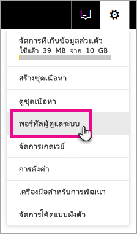
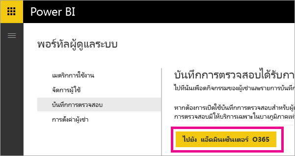
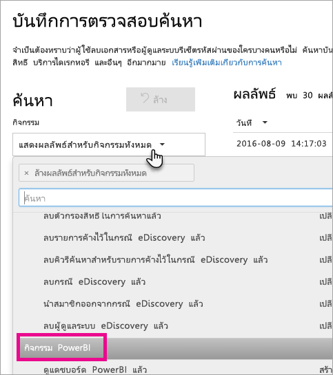
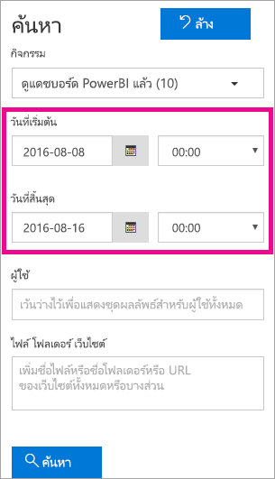
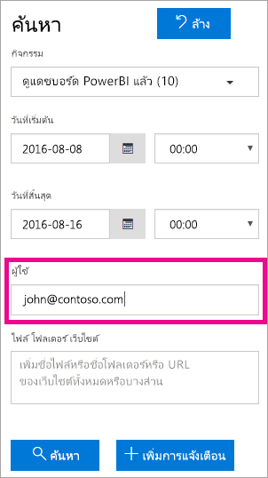
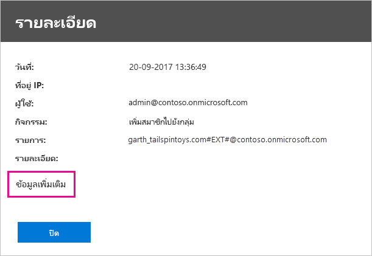
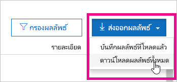

# <a name="using-auditing-within-your-organization"></a>ใช้การตรวจสอบภายในองค์กรของคุณ

การทราบว่าใครกำลังดำเนินการอะไร และในรายการใดใน Power BI ของคุณ เป็นสิ่งสำคัญที่สามารถช่วยให้องค์กรของคุณปฏิบัติตามข้อกำหนดได้ เช่น การปฏิบัติตามข้อบังคับการประชุมและการจัดการบันทึกต่าง ๆ ใช้การตรวจสอบ Power BI เพื่อตรวจสอบการกระทำที่ผู้ใช้ดำเนินการ เช่น "ดูรายงาน" และ "ดูแดชบอร์ด" คุณไม่สามารถใช้การตรวจสอบเพื่อตรวจสอบสิทธิ์

คุณทำงานกับการตรวจสอบในศูนย์การรักษาความปลอดภัยและการปฏิบัติตามนโยบาย Office 365 หรือใช้ PowerShell เราครอบคลุมทั้งสองอย่างในบทความนี้ คุณสามารถกรองข้อมูลการตรวจสอบภายในได้ตามช่วงวัน ผู้ใช้ แดชบอร์ด รายงาน ชุดข้อมูล และประเภทกิจกรรมได้ นอกจากนี้ คุณยังสามารถดาวน์โหลดกิจกรรมในรูปแบบไฟล์ csv (คั่นด้วยจุลภาคค่า) เพื่อทำการวิเคราะห์แบบออฟไลน์ได้

## <a name="requirements"></a>ข้อกำหนด

คุณต้องเป็นไปตามข้อกำหนดเหล่านี้เพื่อเข้าถึงบันทึกการตรวจสอบภายใน:

- เมื่อต้องการเข้าถึงส่วนการตรวจสอบภายในสำหรับศูนย์การรักษาความปลอดภัยและการปฏิบัติตามกฎระเบียบของ Office 365 คุณต้องมีใบอนุญาต Exchange Online สำหรับการใช้งาน (มาพร้อมกับการสมัครใช้งาน Office 365 Enterprise E3 และ E5)

- คุณต้องเป็นผู้ดูแลระบบส่วนกลางหรือมีบทบาทผู้ดูแลระบบ Exchange ที่สามารถเข้าถึงการบันทึกการตรวจสอบได้ บทบาทผู้ดูแลระบบ Exchange จะถูกควบคุมผ่านศูนย์การจัดการ Exchange สำหรับข้อมูลเพิ่มเติม ดู[สิทธิ์ใน Exchange Online](/exchange/permissions-exo/permissions-exo/)

- ถ้าคุณมีสิทธิ์เข้าถึงบันทึกการตรวจสอบภายใจ แต่ไม่ใช่ผู้ดูแลระบบส่วนกลางหรือผู้ดูแลระบบบริการ Power BI คุณจะไม่สามารถเข้าถึงพอร์ทัล Power BI ผู้ดูแลระบบได้ ในกรณีนี้ คุณต้องรับลิงก์ตรงไปยัง [ศูนย์การรักษาความปลอดภัยและการปฏิบัติตามนโยบาย Office 365](https://sip.protection.office.com/#/unifiedauditlog)

- เพื่อดูบันทึกการตรวจสอบสำหรับ Power BI ในผู้เช่าของคุณ คุณต้องการสิทธิ์กล่องจดหมาย exchange อย่างน้อยหนึ่งสิทธิ์ในผู้เช่าของคุณ

## <a name="accessing-your-audit-logs"></a>การเข้าถึงบันทึกการตรวจสอบของคุณ

หากต้องการเข้าถึงรายการบันทึก ก่อนอื่นให้ตรวจสอบให้แน่ใจว่าได้เปิดใช้งานการบันทึกใน Power BI สามารถดูข้อมูลเพิ่มเติมได้ที่ [บันทึกการตรวจสอบ](service-admin-portal.md#audit-logs) ในเอกสารประกอบของพอร์ทัลผู้ดูแลระบบ สามารถมีการหน่วงเวลาสูงสุด 48 ชั่วโมง ตั้งแต่การเปิดใช้งานการตรวจสอบ จนสามารถดูข้อมูลการตรวจสอบได้ ถ้าคุณยังไม่เห็นข้อมูลในทันที ดูบันทึกการตรวจสอบในภายหลัง อาจมีความล่าช้าแบบเดียวกันระหว่าง เวลาที่ได้รับสิทธิ์ในการดูบันทึกการตรวจสอบ จนถึงเวลาที่สามารถเข้าถึงแฟ้มบันทึก

บันทึกการตรวจสอบ Power BI จะพร้อมใช้งานโดยตรงผ่าน [ศูนย์การรักษาความปลอดภัยและการปฏิบัติตามนโยบาย Office 365](https://sip.protection.office.com/#/unifiedauditlog) และยังมีลิงก์จากพอร์ทัลผู้ดูแลระบบ Power BI:

1. ใน Power BI เลือก **ไอคอนเฟือง** มุมขวาด้านบน จากนั้นเลือก **พอร์ทัลผู้ดูแลระบบ**

   

1. เลือก**บันทึกการตรวจสอบ**

1. เลือก**ไปที่ศูนย์ผู้ดูแลระบบ O365**

   

หากต้องการสร้างบัญชีที่ไม่ใช่ผู้ดูแลระบบที่สามารถเข้าถึงบันทึกการตรวจสอบได้ คุณจะต้องกำหนดสิทธิ์ภายในศูนย์การจัดการ Exchange Online ตัวอย่างเช่น คุณสามารถกำหนดผู้ใช้ไปยังกลุ่มบทบาทที่มีอยู่แล้ว เช่น การจัดการองค์กร หรือคุณสามารถสร้างกลุ่มบทบาทใหม่ที่มีบทบาทสำหรับบันทึกการตรวจสอบ สำหรับข้อมูลเพิ่มเติม ดู[สิทธิ์ใน Exchange Online](/exchange/permissions-exo/permissions-exo/)

## <a name="search-only-power-bi-activities"></a>ค้นหากิจกรรม Power BI เท่านั้น

จำกัดผลลัพธ์เป็นกิจกรรม Power BI เท่านั้น โดยปฏิบัติตามขั้นตอนต่อไปนี้ สำหรับรายการของกิจกรรม ดู [รายการของกิจกรรมที่ตรวจสอบ โดย Power BI](#list-of-activities-audited-by-power-bi) ภายหลังในบทความนี้

1. ที่หน้า **ค้นหาบันทึกการตรวจสอบ** ใต้ **ค้นหา** เลือกรายการดรอปดาวน์สำหรับ **กิจกรรม**

2. เลือก **กิจกรรม Power BI**

   

3. เลือกที่ใดก็ได้ภายนอกกล่องการเลือกเพื่อปิด

ในตอนนี้ ระบบจะกรองการค้นหาของคุณให้เป็นเฉพาะกิจกรรม Power BI เท่านั้น

## <a name="search-the-audit-logs-by-date"></a>ค้นหาบันทึกการตรวจสอบตามวัน

คุณสามารถค้นหาบันทึกตามช่วงวันที่ได้โดยใช้เขตข้อมูล **วันเริ่มต้น** และ **วันที่สิ้นสุด** ระบบจะเลือกเจ็ดวันที่ผ่านมาตามค่าเริ่มต้น วันและเวลาจะแสดงในรูปแบบเวลามาตรฐานสากล (UTC) ช่วงวันที่สูงสุดที่คุณสามารถระบุได้คือ 90 วัน 

จะมีข้อผิดพลาดแสดงถ้าเลือกช่วงวันมีค่ามากกว่า 90 วัน หากคุณกำลังใช้ช่วงวันที่สูงสุด 90 วัน เลือกเวลาปัจจุบันสำหรับ **วันเริ่มต้น** มิฉะนั้น คุณจะได้รับข้อความข้อผิดพลาดที่แจ้งว่า วันเริ่มต้นอยู่ก่อนหน้าวันสิ้นสุด หากคุณเปิดการตรวจสอบภายในช่วง 90 วันที่ผ่านมา ช่วงวันที่จะไม่สามารถเริ่มก่อนวันที่ที่เปิดใช้งานการตรวจสอบ



## <a name="search-the-audit-logs-by-users"></a>ค้นหาบันทึกการตรวจสอบตามผู้ใช้งาน

คุณสามารถค้นหารายการบันทึกการตรวจสอบสำหรับกิจกรรมต่าง ๆ ที่ดำเนินการโดยผู้ใช้ที่ระบุได้ หากต้องการดำเนินการนี้ ให้ใส่ชื่อผู้ใช้อย่างน้อยหนึ่งชื่อในเขตข้อมูล **ผู้ใช้** ชื่อผู้ใช้มีลักษณะเหมือนที่อยู่อีเมล กล่าวคือ เป็นบัญชีที่ผู้ใช้ใช้เข้าสู่ระบบ Power BI ปล่อยให้กล่องนี้ว่างไว้เพื่อกลับไปยังรายการสำหรับผู้ใช้ทั้งหมด (และบัญชีบริการ) ในองค์กรของคุณ



## <a name="view-search-results"></a>ดูผลลัพธ์การค้นหา

หลังจากที่เลือก **ค้นหา** ระบบจะโหลดผลลัพธ์การค้นหา และจะแสดงอยู่ใต้ **ผลลัพธ์** หลังจากนั้นสักครู่ เมื่อเสร็จสิ้นการค้นหา จำนวนของผลลัพธ์ที่พบจะแสดงขึ้น ระบบจะสามารถแสดงเหตุการณ์ได้สูงสุด 1000 เหตุการณ์ หากมีเหตุการณ์มากกว่า 1000 เหตุการณ์ที่ตรงกับเกณฑ์การค้นหา ระบบจะแสดง 1000 เหตุการณ์ใหม่ล่าสุด

### <a name="view-the-main-results"></a>ดูผลลัพธ์หลัก

พื้นที่ **ผลลัพธ์** ประกอบด้วยข้อมูลต่อไปนี้สำหรับแต่ละเหตุการณ์ที่ส่งกลับโดยการค้นหา เลือกส่วนหัวของคอลัมน์ใต้ **ผลลัพธ์** เพื่อเรียงลำดับผลลัพธ์

| **แผนภูมิคอลัมน์** | **คำนิยาม** |
| --- | --- |
| วันที่ |วันและเวลา (ในรูปแบบ UTC) ที่เกิดเหตุการณ์ |
| ที่อยู่ IP |อยู่ IP ของอุปกรณ์ที่ใช้เมื่อบันทึกกิจกรรม ที่อยู่ IP จะแสดงในรูปแบบที่อยู่ IPv4 หรือ IPv6 |
| ผู้ใช้ |ผู้ใช้ (หรือบัญชีบริการ) ซึ่งเป็นผู้ที่ดำเนินการกระทำที่ก่อให้เกิดเหตุการณ์ |
| กิจกรรม |กิจกรรมที่ดำเนินการโดยผู้ใช้ ค่านี้สอดคล้องกับกิจกรรมที่คุณเลือกไว้ในรายการดรอปดาวน์ของ **กิจกรรม** สำหรับเหตุการณ์จากบันทึกการตรวจสอบผู้ดูแลระบบ Exchange ค่าในคอลัมน์นี้เป็น cmdlet Exchange |
| รายการ |ออบเจ็กต์จะถูกสร้างขึ้นหรือปรับเปลี่ยนเป็นผลลัพธ์ของกิจกรรมที่สอดคล้องกัน ตัวอย่างเช่น ไฟล์ที่มีการดูหรือถูกปรับเปลี่ยน หรือบัญชีผู้ใช้ที่มีการอัปเดต ไม่ใช่ทุกกิจกรรมที่่มีค่าในคอลัมน์นี้ |
| รายละเอียด |รายละเอียดเพิ่มเติมเกี่ยวกับกิจกรรม ไม่ใช่ทุกกิจกรรมที่จะมีค่านี้ |

### <a name="view-the-details-for-an-event"></a>ดูรายละเอียดของเหตุการณ์หนึ่ง ๆ

คุณสามารถดูรายละเอียดเพิ่มเติมเกี่ยวกับเหตุการณ์ได้ โดยการคลิกบันทึกเหตุการณ์ในรายการผลลัพธ์การค้นหา หน้า **รายละเอียด** จะแสดงขึ้น ซึ่งประกอบด้วยคุณสมบัติโดยละเอียดจากบันทึกเหตุการณ์ คุณสมบัติเหล่านี้จะแสดงโดยขึ้นอยู่กับบริการ Office 365 ที่เหตุการณ์นั้นเกิดขึ้น 

หากต้องการให้แสดงรายละเอียดเพิ่มเติม ให้เลือก **ข้อมูลเพิ่มเติม** รายการ Power BI ทั้งหมดมีค่า 20 สำหรับคุณสมบัติ RecordType สำหรับข้อมูลเกี่ยวกับคุณสมบัติอื่น ๆ ดู [คุณสมบัติโดยละเอียดในบันทึกการตรวจสอบ](/office365/securitycompliance/detailed-properties-in-the-office-365-audit-log/)

   

## <a name="export-search-results"></a>ส่งออกผลลัพธ์การค้นหา

หากต้องการส่งออกบันทึกการตรวจสอบ Power BI เป็นไฟล์ csv ให้ปฏิบัติตามขั้นตอนดังต่อไปนี้

1. เลือก**ส่งออกผลลัพธ์**

1. เลือก**บันทึกผลลัพธ์ที่โหลด**หรือ**ดาวน์โหลดผลลัพธ์ทั้งหมด** อย่างใดอย่างหนึ่ง

    

## <a name="use-powershell-to-search-audit-logs"></a>ใช้ PowerShell เพื่อค้นหาบันทึกการตรวจสอบ

คุณยังสามารถใช้ PowerShell เพื่อเข้าถึงบันทึกการตรวจสอบโดยยึดตามการเข้าสู่ระบบของคุณได้ ตัวอย่างต่อไปนี้แสดงวิธีใช้คำสั่ง [Search-UnifiedAuditLog](/powershell/module/exchange/policy-and-compliance-audit/search-unifiedauditlog?view=exchange-ps/) เพื่อดึงรายการบันทึกการตรวจสอบ Power BI

หากต้องการใช้คำสั่ง [New-PSSession](/powershell/module/microsoft.powershell.core/new-pssession/) บัญชีของคุณต้องได้รับสิทธิ์การใช้งาน Exchange Online และคุณต้องมีสิทธิ์ในการเข้าถึงบันทึกการตรวจสอบสำหรับผู้เช่าของคุณ สำหรับข้อมูลเพิ่มเติมเกี่ยวกับการเชื่อมต่อกับ Exchange Online ดู[เชื่อมต่อกับ Exchange Online PowerShell](/powershell/exchange/exchange-online/connect-to-exchange-online-powershell/connect-to-exchange-online-powershell/)

```powershell
Set-ExecutionPolicy RemoteSigned

$UserCredential = Get-Credential

$Session = New-PSSession -ConfigurationName Microsoft.Exchange -ConnectionUri https://outlook.office365.com/powershell-liveid/ -Credential $UserCredential -Authentication Basic -AllowRedirection

Import-PSSession $Session
Search-UnifiedAuditLog -StartDate 9/11/2018 -EndDate 9/15/2018 -RecordType PowerBI -ResultSize 1000 | Format-Table | More
```

ตัวอย่างอื่นของการใช้ PowerShell ด้วยบันทึกการตรวจสอบ ดู [การใช้บันทึกการตรวจสอบโดยใช้ Power BI และ PowerShell เพื่อกำหนดสิทธิ์การใช้งาน Power BI Pro](https://powerbi.microsoft.com/blog/using-power-bi-audit-log-and-powershell-to-assign-power-bi-pro-licenses/)

## <a name="activities-audited-by-power-bi"></a>กิจกรรมที่ตรวจสอบโดย Power BI

กิจกรรมต่อไปนี้ได้รับการตรวจสอบ โดย Power BI

* AddDatasourceToGateway
* AddGroupMembers
* AnalyzedByExternalApplication
* AnalyzeInExcel
* AttachDataflowStorageAccount
* BindToGateway
* ChangeCapacityState
* ChangeGatewayAdministrators
* ChangeGatewayDatasourceUsers
* CreateApp
* CreateDashboard
* CreateDataflow
* CreateDataset
* CreateEmailSubscription
* CreateFolder
* CreateGateway
* CreateGroup
* CreateOrgApp
* CreateReport
* DeleteComment
* DeleteDashboard
* DeleteDataflow
* DeleteDataset
* DeleteEmailSubscription
* DeleteFolder
* DeleteGateway
* DeleteGroup
* DeleteGroupMembers
* DeleteOrgApp
* DeleteReport
* DownloadReport
* EditDataset
* EditReport
* ExportDataflow
* ExportReport
* ExportTile
* GenerateDataflowSasToken
* GenerateEmbedToken
* GetDatasources
* นำเข้า
* InstallApp
* MigrateWorkspaceIntoCapacity
* OptInForProTrial
* PostComment
* PrintDashboard
* PrintReport
* PublishToWebReport
* RefreshDataset
* RemoveDatasourceFromGateway
* RemoveWorkspacesFromCapacity
* RenameDashboard
* SetAllConnections
* SetScheduledRefresh
* SetScheduledRefreshOnDataflow
* ShareDashboard
* ShareReport
* TakeOverDataset
* TakeOverDataset
* UnpublishApp
* UpdateApp
* UpdateCapacityAdmins
* UpdateCapacityDisplayName
* UpdateCapacityResourceGovernanceSettings
* UpdateCapacityUsersAssignment
* UpdatedAdminFeatureSwitch
* UpdateDataflow
* UpdateDatasetParameters
* UpdateDatasourceCredentials
* UpdateDatasources
* UpdateEmailSubscription
* UpdateFolder
* UpdateFolderAccess
* ViewDashboard
* ViewDataflow
* ViewReport
* ViewTile
* ViewUsageMetrics

## <a name="next-steps"></a>ขั้นตอนถัดไป

[การดูแลระบบ Power BI คืออะไร?](service-admin-administering-power-bi-in-your-organization.md)  

[พอร์ทัลผู้ดูแล Power BI](service-admin-portal.md)  

มีคำถามเพิ่มเติมหรือไม่? [ลองถามชุมชน Power BI](http://community.powerbi.com/)
