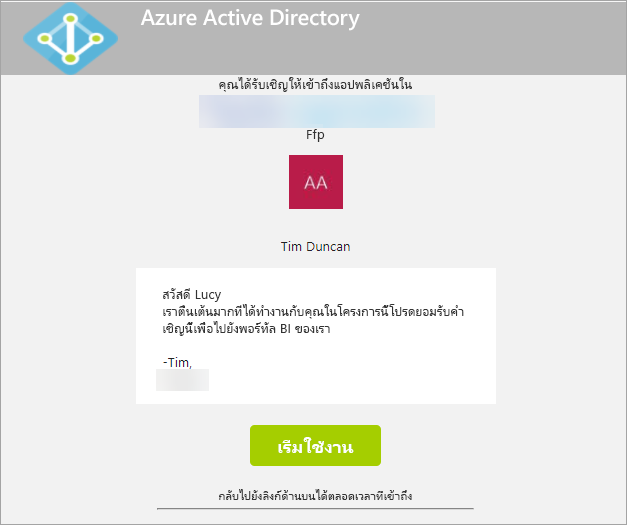
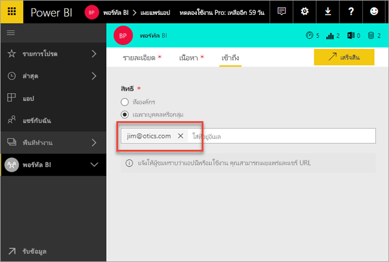
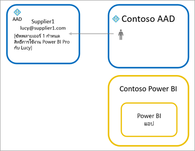
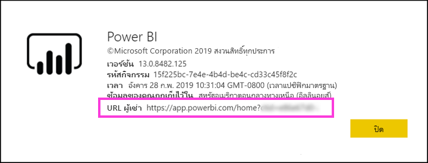

# กระจายเนื้อหา Power BI ไปยังผู้ใช้ที่เป็นผู้เยี่ยมชมจากภายนอกด้วย Azure AD B2B

Power BI รวมเข้ากับ Azure Active Directory เพื่อธุรกิจ (Azure AD B2B) เพื่ออนุญาตให้กระจายเนื้อหา Power BI ไปยังผู้ใช้ที่เป็นผู้เยี่ยมชมจากภายนอกองค์กร ในขณะที่ยังคงรักษาการควบคุมข้อมูลภายใน  

นอกจากนี้ คุณสามารถอนุญาตผู้ใช้เป็นผู้เยี่ยมชมภายนอกองค์กรของคุณเพื่อแก้ไข และจัดการเนื้อหาภายในองค์กรของคุณได้

## เปิดใช้งานการเข้าถึง

ตรวจสอบให้แน่ใจเพื่อเปิดใช้งานคุณลักษณะ [แบ่งปันเนื้อหากับผู้ใช้ภายนอก](service-admin-portal.md#export-and-sharing-settings) ในพอร์ทัลผู้ดูแลระบบ Power BI ก่อนการเชิญผู้ใช้ที่เป็นผู้เยี่ยมชม

นอกจากนี้ คุณยังสามารถใช้คุณลักษณะ [อนุญาตให้ผู้ใช้ที่เป็นผู้เยี่ยมชมภายนอกแก้ไขและจัดการเนื้อหาในองค์กร](service-admin-portal.md#allow-external-guest-users-to-edit-and-manage-content-in-the-organization) ซึ่งช่วยให้คุณเลือกผู้ใช้ที่เป็นผู้เยี่ยมชมที่สามารถดู และสร้างเนื้อหาในพื้นที่ทำงาน รวมถึงการเรียกดู Power BI ขององค์กรของคุณ

## คุณสามารถเชิญใครได้บ้าง

คุณสามารถเชิญผู้ใช้ที่เป็นผู้เยี่ยมชมที่ใช้ที่อยู่อีเมลใดก็ได้ รวมถึงบัญชีส่วนบุคคล เช่น gmail.com, outlook.com หรือ hotmail.com ใน Azure AD B2B ที่อยู่เหล่านี้จะเรียกว่า *ข้อมูลประจำตัวเครือข่ายสังคม*

## เชิญผู้ใช้เป็นผู้เยี่ยมชม

เฉพาะผู้ใช้ที่เป็นผู้เยี่ยมชมเท่านั้นที่ต้องมีคำเชิญเป็นครั้งแรกที่คุณเชิญพวกเขาไปยังองค์กรของคุณ การเชิญผู้ใช้สามารถทำได้สองวิธี คือ คำเชิญเข้าร่วมตามแผนและคำเชิญเข้าร่วมเฉพาะกิจ

### คำเชิญเข้าร่วมแผน

ใช้คำเชิญเข้าร่วมแผนหากคุณทราบว่าต้องการเชิญผู้ใด คุณสามารถส่งคำเชิญโดยใช้พอร์ทัล Azure หรือ PowerShell คุณต้องเป็นผู้ดูแลระบบผู้เช่าเพื่อเชิญบุคคล

ให้ปฏิบัติตามขั้นตอนเหล่านี้เพื่อส่งคำเชิญในพอร์ทัล Azure

1. ใน [พอร์ทัล Azure](https://portal.azure.com) เลือก **Azure Active Directory**

1. ภายใต้ **จัดการ** ให้ **ผู้ใช้** > **ผู้ใช้ทั้งหมด** > **ผู้ใช้ที่เป็นผู้เยี่ยมชมใหม่**

    

1. ใส่ **ที่อยู่อีเมล** และ **ข้อความส่วนบุคคล**

    

1. เลือก**เชิญ**

หากต้องหารเชิญผู้ใช้ที่เป็นผู้เยี่ยมชมมากกว่าหนึ่งรายการให้ใช้ PowerShell สามารถดูข้อมูลเพิ่มเติมได้ที่ [โค้ดการทำงานร่วมกันของ Azure Active Directory B2B และตัวอย่างของ PowerShell](/azure/active-directory/b2b/code-samples/)

ผู้ใช้เป็นผู้เยี่ยมชมจะต้องเลือก**เริ่มต้นใช้งาน**ในคำเชิญอีเมลที่พวกเขาได้รับ จากนั้นจะมีการเพิ่มผู้ใช้ที่เป็นผู้เยี่ยมชมไปยังผู้เช่า

### คำเชิญเฉพาะกิจ

หากต้องการเชิญผู้ใช้ภายนอกตลอดเวลา ให้เพิ่มผู้ใช้ภายนอกไปยังแดชบอร์ดหรือรายงานของคุณผ่านแชร์ UI หรือแอปของคุณผ่านทางหน้าการเข้าถึง นี่คือตัวอย่างของสิ่งที่ต้องทำเมื่อเชิญผู้ใช้ภายนอกเข้ามาใช้แอป

ผู้ใช้ที่เป็นผู้เยี่ยมชมจะได้รับอีเมลที่ระบุว่าคุณได้มีการแชร์แอปกับพวกเขาแล้ว

ผู้ใช้ที่เป็นผู้เยี่ยมชมต้องลงชื่อเข้าใช้ด้วยที่อยู่อีเมลขององค์กรของพวกเขา พวกเขาจะได้รับพร้อมท์ให้ยอมรับคำเชิญหลังจากลงชื่อเข้าใช้ หลังจากลงชื่อเข้าใช้ แอปเปิดขึ้นสำหรับผู้ใช้เป็นผู้เยี่ยมชม หากต้องการกลับไปยังแอป ผู้ใช้สามารถบุ๊กมาร์กลิงก์ หรือบันทึกอีเมล

## สิทธิ์การใช้งาน

ผู้ใช้ที่เป็นผู้เยี่ยมชมจำเป็นต้องมีสิทธ์การใช้งานที่ถูกต้องในการดูเนื้อหาที่ใช้ร่วมกัน มีสามวิธีในการตรวจสอบให้แน่ใจว่าผู้ใช้มีสิทธิการใช้งานที่ถูกต้อง: ใช้ Power BI Premium, มอบสิทธิการใช้งาน Power BI Pro หรือใช้สิทธิการใช้งาน Power BI Pro ของผู้เยี่ยมชม

เมื่อใช้งานคุณลักษณะ [อนุญาตผู้ใช้เป็นผู้เยี่ยมชมภายนอกองค์กรเพื่อแก้ไข และจัดการเนื้อหาภายในองค์กร](service-admin-portal.md#allow-external-guest-users-to-edit-and-manage-content-in-the-organization) ผู้ใช้เป็นผู้เยี่ยมชมที่มีส่วนร่วมในพื้นที่ทำงานหรือแบ่งปันเนื้อหากับผู้อื่นจำเป็นต้องมีใบอนุญาต Power BI Pro

### ใช้ Power BI Premium

การกำหนดพื้นที่ทำงานใน [ความจุของ Power BI Premium](service-premium-what-is.md) จะอนุญาตให้ผู้ใช้ที่เป็นผู้เยี่ยมชมสามารถเข้าใช้แอปได้โดยไม่จำเป็นต้องมีสิทธิ์การใช้งาน Power BI Pro Power BI Premium ยังอนุญาตให้แอปใช้ประโยชน์จากความสามารถอื่น ๆ อีกด้วย เช่น อัตราการรีเฟรชเพิ่ม, ความจุเฉพาะ และขนาดของแบบจำลองขนาดใหญ่

### กำหนดสิทธิ์การใช้งาน Power BI Pro ให้แก่ผู้ใช้ที่เป็นผู้เยี่ยมชม

การกำหนดสิทธิการใช้งาน Power BI Pro ให้แก่ผู้ใช้ที่เป็นผู้เยี่ยมชมภายในผู้เช่าของคุณ จะอนุญาตให้ผู้ใช้ที่เป็นผู้เยี่ยมชมสามารถดูเนื้อหาในผู้เช่าได้

### ผู้ใช้ที่เป็นผู้เยี่ยมชมนำสิทธิ์การใช้งาน Power BI Pro ของพวกเขามาใช้

ผู้ใช้ที่เป็นผู้เยี่ยมชมมีสิทธิ์การใช้งาน Power BI Pro ที่มอบหมายภายในผู้เช่าของพวกเขาอยู่แล้ว

## ผู้ใช้ที่เป็นผู้เยี่ยมชมที่สามารถแก้ไข และจัดการเนื้อหา 

เมื่อใช้คุณลักษณะ [อนุญาตผู้ใช้ที่เป็นผู้เยี่ยมชมภายนอกสามารถแก้ไข และจัดการเนื้อหาภายในองค์กร](service-admin-portal.md#allow-external-guest-users-to-edit-and-manage-content-in-the-organization) ผู้ใช้ที่เป็นผู้เยี่ยมชมที่ระบุจะได้รับสิทธิการเข้าถึง Power BI ขององค์กรคุณ พวกเขาสามารถดูเนื้อหาใดก็ได้ที่พวกเขามีสิทธิ์ พวกเขาสามารถเข้าถึงหน้าแรก เรียกดูพื้นที่ทำงาน ติดตั้งแอปที่อยู่ในรายการเข้าถึง และมีส่วนร่วมในเนื้อหาบนพื้นที่ทำงาน พวกเขาสามารถสร้าง หรือเป็นผู้ดูแลระบบของพื้นที่ทำงานที่ใช้ประสบการณ์พื้นที่ทำงานใหม่ ใช้ข้อจำกัดบางอย่าง ส่วนข้อควรพิจารณาและขีดจำกัดจะระบุรายการข้อจำกัดเหล่านั้น
 
เพื่อช่วยผู้ใช้เหล่านี้ในการลงชื่อเข้าใช้ Power BI ให้ระบุ URL ของผู้เช่า เมื่อต้องการค้นหา URL ของผู้เช่า กรุณาทำตามขั้นตอนเหล่านี้

1. ในบริการของ Power BI ที่เมนูด้านบน เลือกความช่วยเหลือ ( **?** ) จากนั้นเลือก **เกี่ยวกับ Power BI**

2. ค้นหาค่าที่อยู่ถัดจาก **URL ของผู้เช่า** ค่านี้คือ URL ของผู้เช่าที่คุณสามารถแบ่งปันกับผู้ใช้ที่เป็นผู้เยี่ยมชมของคุณได้

    

## ข้อควรพิจารณาและข้อจำกัด

* ตามค่าเริ่มต้น Azure AD B2B ภายนอกจะจำกัดผู้เยี่ยมชมในการใช้เนื้อหาเท่านั้น ผู้เยี่ยมชม Azure AD B2B ภายนอกสามารถดูแอป แดชบอร์ด รายงาน ข้อมูลการส่งออก และสร้างการสมัครใช้งานอีเมลสำหรับแดชบอร์ดและรายงานได้ แต่ไม่สามารถเข้าถึงพื้นที่ทำงาน หรือเผยแพร่เนื้อหาของพวกเขา อย่างไรก็ตาม ข้อจำกัดเหล่านี้ไม่นำไปใช้กับผู้ใช้ที่เป็นผู้เยี่ยมชมที่ได้รับอนุญาตผ่านคุณลักษณะ [อนุญาตผู้ใช้ที่เป็นผู้เยี่ยมชมภายนอกองค์กรสามารถแก้ไข และจัดการเนื้อหาภายในองค์กร](service-admin-portal.md#allow-external-guest-users-to-edit-and-manage-content-in-the-organization)

* หากต้องการเชิญผู้ใช้ที่เป็นผู้เยี่ยมชม จำเป็นต้องมีสิทธิ์การใช้งาน Power BI Pro ผู้ใช้ Pro รุ่นทดลองไม่สามารถเชิญผู้ใช้ที่เป็นผู้เยี่ยมชมใน Power BI ได้

* สำหรับผู้ใช้ที่เป็นผู้เยี่ยมชม ผู้ใช้ดังกล่าวสามารถเปิดใช้งานผ่านคุณสมบัติ [อนุญาตผู้ใช้ที่เป็นผู้เยี่ยมชมภายนอกสามารถแก้ไข และจัดการเนื้อหา](service-admin-portal.md#allow-external-guest-users-to-edit-and-manage-content-in-the-organization) โดยประสบการณ์การใช้งานบางอย่างจะไม่พร้อมใช้งานสำหรับพวกเขา หากต้องการอัปเดตหรือเผยแพร่รายงาน พวกเขาจำเป็นต้องใช้ UI ของเว็บบริการ Power BI รวมถึง รับข้อมูล เพื่ออัปโหลดไฟล์ Power BI Desktop  ประสบการณ์การใช้งานต่อไปนี้ไม่ได้รับการสนับสนุน:
    * เผยแพร่จาก Power BI desktop ไปยังบริการ Power BI โดยตรง
    * ผู้ใช้ที่เป็นผู้เยี่ยมชมไม่สามารถใช้ Power BI desktop เพื่อเชื่อมต่อกับชุดข้อมูลบริการในบริการ Power BI ได้
    * พื้นที่ทำงานแบบคลาสสิกที่ผูกกับกลุ่ม Office 365:
        * ผู้ใช้ที่เป็นผู้เยี่ยมชมไม่สามารถสร้าง หรือเป็นผู้ดูแลระบบของพื้นที่ทำงานเหล่านี้
        * ผู้ใช้ที่เป็นผู้เยี่ยมชมสามารถเป็นสมาชิกได้
    * การส่งคำเชิญเข้าร่วมเฉพาะกิจไม่ได้รับการสนับสนุนสำหรับรายการการเข้าถึงพื้นที่ทำงาน
    * Power BI Publisher สำหรับ Excel ไม่ได้รับการสนับสนุนสำหรับผู้ใช้ที่เป็นผู้เยี่ยมชม
    * ผู้ใช้ที่เป็นผู้เยี่ยมชมไม่สามารถติดตั้ง Power BI Gateway และเชื่อมต่อเกตเวย์กับองค์กรของคุณ
    * ผู้ใช้ที่เป็นผู้เยี่ยมชมไม่สามารถติดตั้งแอปที่เผยแพร่ไปยังทั้งองค์กร
    * ผู้ใช้ที่เป็นผู้เยี่ยมชมไม่สามารถใช้ สร้าง อัปเดต หรือติดตั้งชุดเนื้อหาองค์กร
    * ผู้ใช้ที่เป็นผู้เยี่ยมชมไม่สามารถใช้การวิเคราะห์ใน Excel
    * ผู้ใช้ที่เป็นผู้เยี่ยมชมไม่สามารถ @mentioned ในการแสดงข้อคิดเห็น
    * ผู้ใช้ที่เป็นผู้เยี่ยมชมไม่สามารถใช้การสมัครใช้งาน
    * ผู้ใช้ที่เป็นผู้เยี่ยมชมที่ใช้ความสามารถนี้ควรมีบัญชีที่ทำงาน หรือโรงเรียน 
    
* ผู้ใช้ที่เป็นผู้เยี่ยมชมที่ใช้บัญชีส่วนบุคคลจะพบข้อจำกัดเพิ่มเติมเนื่องจากข้อจำกัดการลงชื่อเข้าใช้
    * พวกเขาสามารถใช้ประสบการณ์การใช้งานในบริการของ Power BI ผ่านเว็บเบราว์เซอร์
    * พวกเขาไม่สามารถใช้แอปสำหรับอุปกรณ์เคลื่อนที่ Power BI ได้
    * พวกเขาจะไม่สามารถลงชื่อเข้าใช้เพื่อให้ข้อมูลประจำตัวที่จำเป็นต้องใช้บัญชีที่ทำงานหรือโรงเรียน

* คุณลักษณะนี้ยังไม่มีให้ใช้กับ web part รายงาน Power BI SharePoint Online

* มีการตั้งค่า Active Directory ที่สามารถจำกัดสิ่งที่ผู้ใช้ที่เป็นผู้เยี่ยมชมภายนอกสามารถทำได้ภายในองค์กรโดยรวมของคุณ ซึ่งยังนำไปใช้กับสภาพแวดล้อม Power BI ของคุณด้วย เอกสารต่อไปนี้อธิบายถึงการตั้งค่า:
    * [จัดการการตั้งค่าการทำงานร่วมกันภายนอก](/azure/active-directory/b2b/delegate-invitations#configure-b2b-external-collaboration-settings)
    * [อนุญาตหรือบล็อกคำเชิญให้ผู้ใช้ B2B จากองค์กรที่เฉพาะเจาะจง](https://docs.microsoft.com/azure/active-directory/b2b/allow-deny-list)  

## ขั้นตอนถัดไป

เพื่อศึกษาข้อมูลรายละเอียดเพิ่มเติม รวมถึงวิธีการทำงานของความปลอดภัยระดับแถว โปรดดูที่เอกสารทางเทคนิค: [กระจายเนื้อหา Power BI ไปยังผู้ใช้ซึ่งเป็นผู้เยี่ยมชมจากภายนอกด้วย Azure AD B2B](https://aka.ms/powerbi-b2b-whitepaper)

สามารถดูข้อมูลเพิ่มเติมเกี่ยวกับ Azure AD B2B ได้ที่ [การทำงานร่วมกันของ Azure AD B2B คืออะไร?](/azure/active-directory/active-directory-b2b-what-is-azure-ad-b2b/)
