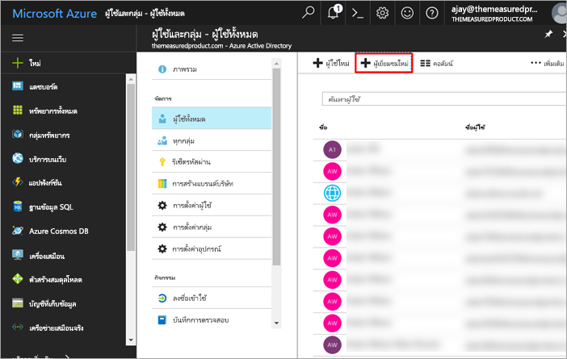
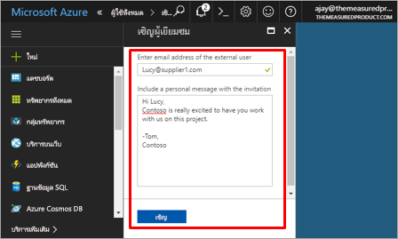
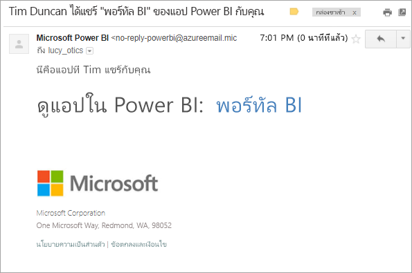
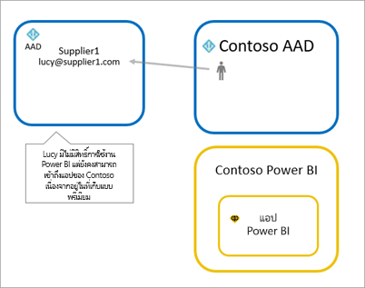
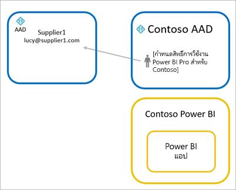
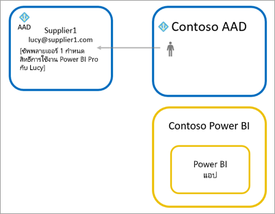

# กระจายเนื้อหา Power BI ไปยังผู้ใช้ที่เป็นผู้เยี่ยมชมจากภายนอกด้วย Azure AD B2B

Power BI รวมเข้ากับ Azure Active Directory เพื่อธุรกิจ (Azure AD B2B) เพื่ออนุญาตให้กระจายเนื้อหา Power BI ไปยังผู้ใช้ที่เป็นผู้เยี่ยมชมจากภายนอกองค์กร ในขณะที่ยังคงรักษาการควบคุมข้อมูลภายใน

## เปิดใช้งานการเข้าถึง

ตรวจสอบให้แน่ใจว่าได้เปิดใช้งานคุณลักษณะ [การตั้งค่าส่งออกและการแชร์](service-admin-portal.md#export-and-sharing-settings) ในพอร์ทัลผู้ดูแลระบบ Power BI ก่อนการเชิญผู้ใช้ที่เป็นผู้เยี่ยมชม

## คุณสามารถเชิญใครได้บ้าง

คุณสามารถเชิญผู้ใช้ที่เป็นผู้เยี่ยมชมที่ใช้ที่อยู่อีเมลใดก็ได้ รวมถึงบัญชีส่วนบุคคล เช่น gmail.com, outlook.com หรือ hotmail.com ใน Azure AD B2B ที่อยู่เหล่านี้จะถูกเรียกว่า *ข้อมูลประจำตัวเครือข่ายสังคม*

## เชิญผู้ใช้เป็นผู้เยี่ยมชม

จะใช้การเชิญในครั้งแรกที่เชิญผู้ใช้ที่เป็นผู้เยี่ยมชมจากภายนอกไปยังองค์กรของคุณเท่านั้น การเชิญผู้ใช้สามารถทำได้สองวิธี คือ คำเชิญเข้าร่วมแผนและคำเชิญเข้าร่วมกิจ

### คำเชิญเข้าร่วมแผน

ใช้คำเชิญเข้าร่วมแผนหากคุณทราบว่าต้องการเชิญผู้ใด คุณสามารถส่งคำเชิญโดยใช้พอร์ทัล Azure หรือ PowerShell คุณต้องเป็นผู้ดูแลระบบผู้เช่าเพื่อเชิญบุคคล

ให้ปฏิบัติตามขั้นตอนเหล่านี้เพื่อส่งคำเชิญในพอร์ทัล Azure

1. ใน [พอร์ทัล Azure](https://portal.azure.com) เลือก **Azure Active Directory**

1. ใต้ **จัดการ** ไปที่ **ผู้ใช้** > **ผู้ใช้ทั้งหมด** > **ผู้ใช้ที่เป็นผู้เยี่ยมชมใหม่**

    

1. ใส่ **ที่อยู่อีเมล** และ **ข้อความส่วนบุคคล**

    

1. เลือก**เชิญ**

หากต้องหารเชิญผู้ใช้ที่เป็นผู้เยี่ยมชมมากกว่าหนึ่งรายการให้ใช้ PowerShell สามารถดูข้อมูลเพิ่มเติมได้ที่ [โค้ดการทำงานร่วมกันของ Azure Active Directory B2B และตัวอย่างของ PowerShell](/azure/active-directory/b2b/code-samples/)

ผู้ใช้เป็นผู้เยี่ยมชมจะต้องเลือก**เริ่มต้นใช้งาน**ในคำเชิญอีเมลที่พวกเขาได้รับ จากนั้นจะมีการเพิ่มผู้ใช้ที่เป็นผู้เยี่ยมชมไปยังผู้เช่า

### คำเชิญเข้าร่วมกิจ

หากต้องการดำเนินการคำเชิญตลอดเวลาให้เพิ่มผู้ใช้ภายนอกไปยังแดชบอร์ดหรือรายงานของคุณผ่านแชร์ UI หรือแอปของคุณผ่านทางหน้าการเข้าถึง นี่คือตัวอย่างของสิ่งที่ต้องทำเมื่อเชิญผู้ใช้ภายนอกเข้ามาใช้แอป

ผู้ใช้ที่เป็นผู้เยี่ยมชมจะได้รับอีเมลที่ระบุว่าได้มีการแชร์แอปกับพวกเขาแล้ว

ผู้ใช้ที่เป็นผู้เยี่ยมชมต้องลงชื่อเข้าใช้ด้วยที่อยู่อีเมลขององค์กรของพวกเขา พวกเขาจะได้รับพร้อมท์ให้ยอมรับคำเชิญหลังจากลงชื่อเข้าใช้ หลังจากลงชื่อเข้าใช้ จะมีการเปลี่ยนเส้นทางผู้ใช้ที่เป็นผู้เยี่ยมชมไปยังเนื้อหาแอป หากต้องการกลับไปยังแอป ผู้ใช้สามารถบุ๊กมาร์กลิงก์ หรือบันทึกอีเมล

## สิทธิ์การใช้งาน

ผู้ใช้ที่เป็นผู้เยี่ยมชมจำเป็นต้องมีสิทธิ์การใช้งานที่ถูกต้องในการดูแอปที่ใช้ร่วมกัน วิธีการมอบสิทธิ์มีอยู่สามตัวเลือก คือ ใช้ Power BI Premium, กำหนดสิทธิ์ Power BI Pro หรือใช้สิทธิ์การใช้งาน Power BI Pro ของผู้เยี่ยมชม

### ใช้ Power BI Premium

การกำหนดพื้นที่ทำงานแอปให้กับ [ความสามารถของ Power BI Premium](service-premium.md) จะอนุญาตให้ผู้ใช้ที่เป็นผู้เยี่ยมชมสามารถเข้าใช้แอปได้โดยไม่จำเป็นต้องมีสิทธิ์การใช้งาน Power BI Pro Power BI Premium ยังอนุญาตให้แอปใช้ประโยชน์จากความสามารถอื่น ๆ อีกด้วย เช่น อัตราการรีเฟรชเพิ่ม, ความจุเฉพาะ และขนาดของแบบจำลองขนาดใหญ่

### กำหนดสิทธิ์การใช้งาน Power BI Pro ให้แก่ผู้ใช้ที่เป็นผู้เยี่ยมชม

การกำหนดสิทธิ์การใช้งาน Power BI Pro ให้แก่ผู้ใช้ที่เป็นผู้เยี่ยมชมภายในผู้เช่าของคุณ จะอนุญาตให้ผู้ใช้ที่เป็นผู้เยี่ยมชมสามารถดูเนื้อหาในผู้เช่าได้

### ผู้ใช้ที่เป็นผู้เยี่ยมชมนำสิทธิ์การใช้งาน Power BI Pro ของพวกเขามาใช้

ผู้ใช้ที่เป็นผู้เยี่ยมชมมีสิทธิ์การใช้งาน Power BI Pro ที่มอบหมายภายในผู้เช่าของพวกเขาอยู่แล้ว

## ข้อควรพิจารณาและข้อจำกัด

* ผู้เยี่ยมชม B2B ภายนอกจะมีการจำกัดปริมาณการใช้เนื้อหา ผู้เยี่ยมชม B2B ภายนอกสามารถดูแอป แดชบอร์ด รายงาน ข้อมูลการส่งออก และสร้างการสมัครใช้งานอีเมลสำหรับแดชบอร์ดและรายงานได้ แต่ไม่สามารถเข้าถึงพื้นที่ทำงาน หรือเผยแพร่เนื้อหาของพวกเขา

* คุณลักษณะนี้ไม่พร้อมใช้งานด้วยแอปมือถือ Power BI คุณสามารถดูเนื้อหา Power BI ที่แชร์โดยใช้ Azure AD B2B ในเบราว์เซอร์บนอุปกรณ์เคลื่อนที่

* คุณลักษณะนี้ยังไม่มีให้ใช้กับ web part รายงาน Power BI SharePoint Online

## ขั้นตอนถัดไป

สำหรับข้อมูลโดยละเอียด รวมถึงวิธีการทำงานของการรักษาความปลอดภัยระดับแถว สามารถดูเอกสารทางเทคนิค: [การกระจายเนื้อหา Power BI ไปยังผู้เยี่ยมชมภายนอกโดยใช้ Azure AD B2B](https://aka.ms/powerbi-b2b-whitepaper)

สามารถดูข้อมูลเพิ่มเติมเกี่ยวกับ Azure AD B2B ได้ที่ [การทำงานร่วมกันของ Azure AD B2B คืออะไร?](/azure/active-directory/active-directory-b2b-what-is-azure-ad-b2b/)
