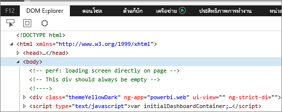
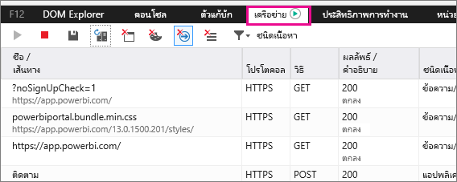
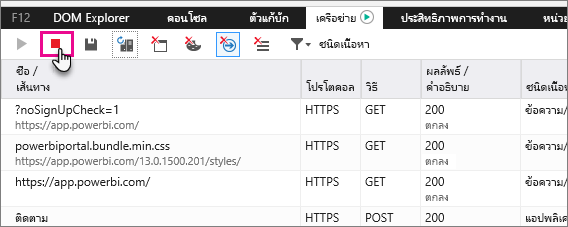

# จับข้อมูลการวินิจฉัยเพิ่มเติมสำหรับ Power BI

บทความนี้ ให้ข้อมูลที่ได้ในการรวบรวมเพิ่มเติมเพื่อการวินิจฉัยจาก เว็บไคลเอ็นต์ Power BI

1. เรียกดู [Power BI](https://app.powerbi.com) ด้วย Microsoft Edge หรือ Internet Explorer

1. กด **F12**เพื่อเปิดเครื่องมือสำหรับนักพัฒนา Microsoft Edge

   

1. เลือกแท็บ **เครือข่าย** จะแสดงรายการข้อมูลเครือข่ายที่ดักจับได้แล้ว

   

    คุณสามารถ

    * เรียกดูภายในหน้าต่าง และจำลองปัญหาใดก็ได้ที่คุณกำลังเจออยู่

    * ซ่อนและแสดงหน้าต่าง เครื่องมือสำหรับนักพัฒนา ตลอดเวลาระหว่างเซสชัน โดยการกด F12

1. เมื่อต้องหยุดการการสร้างโปรไฟล์เซสซันคุณสามารถเลือกสี่เหลี่ยมสีแดงบนแท็บ**เครือข่าย** ในบริเวณของเครื่องมือสำหรับนักพัฒนา

   

1. เลือกไอคอนดิสก์เพื่อส่งออกข้อมูลเป็นไฟล์ที่เก็บถาวรของ HTTP (ฮาร์)

   

1. ใส่ชื่อไฟล์ และบันทึกไฟล์ HAR

    ไฟล์ HAR จะประกอบด้วยข้อมูลทั้งหมดเกี่ยวกับคำขอเครือข่าย ระหว่างหน้าต่างเบราว์เซอร์และ Power BI ซึ่งรวมไปถึง:

    * ID กิจกรรมสำหรับการร้องขอแต่ละรายการ

    * ประทับเวลาที่แม่นยำสำหรับการร้องขอแต่ละรายการ

    * ข้อมูลข้อผิดพลาดใดๆที่ส่งกลับไปยังไคลเอ็นต์

    แฟ้มการติดตามที่ได้ ยังประกอบด้วยข้อมูลที่ใช้เพื่อแสดงภาพบนหน้าจอ

1. คุณสามารถส่งไฟล์ HAR ให้ฝ่ายสนับสนุนสำหรับตรวจสอบ

มีคำถามเพิ่มเติมหรือไม่? [ลองถามชุมชน Power BI](http://community.powerbi.com/)
