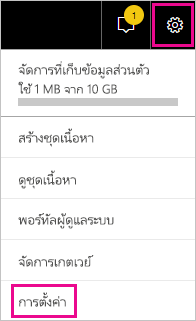
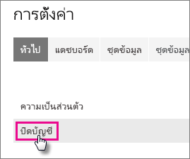
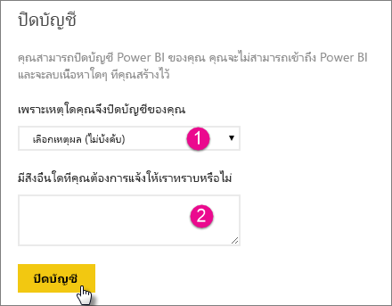
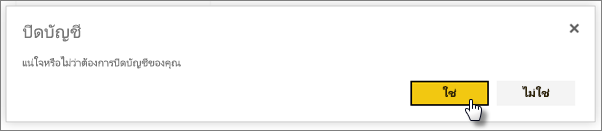
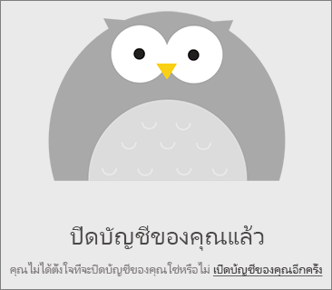
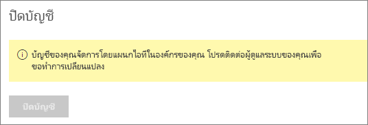

# ปิดบัญชี Power BI ของคุณ

หากคุณไม่ต้องการใช้ Power BI อีกต่อไป คุณสามารถปิดบัญชี Power BI ของคุณได้  หลังจากปิดบัญชีของคุณแล้ว คุณจะสามารถไม่ลงชื่อเข้าใช้ Power BI ได้อีกต่อไป ข้อมูลลูกค้าใด ๆ ที่คุณอัปโหลดหรือสร้างไว้ใน Power BI จะถูกลบตามนโยบายการเก็บข้อมูลในเงื่อนไขการใช้บริการ Power BI

## ผู้ใช้ Power BI รายบุคคล

หากคุณลงทะเบียนใช้งาน Power BI เป็นรายบุคคล คุณสามารถปิดบัญชีของคุณจากหน้าจอ **การตั้งค่า** ได้

1. ใน Power BI เลือกรูปเฟืองมุมขวาด้านบน จากนั้นเลือก **การตั้งค่า**

    

1. ที่แท็บ **ทั่วไป** เลือก **ปิดบัญชี**

    

1. เลือกเหตุผลในการปิดบัญชี (1) นอกจากนี้คุณยังสามารถให้ข้อมูลเพิ่มเติมได้เช่นกัน (2) แล้วเลือก **ปิดบัญชี**

    

1. ยืนยันว่า คุณต้องการปิดบัญชีของคุณ

    

    คุณควรจะเห็นการยืนยันว่ามีการปิดบัญชีของคุณแล้ว คุณสามารถเปิดบัญชีของคุณอีกครั้งจากที่นี่หากมีความจำเป็น

    

## ผู้ใช้แบบผู้เช่าที่มีการจัดการ

หากองค์กรของคุณเป็นผู้ลงทะเบียนใช้งาน Power BI ให้แก่คุณ โปรดติดต่อผู้ดูแลระบบผู้เช่าของคุณ ขอให้ผู้ดูแลยกเลิกการมอบสิทธิ์การใช้งานจากบัญชีของคุณ

มีคำถามเพิ่มเติมหรือไม่? [ลองถามชุมชน Power BI](http://community.powerbi.com/)