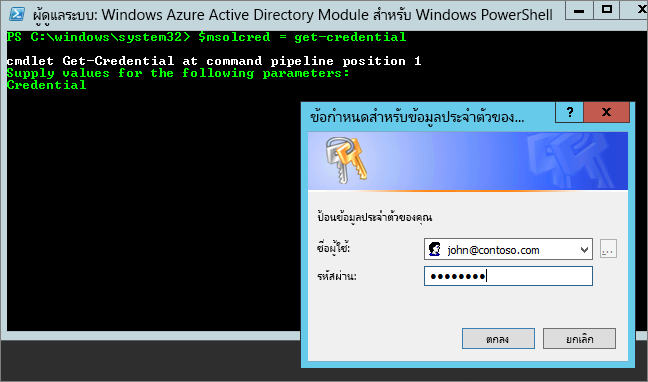

# <a name="administering-power-bi---frequently-asked-questions-faq"></a>การจัดการ Power BI - คำถามที่ถามบ่อย (FAQ)

บทความนี้ตอบคำถามที่ถามบ่อยสำหรับการดูแลระบบ Power BI สำหรับภาพรวมของการดูแลระบบ Power BI ดู[การดูแลระบบ Power BI คืออะไร?](service-admin-administering-power-bi-in-your-organization.md)

## <a name="whats-in-this-article"></a>สิ่งที่อยู่ในบทความนี้

### <a name="sign-up-for-power-bi-section"></a>ลงทะเบียนใช้งานส่วน Power BI

* [การใช้ PowerShell](#using-powershell)
* [ผู้ใช้สามารถลงทะเบียนเข้าใช้ Power BI ได้อย่างไร?](#how-do-users-sign-up-for-power-bi)
* [ผู้ใช้แต่ละคนในองค์กรของฉันจะลงทะเบียนได้อย่างไร?](#how-do-individual-users-in-my-organization-sign-up)
* [ฉันจะป้องกันไม่ให้ผู้ใช้เข้าร่วมผู้เช่า Office 365 ของฉันที่มีอยู่ได้อย่างไร?](#how-can-i-prevent-users-from-joining-my-existing-office-365-tenant)
* [ฉันจะอนุญาตให้ผู้ใช้เข้าร่วมผู้เช่า Office 365 ของฉันที่มีอยู่ได้อย่างไร?](#how-can-i-allow-users-to-join-my-existing-office-365-tenant)
* [ฉันจะตรวจพิสูจน์ได้อย่างไรถ้าฉันมีบล็อกในผู้เช่า?](#how-do-i-verify-if-i-have-the-block-on-in-the-tenant)
* [ฉันจะป้องกันไม่ให้ผู้ใช้ปัจจุบันของฉันเริ่มใช้ Power BI ได้อย่างไร?](#how-can-i-prevent-my-existing-users-from-starting-to-use-power-bi)
* [ฉันจะอนุญาตให้ผู้ใช้ปัจจุบันของฉันลงทะเบียนสำหรับ Power BI ได้อย่างไร?](#how-can-i-allow-my-existing-users-to-sign-up-for-power-bi)

### <a name="administration-of-power-bi-section"></a>ส่วนการดูแลระบบของ Power BI

* [วิธีนี้จะเปลี่ยนวิธีที่ฉันจัดการข้อมูลประจำตัวสำหรับผู้ใช้ต่าง ๆ ในองค์กรของฉันในปัจจุบันได้อย่างไร?](#how-will-this-change-the-way-i-manage-identities-for-users-in-my-organization-today)
* [เราจะจัดการกับ Power BI ได้อย่างไร?](#how-do-we-manage-power-bi)
* [อะไรคือกระบวนการจัดการผู้เช่าที่สร้างโดย Microsoft สำหรับผู้ใช้ของฉัน?](#what-is-the-process-to-manage-a-tenant-created-by-Microsoft-for-my-users)
* [ถ้าฉันมีหลายโดเมน ฉันสามารถควบคุมผู้เช่า Office 365 ที่มีการเพิ่มผู้ใช้เข้าไปได้อย่างไร?](#if-i-have-multiple-domains-can-i-control-the-office-365-tenant-that-users-are-added-to)
* [ฉันจะลบ Power BI สำหรับผู้ใช้ที่ลงทะเบียนแล้วได้อย่างไร?](#how-do-i-remove-power-bi-for-users-that-already-signed-up)
* [ฉันจะทราบได้อย่างไรเมื่อมีผู้ใช้ใหม่เข้าร่วมในผู้เช่าของฉัน?](#how-do-i-know-when-new-users-have-joined-my-tenant)
* [ฉันควรเตรียมพร้อมสำหรับสิ่งอื่น ๆ เพิ่มเติมอีกหรือไม่?](#are-there-any-additional-things-i-should-be-prepared-for)
* [ผู้เช่า Power BI ของฉันอยู่ที่ไหน?](#where-is-my-power-bi-tenant-located)
* [Power BI SLA (ข้อตกลงระดับบริการ [Service Level Agreement]) คืออะไร?](#what-is-the-power-bi-sla)

### <a name="security-in-power-bi-section"></a>ส่วนการรักษาความปลอดภัยใน Power BI

* [Power BI ตรงตามข้อกำหนดการปฏิบัติตามกฎระเบียบของชาติ ภูมิภาค และข้อกำหนดเฉพาะสำหรับอุตสาหกรรมหรือไม่?](#does-power-bi-meet-national-regional-and-industry-specific-compliance-requirements)
* [การรักษาความปลอดภัยทำงานอย่างไรใน Power BI?](#how-does-security-work-in-power-bi)

## <a name="sign-up-for-power-bi"></a>ลงทะเบียนใช้งาน Power BI

### <a name="using-powershell"></a>ใช้ PowerShell

บางขั้นตอนในส่วนนี้จำเป็นต้องมีสคริปต์ Windows PowerShell หากคุณไม่คุ้นเคยกับ PowerShell เราขอแนะนำ [คู่มือเริ่มต้นใช้งาน PowerShell](http://go.microsoft.com/fwlink/p/?LinkID=286814) หากต้องการเรียกใช้สคริปต์ ก่อนอื่นให้ติดตั้งเวอร์ชัน 64 บิตล่าสุดของ [Azure Active Directory PowerShell สำหรับกราฟ](/powershell/azure/active-directory/)

### <a name="how-do-users-sign-up-for-power-bi"></a>ผู้ใช้จะลงทะเบียนสำหรับ Power BI ได้อย่างไร?

ในฐานะผู้ดูแลระบบ คุณสามารถลงทะเบียนใช้งาน Power BI ผ่าน [เว็บไซต์ Power BI](https://powerbi.microsoft.com) หรือหน้า [บริการสั่งซื้อ](https://admin.microsoft.com/AdminPortal/Home#/catalog) บนศูนย์การจัดการ Office 365 ได้ เมื่อผู้ดูแลระบบลงทะเบียนสำหรับ Power BI พวกเขาสามารถกำหนดสิทธิ์การใช้งานของผู้ใช้ต่าง ๆ ที่ควรมีสิทธิ์เข้าใช้งานได้

นอกจากนี้ ผู้ใช้งานแต่ละคนในองค์กรของคุณอาจสามารถลงทะเบียนสำหรับ Power BI ผ่าน[เว็บไซต์ Power BI](https://powerbi.microsoft.com)ได้ เมื่อผู้ใช้ในองค์กรของคุณลงทะเบียนสำหรับ Power BI จะมีการกำหนดสิทธิ์การใช้งาน Power BI ให้ผู้ใช้รายนั้นโดยอัตโนมัติ สามารภดูข้อมูลเพิ่มเติมได้ที่ [ลงทะเบียนใช้งาน Power BI เป็นรายบุคคล](service-self-service-signup-for-power-bi.md) และ [สิทธิ์การใช้งาน Power BI ในองค์กรของคุณ](service-admin-licensing-organization.md)

### <a name="how-do-individual-users-in-my-organization-sign-up"></a>ผู้ใช้แต่ละคนในองค์กรของฉันจะลงทะเบียนได้อย่างไร?

มีสามสถานการณ์ที่อาจนำไปใช้กับผู้ใช้ในองค์กรของคุณ:

* **สถานการณ์ที่ 1**: องค์กรของคุณมีสภาพแวดล้อม Office 365 อยู่แล้ว และผู้ใช้ที่ลงทะเบียนใช้งาน Power BI มีบัญชี Office 365 อยู่แล้ว
    ในสถานการณ์นี้ หากผู้ใช้มีบัญชีที่ทำงานหรือบัญชีโรงเรียนอยู่แล้วในผู้เช่า (ตัวอย่างเช่น contoso.com) แต่ยังไม่มี Power BI Microsoft จะเพียงแค่เปิดใช้งานแผนสำหรับบัญชีนั้น และผู้ใช้จะได้รับแจ้งเกี่ยวกับวิธีการใช้บริการของ Power BI โดยอัตโนมัติ

* **สถานการณ์ที่ 2**: องค์กรของคุณมีสภาพแวดล้อม Office 365 อยู่แล้ว แต่ผู้ใช้ที่ลงทะเบียนใช้งาน Power BI ไม่มีบัญชี Office 365
    ในสถานการณ์นี้ ผู้ใช้มีที่อยู่อีเมลในโดเมนขององค์กรของคุณ (ตัวอย่างเช่น contoso.com) แต่ยังไม่มีบัญชีผู้ใช้ Office 365 ในกรณีนี้ ผู้ใช้สามารถลงทะเบียนใช้งาน Power BI ได้ และจะได้รับบัญชีโดยอัตโนมัติ ซึ่นี่งช่วยให้ผู้ใช้เข้าถึงบริการ Power BI ได้ ตัวอย่างเช่น หากพนักงานชื่อว่า Nancy ใช้อีเมลที่ทำงานของเธอ (เช่น nancy@contoso.com) เพื่อลงทะเบียน Microsoft จะเพิ่ม Nancy เป็นผู้ใช้ในสภาพแวดล้อม Office 365 ของ Contoso และเปิดใช้งาน Power BI สำหรับบัญชีนั้นโดยอัตโนมัติ

* **สถานการณ์ที่ 3**: องค์กรของคุณไม่มีสภาพแวดล้อม Office 365 ที่เชื่อมต่อกับโดเมนอีเมลของคุณ
    ไม่มีการดำเนินการดูแลระบบที่องค์กรของคุณจำเป็นต้องดำเนินการเพื่อใช้ประโยชน์จาก Power BI ผู้ใช้จะถูกเพิ่มไปยังไดเรกทอรีผู้ใช้เฉพาะระบบคลาวด์ใหม่ และคุณจะมีตัวเลือกในการเข้าควบคุมในฐานะผู้ดูแลระบบผู้เช่าและจัดการผู้ใช้

> [!IMPORTANT]
> หากองค์กรของคุณมีหลายโดเมนอีเมล และคุณต้องการให้ส่วนขยายที่อยู่อีเมลทั้งหมดอยู่ในผู้เช่าเดียวกัน เพิ่มโดเมนที่อยู่อีเมลทั้งหมดไปยังผู้เช่า Azure Active Directory ก่อนที่ผู้ใช้จะลงทะเบียน ไม่มีกลไกอัตโนมัติใดในการย้ายผู้ใช้ไปทั่วผู้เช่าหลังจากที่มีการสร้างขึ้นแล้ว สำหรับข้อมูลเพิ่มเติมเกี่ยวกับกระบวนการนี้สามารถดูได้ที่ [หากฉันมีหลายโดเมน ฉันสามารถควบคุมผู้เช่า Office 365 ที่มีการเพิ่มผู้ใช้เข้าไปได้หรือไม่?](#if-i-have-multiple-domains-can-i-control-the-office-365-tenant-that-users-are-added-to) ภายหลังในบทความนี้ และ [เพิ่มโดเมนของคุณไปยัง Office 365](/office365/admin/setup/add-domain/)

### <a name="how-can-i-prevent-users-from-joining-my-existing-office-365-tenant"></a>ฉันจะป้องกันไม่ให้ผู้ใช้เข้าร่วมผู้เช่า Office 365 ของฉันที่มีอยู่ได้อย่างไร?

มีหลายขั้นตอนที่คุณสามารถใช้ได้ในฐานะผู้ดูแลระบบเพื่อป้องกันไม่ให้ผู้ใช้เข้าร่วมผู้เช่า Office 365 ของคุณที่มีอยู่ได้ หากคุณบล็อกการเข้าถึง ความพยายามของผู้ใช้ในการลงทะเบียนจะล้มเหลว และผู้ใช้จะถูกส่งไปยังการติดต่อผู้ดูแลระบบขององค์กรของผู้ใช้เอง คุณไม่ต้องทำซ้ำกระบวนการนี้หากคุณได้ปิดใช้งานการแจกจ่ายสิทธิ์การใช้งานโดยอัตโนมัติแล้ว (เช่น Office 365 เพื่อการศึกษาสำหรับนักเรียน, คณะ และเจ้าหน้าที่)

ใช้สคริปต์ PowerShell ต่อไปนี้เพื่อป้องกันไม่ให้ผู้ใช้ใหม่เข้าร่วมผู้เช่าที่ได้รับการจัดการ [เรียนรู้เพิ่มเติมเกี่ยวกับ PowerShell](#basic-powershell-information)

```powershell
$msolcred = get-credential
connect-msolservice -credential $msolcred

Set-MsolCompanySettings -AllowEmailVerifiedUsers $false
```

> [!NOTE]
> การบล็อกการเข้าถึงจะป้องกันไม่ให้ผู้ใช้ใหม่ในองค์กรของคุณลงทะเบียนใช้งาน Power BI ผู้ใช้ที่ลงทะเบียนใช้งาน Power BI ก่อนการปิดใช้งานการลงทะเบียนใหม่สำหรับองค์กรของคุณ จะยังคงมีสิทธิ์ในการใช้งานอยู่ หากต้องการเอาผู้ใช้ออก ดู [ฉันจะลบ Power BI สำหรับผู้ใช้ที่ลงทะเบียนแล้วได้อย่างไร?](#how-do-i-remove-power-bi-for-users-that-already-signed-up) ภายหลังในบทความนี้

### <a name="how-can-i-allow-users-to-join-my-existing-office-365-tenant"></a>ฉันจะอนุญาตให้ผู้ใช้เข้าร่วมผู้เช่า Office 365 ของฉันที่มีอยู่ได้อย่างไร?

ใช้สคริปต์ PowerShell ต่อไปนี้เพื่อให้ผู้ใช้ใหม่เข้าร่วมผู้เช่าที่ได้รับการจัดการ [เรียนรู้เพิ่มเติมเกี่ยวกับ PowerShell](#basic-powershell-information)

```powershell
$msolcred = get-credential
connect-msolservice -credential $msolcred

Set-MsolCompanySettings -AllowEmailVerifiedUsers $true
```

### <a name="how-do-i-verify-if-i-have-the-block-on-in-the-tenant"></a>ฉันจะตรวจพิสูจน์ได้อย่างไรถ้าฉันมีบล็อกในผู้เช่า?

ใช้สคริปต์ PowerShell ต่อไปนี้เพื่อยืนยันการตั้งค่า *AllowEmailVerifiedUsers* ควรเป็นเท็จ [เรียนรู้เพิ่มเติมเกี่ยวกับ PowerShell](#basic-powershell-information)

```powershell
$msolcred = get-credential
connect-msolservice -credential $msolcred

Get-MsolCompanyInformation | fl allow*
```

### <a name="how-can-i-prevent-my-existing-users-from-starting-to-use-power-bi"></a>ฉันจะป้องกันไม่ให้ผู้ใช้ปัจจุบันของฉันเริ่มใช้ Power BI ได้อย่างไร?

การตั้งค่า Azure AD ที่ควบคุมสิ่งนี้คือ **AllowAdHocSubscriptions** ผู้เช่าส่วนใหญ่จะมีการตั้งค่านี้ให้เป็นจริง ซึ่งหมายความว่า ถูกเปิดใช้งาน หากคุณซื้อ Power BI ผ่านคู่ค้า อาจมีการตั้งค่าสคริปต์เป็น เท็จ ซึ่งหมายความว่าถูกปิดใช้งาน

ใช้สคริปต์ PowerShell ต่อไปนี้เพื่อปิดใช้งานการสมัครใช้งานเฉพาะกิจ [เรียนรู้เพิ่มเติมเกี่ยวกับ PowerShell](#basic-powershell-information)

1. ลงชื่อเข้าใช้ Azure Active Directory โดยใช้ข้อมูลประจำตัวสำหรับ Office 365 ของคุณ บรรทัดแรกของข้อความสคริปต์ PowerShell ต่อไปนี้ปรากฏขึ้นเพื่อให้คุณใส่ข้อมูลประจำตัวของคุณ บรรทัดที่สองจะเชื่อมต่อกับ Azure Active Directory

    ```powershell
     $msolcred = get-credential
     connect-msolservice -credential $msolcred
    ```

   

1. เมื่อคุณลงชื่อเข้าใช้ ออกคำสั่งต่อไปนี้เพื่อดูสิ่งที่ผู้เช่าของคุณกำหนดค่าไว้ในขณะนี้

    ```powershell
     Get-MsolCompanyInformation | fl AllowAdHocSubscriptions
    ```
1. ออกคำสั่งต่อไปนี้เพื่อเปิดใช้งาน ($true) หรือปิดใช้งาน ($false) **AllowAdHocSubscriptions**

    ```powershell
     Set-MsolCompanySettings -AllowAdHocSubscriptions $false
    ```

> [!NOTE]
> ค่าสถานะ AllowAdHocSubscriptions ถูกใช้เพื่อควบคุมความสามารถของผู้ใช้มากมายในองค์กรของคุณ รวมถึงความสามารถสำหรับผู้ใช้เพื่อลงทะเบียนสำหรับบริการ Azure Rights Management การเปลี่ยนธงนี้จะมีผลกระทบต่อความสามารถเหล่านี้ทั้งหมด

### <a name="how-can-i-allow-my-existing-users-to-sign-up-for-power-bi"></a>ฉันจะอนุญาตให้ผู้ใช้ปัจจุบันของฉันลงทะเบียนสำหรับ Power BI ได้อย่างไร?

หากต้องการอนุญาตให้ผู้ใช้ที่มีอยู่ของคุณลงทะเบียนใช้งาน Power BI ให้เรียกใช้คำสั่งที่แสดงสำหรับคำถามด้านบน แต่ส่งผ่าน เป็นจริง แทน เป็นเท็จ ในขั้นตอนสุดท้าย

## <a name="administration-of-power-bi"></a>การดูแลระบบ Power BI

### <a name="how-will-this-change-the-way-i-manage-identities-for-users-in-my-organization-today"></a>วิธีนี้จะเปลี่ยนวิธีที่ฉันจัดการข้อมูลประจำตัวสำหรับผู้ใช้ต่าง ๆ ในองค์กรของฉันในปัจจุบันได้อย่างไร?

มีสามสถานการณ์ที่อาจนำไปใช้กับผู้ใช้ในองค์กรของคุณ:

* **สถานการณ์ที่ 1**: หากองค์กรของคุณมีสภาพแวดล้อม Office 365 อยู่แล้ว และผู้ใช้ในองค์กรของคุณมีบัญชี Office 365 การจัดการข้อมูลประจำตัวจะไม่เปลี่ยนแปลง

* **สถานการณ์ที่ 2**: หากองค์กรของคุณมีสภาพแวดล้อม Office 365 อยู่แล้ว แต่ไม่ใช่ผู้ใช้ทั้งหมดในองค์กรของคุณที่มีบัญชี Office 365 เราจะสร้างผู้ใช้หนึ่งในผู้เช่าและมอบสิทธิ์การใช้งานโดยยึดตามที่อยู่อีเมลของงานหรือโรงเรียนของผู้ใช้

    ซึ่งหมายความว่า จำนวนผู้ใช้ที่คุณกำลังจัดการในช่วงเวลาหนึ่ง ๆ จะขยายเพิ่มขึ้นเนื่องจากผู้ใช้ในองค์กรของคุณลงทะเบียนใช้บริการดังกล่าว

* **สถานการณ์ที่ 3**: หากองค์กรของคุณไม่มีสภาพแวดล้อม Office 365 ที่เชื่อมต่อกับโดเมนอีเมลของคุณ การจัดการข้อมูลประจำตัวจะไม่เปลี่ยนแปลง

    ผู้ใช้จะถูกเพิ่มไปยังไดเรกทอรีผู้ใช้เฉพาะระบบคลาวด์ใหม่ และคุณจะมีตัวเลือกในการเข้าควบคุมในฐานะผู้ดูแลระบบผู้เช่าและจัดการผู้ใช้

### <a name="how-do-we-manage-power-bi"></a>เราจะจัดการกับ Power BI ได้อย่างไร?

Power BI มีพอร์ทัลผู้ดูแลระบบที่ช่วยให้คุณสามารถดูสถิติการใช้งาน, มีลิงก์ไปยังศูนย์การดูแลระบบ Office 365 เพื่อจัดการผู้ใช้และกลุ่มต่าง ๆ และมีความสามารถในการควบคุมการตั้งค่าที่หลากหลายสำหรับผู้เช่า

หากต้องการเข้าถึงพอร์ทัลผู้ดูแลระบบของ Power BI บัญชีของคุณจำเป็นต้องได้รับการทำเครื่องหมายให้เป็น **ผู้ดูแลระบบส่วนกลาง** ภายใน Office 365 หรือ Azure Active Directory หรือต้องได้รับการกำหนดบทบาทเป็นผู้ดูแลระบบบริการ Power BI ดูข้อมูลเพิ่มเติมได้ที่ [การทำความเข้าใจเกี่ยวกับบทบาทผู้ดูแลระบบ Power BI](service-admin-role.md) และ [พอร์ทัลผู้ดูแลระบบ Power BI](service-admin-portal.md)

### <a name="what-is-the-process-to-manage-a-tenant-created-by-microsoft-for-my-users"></a>อะไรคือกระบวนการจัดการผู้เช่าที่สร้างโดย Microsoft สำหรับผู้ใช้ของฉัน?

ถ้าผู้เช่าถูกสร้างขึ้นโดย Microsoft คุณสามารถอ้างสิทธิ์ และจัดการผู้เช่านั้นได้โดยทำตามขั้นตอนเหล่านี้:

1. เข้าร่วมผู้เช่าโดยการลงทะเบียนใช้งาน Power BI โดยใช้โดเมนที่อยู่อีเมลที่ตรงกับโดเมนผู้เช่าที่คุณต้องการจัดการ ตัวอย่างเช่น หาก Microsoft สร้างผู้เช่า contoso.com คุณจะเข้าร่วมผู้เช่าดังกล่าวด้วยที่อยู่อีเมลที่ลงท้ายด้วย @contoso.com

1. ควบคุมการอ้างสิทธิ์ผู้ดูแลระบบโดยการยืนยันความเป็นเจ้าของโดเมน: เมื่อคุณอยู่ในผู้เช่า คุณสามารถเลื่อนระดับตัวคุณเองให้อยู่ในบทบาท*ผู้ดูแลระบบส่วนกลาง* โดยการยืนยันความเป็นเจ้าของโดเมนได้ หากต้องการดำเนินการนี้ ให้ปฏิบัติตามขั้นตอนเหล่านี้ใน [เอกสารประกอบ Office 365](/office365/admin/misc/become-the-admin)

### <a name="if-i-have-multiple-domains-can-i-control-the-office-365-tenant-that-users-are-added-to"></a>ถ้าฉันมีหลายโดเมน ฉันสามารถควบคุมผู้เช่า Office 365 ที่มีการเพิ่มผู้ใช้เข้าไปได้อย่างไร?

หากคุณไม่ดำเนินการ จะมีการสร้างผู้เช่าขึ้นสำหรับแต่ละโดเมนอีเมลของผู้ใช้และโดเมนย่อย หากต้องการให้ผู้ใช้ทั้งหมดอยู่ในผู้เช่าเดียวกันโดยไม่คำนึงถึงส่วนขยายที่อยู่อีเมล ให้สร้างผู้เช่าเป้าหมายล่วงหน้า หรือใช้ผู้เช่าที่มีอยู่แล้ว และเพิ่มโดเมนและโดเมนย่อยทั้งหมดที่มีอยู่ที่คุณต้องการให้รวมเข้าภายในผู้เช่านั้น จากนั้น ผู้ใช้ทั้งหมดที่มีที่อยู่อีเมลที่ลงท้ายด้วยโดเมนและโดเมนย่อยเหล่านั้นจะเข้าร่วมผู้เช่าเป้าหมายโดยอัตโนมัติเมื่อพวกเขาลงทะเบียน

> [!IMPORTANT]
> ไม่มีกลไกอัตโนมัติใดที่สนับสนุนในการย้ายผู้ใช้ไปทั่วผู้เช่าเมื่อมีการสร้างผู้ใช้ขึ้นแล้ว เมื่อต้องการเรียนรู้เกี่ยวกับการเพิ่มโดเมนสำหรับผู้เช่า Office 365 เดียว ดู[เพิ่มผู้ใช้และโดเมนของคุณไปยัง Office 365](/office365/admin/setup/add-domain/)

### <a name="how-do-i-remove-power-bi-for-users-that-already-signed-up"></a>ฉันจะลบ Power BI สำหรับผู้ใช้ที่ลงทะเบียนแล้วได้อย่างไร?

หากผู้ใช้กำลังลงทะเบียนใช้งาน Power BI แต่คุณไม่ต้องการให้ผู้ใช้ดังกล่าวมีสิทธิ์เข้าถึง Power BI อีกต่อไป คุณสามารถลบสิทธิ์การใช้งาน Power BI สำหรับผู้ใช้รายนั้นได้

1. นำทางไปยัง [ศูนย์การจัดการ Office 365](https://admin.microsoft.com/AdminPortal/Home#/homepage)

1. ในแถบนำทางด้านซ้าย เลือก**ผู้ใช้** > **ผู้ใช้ที่ใช้งานอยู่**

1. ค้นหาผู้ใช้ที่คุณต้องการลบสิทธิ์การใช้งาน จากนั้นเลือกชื่อของผู้ใช้

    คุณสามารถดำเนินการจัดการสิทธิ์การใช้งานเป็นกลุ่มกับผู้ใช้ได้เช่นกัน หากต้องการดำเนินการ ให้เลือกผู้ใช้หลายคน และเลือก **แก้ไขสิทธิ์การใช้งานผลิตภัณฑ์**

1. บนหน้ารายละเอียดผู้ใช้ถัดจาก **สิทธิ์การใช้งานผลิตภัณฑ์** ให้เลือก **แก้ไข**

1. ปิด **Power BI (ฟรี)** หรือ **Power BI Pro** **Off** ซึ่งขึ้นอยู่กับสิทธิ์การใช้งานใดที่นำไปใช้กับบัญชีของผู้ใช้

1. เลือก**บันทึก**

### <a name="how-do-i-know-when-new-users-have-joined-my-tenant"></a>ฉันจะทราบได้อย่างไรเมื่อมีผู้ใช้ใหม่เข้าร่วมในผู้เช่าของฉัน?

ผู้ใช้ที่เข้าร่วมผู้เช่าของคุณโดยเป็นส่วนหนึ่งของโปรแกรมนี้ จะได้รับการกำหนดสิทธิ์การใช้งานเฉพาะที่คุณสามารถกรองได้ภายในพื้นที่ผู้ใช้ในแดชบอร์ดผู้ดูแลระบบของคุณ หากต้องการสร้างมุมมองนี้ใหม่ ให้ปฏิบัติตามขั้นตอนเหล่านี้

1. นำทางไปยัง [ศูนย์การจัดการ Office 365](https://admin.microsoft.com/AdminPortal/Home#/homepage)

1. ในแถบนำทางด้านซ้าย เลือก**ผู้ใช้** > **ผู้ใช้ที่ใช้งานอยู่**

1. บนเมนู **มุมมอง** เลือก **เพิ่มมุมมองแบบกำหนดเอง**

1. ตั้งชื่อมุมมองใหม่ของคุณ และใต้ **สิทธิ์การใช้งานที่มอบหมาย** ให้เลือก **Power BI (ฟรี)** หรือ **Power BI Pro**

    คุณสามารถมีได้เพียงหนึ่งสิทธิ์การใช้งานที่เลือกต่อหนึ่งมุมมอง หากคุณมีทั้งสิทธิ์การใช้งาน **Power BI (ฟรี)** และ **Power BI Pro** ในองค์กรของคุณ คุณจะต้องสร้างสองมุมมอง

1. ใส่เงื่อนไขอื่นที่คุณต้องการ จากนั้นเลือก **เพิ่ม**

1. มุมมองใหม่ที่สร้างจะพร้อมใช้งานจากเมนู **มุมมอง**

### <a name="are-there-any-additional-things-i-should-be-prepared-for"></a>ฉันควรเตรียมพร้อมสำหรับสิ่งอื่น ๆ เพิ่มเติมอีกหรือไม่?

คุณอาจประสบกับการเพิ่มคำขอตั้งค่ารหัสผ่านใหม่ สำหรับข้อมูลเกี่ยวกับกระบวนการนี้ ดู[การตั้งค่ารหัสผ่านของผู้ใช้ใหม่](/office365/admin/add-users/reset-passwords)

คุณสามารถลบผู้ใช้จากผู้เช่าของคุณได้ผ่านกระบวนการมาตรฐานในศูนย์การดูแลระบบ Office 365 อย่างไรก็ตาม หากผู้ใช้ดังกล่าวยังคงมีที่อยู่อีเมลที่ใช้งานอยู่จากองค์กรของคุณ ผู้ใช้เหล่านี้จะสามารถเข้าร่วมอีกครั้งได้ เว้นแต่ว่าคุณจะบล็อกผู้ใช้ทั้งหมดไม่ให้เข้าร่วม

### <a name="where-is-my-power-bi-tenant-located"></a>ผู้เช่า Power BI ของฉันอยู่ที่ไหน?

สำหรับข้อมูลเกี่ยวกับขอบเขตข้อมูลที่ผู้เช่า Power BI ของคุณอยู่ สามารถดูได้ที่ [ผู้เช่า Power BI ของฉันอยู่ที่ไหน?](service-admin-where-is-my-tenant-located.md)

### <a name="what-is-the-power-bi-sla"></a>Power BI SLA คืออะไร?

สามารถดูข้อมูลเกี่ยวกับ Power BI SLA (ข้อตกลงระดับบริการ) ได้ที่บทความ [ข้อกำหนดสิทธิ์การใช้งานและเอกสารประกอบ](http://www.microsoftvolumelicensing.com/DocumentSearch.aspx?Mode=3&DocumentTypeId=37) ในหัวข้อ **การให้สิทธิ์** ของเว็บไซต์ Microsoft Licensing

## <a name="security-in-power-bi"></a>การรักษาความปลอดภัยใน Power BI

### <a name="does-power-bi-meet-national-regional-and-industry-specific-compliance-requirements"></a>Power BI ตรงตามข้อกำหนดการปฏิบัติตามกฎระเบียบของชาติ ภูมิภาค และข้อกำหนดเฉพาะสำหรับอุตสาหกรรมหรือไม่?

เมื่อต้องการเรียนรู้เพิ่มเติมเกี่ยวกับการปฏิบัติตามกฎระเบียบ Power BI ดู[ศูนย์ความเชื่อถือ Microsoft](http://go.microsoft.com/fwlink/?LinkId=785324)

### <a name="how-does-security-work-in-power-bi"></a>การรักษาความปลอดภัยทำงานอย่างไรใน Power BI?

Power BI ถูกสร้างขึ้นมาบนพื้นฐานของ Office 365 ซึ่งจะสร้างขึ้นบนบริการ Azure เช่น Azure Active Directory สำหรับภาพรวมสถาปัตยกรรมของ Power BI ดู[การรักษาความปลอดภัย Power BI](service-admin-power-bi-security.md)

## <a name="next-steps"></a>ขั้นตอนถัดไป

[พอร์ทัลผู้ดูแล Power BI](service-admin-portal.md)  
[ทำความเข้าใจเกี่ยวกับบทบาทผู้ดูแลระบบ Power BI](service-admin-role.md)  
[ลงชื่อสมัครใช้ Power BI แบบบริการตนเอง](service-self-service-signup-for-power-bi.md)  
[ซื้อ Power BI Pro](service-admin-purchasing-power-bi-pro.md)  
[Power BI Premium คืออะไร?](service-premium.md)  
[วิธีการซื้อ Power BI Premium](service-admin-premium-purchase.md)  
[เอกสารทางเทคนิคของ Power BI Premium](https://aka.ms/pbipremiumwhitepaper)  
[จัดการกลุ่มของคุณใน Power BI และ Office 365](service-manage-app-workspace-in-power-bi-and-office-365.md)  
[การจัดการบัญชีผู้ใช้ Office 365](/office365/servicedescriptions/office-365-platform-service-description/user-account-management/)  
[การจัดการกลุ่ม Office 365](/office365/admin/email/create-edit-or-delete-a-security-group/)  

มีคำถามเพิ่มเติมหรือไม่? [ลองถามชุมชน Power BI](http://community.powerbi.com/)
