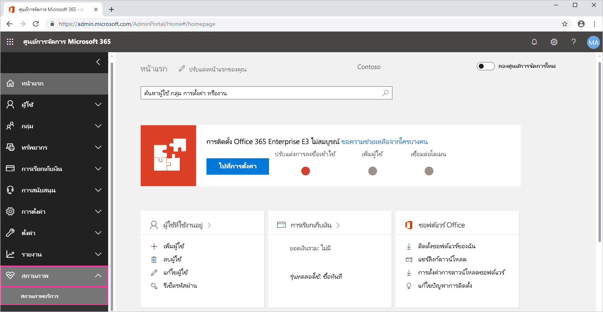
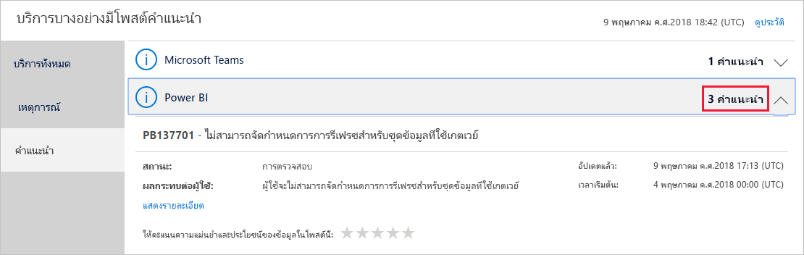
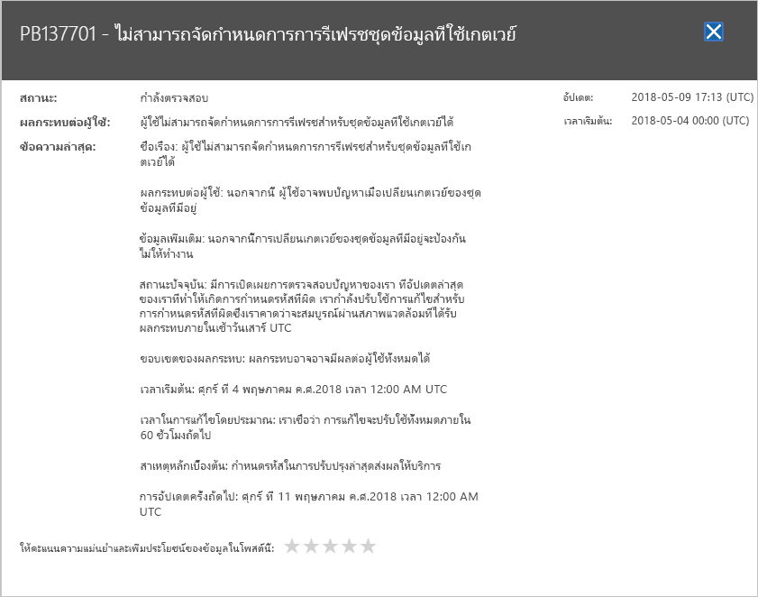

# ติดตามสถานภาพบริการ Power BI ใน Office 365

ศูนย์การจัดการ Office 365 มีเครื่องมือสำคัญสำหรับผู้ดูแล Power BI รวมถึงข้อมูลในอดีต และปัจจุบันเกี่ยวกับสถานภาพบริการ ในการเข้าถึงข้อมูลนี้ คุณต้องอยู่ในหนึ่งบทบาทต่อไปนี้: ผู้ดูแลระบบบริการ Power BI หรือผู้ดูแลระบบส่วนกลาง Office 365 สำหรับข้อมูลเพิ่มเติมเกี่ยวกับบทบาท ดู[บทบาทผู้ดูแลระบบที่เกี่ยวข้องกับ Power BI](service-admin-administering-power-bi-in-your-organization.md#administrator-roles-related-to-power-bi)

1. ลงชื่อเข้าใช้[ศูนย์การจัดการ Office 365](https://portal.office.com/adminportal)

2. เลือกไทล์**สถานภาพบริการ

    

3. ในรายการปัจจุบันเลือก **คำแนะนำ N**หรือ**เหตุการณ์ N**และตรวจสอบผลลัพธ์ ในกราฟิกด้านล่าง คุณจะเห็นหนึ่งในสามคำแนะนำที่ใช้งานอยู่

    

4. เมื่อต้องการดูข้อมูลเพิ่มเติม เลือก**แสดงรายละเอียด**สำหรับรายการ ในกราฟิกด้านล่าง คุณจะเห็นรายละเอียดเพิ่มเติม รวมถึงการปรับปรุงสถานะล่าสุดด้วย

    

    เลื่อนลงเพื่อดูข้อมูลเพิ่มเติม จากนั้นปิดบานหน้าต่างเมื่อคุณทำเสร็จแล้ว

5. ในการดูข้อมูลในอดีตทั่วทั้งบริการ ที่มุมบนขวาของรายการหลัก เลือก**ดูประวัติ** จากนั้นเลือก **7 วันที่ผ่าน**หรือ **30 วันที่ผ่าน** เมื่อต้องการกลับไปยังสถานภาพบริการปัจจุบัน เลือก**ดูสถานะปัจจุบัน**