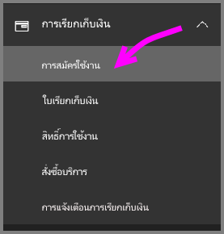
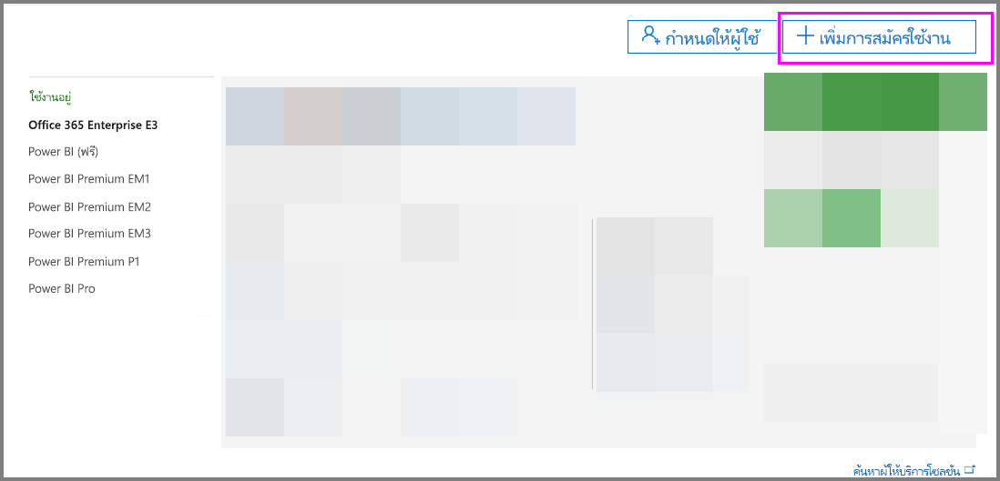
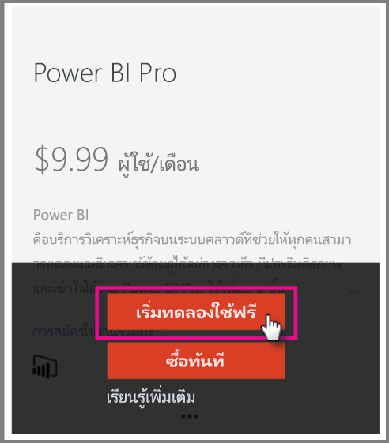
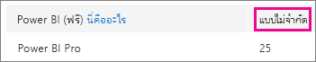
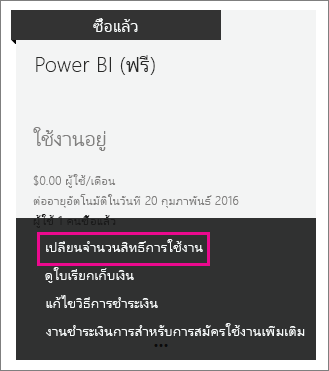

# <a name="power-bi-licensing-in-your-organization"></a>การออกใบอนุญาตการใช้งาน Power BI ในองค์กรของคุณ

[!INCLUDE [license-capabilities](includes/license-capabilities.md)]

บทความนี้เน้นไปที่การออกใบอนุญาตผู้ใช้จากมุมมองของผู้ดูแลระบบ

## <a name="manage-power-bi-pro-licenses"></a>จัดการใบอนุญาตการใช้งาน Power BI Pro

ในฐานะผู้ดูแลระบบคุณสามารถซื้อและมอบใบอนุญาตการใช้งาน Power BI Pro และคุณสามารถลงทะเบียนเพื่อทดลองใช้งาน Power BI Pro สำหรับองค์กรของคุณได้ บุคคลสามารถลงทะเบียนเพื่อทดลองใช้งาน Power BI Pro

### <a name="purchase-power-bi-pro"></a>ซื้อ Power BI Pro

คุณซื้อใบอนุญาตการใช้งาน Power BI Pro ผ่าน Microsoft Office 365 หรือผ่านพันธมิตรของ Microsoft ที่ได้รับการรับรอง หลังจากที่คุณซื้อใบอนุญาตแล้วคุณจะมอบให้กับผู้ใช้แต่ละรายได้ ดูข้อมูลเพิ่มเติมได้ที่ [ซื้อและมอบใบอนุญาตใบอนุญาตการใช้ Power BI Pro](service-admin-purchasing-power-bi-pro.md)

### <a name="power-bi-pro-license-expiration"></a>การหมดอายุการใช้งานของใบอนุญาต Power BI Pro

ไม่มีช่วงเวลาผ่อนผันหลังจากสิทธิ์การใช้งาน Power BI Pro หมดอายุ สำหรับสิทธิ์ใช้งานที่เป็นส่วนหนึ่งของการซื้อลิขสิทธิ์แบบจำนวนมากระยะเวลาผ่อนผันคือ 90 วัน ถ้าคุณซื้อสิทธิ์การใช้งานโดยตรง ช่วงระยะเวลาผ่อนผันคือ 30 วัน

Power BI Pro มีระยะเวลาการสมัครใช้งานแบบเดียวกับ Office 365 สำหรับข้อมูลเพิ่มเติม ให้ดู [เกิดอะไรขึ้นกับข้อมูลของฉันและการเข้าถึงเมื่อการสมัครใช้งานทางธุรกิจ Office 365 ของฉันสิ้นสุด](https://support.office.com/article/What-happens-to-my-data-and-access-when-my-Office-365-for-business-subscription-ends-4436582f-211a-45ec-b72e-33647f97d8a3)

### <a name="power-bi-pro-trial-for-individuals"></a>การทดลองใช้งาน Power BI Pro สำหรับบุคคล

บุคคลในองค์กรของคุณสามารถลงชื่อสมัครเพื่อทดลองใช้ Power BI Pro ได้ ดูข้อมูลเพิ่มเติมได้ที่ [การสมัคร Power BI รายบุคคล](service-self-service-signup-for-power-bi.md)

ผู้ใช้ที่ใช้ประโยชน์จากการทดลองใช้ Power BI Pro ในผลิตภัณฑ์จะไม่ปรากฏใศูนย์การจัดการ Microsoft 365 ในฐานะผู้ทดลองใช้ Power BI Pro (ปรากฏเป็นผู้ใช้ฟรีของ Power BI) อย่างไรก็ตามก็แสดงผู้ใช้เหล่านี้ว่าเป็นผู้ทดลองใช้ Power BI Pro ในหน้าการจัดการพื้นที่เก็บข้อมูลใน Power BI

### <a name="power-bi-pro-trial-for-organizations"></a>การทดลองใช้งาน Power BI Pro สำหรับองค์กร

หากคุณต้องการได้รับและปรับใช้ใบอนุญาตสำหรับการทดลองใช้ Power BI แก่ผู้ใช้หลายรายในองค์กรของคุณ ลงชื่อสมัครทดลองใช้ Power BI Pro สำหรับองค์กรของคุณโดยผู้ใช้ไม่ต้องยอมรับเงื่อนไขการทดลองใช้เป็นรายบุคคล

โปรดจำสิ่งต่อไปนี้ก่อนปฏิบัติตามขั้นตอนการสมัคร:

* ในการสมัคร คุณต้องเป็นสมาชิกใน [**การดูแลระบบทั้งหมด** หรือ **ผู้ดูแลระบบสำหรับการเรียกเก็บเงิน**](https://support.office.com/article/about-office-365-admin-roles-da585eea-f576-4f55-a1e0-87090b6aaa9d) ใน Office 365

* มีขีดจำกัดของเวอร์ชันทดลองใช้ขององค์กรหนึ่งเวอร์ชันสำหรับแต่ละผู้เช่า ซึ่งหมายความว่า ถ้าหากมีผู้สมัครใช้งาน Power BI Pro รุ่นทดลองใช้กับผู้เช่าของคุณแล้ว คุณจะไม่สามารถสมัครได้อีก หากคุณต้องความช่วยเหลือในเรื่องนี้ ติดต่อ [ความช่วยเหลือในการเรียกเก็บเงินสำหรับ Office 365](https://support.office.microsoft.com/article/contact-support-for-business-products-admin-help-32a17ca7-6fa0-4870-8a8d-e25ba4ccfd4b?CorrelationId=552bbf37-214f-4202-80cb-b94240dcd671)

1. ไปที่ [ศูนย์การจัดการ Microsoft 365](https://portal.office.com/adminportal/home#/homepage)

1. ในบานหน้าต่างนำทางด้านซ้าย เลือก **การเรียกเก็บเงิน** จากนั้น **การสมัครรับข้อมูล**

   

1. ทางด้านขวา เลือก **เพิ่มการสมัครรับข้อมูล**

   

1. ภายใต้ **แผนอื่น** , เลื่อนเมาส์ไว้เหนือจุดไข่ปลา ( **... .** ) สำหรับ Power BI Pro และเลือก **เริ่มต้นการทดลองใช้ฟรี**

    

1. ในหน้าจอการยืนยันคำสั่งซื้อ เลือก**ลองใช้เลย**

1. ในใบเสร็จการสั่งซื้อ เลือก **ดำเนินการต่อ**

ขณะนี้คุณสามารถ [กำหนดใบอนุญาตให้ใช้งานได้ใน Office 365 ](https://support.office.com/article/assign-licenses-to-users-in-office-365-for-business-997596b5-4173-4627-b915-36abac6786dc)

## <a name="manage-power-bi-free-licenses"></a>จัดการใบอนุญาตการใช้งาน Power BI ฟรี

ผู้ใช้ภายในองค์กรของคุณสามารถรับใบอนุญาตใช้งาน Power BI ฟรีได้สองวิธีได้แก่

* คุณสามารถกำหนดสิทธิ์การใช้งาน Power BI ให้แก่พวกเขาภายในศูนย์การจัดการ Microsoft 365

* ถ้าผู้ใช้ [ลงทะเบียนทดลองใช้ Power BI Pro](service-self-service-signup-for-power-bi.md) และการทดลองใช้หมดอายุ สิทธิ์การทดลองใช้จะถูกกำหนดเป็นสิทธิ์การใช้งานฟรี

### <a name="requesting-and-assigning-free-licenses"></a>การขอและกำหนดใบอนุญาตการใช้งานฟรี

หากคุณวางแผนที่จะจัดการใบอนุญาตที่ร้องขอและกำหนดจากศูนย์ ขั้นแรกต้องตรวจสอบว่าคุณได้ปิดกั้นใบอนุญาตใช้งาน Power BI (ฟรี) แล้วหรือไม่

ปิดกั้นใบอนุญาตการใช้งานนี้ได้หลังมีผู้สมัครใช้งาน Power BI เป็นรายบุคคลในครั้งแรก ระหว่างกระบวนการนี้ จะแนบเอกสารการปิดกั้นใบอนุญาตการใช้งานนี้กับองค์กรของคุณ และมอบใบอนุญาตใช้งานให้กับผู้ที่สมัคร

1. ในศูนย์การจัดการ Microsoft 365 ภายใต้ **การเรียกเก็บเงิน** > **ใบอนุญาต** เลือก**ไม่จำกัด**.

    

1. หากสามารถปิดกั้นได้ ตอนนี้คุณสามารถ[กำหนดสิทธิ์การใช้งานใน Office 365](https://support.office.com/article/assign-licenses-to-users-in-office-365-for-business-997596b5-4173-4627-b915-36abac6786dc)ได้ หากไม่สามารถบล็อกได้ คุณมีสองตัวเลือก:

    * ให้สมาชิกในองค์กรของคุณลงทะเบียนรายบุคล ซึ่งจะทำให้สามารถสร้างการปิดกั้นได้โดยไม่จำกัด

    * ไปขั้นตอนถัดไปที่คุณสามารถลงทะเบียนตามจำนวนสิทธิ์การใช้งานที่กำหนด

หากไม่สามารถปิดกั้นสิทธิ์การใช้งาน Power BI (ฟรี) และคุณไม่ต้องการลงทะเบียนรายบุคคล ปฏิบัติตามขั้นตอนนี้

1. ไปที่ [ศูนย์การจัดการ Microsoft 365](https://portal.office.com/admin/default.aspx)

1. ในบานหน้าต่างนำทางด้านซ้าย เลือก **การเรียกเก็บเงิน** > **การสมัครใช้งาน**

1. ทางด้านขวา เลือก **เพิ่มการสมัครใช้งาน +**

1. ภายใต้ **แผนอื่นๆ** เลื่อนเมาส์เหนือจุดไข่ปลา ( **. . .** ) ไปที่ Power BI (ฟรี) และเลือก **ซื้อทันที**

    

1. ป้อนจำนวนสิทธิ์การใช้งานที่คุณต้องการเพิ่ม และเลือก **จ่ายเงินตอนนี้** หรือ **เพิ่มลงในรถเข็น**

1. ป้อนข้อมูลที่จำเป็นในลำดับขั้นการจ่ายเงิน

    จะไม่มีการซื้อเมื่อใช้วิธีนี้ แม้ว่าคุณจะต้องใส่ข้อมูลบัตรเครดิตของคุณสำหรับเรียกเก็บเงินหรือไม่ก็เลือกที่จะออกใบแจ้งหนี้ก็ตาม

1. ตอนนี้คุณยังสามารถ[กำหนดสิทธิ์การใช้งานใน Office 365](https://support.office.com/article/assign-licenses-to-users-in-office-365-for-business-997596b5-4173-4627-b915-36abac6786dc) ได้

1. ถ้าคุณตัดสินใจในภายหลังว่า คุณต้องการเพิ่มสิทธิ์การใช้งานเพิ่มเติม ก็สามารถกลับไปยัง **เพิ่มการสมัครใช้งาน** และเลือก **เปลี่ยนจำนวนสิทธิ์การใช้งาน** สำหรับ Power BI (ฟรี) ได้

    

### <a name="enable-or-disable-individual-user-sign-up-in-azure-active-directory"></a>เปิดใช้งานหรือปิดใช้งานการลงทะเบียนผู้ใช้รายบุคคลใน Azure Active Directory

ในฐานะผู้ดูแลระบบ คุณสามารถเลือกเปิดใช้งานหรือปิดใช้งานการลงทะเบียนผู้ใช้รายบุคลผ่าน Azure Active Directory (AAD) ส่วนของบทความนี้แสดงวิธีการจัดการการลงทะเบียนคำสั่งด้วย PowerShell สำหรับข้อมูลเพิ่มเติมเกี่ยวกับ Azure PowerShell ดูที่[ภาพรวมของ Azure PowerShell](/powershell/azure/overview)

การตั้งค่า Azure AD ซึ่งควบคุมการลงทะเบียนคือ **AllowAdHocSubscriptions** สำหรับผู้เช่าส่วนใหญ่ จะกำหนดเป็น *ถูก* ซึ่งหมายความว่าเปิดใช้งาน หากคุณซื้อ Power BI ผ่านคู่ค้า อาจมีการตั้งค่าเป็น*ไม่ถูก*ตามค่าเริ่มต้น ซึ่งหมายความว่าปิดใช้งานอยู่ หากคุณเปลี่ยนการตั้งค่าจาก*ถูก*เป็น*ไม่ถูก* จะปิดกั้นผู้ใช้ใหม่ในองค์กรของคุณไม่ให้ลงทะเบียนรายบุคคล ผู้ใช้ที่ลงทะเบียนสำหรับ Power BI ก่อนที่จะเปลี่ยนแปลงการตั้งค่ายังคงมีสิทธิ์ในใบอนุญาตการใช้งาน โปรดทราบว่าผู้ใช้สามารถลงทะเบียนสำหรับการทดลองใช้งานแบบ Pro ได้ด้วยการตั้งค่าเป็น *เท็จ*

1. ลงชื่อเข้าใช้ Azure Active Directory โดยใช้ข้อมูลประจำตัวสำหรับ Office 365 ของคุณ บรรทัดแรกของข้อความสคริปต์ PowerShell ต่อไปนี้ปรากฏขึ้นเพื่อให้คุณใส่ข้อมูลประจำตัวของคุณ บรรทัดที่สองจะเชื่อมต่อกับ Azure Active Directory

    ```powershell
     $msolcred = get-credential
     connect-msolservice -credential $msolcred
    ```

   

1. เมื่อคุณลงชื่อเข้าใช้ ออกคำสั่งต่อไปนี้เพื่อดูสิ่งที่ผู้เช่าของคุณกำหนดค่าไว้ในขณะนี้ (โปรดทราบว่า 'fl' ที่ด้านล่างนั้นใช้ตัวอักษร 'l' ไม่ใช่ตัวเลข 1)

    ```powershell
     Get-MsolCompanyInformation | fl AllowAdHocSubscriptions 
    ```
1. ออกคำสั่งต่อไปนี้เพื่อเปิดใช้งาน ($true) หรือปิดใช้งาน ($false) **AllowAdHocSubscriptions**

    ```powershell
     Set-MsolCompanySettings -AllowAdHocSubscriptions $true
    ```

> [!NOTE]
> ค่าสถานะ AllowAdHocSubscriptions ถูกใช้เพื่อควบคุมความสามารถของผู้ใช้มากมายในองค์กรของคุณ รวมถึงความสามารถสำหรับผู้ใช้เพื่อลงทะเบียนสำหรับบริการ Azure Rights Management การเปลี่ยนธงนี้จะมีผลกระทบต่อความสามารถเหล่านี้ทั้งหมด

## <a name="next-steps"></a>ขั้นตอนถัดไป

[ลงชื่อสมัครใช้ Power BI แบบบริการตนเอง](service-self-service-signup-for-power-bi.md)  

[ซื้อและะมอบใบอนุญาตการใช้งาน Power BI Pro](service-admin-purchasing-power-bi-pro.md)

มีคำถามเพิ่มเติมหรือไม่? [ลองถามชุมชน Power BI](http://community.powerbi.com/)