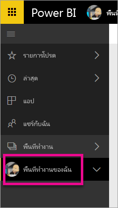
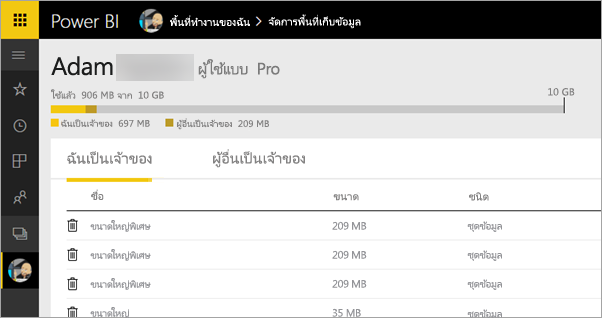
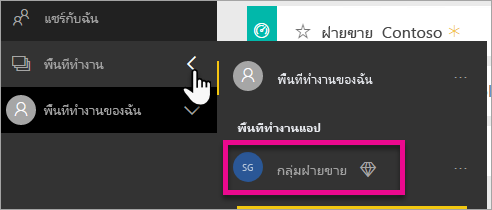
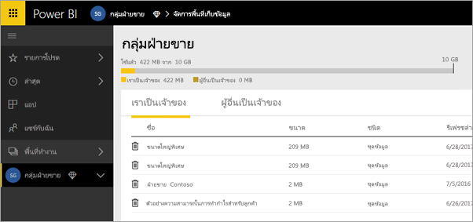
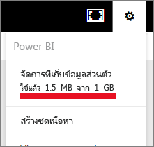
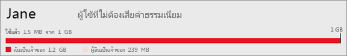
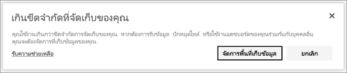

# ladakจัดการที่เก็บข้อมูลในพื้นที่ทำงานบน Power BI

เรียนรู้วิธีที่คุณสามารถจัดการที่เก็บข้อมูลของคุณ หรือของพื้นที่ทำงาน เพื่อให้แน่ใจว่าคุณสามารถเผยแพร่รายงานและชุดข้อมูลต่อไปได้

ผู้ใช้และพื้นที่ทำงานมีความจุข้อมูลของตัวเอง:

* ผู้ใช้ทั้งหมดจะมีพื้นที่จัดเก็บข้อมูลสูงสุด 10 GB
* ผู้ใช้ที่มีสิทธิ์ใช้งาน Power BI Pro สามารถสร้างพื้นที่ทำงานได้ โดยแต่ละคนจะมีพื้นที่เก็บข้อมูลได้สูงสุด 10 GB
* พื้นที่ทำงานในความจุระดับ Premium จะไม่นับรวมกับพื้นที่จัดเก็บข้อมูลของผู้ใช้ Power BI Pro

ในระดับผู้เช่า การใช้ทั้งหมดต้องไม่เกิน 10 GB ต่อผู้ใช้ Pro สำหรับผู้ใช้ Pro และพื้นที่ทำงานในผู้เช่าทั้งหมด

อ่านเกี่ยวกับคุณลักษณะอื่น ๆ ของ[รูปแบบการกำหนดราคา Power BI](https://powerbi.microsoft.com/pricing)

ที่รวมอยู่ในที่เก็บข้อมูลของคุณ ได้แก่ ชุดข้อมูลและรายงาน Excel ของคุณเอง และรายการเหล่านั้นที่มีคนแชร์ให้คุณ ชุดข้อมูลเป็นแหล่งข้อมูลใด ๆ ที่คุณอัปโหลดหรือเชื่อมต่อ แหล่งข้อมูลเหล่านี้รวมถึงไฟล์ Power BI Desktop และสมุดงาน Excel ที่คุณกำลังใช้งาน ต่อไปนี้ยังรวมอยู่ในความจุข้อมูลของคุณด้วย

* ช่วงของข้อมูลใน Excel ที่ปักหมุดไปยังแดชบอร์ด
* การแสดงภาพภายในองค์กรของ Reporting Services ที่ปักหมุดไปยังแดชบอร์ด Power BI
* รูปภาพที่ถูกอัปโหลด

ขนาดของแดชบอร์ดที่คุณแชร์จะแตกต่างกันขึ้นอยู่กับว่ามีอะไรปักหมุดอยู่ข้างใน ตัวอย่างเช่น ถ้าคุณปักหมุดรายการจากรายงานสองฉบับที่เป็นส่วนหนึ่งของชุดข้อมูลที่แตกต่างกันสองชุด ขนาดจะรวมชุดข้อมูลทั้งสองชุด

<a name="manage"/>

## จัดการรายการที่คุณเป็นเจ้าของ

ดูว่าคุณกำลังใช้พื้นที่จัดเก็บข้อมูลเท่าไรในบัญชีของคุณ Power BI และจัดการบัญชีของคุณ

1. เพื่อจัดการที่เก็บข้อมูลของคุณเอง ไปที่ **พื้นที่งานของฉัน** ในบานหน้าต่างนำทางด้านซ้าย
   
    
2. เลือกไอคอนรูปเฟือง ในมุมบนขวา\>**จัดการที่เก็บข้อมูลส่วนตัว**
   
    แถบด้านบนแสดงให้เห็นว่า คุณได้ใช้ที่เก็บข้อมูลมากแค่ไหน
   
    
   
    ชุดข้อมูลและรายงานจะถูกแบ่งออกเป็นสองแท็บ:
   
    **ฉันเป็นเจ้าของ:** คุณได้อัปโหลดรายงานและชุดข้อมูลเหล่านี้ไปยังบัญชี Power BI ของคุณ รวมถึงชุดข้อมูลบริการ เช่น Salesforce และ Dynamics CRM  
    **ผู้อื่นเป็นเจ้าของ:** ผู้อื่นได้แชร์รายงานและชุดข้อมูลเหล่านี้ให้กับคุณ
1. เมื่อต้องการลบชุดข้อมูลหรือรายงาน ให้เลือกไอคอนรูปถังขยะ .

โปรดทราบว่า คุณหรือบุคคลอื่นอาจมีรายงานและแดชบอร์ดที่ขึ้นกับชุดข้อมูลหนึ่ง ๆ ถ้าคุณลบชุดข้อมูล รายงานและแดชบอร์ดเหล่านั้นจะไม่ทำงานอีกต่อไป

## จัดการพื้นที่ทำงานของคุณ
1. เลือกลูกศรที่อยู่ถัดจาก**พื้นที่ทำงาน** \> เลือกชื่อของพื้นที่ทำงาน
   
    
2. เลือกไอคอนรูปเฟือง ในมุมบนขวา\>**จัดการที่เก็บข้อมูลส่วนตัว**
   
    แถบด้านบนแสดงให้เห็นว่า มีการใช้ที่เก็บข้อมูลกลุ่มมากแค่ไหน
   
    
   
    ชุดข้อมูลและรายงานจะถูกแบ่งออกเป็นสองแท็บ:
   
    **เราเป็นเจ้าของ:** คุณหรือผู้อื่นได้อัปโหลดรายงานและชุดข้อมูลเหล่านี้ไปยังบัญชี Power BI ของกลุ่ม รวมถึงชุดข้อมูลบริการ เช่น Salesforce และ Dynamics CRM
    **ผู้อื่นเป็นเจ้าของ:** ผู้อื่นได้แชร์รายงานและชุดข้อมูลเหล่านี้ให้กับคุณ
3. เมื่อต้องการลบชุดข้อมูลหรือรายงาน ให้เลือกไอคอนรูปถังขยะ .
   
   > [!NOTE]
   > สมาชิกใด ๆ ที่มีสิทธิ์ในการแก้ไขพื้นที่ทำงานจะมีสิทธิ์ในการลบชุดข้อมูลและรายงานออกจากพื้นที่ทำงาน
   > 
   > 

โปรดทราบว่า คุณหรือบุคคลอื่นในกลุ่มอาจมีรายงานและแดชบอร์ดที่ขึ้นกับชุดข้อมูลหนึ่ง ๆ ถ้าคุณลบชุดข้อมูล รายงานและแดชบอร์ดเหล่านั้นจะไม่ทำงานอีกต่อไป

## ขีดจำกัดของชุดข้อมูล
มีขีดจำกัด 1 GB ต่อชุดข้อมูล ที่นำเข้าไปใน Power BI ถ้าคุณเลือกที่จะเก็บประสบการณ์ Excel แทนที่จะนำเข้าข้อมูล ซึ่งจะถูกจำกัดที่ 250 MB สำหรับชุดข้อมูล

## เกิดอะไรขึ้นเมื่อคุณถึงขีดจำกัด
เมื่อคุณถึงขีดจำกัดความจุข้อมูลของคุณ คุณจะเห็นพร้อมท์ภายในบริการ 

เมื่อคุณเลือกไอคอนรูปเฟือง , คุณจะเห็นแถบสีแดงซึ่งระบุว่า คุณกำลังใช้งานเกินขีดจำกัดความจุของข้อมูลของคุณ

ขีดจำกัดนี้ยังระบุไว้ภายใน **จัดการที่เก็บข้อมูลส่วนบุคคล**อีกด้วย

 

 เมื่อคุณพยายามที่จะดำเนินการใด ๆ ที่ทำให้ถึงขีดจำกัดเหล่านี้ คุณจะเห็นข้อความที่ระบุว่า คุณกำลังใช้เกินขีดจำกัด คุณสามารถ[จัดการ](#manage)ที่เก็บข้อมูลของคุณเพื่อลดปริมาณข้อมูล และผ่านข้อจำกัดดังกล่าว

 

 มีคำถามเพิ่มเติมหรือไม่? [ลองถามชุมชน Power BI](http://community.powerbi.com/)

